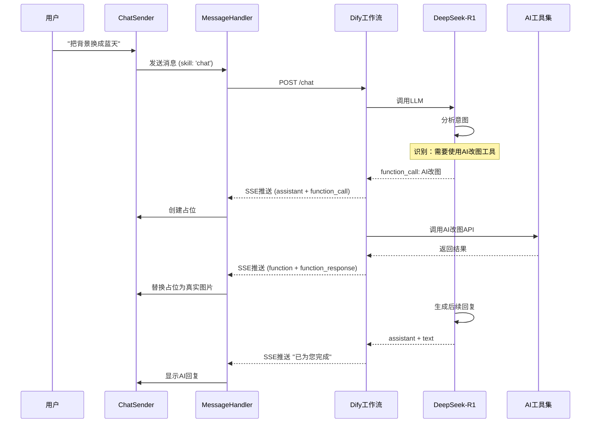
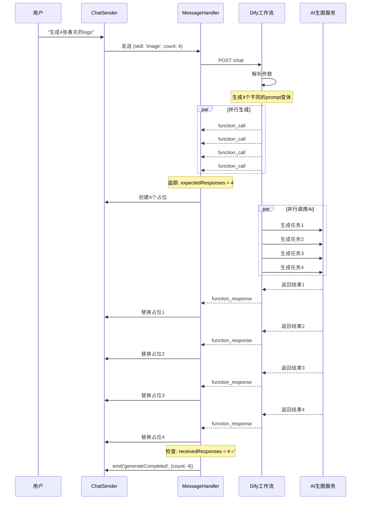
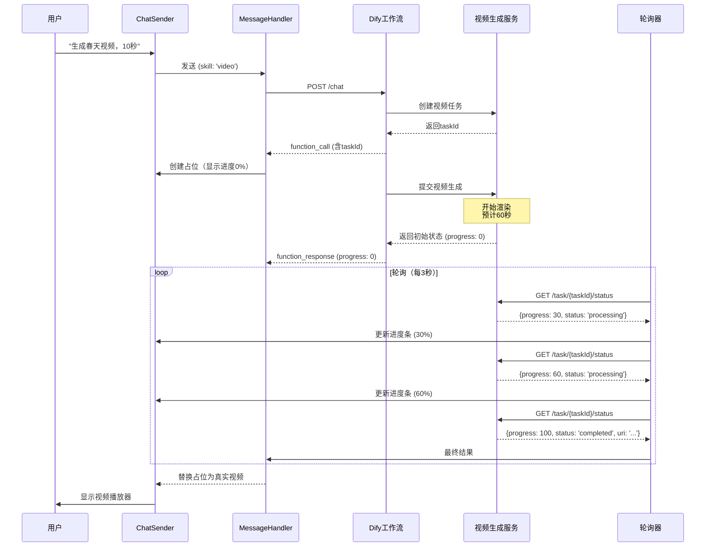

# AI对话系统深度解析（三）：三种模式运转逻辑

> **系列文档**：
>
> - [Part 1 - 概述与整体架构](./AI对话系统深度解析-1-概述与架构.md)
> - [Part 2 - 消息流转与处理机制](./AI对话系统深度解析-2-消息流转.md)
> - **当前：Part 3 - 三种模式运转逻辑** ⭐
> - [Part 4 - 会话与状态管理](./AI对话系统深度解析-4-会话管理.md)

---

## 一、三种模式对比总览

### 1.1 核心差异

| 维度         | Agent模式                       | 图片生成            | 视频生成           |
| ------------ | ------------------------------- | ------------------- | ------------------ |
| **技能类型** | `skill: 'chat'`                 | `skill: 'image'`    | `skill: 'video'`   |
| **交互方式** | 多轮对话                        | 单次生成            | 单次生成           |
| **工具调用** | ✅ 多种工具（抠图/改图/搜索等） | ✅ 仅图片生成       | ✅ 仅视频生成      |
| **占位管理** | ✅ 每个工具独立占位             | ✅ 批量占位         | ✅ 单个占位        |
| **生成时间** | 2-30秒（取决于工具）            | 2-10秒/张           | 30-120秒           |
| **批量支持** | ❌ 单次1个工具                  | ✅ 单次最多16张     | ❌ 单次1个视频     |
| **进度展示** | ✅ 工具执行状态                 | ✅ 张数计数         | ✅ 百分比进度      |
| **结果类型** | 工具输出（图片/文本/数据）      | 图片数组            | 视频URL            |
| **典型场景** | "帮我把背景换成蓝天"            | "生成4张春天的logo" | "生成10秒春天视频" |

### 1.2 消息流对比

#### Agent模式

```
用户: "帮我把这张图的背景换成蓝天"
  ↓
assistant + text: "好的，我来帮您更换背景"
  ↓
assistant + function_call: {name: "AI改图", arguments: {...}}
  ↓
function + function_response: {result: [{uri: "..."}]}
  ↓
assistant + text: "已为您完成背景替换，效果如何？"
```

#### 图片生成

```
用户: "生成4张春天的logo"
  ↓
assistant + text: "好的，我来为您生成"
  ↓
assistant + function_call × 4: {name: "图片生成", arguments: {...}}
  ↓
function + function_response × 4: {result: [{uri: "..."}]}
  ↓
（无后续文本，直接展示结果）
```

#### 视频生成

```
用户: "生成春天的视频，10秒"
  ↓
assistant + text: "好的，我来为您生成视频"
  ↓
assistant + function_call: {name: "视频生成", arguments: {...}}
  ↓
function + function_response: {result: [{uri: "...", progress: 100}]}
  ↓
（无后续文本，直接展示结果）
```

---

## 二、Agent模式深度解析

### 2.1 模式定位

```
Agent = 智能对话 + 工具调用 + 上下文理解

核心能力：
1. 理解用户意图
2. 选择合适工具
3. 多轮对话记忆
4. 复杂任务拆解
```

### 2.2 完整流程图



### 2.3 关键参数

```typescript
// 用户发送
const params = {
  prompt: "把背景换成蓝天",
  skill: "chat",  // ⭐ 关键：标识Agent模式
  sourceKind: "seedEdit",  // 聚焦图片元素
  sourceImageUrl: "https://...",  // 原图
};

// Dify后端返回
{
  role: "assistant",
  content: {
    type: "function_call",
    text: JSON.stringify({
      name: "AI改图",  // 工具名称
      arguments: {
        sourceImageUrl: "https://...",
        prompt: "替换背景为蓝天",
        mode: "inPaintReplace",
      },
    }),
  },
}
```

### 2.4 可用工具列表

| 工具名称   | 功能          | 输入                 | 输出         |
| ---------- | ------------- | -------------------- | ------------ |
| AI抠图     | 移除背景      | 图片URL              | 透明背景图   |
| AI改图     | 局部修改      | 图片 + 提示词 + 区域 | 修改后图片   |
| AI消除     | 移除物体      | 图片 + 区域          | 干净图片     |
| AI变清晰   | 提升分辨率    | 低分辨率图           | 高分辨率图   |
| AI扩图     | 扩展画布      | 图片 + 方向          | 扩展后图片   |
| AI滤镜     | 风格转换      | 图片 + 风格          | 风格化图片   |
| 转矢量     | 位图转矢量    | 位图                 | SVG矢量图    |
| 图文分层   | 文字/背景分离 | 设计图               | 分层模板     |
| 溶图       | 图片融合      | 两张图               | 融合图       |
| AI阴影     | 添加阴影      | 图片                 | 带阴影图     |
| AI换脸     | 人脸替换      | 原图 + 人脸          | 换脸图       |
| 相似图搜索 | 查找相似      | 图片                 | 相似结果列表 |

### 2.5 工具选择逻辑（DeepSeek）

**示例1：简单意图**

```
用户输入: "帮我把背景去掉"
  ↓
DeepSeek分析:
- 关键词: "背景" + "去掉"
- 意图: 移除背景
- 选择工具: AI抠图
  ↓
function_call: {name: "AI抠图", arguments: {sourceImageUrl: "..."}}
```

**示例2：复杂意图（需要拆解）**

```
用户输入: "把背景换成蓝天，然后加个阴影"
  ↓
DeepSeek分析:
- 步骤1: 替换背景 → AI改图
- 步骤2: 添加阴影 → AI阴影
  ↓
第1轮:
function_call: {name: "AI改图", arguments: {prompt: "蓝天背景"}}
function_response: {result: [{uri: "result1.png"}]}
  ↓
第2轮（自动携带result1.png）:
function_call: {name: "AI阴影", arguments: {sourceImageUrl: "result1.png"}}
function_response: {result: [{uri: "result2.png"}]}
  ↓
assistant + text: "已为您完成背景替换和阴影添加"
```

### 2.6 核心代码

#### 识别Agent模式

```typescript
// ChatSender.vue
const isAgentMode = computed(() => {
  return chatConfig.skill === 'chat';
});

// 提交时携带skill参数
const submitParams = {
  prompt: userInput.value,
  skill: isAgentMode.value ? 'chat' : 'image',
  sourceKind: focusedElement ? 'seedEdit' : 'image',
};
```

#### 工具调用处理

```typescript
// MessageHandler.handleSSEMessage()
if (item.content.type === 'function_call') {
  const functionCall = JSON.parse(item.content.text);
  const toolName = functionCall.name; // 如"AI改图"

  // 映射到toolType
  const toolType = TOOL_TYPE_BY_NAME_MAP[toolName]; // 'inPaintReplace'

  // 触发占位创建
  events.emit('addImage', {
    toolType,
    messageId: item.messageId,
    arguments: functionCall.arguments,
  });
}
```

#### 工具结果处理

```typescript
// services/create-tools.ts
export function createTools({ message, toolName }) {
  const result = JSON.parse(message.content.text);

  return result.map((item) => ({
    toolType: TOOL_TYPE_BY_NAME_MAP[toolName],
    result: {
      uri: item.uri,
      width: item.width,
      height: item.height,
      mimeType: getMimeType(item.uri),
    },
    metadata: {
      taskId: message.extra.taskId,
      query: message.extra.query,
      recordId: item.recordId,
    },
  }));
}
```

---

## 三、图片生成模式深度解析

### 3.1 模式定位

```
图片生成 = 批量AIGC + 并行处理 + 占位优化

核心能力：
1. 单次生成多张（最多16张）
2. 并行处理（同时调用多个AI任务）
3. 占位预览（立即反馈）
4. 批量管理（统一展示）
```

### 3.2 完整流程图



### 3.3 关键参数

```typescript
// 用户发送
const params = {
  prompt: "春天的logo，温暖明亮",
  skill: "image",  // ⭐ 关键：标识图片生成模式
  sourceKind: "",  // 空：没有聚焦元素
  styleCode: "realistic",  // 风格代码
  styleName: "写实风格",
  ratio: "16:9",  // 比例
  outputWidth: 1920,
  outputHeight: 1080,
  references: [  // 参考图（可选）
    { image_url: "https://...", features: [...] },
  ],
};

// Dify后端返回（4个function_call）
[
  {
    role: "assistant",
    messageId: "call_1",
    content: {
      type: "function_call",
      text: JSON.stringify({
        name: "图片生成",
        arguments: {
          prompt: "春天的logo，温暖明亮，樱花元素",  // 变体1
          ratio: "16:9",
        },
      }),
    },
  },
  // call_2: "春天的logo，绿色调，清新"
  // call_3: "春天的logo，阳光明媚，花园"
  // call_4: "春天的logo，春暖花开"
]
```

### 3.4 批量追踪机制

#### 追踪数据结构

```typescript
// consecutiveFunctionCalls存储结构
Map {
  "图片生成" => [
    {
      startTime: 1000,           // 第1个call到达时间
      expectedResponses: 4,      // 期望数量（动态增长）
      receivedResponses: 0,      // 已收到数量
      messageIds: Set([
        'call_1',
        'call_2',
        'call_3',
        'call_4',
      ]),
      parentMessageId: 'call_1', // 父消息ID（用于UI聚合）
      isCompleted: false,        // 是否完成
    }
  ]
}
```

#### 追踪代码

```typescript
// MessageHandler.trackConsecutiveFunctionCall()
private trackConsecutiveFunctionCall(item: MessageType) {
  const functionCall = JSON.parse(item.content.text);
  const functionName = functionCall.name;  // "图片生成"

  const trackingList = this.consecutiveFunctionCalls.get(functionName) || [];

  if (trackingList.length === 0) {
    // 第1个call：创建追踪
    trackingList.push({
      startTime: Date.now(),
      expectedResponses: 1,
      receivedResponses: 0,
      messageIds: new Set([item.messageId]),
      parentMessageId: item.messageId,
      isCompleted: false,
    });
  } else {
    const current = trackingList[trackingList.length - 1];
    const timeDiff = Date.now() - current.startTime;

    if (timeDiff < 100) {
      // 100ms内：视为同一批次
      current.messageIds.add(item.messageId);
      current.expectedResponses = current.messageIds.size;
    } else {
      // 超时：创建新批次
      trackingList.push({ /* ... */ });
    }
  }

  this.consecutiveFunctionCalls.set(functionName, trackingList);
}
```

### 3.5 占位创建与替换

#### 占位创建（function_call到达时）

```typescript
// hooks/use-operate-tool.ts
function createPlaceholder(toolType: string, messageId: string) {
  // 1. 在画布中心创建占位元素
  const placeholder = editor.addElement({
    type: 'image',
    url: PLACEHOLDER_IMAGE_URL, // 加载动画图片
    width: 400,
    height: 400,
    x: canvas.centerX - 200,
    y: canvas.centerY - 200,
    opacity: 0.5, // 半透明
    metadata: {
      isPlaceholder: true,
      messageId,
    },
  });

  // 2. 添加加载动画
  placeholder.addAnimation({
    type: 'rotate',
    duration: 1000,
    loop: true,
  });

  // 3. 存储映射
  placeholderMap.set(messageId, placeholder.id);

  return placeholder.id;
}
```

#### 占位替换（function_response到达时）

```typescript
// hooks/use-operate-tool.ts
function replacePlaceholder(placeholderId: string, tool: Tool) {
  const placeholder = editor.getElementById(placeholderId);

  // 1. 加载真实图片
  const realImage = await loadImage(tool.result.uri);

  // 2. 计算位置（保持占位的位置）
  const { x, y } = placeholder.position;
  const { width, height } = fitSize(
    tool.result.width,
    tool.result.height,
    placeholder.width,
    placeholder.height,
  );

  // 3. 删除占位
  editor.removeElement(placeholderId);

  // 4. 添加真实元素（淡入动画）
  const element = editor.addElement({
    type: 'image',
    url: tool.result.uri,
    width,
    height,
    x,
    y,
    opacity: 0, // 初始透明
    metadata: {
      taskId: tool.metadata.taskId,
      recordId: tool.metadata.recordId,
    },
  });

  // 5. 淡入动画
  element.animate({
    opacity: 1,
    duration: 300,
    easing: 'ease-out',
  });

  // 6. 更新映射
  placeholderMap.delete(placeholderId);
}
```

### 3.6 UI展示（批量聚合）

```tsx
// components/message/message-type/resource.tsx
function ResourceMessage({ message }: { message: MessageType }) {
  // 获取所有批量生成的结果
  const functionCalls = message.functionCalls || [];
  const tools = functionCalls.map((call) => call.extra?.localAigc?.tools || []).flat();

  return (
    <div className="resource-message">
      <div className="header">已为您生成 {tools.length} 张图片</div>

      <div className="image-grid">
        {tools.map((tool, index) => (
          <div key={index} className="image-item">
            
            <div className="actions">
              <Button onClick={() => addToCanvas(tool)}>添加到画布</Button>
              <Button onClick={() => regenerate(tool)}>重新生成</Button>
            </div>
          </div>
        ))}
      </div>

      <MessageFooter message={message} />
    </div>
  );
}
```

---

## 四、视频生成模式深度解析

### 4.1 模式定位

```
视频生成 = 长时任务 + 进度反馈 + 轮询机制

核心能力：
1. 长时等待（30-120秒）
2. 进度显示（0% → 100%）
3. 轮询状态（每3秒查询）
4. 失败重试（自动/手动）
```

### 4.2 完整流程图



### 4.3 关键参数

```typescript
// 用户发送
const params = {
  prompt: "春天的视频，花开，10秒",
  skill: "video",  // ⭐ 关键：标识视频生成模式
  duration: 10,  // 视频时长（秒）
  ratio: "16:9",
  firstFrameImageUrl: "https://...",  // 首帧参考（可选）
  lastFrameImageUrl: "https://...",   // 尾帧参考（可选）
};

// Dify后端返回
{
  role: "assistant",
  content: {
    type: "function_call",
    text: JSON.stringify({
      name: "视频生成",
      arguments: {
        prompt: "春天的视频，花开",
        duration: 10,
      },
    }),
  },
  extra: {
    taskId: "video_task_xxx",  // 任务ID（用于轮询）
  },
}

// 初始function_response
{
  role: "function",
  content: {
    type: "function_response",
    text: JSON.stringify([{
      uri: "",  // 空：尚未生成
      progress: 0,  // 进度0%
      status: "pending",
    }]),
  },
  extra: {
    taskId: "video_task_xxx",
  },
}

// 最终function_response（轮询获取）
{
  role: "function",
  content: {
    type: "function_response",
    text: JSON.stringify([{
      uri: "https://cdn.example.com/video.mp4",
      width: 1920,
      height: 1080,
      duration: 10,
      progress: 100,
      status: "completed",
    }]),
  },
}
```

### 4.4 进度轮询机制

#### 轮询器实现

```typescript
// services/video-poller.ts
class VideoPoller {
  private pollingTasks = new Map<string, PollingTask>();

  start(taskId: string, onProgress: (progress: number) => void) {
    const task: PollingTask = {
      taskId,
      interval: 3000, // 3秒轮询
      maxRetries: 40, // 最多2分钟（40 × 3秒）
      currentRetry: 0,
      onProgress,
    };

    this.pollingTasks.set(taskId, task);
    this.poll(taskId);
  }

  private async poll(taskId: string) {
    const task = this.pollingTasks.get(taskId);
    if (!task) return;

    try {
      // 查询任务状态
      const response = await api.getVideoTaskStatus(taskId);

      // 更新进度
      task.onProgress(response.progress);

      if (response.status === 'completed') {
        // 完成：触发结果处理
        events.emit('videoCompleted', {
          taskId,
          result: response,
        });
        this.pollingTasks.delete(taskId);
      } else if (response.status === 'failed') {
        // 失败：触发错误处理
        events.emit('videoFailed', {
          taskId,
          error: response.error,
        });
        this.pollingTasks.delete(taskId);
      } else {
        // 处理中：继续轮询
        task.currentRetry += 1;

        if (task.currentRetry < task.maxRetries) {
          setTimeout(() => this.poll(taskId), task.interval);
        } else {
          // 超时
          events.emit('videoTimeout', { taskId });
          this.pollingTasks.delete(taskId);
        }
      }
    } catch (error) {
      // 网络错误：重试
      task.currentRetry += 1;
      if (task.currentRetry < task.maxRetries) {
        setTimeout(() => this.poll(taskId), task.interval);
      }
    }
  }

  stop(taskId: string) {
    this.pollingTasks.delete(taskId);
  }
}

export const videoPoller = new VideoPoller();
```

#### 进度展示

```tsx
// components/message/message-type/video.tsx
function VideoMessage({ message }: { message: MessageType }) {
  const [progress, setProgress] = useState(0);
  const taskId = message.extra?.taskId;

  useEffect(() => {
    if (taskId && progress < 100) {
      // 启动轮询
      videoPoller.start(taskId, (newProgress) => {
        setProgress(newProgress);
      });

      return () => {
        videoPoller.stop(taskId);
      };
    }
  }, [taskId, progress]);

  // 获取视频结果
  const tool = message.extra?.localAigc?.tools?.[0];

  if (!tool || progress < 100) {
    // 生成中：显示进度
    return (
      <div className="video-generating">
        <div className="placeholder">
          <IconVideo />
          <div className="progress-bar">
            <div className="progress-fill" style={{ width: `${progress}%` }} />
          </div>
          <div className="progress-text">生成中... {progress}%</div>
        </div>
      </div>
    );
  }

  // 生成完成：显示视频播放器
  return (
    <div className="video-result">
      <video src={tool.result.uri} controls width={tool.result.width} height={tool.result.height} />
      <div className="actions">
        <Button onClick={() => addToCanvas(tool)}>添加到画布</Button>
        <Button onClick={() => download(tool.result.uri)}>下载视频</Button>
      </div>
    </div>
  );
}
```

### 4.5 错误处理

```typescript
// 监听失败事件
events.on('videoFailed', ({ taskId, error }) => {
  messageHandler.handleSSEMessage(
    [
      {
        role: 'status',
        content: {
          type: 'status',
          text: `视频生成失败：${error}`,
        },
        extra: { taskId },
      },
    ],
    false,
  );

  // 删除占位
  const placeholderId = placeholderMap.get(taskId);
  if (placeholderId) {
    editor.removeElement(placeholderId);
  }
});

// 监听超时事件
events.on('videoTimeout', ({ taskId }) => {
  messageHandler.handleSSEMessage(
    [
      {
        role: 'status',
        content: {
          type: 'status',
          text: '视频生成超时，请稍后重试',
        },
        extra: { taskId },
      },
    ],
    false,
  );
});
```

---

## 五、三种模式技术对比

### 5.1 消息数量对比

| 模式       | 用户消息 | AI文本 | function_call | function_response | 总消息数 |
| ---------- | -------- | ------ | ------------- | ----------------- | -------- |
| Agent      | 1        | 2-3    | 1             | 1                 | 5-6      |
| 图片生成×4 | 1        | 0-1    | 4             | 4                 | 9-10     |
| 视频生成   | 1        | 0-1    | 1             | 1                 | 3-4      |

### 5.2 时间对比

| 模式       | 连接建立 | AI响应 | 工具执行        | 总耗时      |
| ---------- | -------- | ------ | --------------- | ----------- |
| Agent      | 200ms    | 1-2s   | 2-10s           | **3-12s**   |
| 图片生成×4 | 200ms    | 0.5s   | 2-10s×4（并行） | **3-11s**   |
| 视频生成   | 200ms    | 0.5s   | 30-120s         | **31-121s** |

### 5.3 占位策略对比

| 模式     | 占位时机      | 占位数量  | 占位位置 | 替换方式      |
| -------- | ------------- | --------- | -------- | ------------- |
| Agent    | function_call | 1（单次） | 画布中心 | 立即替换      |
| 图片生成 | function_call | 4（批量） | 网格排列 | 逐个替换      |
| 视频生成 | function_call | 1（单次） | 画布中心 | 进度更新→替换 |

### 5.4 代码复用度

```
共享组件：
├─ MessageHandler（核心逻辑）       ✅ 100%复用
├─ SSEManager（连接管理）           ✅ 100%复用
├─ createTools（结果转换）          ✅ 100%复用
├─ PlaceholderManager（占位管理）   ✅ 100%复用
└─ Message组件（UI展示）            ⚠️ 部分复用

差异部分：
├─ Agent: 工具类型映射 + 多轮对话
├─ 图片: 批量追踪 + 网格布局
└─ 视频: 进度轮询 + 播放器
```

---

## 六、实战案例：混合使用

### 6.1 场景：先生成，再修改

```
步骤1: 用户切换到"图片生成"模式
输入: "生成4张春天的logo"
  ↓
图片生成流程 → 生成4张图片

步骤2: 用户选中其中1张，切换到"Agent"模式
输入: "把背景换成蓝天"
  ↓
Agent流程 → 调用"AI改图"工具 → 修改背景

步骤3: 用户继续在"Agent"模式
输入: "加个阴影效果"
  ↓
Agent流程 → 调用"AI阴影"工具 → 添加阴影
```

### 6.2 场景：视频生成失败后重试

```
步骤1: 用户切换到"视频生成"模式
输入: "生成春天视频，10秒"
  ↓
视频生成流程 → 进度30% → ❌ 失败（服务繁忙）

步骤2: UI显示"重试"按钮
用户点击"重试"
  ↓
重新发起请求 → 成功 → ✅ 生成完成
```

---

## 七、下一章预告

本章完成了**三种模式运转逻辑**的详细对比，下一章将深入**会话与状态管理**：

- 会话的创建与切换
- 历史记录的加载与分页
- 中断处理机制
- 状态同步策略

**继续阅读**：[Part 4 - 会话与状态管理](./AI对话系统深度解析-4-会话管理.md)

---

> **Part 3 完成！** 您已经掌握了Agent、图片生成、视频生成三种模式的完整运转逻辑。
