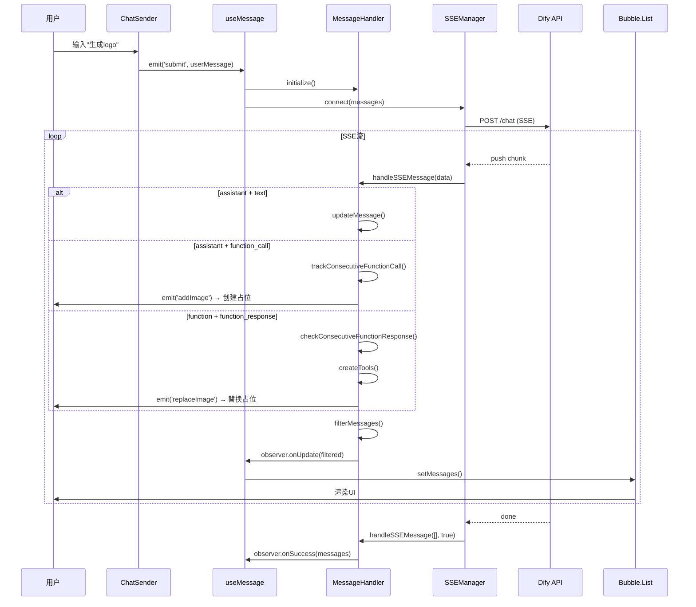

# AI对话系统深度解析（二）：消息流转与处理机制

> **系列文档**：
> - [Part 1 - 概述与整体架构](./AI对话系统深度解析-1-概述与架构.md)
> - **当前：Part 2 - 消息流转与处理机制** ⭐
> - [Part 3 - 三种模式运转逻辑](./AI对话系统深度解析-3-三种模式.md)
> - [Part 4 - 会话与状态管理](./AI对话系统深度解析-4-会话管理.md)

---

## 一、消息生命周期：从创建到展示

### 1.1 生命周期概览

```
创建 → 发送 → SSE接收 → 解析 → 状态管理 → 过滤 → 展示
 ↓      ↓       ↓        ↓      ↓         ↓      ↓
用户   HTTP   Stream   Parse  Handler   Filter  UI
```

### 1.2 完整时序图



### 1.3 消息状态机

```
┌──────────┐
│ 创建中   │  用户输入/AI生成
└─────┬────┘
      ↓
┌──────────┐
│ waiting  │  等待发送
└─────┬────┘
      ↓ submit()
┌──────────┐
│ loading  │  SSE连接中 / 流式接收中
└─────┬────┘
      ↓ stream end
┌──────────┐
│ finished │  完整接收
└─────┬────┘
      ↓ user cancel
┌──────────┐
│   stop   │  用户中断
└──────────┘
```

---

## 二、MessageHandler：消息处理核心

### 2.1 类结构

```typescript
export class MessageHandler {
  // 📦 数据存储
  private messages: MessageType[] = [];              // 原始消息
  private filteredMessages: MessageType[] = [];      // 过滤后消息（展示）
  
  // 🎯 批量追踪
  private consecutiveFunctionCalls: Map<
    string,                                           // toolName
    ConsecutiveFunctionCallTracking[]                // 追踪信息
  > = new Map();
  
  // 👀 观察者
  private observer: MessageObserver;
  
  // 🔧 核心方法
  initialize(): void;                                // 初始化
  handleSSEMessage(data: MessageType[], done: boolean): void;  // 处理SSE
  filterMessages(): MessageType[];                   // 过滤消息
  private trackConsecutiveFunctionCall(item: MessageType): void;  // 追踪call
  private checkConsecutiveFunctionResponse(item: MessageType): void; // 检查response
}
```

### 2.2 核心方法详解

#### 方法1：handleSSEMessage（消息入口）

```typescript
handleSSEMessage(data: MessageType[], done: boolean) {
  if (done) {
    // 流结束：触发成功回调
    this.observer.onSuccess(this.messages);
    return;
  }
  
  // 逐条处理消息
  data.forEach((item) => {
    // 1️⃣ 追踪批量调用
    if (item.content.type === 'function_call') {
      this.trackConsecutiveFunctionCall(item);
    }
    
    // 2️⃣ 检查批量响应
    if (item.content.type === 'function_response') {
      this.checkConsecutiveFunctionResponse(item);
    }
    
    // 3️⃣ 添加/更新消息
    const existingIndex = this.messages.findIndex(
      m => m.messageId === item.messageId
    );
    
    if (existingIndex >= 0) {
      // 更新：流式追加文本
      this.messages[existingIndex] = item;
    } else {
      // 新增
      this.messages.push(item);
    }
  });
  
  // 4️⃣ 过滤并通知UI更新
  this.filteredMessages = this.filterMessages();
  this.observer.onUpdate(this.filteredMessages);
}
```

**关键点**：
- **流式更新**：同一个`messageId`的消息会被覆盖（追加文本）
- **顺序处理**：先追踪call，再检查response，最后过滤
- **实时通知**：每次处理完立即调用`onUpdate`，UI实时刷新

#### 方法2：trackConsecutiveFunctionCall（批量追踪）

**目的**：识别连续的`function_call`，判断总数和完成度

```typescript
private trackConsecutiveFunctionCall(item: MessageType) {
  const functionCall = JSON.parse(item.content.text);
  const functionName = functionCall.name;  // 如"图片生成"
  
  // 获取或创建追踪数组
  const trackingList = this.consecutiveFunctionCalls.get(functionName) || [];
  
  if (trackingList.length === 0) {
    // 🆕 第1个call：创建追踪
    trackingList.push({
      startTime: Date.now(),
      expectedResponses: 1,
      receivedResponses: 0,
      messageIds: new Set([item.messageId]),
      parentMessageId: item.messageId,
      isCompleted: false,
    });
  } else {
    // ➕ 第2-N个call：累加
    const current = trackingList[trackingList.length - 1];
    
    // 判断是否连续（100ms内）
    const timeDiff = Date.now() - current.startTime;
    if (timeDiff < 100) {
      // 连续：追加到当前批次
      current.messageIds.add(item.messageId);
      current.expectedResponses = current.messageIds.size;
    } else {
      // 不连续：创建新批次
      trackingList.push({
        startTime: Date.now(),
        expectedResponses: 1,
        receivedResponses: 0,
        messageIds: new Set([item.messageId]),
        parentMessageId: item.messageId,
        isCompleted: false,
      });
    }
  }
  
  this.consecutiveFunctionCalls.set(functionName, trackingList);
}
```

**关键点**：
- **时间窗口**：100ms内的call视为同一批次
- **动态扩展**：`expectedResponses`会随着新call到达而增加
- **批次管理**：同一工具可能有多个批次（如两次独立的"生成4张"）

#### 方法3：checkConsecutiveFunctionResponse（完成检查）

**目的**：检查`function_response`是否对应某个批次，更新完成度

```typescript
private checkConsecutiveFunctionResponse(item: MessageType) {
  const functionName = item.name;  // 如"图片生成"
  const trackingList = this.consecutiveFunctionCalls.get(functionName);
  
  if (!trackingList) return;
  
  // 查找对应的批次
  const tracking = trackingList.find(t => 
    t.messageIds.has(item.extra?.lastToolMessageId)
  );
  
  if (!tracking) return;
  
  // ✅ 收到1个response
  tracking.receivedResponses += 1;
  
  // 🎉 检查是否全部完成
  if (tracking.receivedResponses >= tracking.expectedResponses) {
    tracking.isCompleted = true;
    
    // 聚合：将所有function_call塞到父消息的functionCalls数组
    const parentMessage = this.messages.find(
      m => m.messageId === tracking.parentMessageId
    );
    
    if (parentMessage) {
      parentMessage.functionCalls = Array.from(tracking.messageIds)
        .map(id => this.messages.find(m => m.messageId === id))
        .filter(Boolean);
      
      // 触发事件
      events.emit('generateCompleted', {
        count: tracking.receivedResponses,
        toolType: functionName,
      });
    }
  }
}
```

**关键点**：
- **匹配机制**：通过`lastToolMessageId`关联call和response
- **完成聚合**：将所有call塞进父消息的`functionCalls`数组
- **事件通知**：完成时触发`generateCompleted`事件

#### 方法4：filterMessages（过滤展示）

**目的**：从原始消息中过滤出需要展示的消息

```typescript
filterMessages(): MessageType[] {
  return this.messages.filter(msg => {
    // ❌ 隐藏：function角色（工具响应）
    if (msg.role === 'function') return false;
    
    // ❌ 隐藏：heartbeat角色（心跳）
    if (msg.role === 'heartbeat') return false;
    
    // ❌ 隐藏：已完成的reasoning（思考过程）
    if (msg.content.type === 'reasoning' && 
        msg.status === 'finished') return false;
    
    // ❌ 隐藏：批次中的非父消息
    if (msg.content.type === 'function_call') {
      // 检查是否是父消息
      const trackingList = this.consecutiveFunctionCalls.get(
        JSON.parse(msg.content.text).name
      );
      const tracking = trackingList?.find(t => 
        t.parentMessageId === msg.messageId
      );
      
      // 只保留父消息
      return !!tracking;
    }
    
    // ✅ 显示：其他所有消息
    return true;
  });
}
```

**过滤规则总结**：

| 消息类型 | role | content.type | 是否展示 | 原因 |
|---------|------|-------------|---------|------|
| 用户输入 | user | text | ✅ | 用户消息必须展示 |
| AI回复 | assistant | text | ✅ | AI文本必须展示 |
| AI思考 | assistant | reasoning + loading | ✅ | 显示"思考中..." |
| AI思考完成 | assistant | reasoning + finished | ❌ | 已完成，隐藏 |
| 工具调用（父） | assistant | function_call | ✅ | 显示"正在生成..." |
| 工具调用（子） | assistant | function_call | ❌ | 批次中非父消息 |
| 工具响应 | function | function_response | ❌ | 内部消息 |
| 心跳 | heartbeat | - | ❌ | 内部消息 |
| 状态 | status | - | ⚠️ | 错误时展示 |

---

## 三、不同角色消息的处理逻辑

### 3.1 user（用户消息）

**特点**：
- 由前端创建，直接展示
- 包含`$senderParams`（用户输入参数）

**处理流程**：

```typescript
// 1. ChatSender创建
const userMessage: MessageType = {
  role: 'user',
  messageId: uuidv4(),
  status: 'finished',
  content: {
    type: 'text',
    text: prompt,
  },
  $senderParams: {
    prompt,
    sourceKind: 'image',
    references: [...],
    styleCode: 'realistic',
  },
};

// 2. 直接展示
filterMessages() → ✅ 保留

// 3. UI渲染
<UserMessage message={userMessage} />
```

**展示效果**：

```
┌─────────────────────────────────────┐
│ 用户                           17:23 │
│ 生成一个春天的logo，温暖明亮         │
│ [参考图1] [参考图2]                  │
└─────────────────────────────────────┘
```

### 3.2 assistant（AI回复）

**子类型**：
1. **text**：普通文本回复
2. **reasoning**：思考过程（DeepSeek-R1特有）
3. **function_call**：工具调用

#### 子类型1：assistant + text

```typescript
// SSE推送
{
  role: 'assistant',
  messageId: 'msg_001',
  content: {
    type: 'text',
    text: '好的，我来为您生成',  // 流式追加
  },
  status: 'loading',  // → 'finished'
}

// 处理逻辑
handleSSEMessage() → 流式更新同一messageId → 展示

// UI渲染
<Bubble.Markdown content={message.content.text} />
```

**展示效果（流式）**：

```
┌─────────────────────────────────────┐
│ AI助手                         17:23 │
│ 好▊                                  │  ← loading
└─────────────────────────────────────┘

┌─────────────────────────────────────┐
│ AI助手                         17:23 │
│ 好的，我来▊                          │
└─────────────────────────────────────┘

┌─────────────────────────────────────┐
│ AI助手                         17:23 │
│ 好的，我来为您生成一个春天的logo      │  ← finished
└─────────────────────────────────────┘
```

#### 子类型2：assistant + reasoning

```typescript
// SSE推送（DeepSeek-R1）
{
  role: 'assistant',
  messageId: 'msg_reasoning',
  content: {
    type: 'reasoning',
    text: '用户想要春天主题...',  // 思考过程
  },
  status: 'loading',
}

// 处理逻辑
if (status === 'loading') → 展示"AI正在思考..."
if (status === 'finished') → filterMessages隐藏

// UI渲染
<div className="reasoning">
  <Icon type="brain" />
  <span>AI正在深度思考...</span>
</div>
```

#### 子类型3：assistant + function_call

```typescript
// SSE推送
{
  role: 'assistant',
  messageId: 'msg_call_001',
  content: {
    type: 'function_call',
    text: JSON.stringify({
      name: '图片生成',
      arguments: {
        prompt: '春天的logo，温暖明亮',
        ratio: '16:9',
      },
    }),
  },
  status: 'loading',
}

// 处理逻辑
trackConsecutiveFunctionCall() → 追踪批量
emit('addImage') → 创建占位
filterMessages() → ✅ 保留父消息，❌ 隐藏子消息

// UI渲染（父消息）
<Resource 
  message={message} 
  functionCalls={message.functionCalls}  // [call1, call2, call3, call4]
/>
```

**展示效果（批量）**：

```
┌─────────────────────────────────────┐
│ AI助手                         17:23 │
│ 已为您生成 4 张图片                  │
│                                     │
│ ┌──────┐ ┌──────┐ ┌──────┐ ┌──────┐│
│ │      │ │      │ │      │ │      ││
│ │ 图1  │ │ 图2  │ │ 图3  │ │ 图4  ││
│ │      │ │      │ │      │ │      ││
│ └──────┘ └──────┘ └──────┘ └──────┘│
│                                     │
│ [📎 添加到画布] [🔄 重新生成] [❤️ 收藏] │
└─────────────────────────────────────┘
```

### 3.3 function（工具响应）

**特点**：
- 由后端推送，包含生成结果
- **不直接展示**，而是转换为Tool对象，关联到对应的function_call

**处理流程**：

```typescript
// SSE推送
{
  role: 'function',
  messageId: 'msg_resp_001',
  name: '图片生成',
  content: {
    type: 'function_response',
    text: JSON.stringify([{
      uri: 'https://cdn.example.com/image.png',
      width: 1920,
      height: 1080,
    }]),
  },
  extra: {
    lastToolMessageId: 'msg_call_001',  // 关联的function_call
    taskId: 'task_xxx',
  },
}

// 处理逻辑
checkConsecutiveFunctionResponse() → 更新追踪
createTools(message) → 生成Tool对象
emit('replaceImage', tool) → 替换占位
filterMessages() → ❌ 隐藏

// Tool对象
const tool: Tool = {
  toolType: 'image',
  result: {
    uri: 'https://...',
    width: 1920,
    height: 1080,
    mimeType: 'image/png',
  },
  metadata: {
    taskId: 'task_xxx',
    query: '春天的logo',
    recordId: 'record_xxx',
  },
};

// 关联到functionCalls
parentMessage.functionCalls[0].extra.localAigc = {
  tools: [tool],
};
```

**关键点**：
- `extra.lastToolMessageId`：关联到对应的function_call
- `extra.localAigc.tools`：存储转换后的Tool对象
- UI通过`functionCalls`数组访问所有生成结果

### 3.4 status（状态消息）

**用途**：系统通知（如错误提示）

```typescript
// SSE推送（错误）
{
  role: 'status',
  messageId: 'msg_error',
  content: {
    type: 'status',
    text: '生成失败：服务繁忙，请稍后重试',
  },
  status: 'finished',
}

// UI渲染
<div className="status-error">
  <Icon type="warning" />
  <span>{message.content.text}</span>
</div>
```

### 3.5 heartbeat（心跳）

**用途**：保持SSE连接活跃

```typescript
// SSE推送（每30秒）
{
  role: 'heartbeat',
  messageId: 'heartbeat_xxx',
  content: { type: 'heartbeat', text: '' },
}

// 处理逻辑
filterMessages() → ❌ 隐藏（不展示）
仅用于重置connection timeout
```

---

## 四、批量生成的完整案例

### 4.1 场景：用户说"生成4张春天的logo"

#### 时间线

| 时间 | 事件 | MessageHandler状态 |
|------|------|-------------------|
| T+0ms | 用户点击发送 | messages: [userMsg] |
| T+200ms | SSE连接建立 | - |
| T+500ms | 收到assistant+text | messages: [userMsg, aiText] |
| T+1000ms | 收到call_1 | tracking: {expected:1, received:0} |
| T+1020ms | 收到call_2 | tracking: {expected:2, received:0} |
| T+1040ms | 收到call_3 | tracking: {expected:3, received:0} |
| T+1060ms | 收到call_4 | tracking: {expected:4, received:0} |
| T+3000ms | 收到resp_1 | tracking: {expected:4, received:1} |
| T+5000ms | 收到resp_2 | tracking: {expected:4, received:2} |
| T+7000ms | 收到resp_3 | tracking: {expected:4, received:3} |
| T+9000ms | 收到resp_4 | tracking: {expected:4, received:4, completed: true} |

#### 代码执行流程

```typescript
// T+1000ms: 第1个function_call到达
handleSSEMessage([{
  role: 'assistant',
  messageId: 'call_1',
  content: { type: 'function_call', text: '{"name":"图片生成"}' },
}], false);

// → trackConsecutiveFunctionCall()
consecutiveFunctionCalls.set('图片生成', [{
  startTime: 1000,
  expectedResponses: 1,  // 初始为1
  receivedResponses: 0,
  messageIds: Set(['call_1']),
  parentMessageId: 'call_1',
}]);

// → emit('addImage')
events.emit('addImage', { toolType: 'image', messageId: 'call_1' });
// → 画布上创建占位1

// T+1020ms: 第2个function_call到达（20ms < 100ms，连续）
handleSSEMessage([{
  messageId: 'call_2',
  // ...
}], false);

// → trackConsecutiveFunctionCall()
tracking.messageIds.add('call_2');
tracking.expectedResponses = 2;  // ✅ 更新为2

// → emit('addImage')
// → 画布上创建占位2

// T+1040ms: 第3个
// expectedResponses → 3
// 占位3

// T+1060ms: 第4个
// expectedResponses → 4
// 占位4

// T+3000ms: 第1个function_response到达
handleSSEMessage([{
  role: 'function',
  messageId: 'resp_1',
  name: '图片生成',
  content: { type: 'function_response', text: '[{uri:"..."}]' },
  extra: { lastToolMessageId: 'call_1', taskId: 'task_1' },
}], false);

// → checkConsecutiveFunctionResponse()
tracking.receivedResponses = 1;  // 1/4
if (1 < 4) return;  // 未完成，继续等待

// → createTools()
const tool1 = { toolType: 'image', result: { uri: '...' } };

// → emit('replaceImage')
events.emit('replaceImage', { placeholderId: 'call_1', tool: tool1 });
// → 占位1 → 真实图片1

// T+5000ms: 第2个response
// receivedResponses = 2  (2/4)
// 占位2 → 真实图片2

// T+7000ms: 第3个response
// receivedResponses = 3  (3/4)
// 占位3 → 真实图片3

// T+9000ms: 第4个response（最后一个）
checkConsecutiveFunctionResponse();
tracking.receivedResponses = 4;  // 4/4
if (4 >= 4) {  // ✅ 全部完成
  tracking.isCompleted = true;
  
  // 聚合：将4个call塞进父消息
  const parentMsg = messages.find(m => m.messageId === 'call_1');
  parentMsg.functionCalls = [
    messages.find(m => m.messageId === 'call_1'),
    messages.find(m => m.messageId === 'call_2'),
    messages.find(m => m.messageId === 'call_3'),
    messages.find(m => m.messageId === 'call_4'),
  ];
  
  // 触发事件
  events.emit('generateCompleted', { count: 4, toolType: '图片生成' });
}

// 占位4 → 真实图片4
```

#### UI展示变化

```
T+1000ms:
┌─────────────────────────────────────┐
│ AI助手                              │
│ 正在生成...                         │
│ [占位1: 🔄加载中]                    │
└─────────────────────────────────────┘

T+1060ms:
┌─────────────────────────────────────┐
│ AI助手                              │
│ 正在生成...                         │
│ [占位1] [占位2] [占位3] [占位4]      │
└─────────────────────────────────────┘

T+3000ms:
┌─────────────────────────────────────┐
│ AI助手                              │
│ 正在生成...                         │
│ [图片1] [占位2] [占位3] [占位4]      │
└─────────────────────────────────────┘

T+9000ms:
┌─────────────────────────────────────┐
│ AI助手                              │
│ 已为您生成 4 张图片                  │
│ [图片1] [图片2] [图片3] [图片4]      │
│ [📎 添加到画布] [🔄 重新生成]        │
└─────────────────────────────────────┘
```

---

## 五、性能优化

### 5.1 流式更新优化

**挑战**：SSE每秒推送10-20次，频繁调用`onUpdate`会导致卡顿

**解决**：防抖 + 批量更新

```typescript
private debounceUpdate = debounce(() => {
  this.observer.onUpdate(this.filteredMessages);
}, 50);  // 50ms内的更新合并为1次

handleSSEMessage(data, done) {
  // ... 处理逻辑
  
  if (done) {
    this.observer.onSuccess(this.messages);  // 立即触发
  } else {
    this.debounceUpdate();  // 防抖触发
  }
}
```

### 5.2 消息过滤优化

**挑战**：每次`filterMessages()`都要遍历所有消息

**解决**：增量过滤 + 缓存

```typescript
private lastFilteredCount = 0;

filterMessages() {
  // 只处理新增的消息
  const newMessages = this.messages.slice(this.lastFilteredCount);
  const filteredNew = newMessages.filter(this.filterPredicate);
  
  this.lastFilteredCount = this.messages.length;
  this.filteredMessages.push(...filteredNew);
  
  return this.filteredMessages;
}
```

### 5.3 占位同步创建

**挑战**：等待`function_response`再创建元素，用户会感知延迟（2-10秒）

**解决**：`function_call`到达时立即创建占位（< 50ms）

```
传统方案：
用户发送 → AI响应(5s) → function_response → 创建元素(50ms) → 展示
总延迟：5050ms

优化方案：
用户发送 → function_call(50ms) → 创建占位(10ms) → 展示加载动画
         → AI响应(5s) → function_response → 替换真实元素(50ms)
感知延迟：60ms
```

---

## 六、错误处理

### 6.1 网络错误

```typescript
// SSE断开
createSSEConnection().catch((error) => {
  messageHandler.handleSSEMessage([{
    role: 'status',
    content: { type: 'status', text: '网络连接中断，请检查网络后重试' },
  }], true);
});
```

### 6.2 生成失败

```typescript
// function_response返回错误
{
  role: 'function',
  content: {
    type: 'function_response',
    text: JSON.stringify({ error: '余额不足' }),
  },
}

// 处理
if (result.error) {
  emit('removeImage', placeholderId);  // 删除占位
  showError(result.error);  // 显示错误
}
```

### 6.3 超时处理

```typescript
// 30秒无响应
const timeout = setTimeout(() => {
  if (!tracking.isCompleted) {
    tracking.isCompleted = true;
    showError('生成超时，请重试');
  }
}, 30000);
```

---

## 七、下一章预告

本章完成了**消息流转与处理机制**的深入讲解，下一章将详细对比**三种模式的运转逻辑**：

- Agent模式：多轮对话 + 工具调用
- 图片生成：批量生成 + 占位管理
- 视频生成：长时等待 + 进度显示

**继续阅读**：[Part 3 - 三种模式运转逻辑](./AI对话系统深度解析-3-三种模式.md)

---

> **Part 2 完成！** 您已经掌握了消息的完整生命周期和处理细节。
