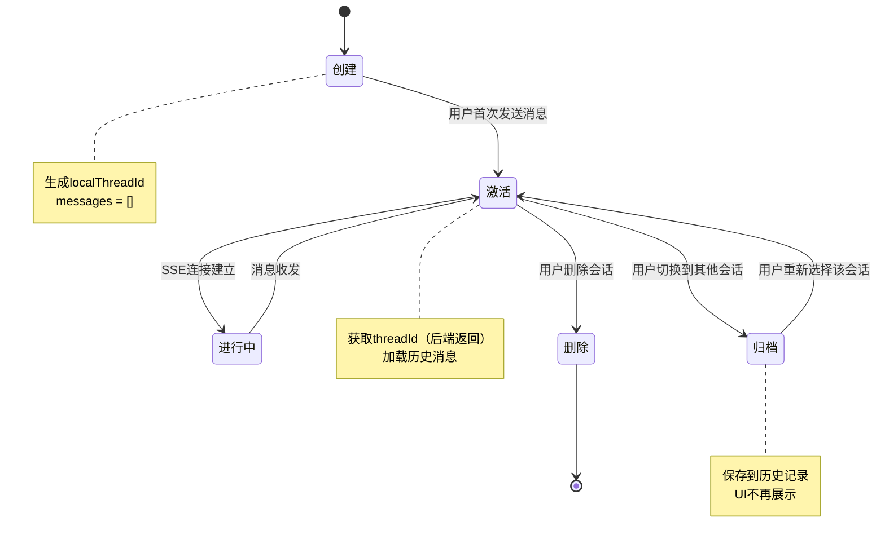
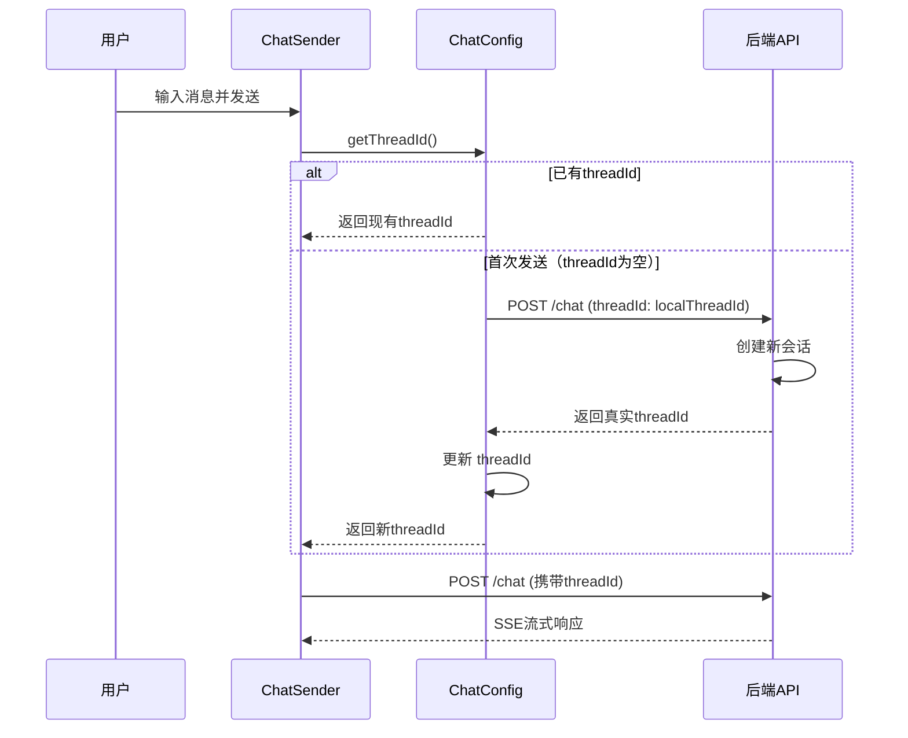
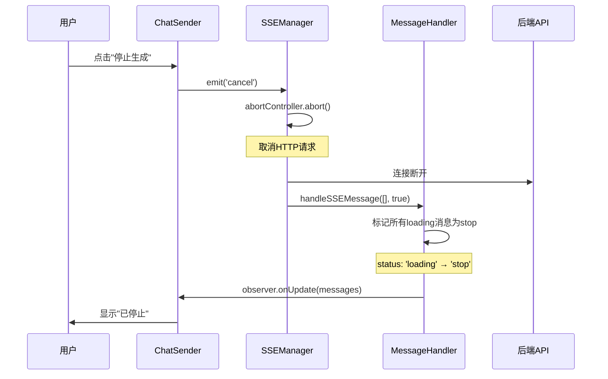

# AI对话系统深度解析（四）：会话与状态管理

> **系列文档**：
> - [Part 1 - 概述与整体架构](./AI对话系统深度解析-1-概述与架构.md)
> - [Part 2 - 消息流转与处理机制](./AI对话系统深度解析-2-消息流转.md)
> - [Part 3 - 三种模式运转逻辑](./AI对话系统深度解析-3-三种模式.md)
> - **当前：Part 4 - 会话与状态管理** ⭐

---

## 一、会话管理全景

### 1.1 核心概念

```
会话 (Session) = 一组相关消息 + 上下文 + 元数据

关键属性：
├─ threadId: 后端会话ID（唯一标识）
├─ localThreadId: 前端临时ID（首次创建）
├─ title: 会话标题（自动生成/用户重命名）
├─ messages: 消息列表
├─ timestamp: 创建时间
└─ isActive: 是否为当前激活会话
```

### 1.2 会话生命周期



### 1.3 会话管理架构

```
┌─────────────────────────────────────────────────────────┐
│                    UI层                                  │
│  ChatHistoryList → 历史列表                              │
│  ChatWrap → 当前会话                                     │
└─────────────────────────────────────────────────────────┘
                          ↕️
┌─────────────────────────────────────────────────────────┐
│                  状态管理层                              │
│  ChatConfig → 全局配置                                   │
│  RecordConversation → 会话记录接口                       │
│  useAiChatWrap → Vue Composable                          │
└─────────────────────────────────────────────────────────┘
                          ↕️
┌─────────────────────────────────────────────────────────┐
│                  数据层                                  │
│  getChatRecords() → 获取历史                             │
│  renameChatRecord() → 重命名                             │
│  deleteChatRecord() → 删除                               │
│  autoSaveConversation() → 自动保存                       │
└─────────────────────────────────────────────────────────┘
                          ↕️
┌─────────────────────────────────────────────────────────┐
│                  存储层                                  │
│  服务端数据库（历史记录）                                 │
│  浏览器LocalStorage（草稿/缓存）                          │
└─────────────────────────────────────────────────────────┘
```

---

## 二、会话创建与激活

### 2.1 创建新会话

#### 时机

1. **用户主动创建**：点击"新建对话"按钮
2. **自动创建**：首次打开聊天面板
3. **切换模式**：从"图片生成"切换到"Agent"（可选）

#### 代码实现

```typescript
// chat-panel.vue
function newChat() {
  // 1. 生成本地ID
  const localThreadId = `local_${Date.now()}_${Math.random()}`;
  
  // 2. 重置状态
  chatWrapRef.value?.reset({
    threadId: '',                // 后端ID为空
    localThreadId,               // 本地临时ID
    messages: [],                // 空消息列表
    title: '',                   // 标题为空
    timestamp: Date.now(),
  });
  
  // 3. 关闭历史面板
  historyVisible.value = false;
  
  // 4. 聚焦输入框
  nextTick(() => {
    chatSenderRef.value?.focus();
  });
}
```

#### 数据结构

```typescript
interface SessionState {
  // 标识
  threadId: string;              // 后端ID（空 = 新会话）
  localThreadId: string;         // 本地ID（用于临时标识）
  
  // 内容
  messages: MessageType[];       // 消息列表
  title: string;                 // 会话标题
  
  // 元数据
  timestamp: number;             // 创建时间
  workId: string;                // 作品ID
  userId: string;                // 用户ID
  companyId: string;             // 企业ID
  
  // 状态
  isActive: boolean;             // 是否激活
  isRequesting: boolean;         // 是否请求中
}
```

### 2.2 首次发送消息（获取threadId）

#### 流程



#### 代码实现

```typescript
// services/chat-config.ts
export class ChatConfig {
  private threadId: string = '';
  private localThreadId: string = '';
  
  getThreadId(): string {
    return this.threadId || this.localThreadId;
  }
  
  updateThreadId(newThreadId: string) {
    if (!this.threadId && newThreadId) {
      // 首次获取真实ID：替换本地ID
      this.threadId = newThreadId;
      
      // 触发保存
      events.emit('threadIdUpdated', {
        localThreadId: this.localThreadId,
        threadId: newThreadId,
      });
    }
  }
}

// hook/use-message/index.ts
const [agent] = useXAgent({
  request: async ({ message }, { onSuccess }) => {
    // 发送消息
    await sseManager.connect(message, isOnline);
    
    // SSE响应中包含threadId
    // 会在handleSSEMessage中提取并更新
  },
});

// services/message-handler.ts
handleSSEMessage(data: MessageType[]) {
  data.forEach(item => {
    // 提取threadId（后端返回）
    if (item.threadId && !chatConfig.threadId) {
      chatConfig.updateThreadId(item.threadId);
    }
    
    // 处理消息...
  });
}
```

### 2.3 加载历史会话

#### 时机

1. **用户打开历史面板**：点击"历史对话"按钮
2. **用户选择历史记录**：点击某条历史记录

#### 代码实现

```typescript
// components/chat-history-list/index.vue
async function loadHistoryRecords() {
  loading.value = true;
  
  try {
    // 1. 请求历史记录
    const records = await getChatRecords({
      userId: props.userId,
      companyId: props.companyId,
      workId: props.editor.workId,
      page: currentPage.value,
      pageSize: 20,
    });
    
    // 2. 转换为UI数据
    historyRecords.value = records.map(record => ({
      id: record.threadId,
      title: record.title || '未命名对话',
      timestamp: record.timestamp,
      preview: record.messages[0]?.content.text || '',
      messageCount: record.messages.length,
    }));
  } catch (error) {
    console.error('加载历史记录失败', error);
  } finally {
    loading.value = false;
  }
}

// 用户点击某条历史记录
async function handleRecordClick(record: HistoryRecord) {
  // 1. 获取完整消息列表
  const fullRecord = await api.getChatDetail(record.id);
  
  // 2. 恢复会话
  chatWrapRef.value?.restore({
    threadId: fullRecord.threadId,
    localThreadId: fullRecord.localThreadId,
    messages: fullRecord.messages,
    title: fullRecord.title,
    timestamp: fullRecord.timestamp,
  });
  
  // 3. 关闭历史面板
  emit('record-click', record);
}
```

---

## 三、消息管理

### 3.1 消息的增删改查

#### 添加消息

```typescript
// hook/use-message/index.ts
function addMessage(message: MessageType) {
  // 1. 添加到消息列表
  messagesRef.current.push(message);
  
  // 2. 触发UI更新
  setMessages([...messagesRef.current]);
  
  // 3. 自动保存（防抖）
  debouncedSave();
}
```

#### 更新消息（流式追加）

```typescript
// services/message-handler.ts
handleSSEMessage(data: MessageType[]) {
  data.forEach(item => {
    const index = this.messages.findIndex(
      m => m.messageId === item.messageId
    );
    
    if (index >= 0) {
      // 流式更新：覆盖
      this.messages[index] = {
        ...this.messages[index],
        ...item,
        content: {
          ...this.messages[index].content,
          text: item.content.text,  // 追加文本
        },
      };
    } else {
      // 新消息：添加
      this.messages.push(item);
    }
  });
  
  // 通知UI
  this.observer.onUpdate(this.filterMessages());
}
```

#### 删除消息（用户撤回）

```typescript
// components/message/footer/index.tsx
function handleDelete(messageId: string) {
  // 1. 确认对话框
  Modal.confirm({
    title: '确认删除',
    content: '删除后无法恢复，确定要删除这条消息吗？',
    onOk: async () => {
      // 2. 从消息列表移除
      const newMessages = messages.filter(m => m.messageId !== messageId);
      setMessages(newMessages);
      
      // 3. 通知后端
      await api.deleteMessage(messageId);
      
      // 4. 保存会话
      await saveConversation(newMessages);
    },
  });
}
```

#### 查询消息（分页加载）

```typescript
// hook/use-message-pagination.ts
export function useMessagePagination(threadId: string) {
  const [page, setPage] = useState(1);
  const [hasMore, setHasMore] = useState(true);
  const [loading, setLoading] = useState(false);
  
  async function loadMore() {
    if (loading || !hasMore) return;
    
    setLoading(true);
    
    try {
      // 请求历史消息
      const result = await api.getMessages({
        threadId,
        page: page + 1,
        pageSize: 20,
      });
      
      // 插入到消息列表开头
      const newMessages = [...result.messages, ...messages];
      setMessages(newMessages);
      
      // 更新分页状态
      setPage(page + 1);
      setHasMore(result.hasMore);
    } catch (error) {
      console.error('加载历史消息失败', error);
    } finally {
      setLoading(false);
    }
  }
  
  return { loadMore, hasMore, loading };
}
```

### 3.2 消息存储策略

#### 存储时机

| 触发条件 | 存储范围 | 存储位置 | 延迟 |
|---------|---------|---------|------|
| **用户发送消息** | 单条消息 | 服务端 | 立即 |
| **AI回复完成** | 整个会话 | 服务端 | 防抖2秒 |
| **工具调用完成** | 整个会话 | 服务端 | 防抖2秒 |
| **用户切换会话** | 当前会话 | 服务端 | 立即 |
| **页面关闭** | 草稿 | LocalStorage | 立即 |

#### 存储格式

```typescript
// 服务端存储
interface ConversationRecord {
  threadId: string;
  userId: string;
  workId: string;
  title: string;
  messages: MessageType[];  // 完整消息列表
  timestamp: number;
  metadata: {
    messageCount: number;
    lastMessageTime: number;
    tags: string[];
  };
}

// LocalStorage存储（草稿）
interface DraftConversation {
  localThreadId: string;
  messages: MessageType[];
  timestamp: number;
  expiresAt: number;  // 7天后过期
}
```

#### 自动保存实现

```typescript
// services/auto-save.ts
const debouncedSave = debounce(async (messages: MessageType[]) => {
  try {
    await api.saveConversation({
      threadId: chatConfig.threadId,
      userId: chatConfig.userId,
      workId: chatConfig.workId,
      messages,
      timestamp: Date.now(),
    });
  } catch (error) {
    // 保存失败：存入LocalStorage
    saveToDraft(messages);
  }
}, 2000);  // 2秒防抖

// 从草稿恢复
function restoreFromDraft() {
  const draft = localStorage.getItem(`draft_${chatConfig.workId}`);
  if (draft) {
    const data = JSON.parse(draft);
    
    // 检查是否过期
    if (Date.now() < data.expiresAt) {
      return data.messages;
    }
    
    // 过期：清理
    localStorage.removeItem(`draft_${chatConfig.workId}`);
  }
  return [];
}
```

---

## 四、中断处理机制

### 4.1 中断类型

```
1. 用户主动中断
   ├─ 点击"停止生成"按钮
   ├─ 关闭浏览器标签页
   └─ 刷新页面

2. 网络中断
   ├─ Wi-Fi断开
   ├─ 移动网络切换
   └─ 服务器超时

3. 系统中断
   ├─ 后端服务崩溃
   ├─ SSE连接异常断开
   └─ 内存溢出
```

### 4.2 用户主动中断

#### UI交互

```typescript
// components/chat-sender/index.vue
<template>
  <div :class="bem()">
    <!-- 输入区域 -->
    <textarea v-model="userInput" />
    
    <!-- 按钮切换 -->
    <Button 
      v-if="!isRequesting"
      @click="handleSubmit"
    >
      发送
    </Button>
    
    <Button 
      v-else
      @click="handleCancel"
      type="danger"
    >
      停止生成
    </Button>
  </div>
</template>

<script setup>
function handleCancel() {
  // 1. 触发中断事件
  events.emit('cancel');
  
  // 2. 更新状态
  isRequesting.value = false;
  
  // 3. UI反馈
  Message.info('已停止生成');
}
</script>
```

#### 中断处理流程



#### 代码实现

```typescript
// services/sse-manager.ts
export class SSEManager {
  private abortController: AbortController | null = null;
  
  async connect(messages: MessageType[]) {
    // 创建可中断的控制器
    this.abortController = new AbortController();
    
    try {
      const response = await fetch(sseUrl, {
        method: 'POST',
        body: JSON.stringify(messages),
        signal: this.abortController.signal,  // ⭐ 关键
      });
      
      // 处理流...
    } catch (error) {
      if (error.name === 'AbortError') {
        // 用户主动中断
        this.handleCancel();
      } else {
        // 其他错误
        this.handleError(error);
      }
    }
  }
  
  cancel() {
    if (this.abortController) {
      this.abortController.abort();
      this.abortController = null;
    }
  }
  
  private handleCancel() {
    // 通知MessageHandler
    messageHandler.handleSSEMessage([], true);
    
    // 更新消息状态
    messageHandler.messages.forEach(msg => {
      if (msg.status === 'loading') {
        msg.status = 'stop';
      }
    });
    
    // 保存会话（包含未完成的消息）
    debouncedSave();
  }
}

// 监听取消事件
events.on('cancel', () => {
  sseManager.cancel();
});
```

### 4.3 页面关闭中断

#### beforeunload处理

```typescript
// utils/tool.ts
export function registerBeforeUnload() {
  window.addEventListener('beforeunload', handleBeforeUnload);
}

function handleBeforeUnload(event: BeforeUnloadEvent) {
  // 1. 检查是否有请求进行中
  if (chatConfig.isRequesting) {
    // 提示用户
    event.preventDefault();
    event.returnValue = '正在生成内容，确定要离开吗？';
    
    // 2. 保存草稿
    saveToDraft(chatConfig.messages);
    
    return event.returnValue;
  }
  
  // 3. 清理资源
  sseManager.cancel();
  videoPoller.stopAll();
}

export function destoryBeforeUnload() {
  window.removeEventListener('beforeunload', handleBeforeUnload);
}
```

### 4.4 网络中断处理

#### 断线检测

```typescript
// hook/use-online.ts
export function useOnlineStatus() {
  const [isOnline, setIsOnline] = useState(navigator.onLine);
  
  useEffect(() => {
    function handleOnline() {
      setIsOnline(true);
      
      // 尝试重连
      if (chatConfig.isRequesting) {
        sseManager.reconnect();
      }
    }
    
    function handleOffline() {
      setIsOnline(false);
      
      // 显示离线提示
      Message.warning('网络已断开，请检查网络连接');
      
      // 取消当前请求
      sseManager.cancel();
    }
    
    window.addEventListener('online', handleOnline);
    window.addEventListener('offline', handleOffline);
    
    return () => {
      window.removeEventListener('online', handleOnline);
      window.removeEventListener('offline', handleOffline);
    };
  }, []);
  
  return isOnline;
}
```

#### 自动重连

```typescript
// services/sse-manager.ts
export class SSEManager {
  private retryCount = 0;
  private maxRetries = 3;
  
  async reconnect() {
    if (this.retryCount >= this.maxRetries) {
      Message.error('重连失败，请手动重试');
      return;
    }
    
    this.retryCount += 1;
    
    // 延迟重连（指数退避）
    const delay = Math.pow(2, this.retryCount) * 1000;  // 2s, 4s, 8s
    
    await new Promise(resolve => setTimeout(resolve, delay));
    
    try {
      // 重新发起连接
      await this.connect(chatConfig.messages);
      
      // 重连成功
      this.retryCount = 0;
      Message.success('已重新连接');
    } catch (error) {
      // 重连失败：继续重试
      this.reconnect();
    }
  }
}
```

### 4.5 状态恢复

#### 中断后恢复策略

| 中断类型 | 恢复策略 | 数据来源 | 用户体验 |
|---------|---------|---------|---------|
| **用户主动** | 保留未完成消息 | 内存 | "已停止" |
| **页面关闭** | 下次打开恢复 | LocalStorage | "继续上次对话" |
| **网络中断** | 自动重连 | 内存 | "重新连接中..." |
| **服务崩溃** | 提示重试 | 服务端 | "生成失败，请重试" |

#### 恢复代码

```typescript
// components/chat-wrap/chat-wrap.vue
onMounted(async () => {
  // 1. 尝试从草稿恢复
  const draftMessages = restoreFromDraft();
  
  if (draftMessages.length > 0) {
    // 询问用户是否恢复
    Modal.confirm({
      title: '发现未完成的对话',
      content: '是否继续上次的对话？',
      onOk: () => {
        setMessages(draftMessages);
        
        // 检查最后一条消息
        const lastMessage = draftMessages[draftMessages.length - 1];
        if (lastMessage.status === 'loading') {
          // 重新发起请求
          onRequest([lastMessage]);
        }
      },
      onCancel: () => {
        // 清空草稿
        clearDraft();
      },
    });
  }
});
```

---

## 五、状态同步策略

### 5.1 多端同步

#### 场景

```
用户在电脑上发起对话
  ↓
服务端保存会话记录
  ↓
用户在手机上打开
  ↓
加载相同的会话记录
  ↓
两端消息保持一致
```

#### 实现

```typescript
// services/sync.ts
class ConversationSync {
  private syncInterval: number | null = null;
  
  startSync(threadId: string) {
    // 每10秒同步一次
    this.syncInterval = setInterval(async () => {
      await this.sync(threadId);
    }, 10000);
  }
  
  async sync(threadId: string) {
    try {
      // 1. 获取服务端最新状态
      const serverMessages = await api.getMessages(threadId);
      
      // 2. 对比本地消息
      const localMessages = chatConfig.messages;
      
      // 3. 检查是否有新消息
      const newMessages = serverMessages.filter(
        sm => !localMessages.find(lm => lm.messageId === sm.messageId)
      );
      
      if (newMessages.length > 0) {
        // 4. 合并新消息
        chatConfig.messages = [...localMessages, ...newMessages];
        
        // 5. 通知UI更新
        events.emit('messagesUpdated', chatConfig.messages);
        
        // 6. 显示提示
        Message.info(`收到 ${newMessages.length} 条新消息`);
      }
    } catch (error) {
      console.error('同步失败', error);
    }
  }
  
  stopSync() {
    if (this.syncInterval) {
      clearInterval(this.syncInterval);
      this.syncInterval = null;
    }
  }
}

export const conversationSync = new ConversationSync();
```

### 5.2 状态一致性

#### 乐观更新

```typescript
// 用户删除消息（乐观更新）
async function deleteMessage(messageId: string) {
  // 1. 立即更新UI（乐观）
  const newMessages = messages.filter(m => m.messageId !== messageId);
  setMessages(newMessages);
  
  try {
    // 2. 请求后端
    await api.deleteMessage(messageId);
    
    // 3. 成功：无需操作
  } catch (error) {
    // 4. 失败：回滚
    setMessages(messages);
    Message.error('删除失败，请重试');
  }
}
```

#### 冲突解决

```typescript
// 检测冲突
function detectConflict(local: MessageType, remote: MessageType) {
  return local.messageId === remote.messageId &&
         local.content.text !== remote.content.text;
}

// 解决冲突（以服务端为准）
function resolveConflict(local: MessageType[], remote: MessageType[]) {
  const resolved: MessageType[] = [];
  
  remote.forEach(remoteMsg => {
    const localMsg = local.find(m => m.messageId === remoteMsg.messageId);
    
    if (!localMsg) {
      // 服务端新增：直接添加
      resolved.push(remoteMsg);
    } else if (detectConflict(localMsg, remoteMsg)) {
      // 冲突：以服务端为准
      resolved.push(remoteMsg);
      console.warn('检测到冲突，已使用服务端版本', remoteMsg);
    } else {
      // 一致：保留
      resolved.push(remoteMsg);
    }
  });
  
  return resolved;
}
```

---

## 六、性能优化

### 6.1 消息列表虚拟化

**问题**：消息数量超过1000条时，渲染卡顿

**解决**：使用虚拟滚动

```typescript
// components/message/index.tsx
import { VirtualList } from '@gaoding/antd-react';

export function Message({ messages }) {
  return (
    <VirtualList
      data={messages}
      height={600}
      itemHeight={100}  // 平均高度
      renderItem={(message) => (
        <MessageItem message={message} />
      )}
    />
  );
}
```

### 6.2 历史记录分页加载

**策略**：

```
初始加载：最近20条
向上滚动：加载更早的20条
向下滚动到底：触发分页
```

**实现**：

```typescript
// hook/use-message-pagination.ts
export function useMessagePagination() {
  const [page, setPage] = useState(1);
  const [hasMore, setHasMore] = useState(true);
  
  const loadMore = useCallback(async () => {
    if (!hasMore || loading) return;
    
    setLoading(true);
    
    const result = await api.getMessages({
      threadId: chatConfig.threadId,
      page: page + 1,
      pageSize: 20,
    });
    
    setMessages(prev => [...result.messages, ...prev]);  // 插入开头
    setPage(page + 1);
    setHasMore(result.hasMore);
    setLoading(false);
  }, [page, hasMore, loading]);
  
  return { loadMore, hasMore, loading };
}
```

### 6.3 消息缓存

```typescript
// services/message-cache.ts
class MessageCache {
  private cache = new Map<string, MessageType[]>();
  private maxSize = 10;  // 最多缓存10个会话
  
  set(threadId: string, messages: MessageType[]) {
    // LRU：超过限制时删除最旧的
    if (this.cache.size >= this.maxSize) {
      const firstKey = this.cache.keys().next().value;
      this.cache.delete(firstKey);
    }
    
    this.cache.set(threadId, messages);
  }
  
  get(threadId: string): MessageType[] | undefined {
    return this.cache.get(threadId);
  }
  
  clear() {
    this.cache.clear();
  }
}

export const messageCache = new MessageCache();

// 使用缓存
async function loadMessages(threadId: string) {
  // 1. 尝试从缓存读取
  const cached = messageCache.get(threadId);
  if (cached) {
    setMessages(cached);
    return;
  }
  
  // 2. 从服务端加载
  const messages = await api.getMessages(threadId);
  
  // 3. 存入缓存
  messageCache.set(threadId, messages);
  setMessages(messages);
}
```

---

## 七、总结与最佳实践

### 7.1 架构设计原则

```
1. 单一职责
   ├─ MessageHandler：只负责消息处理
   ├─ SSEManager：只负责连接管理
   └─ ChatConfig：只负责配置管理

2. 事件驱动
   ├─ 组件间通过事件通信
   ├─ 解耦UI和业务逻辑
   └─ 易于扩展和测试

3. 状态管理
   ├─ 单一数据源（ChatConfig）
   ├─ 不可变更新（immutable）
   └─ 响应式订阅（observer模式）

4. 错误处理
   ├─ 分层处理（UI/业务/网络）
   ├─ 优雅降级（offline模式）
   └─ 用户友好提示
```

### 7.2 性能优化清单

- [x] 虚拟滚动（1000+消息）
- [x] 分页加载（历史记录）
- [x] 防抖保存（2秒）
- [x] 消息缓存（LRU）
- [x] 流式渲染（SSE）
- [x] 占位预览（< 50ms）
- [x] 图片懒加载
- [x] 代码分割（React/Vue）

### 7.3 用户体验要点

```
1. 立即反馈
   ├─ 占位立即显示（< 50ms）
   ├─ 加载动画（视觉反馈）
   └─ 进度百分比（视频生成）

2. 容错处理
   ├─ 网络中断自动重连
   ├─ 生成失败可重试
   └─ 草稿自动保存

3. 操作便捷
   ├─ 快捷键支持（Enter发送）
   ├─ 历史记录快速切换
   └─ 消息复制/删除

4. 性能流畅
   ├─ 首屏加载 < 1s
   ├─ 消息渲染 < 100ms
   └─ 滚动流畅 60fps
```

---

## 八、系列文档总结

通过这四部分文档，我们完整剖析了AI对话系统：

### Part 1：概述与整体架构
- 三层架构（展示/业务/服务）
- 核心概念（消息/会话/工具/占位/批量追踪）
- 技术栈总览

### Part 2：消息流转与处理机制
- 消息生命周期
- MessageHandler核心算法
- 不同角色消息处理
- 批量生成追踪

### Part 3：三种模式运转逻辑
- Agent模式（工具调用）
- 图片生成（批量处理）
- 视频生成（进度轮询）

### Part 4：会话与状态管理
- 会话创建与激活
- 消息管理（增删改查）
- 中断处理机制
- 状态同步策略

---

> **系列完结！** 您已经全面掌握了AI对话系统的业务逻辑和技术实现。现在可以开始实战开发或深入优化了！

**相关文档**：
- [ai-chat-react详细分析](./ai-chat-react详细分析.md)
- [ant-design-x在ai-chat-react中的使用](./ant-design-x在ai-chat-react中的使用.md)
- [AI对话系统核心技术](./06-AI对话系统核心技术.md)
