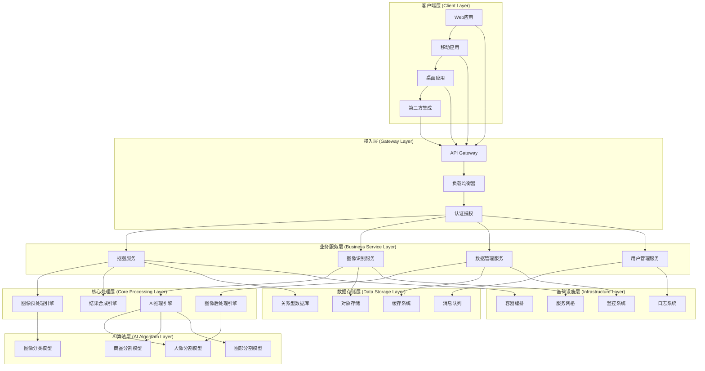
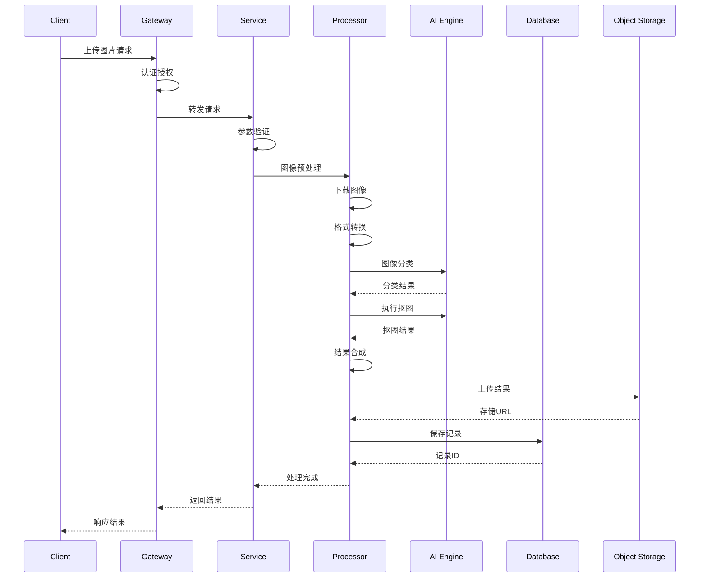

# 抠图系统架构设计方案

## 概述

本文档基于软件开发生命周期(SDLC)理论，设计了一个完整的AI抠图系统架构方案。该系统采用分层架构模式，通过多个阶段的协同工作，实现从原始图像到最终抠图结果的完整处理流程。

## 目录

- [系统架构概览](#系统架构概览)
- [抠图流程阶段分析](#抠图流程阶段分析)
- [核心技术栈](#核心技术栈)
- [分层架构设计](#分层架构设计)
- [数据流转设计](#数据流转设计)
- [服务治理架构](#服务治理架构)
- [性能与扩展性设计](#性能与扩展性设计)
- [安全架构设计](#安全架构设计)
- [监控与运维架构](#监控与运维架构)

## 系统架构概览

### 整体架构图



### 架构特点

| 特点 | 描述 | 优势 |
|------|------|------|
| 分层解耦 | 各层职责明确，降低耦合度 | 易维护、可扩展 |
| 微服务化 | 服务独立部署和扩展 | 高可用、灵活部署 |
| 异步处理 | 支持批量和实时处理 | 高并发、用户体验好 |
| 多模型支持 | 针对不同场景优化 | 准确率高、适应性强 |

## 抠图流程阶段分析

### 阶段1: 需求分析与输入验证 (Requirements & Validation)

#### 职责
- 接收用户请求并进行参数验证
- 分析抠图需求类型和优先级
- 进行权限校验和资源配额检查

#### 核心技术
- **参数验证**: JSON Schema验证、类型检查
- **权限控制**: JWT Token、RBAC权限模型
- **限流控制**: Redis + Sliding Window算法

#### 处理流程
```typescript
// 1. 请求接收与验证
interface MattingRequest {
    images: string[];           // 图片URL列表
    type?: 'auto' | 'portrait' | 'product' | 'graphic';
    watermark?: string;         // 水印配置
    quality?: 'high' | 'medium' | 'low';
    callback?: string;          // 回调URL
}

// 2. 验证逻辑
class RequestValidator {
    validate(request: MattingRequest): ValidationResult {
        // URL格式验证
        // 图片大小限制检查
        // 并发数量限制
        // 用户配额检查
    }
}
```

#### 输出
- 验证通过的标准化请求对象
- 分配的任务ID和优先级
- 资源预估和调度信息

### 阶段2: 图像预处理 (Image Preprocessing)

#### 职责
- 图像下载和格式标准化
- 图像质量检测和修复
- 尺寸调整和格式转换

#### 核心技术
- **图像下载**: HTTP/HTTPS协议、断点续传
- **格式处理**: Canvas API、WebGL加速
- **质量检测**: 图像清晰度算法、噪声检测

#### 处理流程
```typescript
class ImagePreprocessor {
    async process(imageUrl: string): Promise<ProcessedImage> {
        // 1. 图像下载
        const imageBuffer = await this.downloadImage(imageUrl);
        
        // 2. 格式检测与转换
        const format = await this.detectFormat(imageBuffer);
        const standardImage = await this.convertToStandard(imageBuffer, format);
        
        // 3. 质量检测
        const quality = await this.assessQuality(standardImage);
        
        // 4. 预处理优化
        const optimizedImage = await this.optimize(standardImage, quality);
        
        return {
            canvas: optimizedImage,
            metadata: { width, height, format, quality },
            preprocessing: { resized, enhanced, normalized }
        };
    }
}
```

#### 输出
- 标准化的Canvas对象
- 图像元数据信息
- 预处理操作记录

### 阶段3: 智能分类识别 (Intelligent Classification)

#### 职责
- 自动识别图像内容类型
- 选择最适合的抠图算法
- 提供置信度评估

#### 核心技术
- **深度学习**: CNN卷积神经网络
- **模型推理**: TensorFlow.js、ONNX Runtime
- **特征提取**: ResNet、EfficientNet架构

#### 处理流程
```typescript
class ImageClassifier {
    private models: Map<string, AIModel> = new Map();
    
    async classify(image: ProcessedImage): Promise<ClassificationResult> {
        // 1. 特征提取
        const features = await this.extractFeatures(image.canvas);
        
        // 2. 多模型推理
        const predictions = await Promise.all([
            this.models.get('scene-classifier').predict(features),
            this.models.get('object-detector').predict(features),
            this.models.get('complexity-analyzer').predict(features)
        ]);
        
        // 3. 结果融合
        const result = this.fuseResults(predictions);
        
        return {
            type: result.primaryType,      // 'portrait' | 'product' | 'graphic'
            confidence: result.confidence,  // 0-1置信度
            complexity: result.complexity,  // 复杂度评估
            recommendations: result.suggestions
        };
    }
}
```

#### 输出
- 图像分类结果和置信度
- 推荐的抠图策略
- 复杂度评估信息

### 阶段4: 核心抠图处理 (Core Matting Processing)

#### 职责
- 执行具体的抠图算法
- 生成高质量的分割掩码
- 进行边缘优化和细节处理

#### 核心技术
- **语义分割**: U-Net、DeepLab架构
- **边缘检测**: Canny算法、Sobel算子
- **图像分割**: GrabCut、Watershed算法

#### 处理流程

##### 4.1 人像抠图流程
```typescript
class PortraitMattingProcessor {
    async process(image: ProcessedImage): Promise<MattingResult> {
        // 1. 人体关键点检测
        const keypoints = await this.detectKeypoints(image);
        
        // 2. 人像分割
        const segmentation = await this.portraitSegmentation(image, keypoints);
        
        // 3. 头发细节处理
        const hairMask = await this.refineHairDetails(image, segmentation);
        
        // 4. 边缘羽化
        const refinedMask = await this.edgeFeathering(hairMask);
        
        return {
            mask: refinedMask,
            confidence: segmentation.confidence,
            processing_time: Date.now() - startTime
        };
    }
}
```

##### 4.2 商品抠图流程
```typescript
class ProductMattingProcessor {
    async process(image: ProcessedImage): Promise<MattingResult> {
        // 1. 商品边界检测
        const boundaries = await this.detectProductBoundaries(image);
        
        // 2. 背景分离
        const backgroundMask = await this.separateBackground(image, boundaries);
        
        // 3. 阴影处理
        const shadowProcessed = await this.handleShadows(image, backgroundMask);
        
        // 4. 细节优化
        const optimizedMask = await this.optimizeDetails(shadowProcessed);
        
        return {
            mask: optimizedMask,
            boundaries: boundaries,
            processing_time: Date.now() - startTime
        };
    }
}
```

##### 4.3 图形抠图流程
```typescript
class GraphicMattingProcessor {
    async process(image: ProcessedImage): Promise<MattingResult> {
        // 1. 形状识别
        const shapes = await this.recognizeShapes(image);
        
        // 2. 颜色聚类
        const colorClusters = await this.clusterColors(image);
        
        // 3. 轮廓提取
        const contours = await this.extractContours(shapes, colorClusters);
        
        // 4. 精确分割
        const preciseMask = await this.preciseSegmentation(contours);
        
        return {
            mask: preciseMask,
            shapes: shapes,
            processing_time: Date.now() - startTime
        };
    }
}
```

#### 输出
- 高质量分割掩码
- 处理元数据和统计信息
- 质量评估结果

### 阶段5: 结果合成与优化 (Result Composition & Optimization)

#### 职责
- 将原图与掩码进行合成
- 添加水印和特效处理
- 进行质量优化和格式转换

#### 核心技术
- **图像合成**: Canvas 2D/WebGL渲染
- **水印技术**: Alpha混合、频域水印
- **压缩优化**: WebP、AVIF格式支持

#### 处理流程
```typescript
class ResultComposer {
    async compose(
        originalImage: ProcessedImage,
        mask: MattingResult,
        options: CompositionOptions
    ): Promise<ComposedResult> {
        
        // 1. 基础合成
        const baseResult = await this.basicComposition(originalImage, mask);
        
        // 2. 边缘优化
        const edgeOptimized = await this.optimizeEdges(baseResult, options.edgeSmoothing);
        
        // 3. 水印添加
        const watermarked = options.watermark 
            ? await this.addWatermark(edgeOptimized, options.watermark)
            : edgeOptimized;
        
        // 4. 格式优化
        const optimized = await this.optimizeOutput(watermarked, options.outputFormat);
        
        return {
            canvas: optimized,
            dataUrl: optimized.toDataURL(options.outputFormat),
            blob: await this.canvasToBlob(optimized),
            metadata: {
                size: optimized.width * optimized.height,
                format: options.outputFormat,
                quality: options.quality
            }
        };
    }
}
```

#### 输出
- 最终抠图结果(Canvas/Blob/DataURL)
- 输出格式和质量信息
- 处理统计数据

### 阶段6: 数据持久化与管理 (Data Persistence & Management)

#### 职责
- 结果存储和版本管理
- 元数据记录和索引
- 缓存策略和清理

#### 核心技术
- **对象存储**: OSS、S3兼容存储
- **数据库**: PostgreSQL、MongoDB
- **缓存**: Redis、Memcached

#### 处理流程
```typescript
class DataManager {
    async persist(
        result: ComposedResult,
        request: MattingRequest,
        metadata: ProcessingMetadata
    ): Promise<PersistenceResult> {
        
        // 1. 生成存储路径
        const storagePath = this.generateStoragePath(request, metadata);
        
        // 2. 上传到对象存储
        const storageUrl = await this.uploadToStorage(result.blob, storagePath);
        
        // 3. 记录到数据库
        const record = await this.saveToDatabase({
            id: metadata.taskId,
            originalUrl: request.images[0],
            resultUrl: storageUrl,
            type: metadata.classification.type,
            processingTime: metadata.totalTime,
            quality: metadata.quality,
            createdAt: new Date()
        });
        
        // 4. 更新缓存
        await this.updateCache(metadata.taskId, {
            status: 'completed',
            resultUrl: storageUrl
        });
        
        return {
            taskId: metadata.taskId,
            resultUrl: storageUrl,
            recordId: record.id
        };
    }
}
```

#### 输出
- 持久化存储URL
- 数据库记录ID
- 缓存更新状态

## 核心技术栈

### 前端技术栈

| 技术 | 版本 | 用途 | 优势 |
|------|------|------|------|
| TypeScript | 5.0+ | 类型安全开发 | 编译时错误检查、更好的IDE支持 |
| Canvas API | - | 图像处理 | 原生支持、性能优异 |
| WebGL | 2.0 | GPU加速 | 并行计算、高性能渲染 |
| Web Workers | - | 多线程处理 | 避免UI阻塞、提升响应性 |
| IndexedDB | - | 本地存储 | 大容量、异步操作 |

### 后端技术栈

| 技术 | 版本 | 用途 | 优势 |
|------|------|------|------|
| Node.js | 18+ | 服务端运行时 | 高并发、生态丰富 |
| Fastify | 4.0+ | Web框架 | 高性能、类型安全 |
| TensorFlow.js | 4.0+ | AI推理 | 跨平台、易集成 |
| Sharp | 0.32+ | 图像处理 | 高性能、内存效率高 |
| Redis | 7.0+ | 缓存/队列 | 高性能、数据结构丰富 |

### AI算法技术栈

| 技术 | 用途 | 模型架构 | 性能指标 |
|------|------|----------|----------|
| U-Net | 语义分割 | Encoder-Decoder | mIoU > 0.85 |
| DeepLabv3+ | 精细分割 | Atrous Convolution | 边缘精度 > 90% |
| ResNet50 | 图像分类 | 残差网络 | Top-1准确率 > 95% |
| YOLO | 目标检测 | 单阶段检测 | 检测速度 < 50ms |

### 基础设施技术栈

| 技术 | 版本 | 用途 | 特点 |
|------|------|------|------|
| Docker | 24.0+ | 容器化 | 环境一致性、易部署 |
| Kubernetes | 1.28+ | 容器编排 | 自动扩缩容、服务发现 |
| Istio | 1.19+ | 服务网格 | 流量管理、安全策略 |
| Prometheus | 2.45+ | 监控告警 | 指标收集、可视化 |

## 分层架构设计

### 表现层 (Presentation Layer)

#### 职责
- 用户界面展示和交互
- 请求参数收集和验证
- 结果展示和下载

#### 组件设计
```typescript
// 抠图组件接口
interface MattingComponent {
    // 文件上传
    uploadFiles(files: File[]): Promise<UploadResult>;
    
    // 参数配置
    configureOptions(options: MattingOptions): void;
    
    // 开始处理
    startProcessing(): Promise<void>;
    
    // 进度监听
    onProgress(callback: (progress: number) => void): void;
    
    // 结果处理
    onComplete(callback: (results: MattingResult[]) => void): void;
}
```

#### 状态管理
```typescript
interface AppState {
    // 上传状态
    upload: {
        files: File[];
        progress: number;
        status: 'idle' | 'uploading' | 'completed' | 'error';
    };
    
    // 处理状态
    processing: {
        tasks: ProcessingTask[];
        currentTask?: string;
        progress: number;
        status: 'idle' | 'processing' | 'completed' | 'error';
    };
    
    // 结果状态
    results: {
        items: MattingResult[];
        selected?: string;
        downloadProgress: number;
    };
}
```

### 业务逻辑层 (Business Logic Layer)

#### 服务编排
```typescript
class MattingOrchestrator {
    constructor(
        private validator: RequestValidator,
        private preprocessor: ImagePreprocessor,
        private classifier: ImageClassifier,
        private processors: Map<string, MattingProcessor>,
        private composer: ResultComposer,
        private dataManager: DataManager
    ) {}
    
    async processBatch(requests: MattingRequest[]): Promise<BatchResult> {
        const results: ProcessingResult[] = [];
        
        for (const request of requests) {
            try {
                // 1. 验证请求
                const validation = await this.validator.validate(request);
                if (!validation.valid) {
                    results.push({ status: 'error', error: validation.error });
                    continue;
                }
                
                // 2. 预处理
                const preprocessed = await this.preprocessor.process(request.imageUrl);
                
                // 3. 分类识别
                const classification = await this.classifier.classify(preprocessed);
                
                // 4. 选择处理器
                const processor = this.processors.get(classification.type);
                const mattingResult = await processor.process(preprocessed);
                
                // 5. 结果合成
                const composed = await this.composer.compose(
                    preprocessed, 
                    mattingResult, 
                    request.options
                );
                
                // 6. 数据持久化
                const persisted = await this.dataManager.persist(
                    composed, 
                    request, 
                    { classification, processingTime: Date.now() - startTime }
                );
                
                results.push({ 
                    status: 'success', 
                    result: persisted 
                });
                
            } catch (error) {
                results.push({ 
                    status: 'error', 
                    error: error.message 
                });
            }
        }
        
        return { results, summary: this.generateSummary(results) };
    }
}
```

### 数据访问层 (Data Access Layer)

#### 数据模型
```typescript
// 任务记录模型
interface TaskRecord {
    id: string;
    userId: string;
    status: 'pending' | 'processing' | 'completed' | 'failed';
    originalImages: string[];
    resultImages?: string[];
    processingOptions: MattingOptions;
    metadata: {
        classification: ClassificationResult;
        processingTime: number;
        quality: number;
    };
    createdAt: Date;
    updatedAt: Date;
}

// 用户配额模型
interface UserQuota {
    userId: string;
    dailyLimit: number;
    dailyUsed: number;
    monthlyLimit: number;
    monthlyUsed: number;
    lastResetDate: Date;
}
```

#### 数据访问接口
```typescript
interface DataAccessLayer {
    // 任务管理
    createTask(task: Partial<TaskRecord>): Promise<TaskRecord>;
    updateTask(id: string, updates: Partial<TaskRecord>): Promise<void>;
    getTask(id: string): Promise<TaskRecord | null>;
    listTasks(userId: string, pagination: Pagination): Promise<TaskRecord[]>;
    
    // 配额管理
    getUserQuota(userId: string): Promise<UserQuota>;
    updateQuota(userId: string, usage: number): Promise<void>;
    
    // 缓存操作
    setCache(key: string, value: any, ttl?: number): Promise<void>;
    getCache(key: string): Promise<any>;
    deleteCache(key: string): Promise<void>;
}
```

## 数据流转设计

### 数据流图



### 数据格式标准

#### 请求数据格式
```json
{
    "taskId": "uuid-v4",
    "images": [
        {
            "url": "https://example.com/image1.jpg",
            "name": "product1.jpg",
            "size": 1024000
        }
    ],
    "options": {
        "type": "auto",
        "quality": "high",
        "watermark": {
            "url": "https://example.com/watermark.png",
            "position": "bottom-right",
            "opacity": 0.8
        },
        "output": {
            "format": "png",
            "background": "transparent"
        }
    },
    "callback": "https://example.com/webhook"
}
```

#### 响应数据格式
```json
{
    "taskId": "uuid-v4",
    "status": "completed",
    "results": [
        {
            "originalUrl": "https://example.com/image1.jpg",
            "resultUrl": "https://storage.com/result1.png",
            "thumbnailUrl": "https://storage.com/thumb1.jpg",
            "metadata": {
                "type": "product",
                "confidence": 0.95,
                "processingTime": 1500,
                "dimensions": {
                    "width": 1920,
                    "height": 1080
                }
            }
        }
    ],
    "summary": {
        "totalImages": 1,
        "successCount": 1,
        "failureCount": 0,
        "totalProcessingTime": 1500
    }
}
```

### 错误数据格式
```json
{
    "taskId": "uuid-v4",
    "status": "failed",
    "error": {
        "code": "PROCESSING_ERROR",
        "message": "图像处理失败",
        "details": {
            "stage": "classification",
            "reason": "图像质量过低",
            "suggestions": ["提高图像分辨率", "改善光照条件"]
        }
    }
}
```

## 服务治理架构

### 微服务拆分

#### 服务边界定义
```typescript
// 抠图核心服务
interface MattingService {
    processImage(request: MattingRequest): Promise<MattingResult>;
    getBatchStatus(batchId: string): Promise<BatchStatus>;
    cancelProcessing(taskId: string): Promise<void>;
}

// 图像管理服务
interface ImageService {
    uploadImage(file: File): Promise<UploadResult>;
    getImageInfo(imageId: string): Promise<ImageInfo>;
    optimizeImage(imageId: string, options: OptimizeOptions): Promise<OptimizedImage>;
}

// 用户管理服务
interface UserService {
    authenticate(token: string): Promise<UserInfo>;
    checkQuota(userId: string): Promise<QuotaInfo>;
    updateUsage(userId: string, usage: UsageInfo): Promise<void>;
}

// 通知服务
interface NotificationService {
    sendWebhook(url: string, payload: any): Promise<void>;
    sendEmail(to: string, template: string, data: any): Promise<void>;
    sendSMS(phone: string, message: string): Promise<void>;
}
```

### 服务间通信

#### 同步通信 (HTTP/gRPC)
```typescript
// HTTP客户端封装
class ServiceClient {
    constructor(private baseUrl: string, private timeout: number = 5000) {}
    
    async call<T>(
        method: string,
        endpoint: string,
        data?: any,
        options?: RequestOptions
    ): Promise<T> {
        const response = await fetch(`${this.baseUrl}${endpoint}`, {
            method,
            headers: {
                'Content-Type': 'application/json',
                'Authorization': `Bearer ${this.getToken()}`,
                ...options?.headers
            },
            body: data ? JSON.stringify(data) : undefined,
            signal: AbortSignal.timeout(this.timeout)
        });
        
        if (!response.ok) {
            throw new ServiceError(response.status, await response.text());
        }
        
        return response.json();
    }
}
```

#### 异步通信 (消息队列)
```typescript
// 消息队列接口
interface MessageQueue {
    publish(topic: string, message: any): Promise<void>;
    subscribe(topic: string, handler: MessageHandler): Promise<void>;
    unsubscribe(topic: string): Promise<void>;
}

// 事件驱动架构
class EventBus {
    constructor(private queue: MessageQueue) {}
    
    // 发布事件
    async publishEvent(event: DomainEvent): Promise<void> {
        await this.queue.publish(event.type, {
            id: event.id,
            type: event.type,
            data: event.data,
            timestamp: event.timestamp,
            source: event.source
        });
    }
    
    // 订阅事件
    async subscribeToEvent(
        eventType: string, 
        handler: EventHandler
    ): Promise<void> {
        await this.queue.subscribe(eventType, async (message) => {
            const event = this.deserializeEvent(message);
            await handler(event);
        });
    }
}
```

### 服务发现与注册

```typescript
// 服务注册中心
interface ServiceRegistry {
    register(service: ServiceInfo): Promise<void>;
    deregister(serviceId: string): Promise<void>;
    discover(serviceName: string): Promise<ServiceInfo[]>;
    healthCheck(serviceId: string): Promise<HealthStatus>;
}

// 负载均衡器
class LoadBalancer {
    constructor(
        private registry: ServiceRegistry,
        private strategy: LoadBalanceStrategy = 'round-robin'
    ) {}
    
    async getServiceInstance(serviceName: string): Promise<ServiceInfo> {
        const instances = await this.registry.discover(serviceName);
        const healthyInstances = await this.filterHealthyInstances(instances);
        
        if (healthyInstances.length === 0) {
            throw new Error(`No healthy instances for service: ${serviceName}`);
        }
        
        return this.selectInstance(healthyInstances);
    }
}
```

## 性能与扩展性设计

### 性能优化策略

#### 1. 计算性能优化

```typescript
// GPU加速处理
class GPUAccelerator {
    private gl: WebGL2RenderingContext;
    private programs: Map<string, WebGLProgram> = new Map();
    
    async processImageOnGPU(
        image: ImageData,
        shader: string
    ): Promise<ImageData> {
        // 1. 创建纹理
        const texture = this.createTexture(image);
        
        // 2. 编译着色器
        const program = this.getOrCreateProgram(shader);
        
        // 3. GPU计算
        const result = await this.executeShader(program, texture);
        
        // 4. 读取结果
        return this.readPixels(result);
    }
}

// Web Worker多线程处理
class WorkerPool {
    private workers: Worker[] = [];
    private taskQueue: Task[] = [];
    
    constructor(private workerScript: string, private poolSize: number = 4) {
        this.initializeWorkers();
    }
    
    async execute<T>(task: Task): Promise<T> {
        return new Promise((resolve, reject) => {
            const worker = this.getAvailableWorker();
            
            worker.postMessage(task);
            worker.onmessage = (event) => {
                if (event.data.error) {
                    reject(new Error(event.data.error));
                } else {
                    resolve(event.data.result);
                }
                this.releaseWorker(worker);
            };
        });
    }
}
```

#### 2. 内存优化

```typescript
// 内存池管理
class MemoryPool {
    private canvasPool: HTMLCanvasElement[] = [];
    private imageDataPool: ImageData[] = [];
    
    getCanvas(width: number, height: number): HTMLCanvasElement {
        const canvas = this.canvasPool.pop() || document.createElement('canvas');
        canvas.width = width;
        canvas.height = height;
        return canvas;
    }
    
    releaseCanvas(canvas: HTMLCanvasElement): void {
        const ctx = canvas.getContext('2d');
        ctx?.clearRect(0, 0, canvas.width, canvas.height);
        this.canvasPool.push(canvas);
    }
    
    // 自动垃圾回收
    startGC(): void {
        setInterval(() => {
            if (this.canvasPool.length > 10) {
                this.canvasPool.splice(10);
            }
        }, 30000);
    }
}
```

#### 3. 缓存策略

```typescript
// 多级缓存架构
class CacheManager {
    constructor(
        private l1Cache: Map<string, any> = new Map(),  // 内存缓存
        private l2Cache: RedisClient,                    // Redis缓存
        private l3Cache: ObjectStorage                   // 对象存储
    ) {}
    
    async get<T>(key: string): Promise<T | null> {
        // L1缓存查找
        if (this.l1Cache.has(key)) {
            return this.l1Cache.get(key);
        }
        
        // L2缓存查找
        const l2Result = await this.l2Cache.get(key);
        if (l2Result) {
            this.l1Cache.set(key, l2Result);
            return l2Result;
        }
        
        // L3缓存查找
        const l3Result = await this.l3Cache.get(key);
        if (l3Result) {
            await this.l2Cache.set(key, l3Result, 3600);
            this.l1Cache.set(key, l3Result);
            return l3Result;
        }
        
        return null;
    }
}
```

### 扩展性设计

#### 水平扩展

```yaml
# Kubernetes部署配置
apiVersion: apps/v1
kind: Deployment
metadata:
  name: matting-service
spec:
  replicas: 3
  selector:
    matchLabels:
      app: matting-service
  template:
    metadata:
      labels:
        app: matting-service
    spec:
      containers:
      - name: matting-service
        image: matting-service:latest
        resources:
          requests:
            memory: "1Gi"
            cpu: "500m"
          limits:
            memory: "2Gi"
            cpu: "1000m"
        env:
        - name: NODE_ENV
          value: "production"
---
apiVersion: v1
kind: Service
metadata:
  name: matting-service
spec:
  selector:
    app: matting-service
  ports:
  - port: 80
    targetPort: 3000
  type: LoadBalancer
---
apiVersion: autoscaling/v2
kind: HorizontalPodAutoscaler
metadata:
  name: matting-service-hpa
spec:
  scaleTargetRef:
    apiVersion: apps/v1
    kind: Deployment
    name: matting-service
  minReplicas: 3
  maxReplicas: 10
  metrics:
  - type: Resource
    resource:
      name: cpu
      target:
        type: Utilization
        averageUtilization: 70
  - type: Resource
    resource:
      name: memory
      target:
        type: Utilization
        averageUtilization: 80
```

#### 垂直扩展

```typescript
// 动态资源分配
class ResourceManager {
    private currentLoad: number = 0;
    private maxCapacity: number = 100;
    
    async allocateResources(task: ProcessingTask): Promise<ResourceAllocation> {
        const requiredResources = this.estimateResources(task);
        
        if (this.currentLoad + requiredResources > this.maxCapacity) {
            // 触发扩容
            await this.scaleUp();
        }
        
        return {
            cpu: requiredResources * 0.6,
            memory: requiredResources * 0.4,
            gpu: task.complexity > 0.8 ? requiredResources * 0.3 : 0
        };
    }
    
    private async scaleUp(): Promise<void> {
        // 通知容器编排系统扩容
        await this.orchestrator.scaleService('matting-service', {
            replicas: Math.ceil(this.currentLoad / this.maxCapacity) + 1
        });
    }
}
```

## 安全架构设计

### 认证授权

```typescript
// JWT认证中间件
class AuthMiddleware {
    constructor(private jwtSecret: string) {}
    
    async authenticate(request: Request): Promise<UserContext> {
        const token = this.extractToken(request);
        
        if (!token) {
            throw new UnauthorizedError('Missing authentication token');
        }
        
        try {
            const payload = jwt.verify(token, this.jwtSecret) as JWTPayload;
            const user = await this.getUserInfo(payload.userId);
            
            return {
                userId: user.id,
                roles: user.roles,
                permissions: user.permissions,
                quota: user.quota
            };
        } catch (error) {
            throw new UnauthorizedError('Invalid authentication token');
        }
    }
}

// 权限控制
class AuthorizationService {
    async checkPermission(
        user: UserContext,
        resource: string,
        action: string
    ): Promise<boolean> {
        // 基于角色的权限检查
        const rolePermissions = await this.getRolePermissions(user.roles);
        
        // 基于用户的权限检查
        const userPermissions = user.permissions;
        
        const allPermissions = [...rolePermissions, ...userPermissions];
        
        return allPermissions.some(permission => 
            permission.resource === resource && 
            permission.actions.includes(action)
        );
    }
}
```

### 数据安全

```typescript
// 数据加密服务
class EncryptionService {
    constructor(
        private encryptionKey: string,
        private algorithm: string = 'aes-256-gcm'
    ) {}
    
    encrypt(data: string): EncryptedData {
        const iv = crypto.randomBytes(16);
        const cipher = crypto.createCipher(this.algorithm, this.encryptionKey);
        cipher.setAAD(Buffer.from('matting-service'));
        
        let encrypted = cipher.update(data, 'utf8', 'hex');
        encrypted += cipher.final('hex');
        
        const authTag = cipher.getAuthTag();
        
        return {
            encrypted,
            iv: iv.toString('hex'),
            authTag: authTag.toString('hex')
        };
    }
    
    decrypt(encryptedData: EncryptedData): string {
        const decipher = crypto.createDecipher(this.algorithm, this.encryptionKey);
        decipher.setAAD(Buffer.from('matting-service'));
        decipher.setAuthTag(Buffer.from(encryptedData.authTag, 'hex'));
        
        let decrypted = decipher.update(encryptedData.encrypted, 'hex', 'utf8');
        decrypted += decipher.final('utf8');
        
        return decrypted;
    }
}
```

### 输入验证与防护

```typescript
// 输入验证器
class InputValidator {
    private schemas: Map<string, JSONSchema> = new Map();
    
    validate(input: any, schemaName: string): ValidationResult {
        const schema = this.schemas.get(schemaName);
        if (!schema) {
            throw new Error(`Schema not found: ${schemaName}`);
        }
        
        const ajv = new Ajv();
        const validate = ajv.compile(schema);
        const valid = validate(input);
        
        return {
            valid,
            errors: validate.errors || []
        };
    }
    
    // 防止路径遍历攻击
    sanitizePath(path: string): string {
        return path.replace(/\.\./g, '').replace(/[<>:"|?*]/g, '');
    }
    
    // 防止XSS攻击
    sanitizeHtml(html: string): string {
        return DOMPurify.sanitize(html);
    }
}

// 速率限制
class RateLimiter {
    private redis: RedisClient;
    
    async checkLimit(
        key: string,
        limit: number,
        window: number
    ): Promise<RateLimitResult> {
        const current = await this.redis.incr(key);
        
        if (current === 1) {
            await this.redis.expire(key, window);
        }
        
        const ttl = await this.redis.ttl(key);
        
        return {
            allowed: current <= limit,
            remaining: Math.max(0, limit - current),
            resetTime: Date.now() + (ttl * 1000)
        };
    }
}
```

## 监控与运维架构

### 监控体系

```typescript
// 指标收集器
class MetricsCollector {
    private prometheus: PrometheusRegistry;
    
    constructor() {
        this.initializeMetrics();
    }
    
    private initializeMetrics(): void {
        // 业务指标
        this.processedImagesCounter = new Counter({
            name: 'matting_processed_images_total',
            help: 'Total number of processed images',
            labelNames: ['type', 'status']
        });
        
        this.processingDurationHistogram = new Histogram({
            name: 'matting_processing_duration_seconds',
            help: 'Processing duration in seconds',
            labelNames: ['type'],
            buckets: [0.1, 0.5, 1, 2, 5, 10, 30]
        });
        
        // 系统指标
        this.memoryUsageGauge = new Gauge({
            name: 'matting_memory_usage_bytes',
            help: 'Memory usage in bytes'
        });
        
        this.cpuUsageGauge = new Gauge({
            name: 'matting_cpu_usage_percent',
            help: 'CPU usage percentage'
        });
    }
    
    recordProcessing(type: string, duration: number, status: string): void {
        this.processedImagesCounter.inc({ type, status });
        this.processingDurationHistogram.observe({ type }, duration);
    }
}

// 健康检查
class HealthChecker {
    private checks: Map<string, HealthCheck> = new Map();
    
    addCheck(name: string, check: HealthCheck): void {
        this.checks.set(name, check);
    }
    
    async runChecks(): Promise<HealthStatus> {
        const results: HealthCheckResult[] = [];
        
        for (const [name, check] of this.checks) {
            try {
                const startTime = Date.now();
                await check.execute();
                results.push({
                    name,
                    status: 'healthy',
                    duration: Date.now() - startTime
                });
            } catch (error) {
                results.push({
                    name,
                    status: 'unhealthy',
                    error: error.message
                });
            }
        }
        
        const overallStatus = results.every(r => r.status === 'healthy') 
            ? 'healthy' 
            : 'unhealthy';
        
        return {
            status: overallStatus,
            checks: results,
            timestamp: new Date()
        };
    }
}
```

### 日志系统

```typescript
// 结构化日志
class Logger {
    constructor(
        private service: string,
        private version: string,
        private environment: string
    ) {}
    
    info(message: string, metadata?: any): void {
        this.log('info', message, metadata);
    }
    
    error(message: string, error?: Error, metadata?: any): void {
        this.log('error', message, {
            ...metadata,
            error: error ? {
                name: error.name,
                message: error.message,
                stack: error.stack
            } : undefined
        });
    }
    
    private log(level: string, message: string, metadata?: any): void {
        const logEntry = {
            timestamp: new Date().toISOString(),
            level,
            service: this.service,
            version: this.version,
            environment: this.environment,
            message,
            ...metadata
        };
        
        console.log(JSON.stringify(logEntry));
    }
}

// 分布式追踪
class TracingService {
    private tracer: Tracer;
    
    startSpan(operationName: string, parentSpan?: Span): Span {
        return this.tracer.startSpan(operationName, {
            childOf: parentSpan
        });
    }
    
    async traceAsync<T>(
        operationName: string,
        operation: (span: Span) => Promise<T>,
        parentSpan?: Span
    ): Promise<T> {
        const span = this.startSpan(operationName, parentSpan);
        
        try {
            const result = await operation(span);
            span.setTag('success', true);
            return result;
        } catch (error) {
            span.setTag('error', true);
            span.log({ error: error.message });
            throw error;
        } finally {
            span.finish();
        }
    }
}
```

### 告警系统

```typescript
// 告警规则引擎
class AlertManager {
    private rules: AlertRule[] = [];
    private notifiers: Map<string, Notifier> = new Map();
    
    addRule(rule: AlertRule): void {
        this.rules.push(rule);
    }
    
    async evaluateMetrics(metrics: Metrics): Promise<void> {
        for (const rule of this.rules) {
            const shouldAlert = await rule.evaluate(metrics);
            
            if (shouldAlert && !rule.isActive) {
                await this.triggerAlert(rule, metrics);
                rule.isActive = true;
            } else if (!shouldAlert && rule.isActive) {
                await this.resolveAlert(rule);
                rule.isActive = false;
            }
        }
    }
    
    private async triggerAlert(rule: AlertRule, metrics: Metrics): Promise<void> {
        const alert: Alert = {
            id: generateId(),
            rule: rule.name,
            severity: rule.severity,
            message: rule.generateMessage(metrics),
            timestamp: new Date(),
            status: 'firing'
        };
        
        for (const notifierName of rule.notifiers) {
            const notifier = this.notifiers.get(notifierName);
            if (notifier) {
                await notifier.send(alert);
            }
        }
    }
}
```

## 总结

本架构设计方案基于软件开发生命周期理论，将抠图系统分解为六个核心阶段，每个阶段都有明确的职责和技术实现。通过分层架构、微服务化、事件驱动等现代软件架构模式，构建了一个高性能、高可用、可扩展的AI抠图系统。

### 核心优势

1. **模块化设计**: 各阶段职责清晰，便于维护和扩展
2. **技术先进**: 采用最新的AI算法和Web技术
3. **性能优异**: 多级缓存、GPU加速、并行处理
4. **安全可靠**: 完善的认证授权和数据保护机制
5. **运维友好**: 全面的监控告警和日志系统

### 适用场景

- 电商平台商品图片处理
- 社交媒体头像抠图
- 设计工具图像编辑
- 批量图片处理服务
- 企业级图像管理系统

该架构方案为构建现代化的AI抠图服务提供了完整的技术指导和实现路径。
