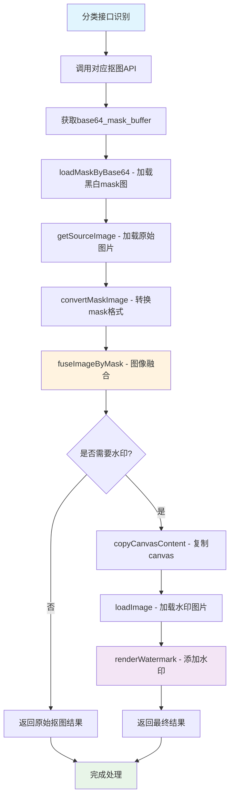

# 核心图像处理方法详解

## 概述

本文档详细解析抠图服务中从黑白mask图到最终抠图结果的完整处理流程，包括mask转换、图像融合、水印添加等核心技术实现。

## 完整处理流程图



## 核心处理方法详解

### 1. 黑白Mask图处理

#### 1.1 加载Base64 Mask图
```typescript
// 从API返回的base64字符串加载mask图像
async function loadMaskByBase64(base64: string): Promise<HTMLImageElement> {
    try {
        return await loadImage(`data:image/png;base64,${base64}`);
    } catch (error) {
        throw getError('加载 mask 失败', error);
    }
}
```

**处理说明**：
- API返回的是纯base64字符串，需要添加`data:image/png;base64,`前缀
- 使用`loadImage`工具函数异步加载为HTMLImageElement
- 此时得到的是黑白图：白色区域为需要保留的部分，黑色为背景

#### 1.2 Mask格式转换
```typescript
// 将黑白mask图转换为alpha通道mask
function convertMaskImage(image: HTMLImageElement): HTMLCanvasElement {
    const { width, height } = image;
    const { canvas, ctx } = createCanvas(width, height);
    ctx.drawImage(image, 0, 0);

    // 获取像素数据
    const imageData = ctx.getImageData(0, 0, width, height);
    const data = imageData.data;

    // 核心转换逻辑：将R通道值复制到Alpha通道
    for (let i = 3; i < data.length; i += 4) {
        data[i] = data[i - 3];  // Alpha = Red通道值
    }

    // 将处理后的数据写回canvas
    ctx.putImageData(imageData, 0, 0);
    return canvas;
}
```

**转换原理**：
- **输入**：黑白mask图（白色=255，黑色=0）
- **处理**：遍历每个像素的RGBA值，将R通道值赋给Alpha通道
- **结果**：白色区域变为不透明(Alpha=255)，黑色区域变为透明(Alpha=0)
- **用途**：转换后的mask可以直接用于Canvas合成操作

### 2. 图像融合处理

#### 2.1 获取原始图片
```typescript
async function getSourceImage(file: string | File | Blob): Promise<HTMLImageElement> {
    try {
        if (isString(file)) {
            // URL形式的图片
            return await loadImage(file, true);
        } else {
            // File/Blob对象
            return await loadImage(URL.createObjectURL(file));
        }
    } catch (error) {
        throw getError('获取原图失败', error);
    }
}
```

#### 2.2 核心融合算法
```typescript
// 使用mask将原图和背景分离
function fuseImageByMask(
    image: HTMLImageElement | HTMLCanvasElement,
    mask: HTMLImageElement | HTMLCanvasElement,
): HTMLCanvasElement {
    // 创建与原图相同尺寸的canvas
    const { canvas, ctx } = createCanvas(image.width, image.height);
    
    // 1. 绘制原始图片
    ctx.drawImage(image, 0, 0);
    
    // 2. 保存当前状态
    ctx.save();
    
    // 3. 设置合成模式为 destination-in
    ctx.globalCompositeOperation = 'destination-in';
    
    // 4. 绘制mask，只保留mask不透明区域的原图内容
    ctx.drawImage(mask, 0, 0);
    
    // 5. 恢复状态
    ctx.restore();
    
    return canvas;
}
```

**合成模式说明**：
- `destination-in`：只保留新图形与现有图形重叠的部分
- **效果**：原图只在mask不透明的区域显示，其他区域变为透明
- **结果**：得到完美的抠图效果

### 3. 商品抠图完整流程

```typescript
async function productMatting(url: string, file?: File | Blob): Promise<HTMLCanvasElement> {
    // 1. 调用商品抠图API
    const { base64_mask_buffer } = await legoApi.productClip({
        url,
        return_base64: 1,
    });

    // 2. 并行处理：加载mask和原图
    const [maskImg, sourceImage] = await Promise.all([
        loadMaskByBase64(base64_mask_buffer),  // 加载黑白mask
        getSourceImage(file || url)           // 加载原始图片
    ]);

    // 3. 转换mask格式
    const convertedMask = convertMaskImage(maskImg);

    // 4. 图像融合生成抠图结果
    const result = fuseImageByMask(sourceImage, convertedMask);

    return result;
}
```

### 4. 水印添加处理

#### 4.1 Canvas内容复制
```typescript
// 复制canvas内容，避免修改原始结果
function copyCanvasContent(canvas: HTMLCanvasElement): HTMLCanvasElement {
    const { canvas: copyCanvas, ctx } = createCanvas(canvas.width, canvas.height);
    ctx.drawImage(canvas, 0, 0);
    return copyCanvas;
}
```

#### 4.2 水印渲染核心算法
```typescript
// 水印添加的完整实现
function renderWatermark(options: {
    watermarkOptions: {
        image: HTMLImageElement;           // 水印图片
        patternRepetition?: string;        // 重复模式：'repeat' | 'no-repeat'
        objectFit?: string;                // 适应模式：'contain' | 'cover' | 'none'
    };
    fillOptions: {
        canvas: HTMLCanvasElement;         // 目标canvas
        globalCompositeOperation?: string; // 合成模式
    };
}): HTMLCanvasElement {
    
    const { watermarkOptions, fillOptions } = options;
    
    // 1. 设置默认值
    const _watermarkOptions = {
        patternRepetition: 'repeat',
        objectFit: 'none',
        ...watermarkOptions,
    };
    
    const _fillOptions = {
        globalCompositeOperation: 'source-over',
        ...fillOptions,
    };

    // 2. 计算水印尺寸和位置
    const {
        width: watermarkWidth,
        height: watermarkHeight,
        x: drawWatermarkX,
        y: drawWatermarkY,
    } = getSizeByObjectFit({
        type: _watermarkOptions.objectFit,
        containerWidth: _fillOptions.canvas.width,
        containerHeight: _fillOptions.canvas.height,
        imageWidth: _watermarkOptions.image.width,
        imageHeight: _watermarkOptions.image.height,
    });

    // 3. 创建水印pattern
    const { canvas: watermarkCanvas, ctx: watermarkCtx } = createCanvas(
        watermarkWidth + drawWatermarkX * 2,
        watermarkHeight + drawWatermarkY * 2,
    );
    
    // 4. 绘制水印到pattern canvas
    watermarkCtx.drawImage(
        _watermarkOptions.image,
        drawWatermarkX,
        drawWatermarkY,
        watermarkWidth,
        watermarkHeight,
    );
    
    // 5. 创建填充pattern
    const pattern = watermarkCtx.createPattern(
        watermarkCanvas,
        _watermarkOptions.patternRepetition,
    );
    
    if (!pattern) throw new Error('createPattern fail');

    // 6. 应用水印到目标canvas
    const fillCtx = _fillOptions.canvas.getContext('2d');
    if (!fillCtx) throw new Error('get fillCanvas 2d context fail');

    fillCtx.save();
    fillCtx.globalCompositeOperation = _fillOptions.globalCompositeOperation;
    fillCtx.fillStyle = pattern;
    fillCtx.fillRect(0, 0, _fillOptions.canvas.width, _fillOptions.canvas.height);
    fillCtx.restore();

    return _fillOptions.canvas;
}
```

#### 4.3 水印适应模式处理
```typescript
// 计算水印在容器中的尺寸和位置
function getSizeByObjectFit({
    type = 'none',
    containerWidth,
    containerHeight,
    imageWidth,
    imageHeight,
}: {
    type?: 'contain' | 'cover' | 'none';
    containerWidth: number;
    containerHeight: number;
    imageWidth: number;
    imageHeight: number;
}) {
    let width = imageWidth;
    let height = imageHeight;
    let x = 0;
    let y = 0;

    switch (type) {
        case 'contain':
            // 等比缩放，完全显示在容器内
            const containScale = Math.min(
                containerWidth / imageWidth,
                containerHeight / imageHeight
            );
            width = imageWidth * containScale;
            height = imageHeight * containScale;
            x = (containerWidth - width) / 2;
            y = (containerHeight - height) / 2;
            break;
            
        case 'cover':
            // 等比缩放，完全覆盖容器
            const coverScale = Math.max(
                containerWidth / imageWidth,
                containerHeight / imageHeight
            );
            width = imageWidth * coverScale;
            height = imageHeight * coverScale;
            x = (containerWidth - width) / 2;
            y = (containerHeight - height) / 2;
            break;
            
        case 'none':
        default:
            // 保持原始尺寸
            break;
    }

    return { x, y, width, height };
}
```

### 5. 完整的抠图+水印流程

```typescript
// 自动抠图逻辑中的水印处理部分
async function matting<T extends MattingOptions>(options: T[]): Promise<MattingFunctionResult<T>> {
    const filePromises = options.map(async ({ file, fileResource, watermarkUrl, type }, index) => {
        
        // 1. 执行抠图获得原始结果
        const originResult = await mattingByClassify({
            url: file,
            type: classifyType,
            file: fileResource,
        });

        // 2. 添加水印处理
        const composeResult = watermarkUrl
            ? renderWatermark({
                  fillOptions: {
                      canvas: copyCanvasContent(originResult), // 复制原始结果
                  },
                  watermarkOptions: {
                      image: await loadImage(watermarkUrl, true), // 加载水印图片
                      patternRepetition: 'no-repeat',             // 不重复
                      objectFit: 'contain',                       // 等比缩放适应
                  },
              })
            : undefined;

        return {
            composeResult,  // 带水印的合成结果
            originResult,   // 原始抠图结果
            type: classifyType,
        };
    });

    // 3. 批量处理所有任务
    const results = await allSettled(filePromises);
    const { errors, successes } = normalizeAllsettled(results);

    return { results, errors, successes };
}
```

## 关键技术点总结

### 1. Mask处理技术
- **黑白转Alpha**：将mask的灰度值转换为透明度
- **像素级操作**：直接操作ImageData进行高效转换
- **内存优化**：使用Canvas进行GPU加速处理

### 2. 图像合成技术
- **合成模式**：`destination-in`实现精确抠图
- **状态管理**：使用save/restore保护Canvas状态
- **尺寸匹配**：确保mask和原图尺寸一致

### 3. 水印技术
- **Pattern系统**：使用Canvas Pattern实现灵活的水印效果
- **适应模式**：支持contain/cover/none多种适应方式
- **合成控制**：通过globalCompositeOperation控制混合效果

### 4. 性能优化
- **并行处理**：同时加载mask和原图
- **内存复用**：合理的Canvas复制和释放
- **异步操作**：所有IO操作都是异步的

## 使用示例

### 基础抠图
```typescript
// 1. 商品抠图
const canvas = await productMatting('https://example.com/product.jpg');
document.body.appendChild(canvas);

// 2. 带本地文件的抠图
const file = document.querySelector('input[type="file"]').files[0];
const canvas = await productMatting('https://example.com/product.jpg', file);
```

### 带水印的抠图
```typescript
const result = await matting([{
    file: 'https://example.com/product.jpg',
    watermarkUrl: 'https://example.com/watermark.png'
}]);

// 获取结果
const { originResult, composeResult } = result.successes[0];

// originResult: 原始抠图结果
// composeResult: 带水印的结果
document.body.appendChild(composeResult || originResult);
```

### 自定义水印配置
```typescript
// 手动添加水印
const watermarkedCanvas = renderWatermark({
    fillOptions: {
        canvas: copyCanvasContent(originCanvas),
    },
    watermarkOptions: {
        image: watermarkImage,
        patternRepetition: 'repeat',    // 平铺水印
        objectFit: 'cover',             // 覆盖模式
    },
});
```

## 错误处理

### 常见错误类型
1. **图片加载失败**：网络问题或URL无效
2. **Mask转换失败**：API返回的mask格式异常
3. **Canvas操作失败**：浏览器兼容性问题
4. **水印加载失败**：水印URL无效或网络问题

### 错误处理策略
```typescript
try {
    const result = await productMatting(url, file);
    return result;
} catch (error) {
    if (error.message.includes('加载 mask 失败')) {
        // mask加载失败，可能需要重试
        console.error('Mask加载失败，请检查网络连接');
    } else if (error.message.includes('获取原图失败')) {
        // 原图加载失败
        console.error('原图加载失败，请检查图片URL');
    }
    throw error;
}
```

这套核心图像处理方法通过精心设计的算法和优化策略，实现了高质量、高性能的抠图效果，为用户提供了完整的图像处理解决方案。

