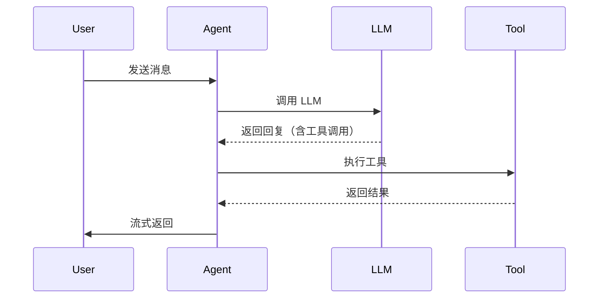
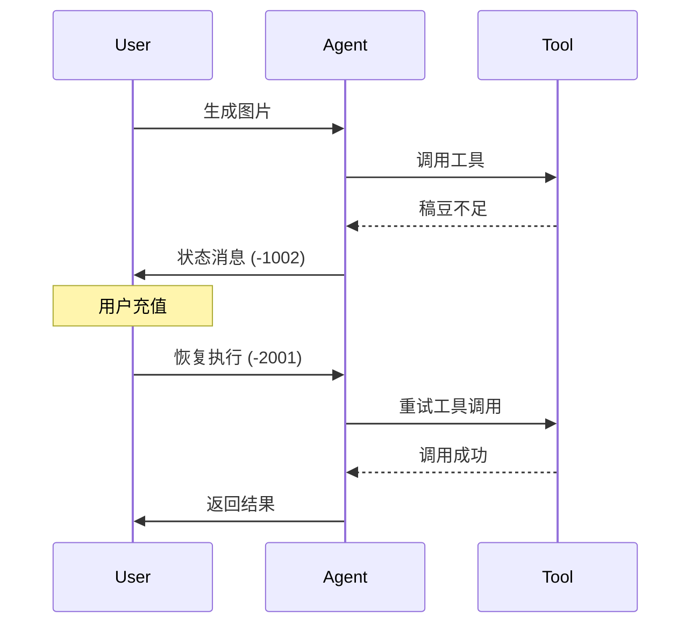

# AI Agent 快速入门

> **5 分钟了解稿定 AI Agent 系统**

---

## 什么是 AI Agent？

**AI Agent**（人工智能代理）是一个能够**理解用户意图、调用工具、完成复杂任务**的智能系统。与传统的单次 LLM 调用不同，Agent 可以：

- 🤖 **多轮对话**：记住上下文，进行连贯的对话
- 🛠️ **工具调用**：调用图像生成、搜索等外部工具
- 🔄 **任务编排**：将复杂任务拆解为多个步骤
- 💾 **状态管理**：支持中断与恢复

**简单类比**：
- **传统 LLM**：像一个只会回答问题的客服
- **AI Agent**：像一个能帮你完成任务的助理

---

## 核心能力

### 1. 智能对话

```
用户：帮我生成一张牙膏产品图
Agent：好的，我来帮你生成。请问你想要什么风格的？
用户：简约风格，白色背景
Agent：[调用图像生成工具] 已为你生成，请查看
```

### 2. 工具调用

Agent 可以调用多种工具：
- **图像生成**：生成产品图、海报等
- **搜索**：搜索模板、素材
- **视频生成**：生成视频内容
- **...更多工具**

### 3. 任务编排

复杂任务自动拆解：
```
用户任务：设计一套品牌视觉
  ↓
Step 1：生成 Logo
  ↓
Step 2：生成配色方案
  ↓
Step 3：生成海报模板
  ↓
完成
```

### 4. 中断与恢复

```
用户：生成图片
Agent：检测到稿豆不足，请充值
[用户充值]
用户：继续
Agent：[从中断点恢复] 继续生成...
```

---

## 系统架构（一图胜千言）

```
┌─────────┐
│  用户   │
└────┬────┘
     │ 发送消息
     ↓
┌─────────────────┐
│  Kong 网关      │ ← SSE 长连接
│  (15分钟超时)   │
└────┬────────────┘
     │
     ↓
┌─────────────────┐
│  Agent 服务     │ ← 核心服务
│  - 会话管理     │
│  - 状态持久化   │
└────┬────────────┘
     │
     ↓
┌─────────────────┐
│  LangGraph      │ ← 工作流编排
│  - Node 调度    │
│  - 中断与恢复   │
└────┬────────────┘
     │
     ├──────────────────┐
     ↓                  ↓
┌──────────────┐  ┌──────────────┐
│ AI Gateway   │  │ gdesign-tool │
│ (LLM 调用)   │  │ (工具调用)   │
└──────────────┘  └──────────────┘
```

---

## 核心概念

### 消息 (Message)

Agent 中的所有交互都通过**消息**进行：

```json
{
  "thread_id": "thread_123",      // 会话 ID
  "message_id": "msg_001",         // 消息 ID
  "role": "user",                  // 角色：user/assistant/function/status
  "content": {
    "type": "plain",               // 类型：plain/function_call/function_response
    "text": "帮我生成一张图"
  }
}
```

**关键角色**：
- `user`：用户输入
- `assistant`：AI 回复
- `function`：工具调用结果
- `status`：状态消息（如稿豆不足）

### 会话 (Thread)

一次完整的对话称为一个**会话**：

```
Thread ID: thread_123
├── Message 1: 用户问好
├── Message 2: Agent 回复
├── Message 3: 用户请求生成图片
├── Message 4: Agent 调用工具
├── Message 5: 工具返回结果
└── Message 6: Agent 返回最终结果
```

### 工具调用 (Function Calling)

Agent 通过特殊格式调用工具：

```xml
<tool_call>
{
  "name": "generate_image",
  "parameters": {
    "user_prompt": "一张牙膏产品图",
    "width": "512",
    "height": "512"
  }
}
</tool_call>
```

### 状态消息 (Status Message)

用于传递系统状态：

| 状态码 | 含义 | 处理方式 |
|--------|------|----------|
| `-1002` | 稿豆不足 | 提示用户充值 |
| `-1004` | Token 过期 | 刷新 token |
| `-1006` | 内容风险 | 撤回并提示 |
| `-2001` | 恢复执行 | 从中断点继续 |

---

## 快速体验

### 1. 简单对话

```bash
POST /api/agent/chat
{
  "thread_id": null,  # 新会话传 null
  "message": "你好"
}

# 响应（SSE 流式）
data: {"role": "assistant", "content": "你好！我是稿定 AI Agent，有什么可以帮你的吗？"}
```

### 2. 调用工具

```bash
POST /api/agent/chat
{
  "thread_id": "thread_123",
  "message": "帮我生成一张牙膏产品图",
  "input_skill_id": 2  # 图像生成技能
}

# 响应
data: {"role": "assistant", "content": "好的，我来帮你生成..."}
data: {"role": "function", "content": {"tool_name": "generate_image", "result": "success", "image_url": "..."}}
data: {"role": "assistant", "content": "已为你生成，请查看"}
```

### 3. 处理中断

```bash
# 第一次请求
POST /api/agent/chat
{
  "message": "生成图片"
}

# 响应：稿豆不足
data: {"role": "status", "content": {"code": -1002, "message": "稿豆不足"}}

# 用户充值后恢复
POST /api/agent/chat
{
  "thread_id": "thread_123",
  "message": null,  # 恢复时不需要新消息
  "resume": true    # 标记为恢复请求
}

# 响应：继续执行
data: {"role": "function", "content": {...}}
```

---

## 关键流程

### 消息流转



### 中断与恢复



---

## 核心优势

### 1. 长连接流式输出

- ✅ 实时反馈，用户体验好
- ✅ 支持 15 分钟长任务
- ✅ SSE 协议，兼容性好

### 2. 状态管理

- ✅ 支持中断与恢复
- ✅ 完整的会话历史
- ✅ 状态持久化

### 3. 工具生态

- ✅ 统一的工具调用接口
- ✅ 易于扩展新工具
- ✅ 工具调用可追踪

### 4. 可观测性

- ✅ 完整的链路追踪
- ✅ 详细的性能指标
- ✅ 成本管控

---

## 下一步

### 深入学习

1. **[基础概念](01-基础概念.md)**  
   理解 AI Agent 的核心原理

2. **[消息系统](02-消息系统.md)**  
   掌握消息格式和状态管理

3. **[工具调用](03-工具调用.md)**  
   学习 Function Calling 机制

4. **[工作流编排](04-工作流编排.md)**  
   了解 LangGraph 集成

### 开发指南

- **[网络架构](05-网络架构.md)**：了解系统架构
- **[中断与恢复](06-中断与恢复.md)**：掌握状态管理
- **[业务功能](07-业务功能.md)**：学习实际应用
- **[可观测性](08-可观测性.md)**：监控与追踪
- **[最佳实践](09-最佳实践.md)**：开发规范

---

## 常见问题

### Q1: Agent 和普通 LLM 有什么区别？

**A:** 主要区别：
- **LLM**：单次问答，无状态
- **Agent**：多轮对话，有状态，可调用工具

### Q2: 为什么需要状态消息？

**A:** 状态消息用于：
- 传递系统状态（如稿豆不足）
- 实现中断与恢复
- 控制流程（如停止生成）

### Q3: 如何处理长任务？

**A:** 通过以下机制：
- SSE 长连接（15分钟超时）
- 中断与恢复机制
- 状态持久化

### Q4: 工具调用失败怎么办？

**A:** 系统会：
- 记录错误日志
- 返回错误状态
- 支持重试机制

---

## 快速参考

### 关键 API

```bash
# 发送消息
POST /api/agent/chat

# 停止生成
POST /api/agent/stop

# 获取会话历史
GET /api/agent/thread/{thread_id}

# 获取会话列表
GET /api/agent/threads?user_id={user_id}
```

### 关键配置

```python
# 超时配置
KONG_SSE_TIMEOUT = 900  # 15 分钟
AGENT_TIMEOUT = 600     # 10 分钟

# 限制配置
MAX_LLM_CALLS = 10      # 单轮最多 LLM 调用次数
MAX_TOOL_CALLS = 5      # 单轮最多工具调用次数
```

---

*文档版本：v1.0*  
*最后更新：2026-01-26*

**下一篇**：[基础概念 →](01-基础概念.md)
