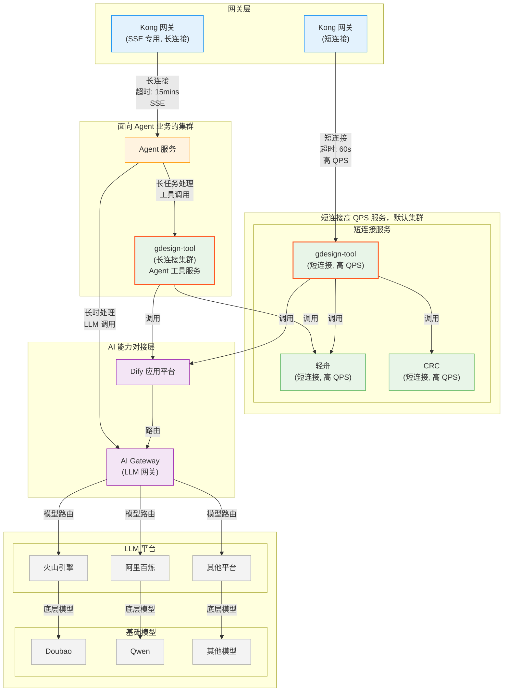

# Agent 网络架构设计

## 一、架构概述

稿定 AI Agent 采用分层架构设计，通过短连接和长连接集群分离，实现高效的服务调度和资源管理。本文档详细描述了 Agent 系统的网络架构、服务组件和调用关系。

---

## 二、整体架构图



---

## 三、架构分层

### 3.1 网关层

#### Kong 网关（短连接）
- **功能**：处理常规的短连接请求
- **超时设置**：60 秒
- **特点**：高 QPS，快速响应
- **服务对象**：gdesign-tool 等短连接服务

#### Kong 网关（SSE 专用，长连接）
- **功能**：专门处理 Server-Sent Events (SSE) 长连接
- **超时设置**：15 分钟
- **特点**：支持流式数据传输
- **服务对象**：Agent 服务

**设计理由：**
- 短连接和长连接分离，避免资源竞争
- SSE 专用网关优化长连接处理
- 独立的超时配置满足不同业务需求

---

### 3.2 服务层

#### 短连接高 QPS 服务集群

**gdesign-tool（短连接）**
- **类型**：短连接，高 QPS
- **职责**：常规设计工具服务，快速响应
- **调用关系**：
  - → 轻舟（Lightboat）
  - → CRC
  - → Dify

**轻舟（Lightboat）**
- **类型**：短连接，高 QPS
- **职责**：提供基础设计能力

**CRC**
- **类型**：短连接，高 QPS
- **职责**：内容审核与合规检查

#### Agent 业务集群

**Agent 服务**
- **类型**：长连接
- **职责**：AI Agent 核心服务，处理复杂的多轮对话和任务编排
- **调用关系**：
  - → gdesign-tool（长连接集群）
  - → AI Gateway
- **特点**：
  - 支持 SSE 流式输出
  - 长时任务处理
  - 智能工具调用

**gdesign-tool（长连接集群）**
- **类型**：长连接
- **职责**：为 Agent 提供工具调用能力
- **调用关系**：
  - → Dify
  - → 轻舟
- **特点**：
  - 与短连接集群隔离
  - 优化长时任务处理
  - 支持异步调用

---

### 3.3 AI 能力对接层

#### AI Gateway（LLM 网关）
- **职责**：LLM 模型路由和统一接入
- **功能**：
  - 模型选择和负载均衡
  - 请求转发和响应聚合
  - 统一的 API 接口
- **支持平台**：
  - 火山引擎 → Doubao
  - 阿里百炼 → Qwen
  - 其他平台 → 其他模型

#### Dify 应用平台
- **职责**：AI 应用编排平台
- **功能**：
  - Workflow 编排
  - Prompt 管理
  - 应用发布
- **集成**：与 AI Gateway 协同工作

---

### 3.4 LLM 平台层

#### LLM 平台
| 平台 | 基础模型 | 特点 |
|------|----------|------|
| 火山引擎 | Doubao | 高性能，低成本 |
| 阿里百炼 | Qwen | 开源生态，灵活部署 |
| 其他平台 | 其他模型 | 多模态能力 |

---

## 四、调用链路

### 4.1 短连接链路

```
用户请求 
  → Kong 网关（短连接，60s 超时）
  → gdesign-tool（短连接集群）
  → [轻舟 / CRC / Dify]
  → 快速响应
```

**特点：**
- ✅ 快速响应（秒级）
- ✅ 高 QPS 支持
- ✅ 适合简单任务

**适用场景：**
- 单次工具调用
- 快速查询
- 状态查询

---

### 4.2 长连接链路（SSE）

```
用户请求 
  → Kong 网关（SSE 专用，15mins 超时）
  → Agent 服务
  → gdesign-tool（长连接集群）
  → [Dify / 轻舟]
  → 流式响应
```

**特点：**
- ✅ 支持流式输出
- ✅ 长时任务处理（分钟级）
- ✅ 实时反馈

**适用场景：**
- 多轮对话
- 复杂任务编排
- 流式内容生成

---

### 4.3 LLM 调用链路

```
Agent 服务 / Dify
  → AI Gateway
  → [火山引擎 / 阿里百炼 / 其他平台]
  → [Doubao / Qwen / 其他模型]
  → LLM 响应
```

**特点：**
- ✅ 统一接入
- ✅ 模型路由
- ✅ 负载均衡

---

## 五、架构设计原则

### 5.1 集群隔离

**短连接集群 vs 长连接集群**

| 维度 | 短连接集群 | 长连接集群 |
|------|-----------|-----------|
| 超时时间 | 60s | 15mins |
| QPS | 高 | 中低 |
| 资源占用 | 低 | 高 |
| 适用场景 | 快速查询 | 复杂任务 |

**隔离好处：**
- 避免资源竞争
- 独立扩缩容
- 故障隔离

### 5.2 网关分离

**Kong 短连接网关 vs Kong SSE 网关**

**分离理由：**
- SSE 长连接占用连接资源更多
- 超时配置需求不同
- 监控和告警策略不同

### 5.3 服务分层

```
网关层 → 服务层 → AI 能力层 → LLM 平台层
```

**优势：**
- 职责清晰
- 易于扩展
- 故障隔离

---

## 六、性能与可用性

### 6.1 超时策略

| 层级 | 超时时间 | 说明 |
|------|----------|------|
| Kong 短连接 | 60s | 覆盖 99% 短连接场景 |
| Kong SSE | 15mins | 支持复杂任务 |
| gdesign-tool | 可配置 | 根据具体工具调整 |
| AI Gateway | 120s | LLM 调用超时 |

### 6.2 高可用设计

**服务层面：**
- ✅ 多实例部署
- ✅ 健康检查
- ✅ 自动重启

**网关层面：**
- ✅ Kong 集群部署
- ✅ 负载均衡
- ✅ 熔断降级

**LLM 层面：**
- ✅ 多平台接入
- ✅ 模型备份
- ✅ 降级策略

---

## 七、扩展性

### 7.1 横向扩展

**服务扩展：**
- Agent 服务可独立扩容
- gdesign-tool 集群可独立扩容
- AI Gateway 支持横向扩展

**LLM 扩展：**
- 新增 LLM 平台接入
- 新增基础模型支持
- 模型版本管理

### 7.2 功能扩展

**工具生态：**
- 新增工具通过 gdesign-tool 统一接入
- 支持自定义工具
- 工具版本管理

**应用编排：**
- Dify 支持复杂 Workflow
- 可视化编排
- 低代码开发

---

## 八、监控与告警

### 8.1 关键指标

**网关层：**
- 请求 QPS
- 响应时间
- 错误率

**服务层：**
- Agent 服务可用性
- gdesign-tool 调用成功率
- 工具调用延迟

**LLM 层：**
- AI Gateway 可用性
- 模型调用成功率
- Token 消耗

### 8.2 告警规则

| 指标 | 阈值 | 告警级别 |
|------|------|----------|
| 服务可用性 | < 99% | P0 |
| 请求成功率 | < 95% | P1 |
| 响应时间 P99 | > 10s | P2 |
| LLM 调用失败率 | > 5% | P1 |

---

## 九、总结

### 9.1 核心设计

1. **集群隔离**：短连接和长连接集群分离
2. **网关分离**：SSE 专用网关独立部署
3. **服务分层**：清晰的分层架构
4. **统一接入**：AI Gateway 统一 LLM 接入

### 9.2 架构优势

- ✅ 高性能：短连接高 QPS，长连接流式输出
- ✅ 高可用：多层级故障隔离
- ✅ 易扩展：模块化设计，支持横向扩展
- ✅ 易维护：职责清晰，监控完善

---

*文档版本：v1.0*  
*最后更新：2025-01-26*
