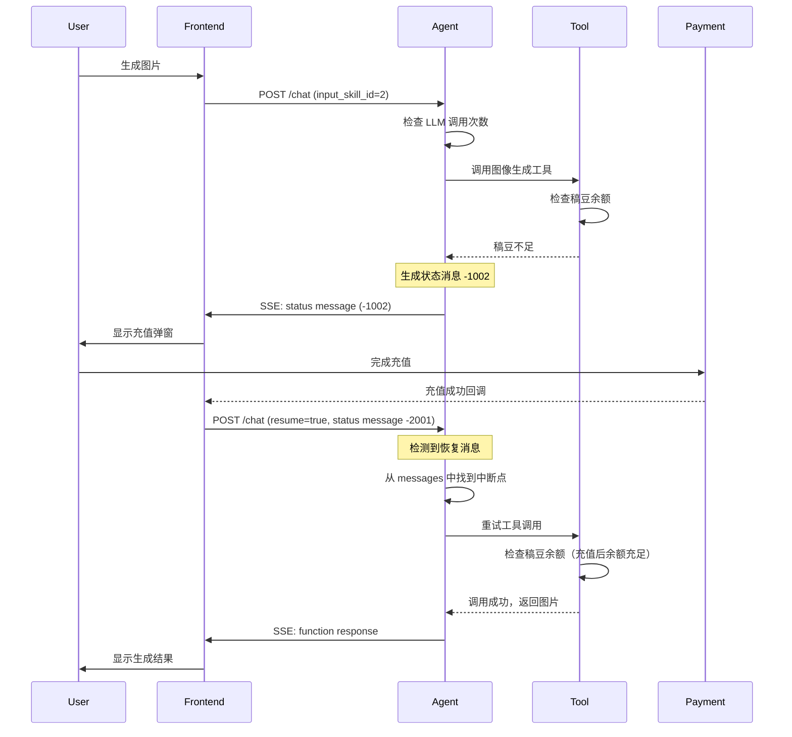
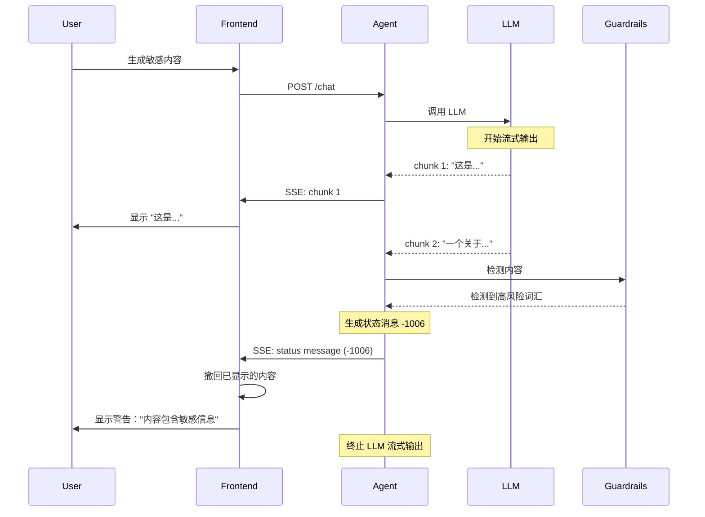

# 消息系统深入原理

> **理解 AI Agent 的通信语言**

---

## 一、为什么需要自定义消息格式？（深入分析）

### 1.1 LLM 原生格式的深层问题

#### ChatGPT 的链表结构剖析

从 `image2025-7-1_1-8-34.png` 可以看到 ChatGPT 的消息结构：

```json
{
  "mapping": {
    "7e5528af-c94d-47a9-9d97-a940f601d491": {
      "id": "7e5528af-c94d-47a99d97-a940f601d491",
      "message": {
        "id": "7e5528af-c94d-47a9-9d97-a940f601d491",
        "author": {
          "role": "system",
          "name": null,
          "metadata": {}
        },
        "content": {
          "content_type": "text",
          "parts": ["..."]
        },
        "status": "finished_successfully",
        "end_turn": true,
        "metadata": {
          "is_visually_hidden_from_conversation": true
        }
      },
      "parent": "aaa14f48-f585-462a-a22a-cb6be5550bf6",
      "children": ["aaa22956-f5e7-4e1e-ab3b-19719f2cecc1"]
    }
  }
}
```

**深层问题分析**：

1. **树形结构的复杂性**
   - 使用 `parent` 和 `children` 构成树
   - 需要递归遍历才能获取对话历史
   - 难以做范围查询（如"获取最近10条消息"）

2. **元数据冗余**
   - `id` 字段重复出现
   - `metadata` 嵌套过深
   - `is_visually_hidden_from_conversation` 这类字段业务耦合

3. **存储效率低**
   - JSON 嵌套层次深
   - 关系型数据库存储困难
   - 查询性能差

#### Doubao 的列表结构剖析

从 `image2025-7-1_1-9-19.png` 可以看到豆包的消息结构：

```json
{
  "data": {
    "message_list": [
      {
        "conversation_id": "9807447576487938",
        "section_id": "9807447576488194",
        "message_id": "10646269206109442",
        "local_message_id": "",
        "index": 26,
        "content": "{\"text\":\"以下是一些常见语言中"你好"的表达...",
        "ext": {
          "bot_id": "7338286299411103781",
          "inner_app_id": "582478",
          "inner_platform": "web",
          ...
        }
      }
    ]
  }
}
```

**深层问题分析**：

1. **字段命名不一致**
   - `conversation_id` vs OpenAI 的 `thread_id`
   - `content` 是字符串，需要二次解析
   - `ext` 字段里塞了大量内部字段

2. **业务耦合严重**
   - `inner_app_id`, `inner_platform` 等内部字段暴露
   - `bot_id` 是豆包特有概念
   - 难以适配其他 LLM

3. **扩展性差**
   - Content 是纯字符串，难以表达复杂类型
   - 没有预留的扩展字段
   - 缺少版本管理

### 1.2 统一格式的设计哲学

> 💡 **核心洞察**  
> "愈发觉得前期不应该把 LLM 的消息格式当作业务格式来使用。面向业务领域的消息格式，势必要考虑状态和交互的问题，否则无法通过一个源来回溯所有的状态。"

**设计哲学**：

1. **分离关注点**
   ```
   LLM 消息格式 ← 适配层 → 业务消息格式
   ```
   - LLM 格式：专注于 LLM 的输入输出
   - 业务格式：专注于业务逻辑和状态管理
   - 适配层：负责格式转换

2. **领域驱动设计**
   - 消息格式应该反映业务领域模型
   - 而不是反映 LLM 的技术实现

3. **面向未来的可扩展性**
   - 支持新的消息类型
   - 支持新的业务字段
   - 支持版本演进

---

## 二、消息格式详细设计

### 2.1 一级字段设计

| 字段 | 类型 | 必需 | 说明 | 设计理由 |
|------|------|------|------|----------|
| `thread_id` | varchar(100) | ✅ | 会话 ID | 关联会话 |
| `message_id` | varchar(100) | ✅ | 消息 ID | 全局唯一标识 |
| `local_thread_id` | varchar(100) | - | 前端本地会话 ID | 支持离线和乐观更新 |
| `local_message_id` | varchar(100) | - | 前端本地消息 ID | 前端关联用 |
| `role` | string | ✅ | 消息角色 | 区分消息类型 |
| `content` | JSON | ✅ | 消息内容 | 结构化内容 |
| `input_skill_id` | int | - | 用户选择的技能 | 业务扩展 |
| `attachments` | JSON Array | - | 附件列表 | 支持多模态 |
| `extra` | JSON | - | 额外信息 | 预留扩展字段 |

#### 字段设计深度分析

**1. 为什么有两套 ID？**

```typescript
{
  "local_thread_id": "local_001",   // 前端生成
  "thread_id": "thread_abc123",     // 后端生成
  "local_message_id": "local_msg_001",
  "message_id": "msg_123"
}
```

**原因**：

- **离线支持**：前端可以在离线时创建本地会话
- **乐观更新**：前端不需要等待后端响应
- **关联映射**：前端可以通过本地 ID 找到对应的服务端 ID
- **错误恢复**：如果创建失败，前端可以通过本地 ID 重试

**流程**：

```
前端创建消息
  ↓
生成 local_message_id = "local_msg_001"
  ↓
乐观显示（使用本地 ID）
  ↓
发送到后端
  ↓
后端生成 message_id = "msg_abc123"
  ↓
前端记录映射：local_msg_001 → msg_abc123
  ↓
更新显示（使用服务端 ID）
```

**2. 为什么 Content 是 JSON 而不是字符串？**

❌ **字符串方案**：
```json
{
  "content": "帮我生成一张图"
}
```

问题：
- 无法区分类型（纯文本 vs 工具调用）
- 无法携带结构化信息
- 前端需要解析字符串

✅ **JSON 方案**：
```json
{
  "content": {
    "type": "plain",
    "text": "帮我生成一张图"
  }
}
```

优势：
- 类型明确
- 结构清晰
- 易于扩展

**3. 为什么需要 extra 字段？**

**设计原则**：**开放封闭原则**
- 对扩展开放
- 对修改封闭

**示例**：

```json
{
  "extra": {
    "deduct_points": 10,        // 扣除稿豆
    "execution_time_ms": 5000,  // 执行耗时
    "model_version": "v1.2",    // 模型版本
    "debug_info": {...}         // 调试信息（仅非生产环境）
  }
}
```

不需要修改表结构，就可以添加新字段。

### 2.2 Role 类型深度解析

| Role | 生成者 | 作用 | 特点 |
|------|--------|------|------|
| `system` | 系统 | 设定 LLM 行为 | 通常是第一条消息 |
| `user` | 用户 | 用户输入 | 可以携带附件和技能 ID |
| `assistant` | LLM | AI 回复或工具调用 | 可以包含 reasoning |
| `function` | 工具 | 工具执行结果 | 总是跟在 function_call 后 |
| `status` | 系统 | 状态消息 | 用于控制流程 |
| `heartbeat` | 系统 | 心跳包 | 仅保持连接活跃 |

#### Heartbeat 的设计理由

**问题**：SSE 长连接可能被网关或代理断开

**解决方案**：定期发送心跳

```javascript
// 后端每 30 秒发送一次心跳
setInterval(() => {
  send_sse({
    role: "heartbeat",
    content: { code: -1005, message: "heartbeat" }
  })
}, 30000)

// 前端检测心跳
let lastHeartbeat = Date.now()
setInterval(() => {
  if (Date.now() - lastHeartbeat > 60000) {
    // 60秒没收到心跳，认为连接断开
    reconnect()
  }
}, 10000)
```

### 2.3 Content 类型深度解析

#### Type 枚举

| Type | 说明 | 使用场景 | Content.text 类型 |
|------|------|----------|-------------------|
| `plain` | 纯文本 | 用户输入、LLM 回复 | string |
| `function_call` | 工具调用指令 | LLM 决定调用工具 | FunctionCall |
| `function_response` | 工具执行结果 | 工具返回结果 | FunctionResponse |
| `reasoning` | 思考内容 | Reasoning 模型的思考过程 | string |

#### FunctionCall 结构

```typescript
interface FunctionCall {
  tool_name: string
  parameters: Record<string, any>
}

// 示例
{
  "type": "function_call",
  "text": {
    "tool_name": "generate_image",
    "parameters": {
      "user_prompt": "一张牙膏产品图",
      "width": "512",
      "height": "512",
      "style": "简约"
    }
  }
}
```

**为什么参数是 Record<string, any>？**

- **灵活性**：不同工具的参数不同
- **可扩展**：工具可以随时添加新参数
- **JSON 兼容**：可以直接序列化

**参数验证**：

```python
def validate_function_call(tool_name, parameters):
    tool = get_tool(tool_name)
    
    # 检查必需参数
    for param_name, param_def in tool.required_params.items():
        if param_name not in parameters:
            raise ValueError(f"Missing required parameter: {param_name}")
    
    # 检查参数类型
    for param_name, param_value in parameters.items():
        param_def = tool.params[param_name]
        if not isinstance(param_value, param_def['type']):
            raise TypeError(f"Parameter {param_name} must be {param_def['type']}")
    
    return True
```

#### FunctionResponse 结构

```typescript
interface FunctionResponse {
  tool_name: string
  result: "success" | "failed"
  [key: string]: any  // 工具特定的返回字段
}

// 图像生成工具返回
{
  "type": "function_response",
  "text": {
    "tool_name": "generate_image",
    "result": "success",
    "image_url": "https://cdn.gaoding.com/xxx.png",
    "task_id": "task_123",
    "width": 512,
    "height": 512
  }
}

// 搜索工具返回
{
  "type": "function_response",
  "text": {
    "tool_name": "search_templates",
    "result": "success",
    "results": [
      {"id": "1", "title": "...", "thumbnail": "..."},
      {"id": "2", "title": "...", "thumbnail": "..."}
    ],
    "total": 100,
    "page": 1
  }
}
```

**为什么允许动态字段？**

- 不同工具返回的字段不同
- 避免定义大量的接口类型
- 保持灵活性

---

## 三、状态消息的深层设计

### 3.1 状态消息的本质

**状态消息是一种特殊的控制流消息，它不携带业务数据，而是携带控制指令。**

**类比**：
- 普通消息 = HTTP 的 200 响应（正常数据）
- 状态消息 = HTTP 的 4xx/5xx 状态码（错误控制）

**区别**：
| 维度 | 普通消息 | 状态消息 |
|------|----------|----------|
| **来源** | 用户或 LLM | 系统 |
| **内容** | 业务数据 | 控制指令 |
| **作用** | 推进对话 | 控制流程 |
| **持久化** | 需要 | 可选 |

### 3.2 状态码设计哲学

#### 分段设计

```
-1xxx：后端 → 前端的状态消息
-2xxx：前端 → 后端的状态消息
-3xxx：预留（如系统间通信）
```

**为什么分段？**

1. **职责明确**：一看就知道是谁发的
2. **防止冲突**：不会有相同的状态码
3. **易于扩展**：每段内可以独立添加新状态码

#### 后端状态码详解

| Code | Message | 触发条件 | 前端处理 | Extra 字段 |
|------|---------|---------|----------|-----------|
| `-1001` | 停止生成 | 用户点击停止按钮 | 停止显示流式输出 | `message_id`: 被停止的消息 ID |
| `-1002` | 稿豆不足 | 工具调用时稿豆余额不足 | 显示充值弹窗 | `last_tool_message_id`: 最后一次工具调用的消息 ID |
| `-1003` | LLM/工具调用超限 | 单轮对话调用次数超过阈值 | 提示用户，结束对话 | - |
| `-1004` | Token 过期 | 用户 Token 失效 | 静默刷新或引导登录 | - |
| `-1005` | 心跳 | 定时发送 | 更新最后心跳时间 | - |
| `-1006` | 中断并撤回 | Guardrails 检测到风险 | 撤回已输出的消息，显示警告 | `revoked_message_id`: 被撤回的消息 ID |
| `-1007` | 安全预警 | Guardrails 检测到轻微风险 | 显示警告提示，但不中断 | `warning`: 警告信息 |

#### 前端状态码详解

| Code | Message | 触发条件 | 后端处理 | Extra 字段 |
|------|---------|---------|----------|-----------|
| `-2001` | 恢复执行 | 用户充值后点击"继续" | 检测到此消息，从中断点恢复 | `message_id`: 中断时的状态消息 ID |

### 3.3 状态消息的生命周期

#### -1002（稿豆不足）的完整流程



#### -1006（中断并撤回）的完整流程



### 3.4 状态消息的存储策略

**问题**：状态消息需要持久化吗？

**答案**：分情况

| 状态码 | 是否持久化 | 理由 |
|--------|-----------|------|
| `-1001` (停止) | ✅ 是 | 需要记录用户主动停止的历史 |
| `-1002` (稿豆不足) | ✅ 是 | 需要恢复，必须持久化 |
| `-1003` (超限) | ✅ 是 | 需要记录超限原因 |
| `-1004` (Token过期) | ❌ 否 | 临时状态，不需要持久化 |
| `-1005` (心跳) | ❌ 否 | 仅保持连接，不需要持久化 |
| `-1006` (撤回) | ✅ 是 | 需要审计追踪 |
| `-1007` (预警) | ✅ 是 | 需要分析预警记录 |
| `-2001` (恢复) | ✅ 是 | 需要记录恢复操作 |

**实现**：

```python
PERSISTENT_STATUS_CODES = {
    -1001, -1002, -1003, -1006, -1007, -2001
}

def should_persist_status_message(code):
    return code in PERSISTENT_STATUS_CODES

def send_status_message(thread_id, code, message, extra=None):
    status_msg = {
        "thread_id": thread_id,
        "role": "status",
        "content": {
            "code": code,
            "message": message,
            "extra": extra or {}
        }
    }
    
    # 发送给前端
    send_sse(status_msg)
    
    # 根据状态码决定是否持久化
    if should_persist_status_message(code):
        message_id = generate_message_id()
        status_msg["message_id"] = message_id
        save_message(status_msg)
    
    return status_msg
```

---

## 四、Qwen-Agent 的消息转换机制

### 4.1 convert_fncall_to_text 函数解析

从现有文档可以看到，Qwen-Agent 需要转换消息格式：

```python
def convert_fncall_to_text(messages: List[Dict]) -> List[Dict]:
    """
    将 function 消息转换为 assistant 消息
    
    原因：
    1. 便于前端展示
    2. LLM 更容易理解
    3. 保持对话的连续性
    """
    new_messages = []
    
    for msg in messages:
        role, content, reasoning_content, name = (
            msg[ROLE], msg[CONTENT], 
            msg.get(REASONING_CONTENT, ''), 
            msg.get(NAME, None)
        )
        
        # 去除多余的空白和代码块标记
        content = (content or '').lstrip('\n').rstrip().replace('```', '')
        
        # system 或 user 消息直接追加
        if role in (SYSTEM, USER):
            new_messages.append({
                ROLE: role, 
                CONTENT: content, 
                NAME: name
            })
        
        # assistant 消息：添加 thinking 内容
        elif role == ASSISTANT:
            if reasoning_content:
                thought = reasoning_content
                content = THINK.format(thought=thought) + content
            
            # 合并连续的 assistant 消息
            if (len(new_messages) > 0 and 
                new_messages[-1][ROLE] == ASSISTANT and 
                new_messages[-1][NAME] == name):
                new_messages[-1][CONTENT] += content
            else:
                new_messages.append({
                    ROLE: role, 
                    CONTENT: content, 
                    NAME: name
                })
        
        # function 消息：合并到最后一条 assistant 消息中
        elif role == FUNCTION:
            assert new_messages[-1][ROLE] == ASSISTANT
            new_messages[-1][CONTENT] += TOOL_OUTPUT.format(
                tool_output=content
            )
        
        else:
            raise TypeError(f"Unknown role: {role}")
    
    return new_messages
```

### 4.2 为什么需要转换？

**场景 1：展示工具调用结果**

**转换前**：

```json
[
  {"role": "assistant", "content": "<tool_call>{...}</tool_call>"},
  {"role": "function", "content": "{'result': 'success', 'image_url': '...'}"}
]
```

前端需要：
1. 解析 assistant 消息找到工具调用
2. 关联 function 消息
3. 分别渲染

**转换后**：

```json
[
  {
    "role": "assistant",
    "content": "✱✱✱ Start calling tool \"generate_image\" ...\n{...}\n✱✱✱\n✱✱✱ Finished tool calling.\n{'result': 'success', 'image_url': '...'}\n✱✱✱"
  }
]
```

前端只需要：
1. 渲染 assistant 消息
2. 解析特殊标记 `✱✱✱`
3. 分区域显示

**场景 2：LLM 理解上下文**

LLM 在理解历史对话时，更容易理解：

```
Assistant: 我正在调用工具 generate_image 生成图片...
[工具执行结果：成功，图片URL: xxx]
```

而不是：

```
Message 1: <tool_call>{...}</tool_call>
Message 2: (role=function) {...}
```

### 4.3 工具调用模板

```python
# 工具调用开始标记
TOOL_CALL = '''
✱✱✱ Start calling tool "{tool_name}" ...

{tool_input}
✱✱✱
'''

# 工具执行结果标记
TOOL_OUTPUT = '''
✱✱✱ Finished tool calling.

{tool_output}
✱✱✱
'''

# Thinking 内容标记
THINK = '''
<think>
{thought}
</think>

'''
```

**为什么使用特殊标记？**

1. **易于解析**：`✱✱✱` 不会出现在正常文本中
2. **易于识别**：视觉上明显
3. **易于移除**：前端可以选择隐藏这些标记

---

## 五、消息的生命周期管理

### 5.1 消息的创建

```python
def create_message(
    thread_id: str,
    role: str,
    content: dict,
    input_skill_id: int = None,
    attachments: list = None,
    extra: dict = None
) -> dict:
    """创建消息"""
    
    # 1. 生成消息 ID
    message_id = generate_message_id()
    
    # 2. 验证消息格式
    validate_message(role, content)
    
    # 3. 构造消息对象
    message = {
        "thread_id": thread_id,
        "message_id": message_id,
        "role": role,
        "content": content,
        "input_skill_id": input_skill_id,
        "attachments": attachments or [],
        "extra": extra or {},
        "created_at": datetime.utcnow().isoformat()
    }
    
    # 4. 持久化
    save_message(message)
    
    # 5. 返回
    return message
```

### 5.2 消息的查询

```python
# 获取会话的所有消息
def get_messages(thread_id: str) -> List[dict]:
    return db.query(
        "SELECT * FROM messages WHERE thread_id = ? ORDER BY created_at",
        thread_id
    )

# 获取会话的最近N条消息
def get_recent_messages(thread_id: str, limit: int = 10) -> List[dict]:
    return db.query(
        "SELECT * FROM messages WHERE thread_id = ? "
        "ORDER BY created_at DESC LIMIT ?",
        thread_id, limit
    )

# 获取特定角色的消息
def get_messages_by_role(thread_id: str, role: str) -> List[dict]:
    return db.query(
        "SELECT * FROM messages WHERE thread_id = ? AND role = ? "
        "ORDER BY created_at",
        thread_id, role
    )
```

### 5.3 消息的统计

```python
# 统计 LLM 调用次数
def count_llm_calls(messages: List[dict]) -> int:
    return sum(
        1 for msg in messages 
        if msg['role'] == 'assistant' and 
           msg['content']['type'] in ('plain', 'function_call')
    )

# 统计工具调用次数
def count_tool_calls(messages: List[dict]) -> int:
    return sum(
        1 for msg in messages 
        if msg['role'] == 'function'
    )

# 检查是否需要恢复
def needs_resume(messages: List[dict]) -> bool:
    if not messages:
        return False
    
    last_msg = messages[-1]
    
    # 最后一条消息是恢复状态消息
    if (last_msg['role'] == 'status' and 
        last_msg['content']['code'] == -2001):
        return True
    
    return False
```

---

## 六、最佳实践

### 6.1 消息设计原则

**DO：**
- ✅ 使用类型安全的 Content 结构
- ✅ 记录完整的上下文信息
- ✅ 保持消息不可变
- ✅ 使用状态消息传递控制指令
- ✅ 记录本地 ID 便于前端关联

**DON'T：**
- ❌ 直接使用 LLM 的消息格式
- ❌ 在消息中存储大文件
- ❌ 修改已创建的消息
- ❌ 在 content 中嵌套过深

### 6.2 前端处理建议

```typescript
// 消息处理器
class MessageHandler {
  handle(message: Message) {
    switch (message.role) {
      case 'user':
        return this.handleUserMessage(message)
      case 'assistant':
        return this.handleAssistantMessage(message)
      case 'function':
        return this.handleFunctionMessage(message)
      case 'status':
        return this.handleStatusMessage(message)
      case 'heartbeat':
        return this.handleHeartbeat(message)
    }
  }
  
  handleStatusMessage(message: StatusMessage) {
    const { code, message: msg, extra } = message.content
    
    switch (code) {
      case -1002: // 稿豆不足
        this.showRechargeDialog(extra.last_tool_message_id)
        break
      
      case -1004: // Token 过期
        this.refreshToken().then(() => {
          this.retryLastRequest()
        })
        break
      
      case -1006: // 中断并撤回
        this.revokeMessage(extra.revoked_message_id)
        this.showWarning(msg)
        break
      
      case -1007: // 安全预警
        this.showWarningBanner(msg)
        break
    }
  }
}
```

---

## 七、总结

### 7.1 核心设计

1. **统一消息格式**：不依赖特定 LLM
2. **状态消息**：实现中断与恢复
3. **类型安全**：Content 结构化设计
4. **可扩展**：Extra 字段预留扩展

### 7.2 关键特性

- ✅ 支持多种消息类型
- ✅ 完整的状态码体系
- ✅ 中断与恢复机制
- ✅ 本地 ID 关联
- ✅ 技能选择
- ✅ 附件支持

---

*文档版本：v1.0*  
*最后更新：2026-01-26*

**上一篇**：[← 基础概念](01-基础概念.md) | **下一篇**：[工具调用 →](03-工具调用.md)
