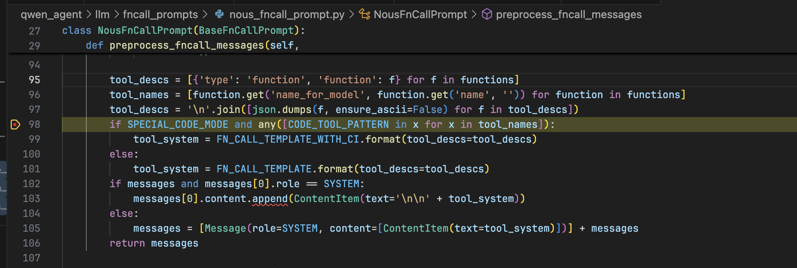
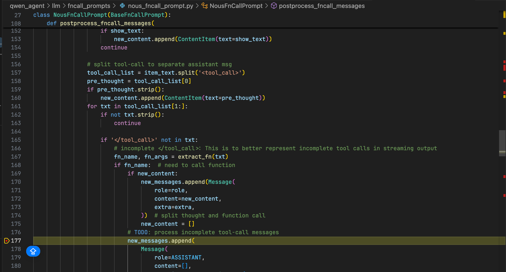
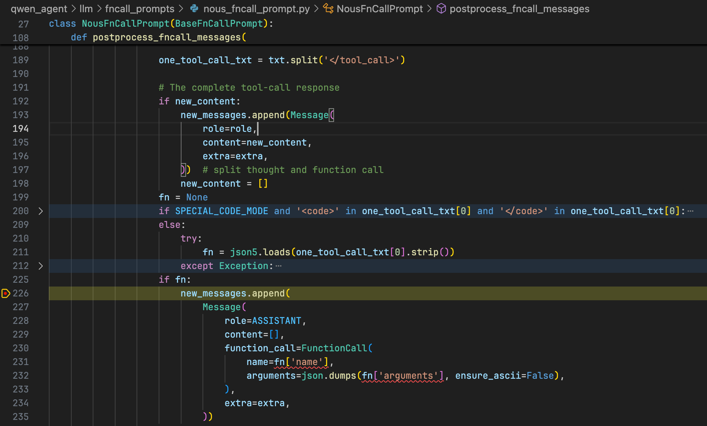
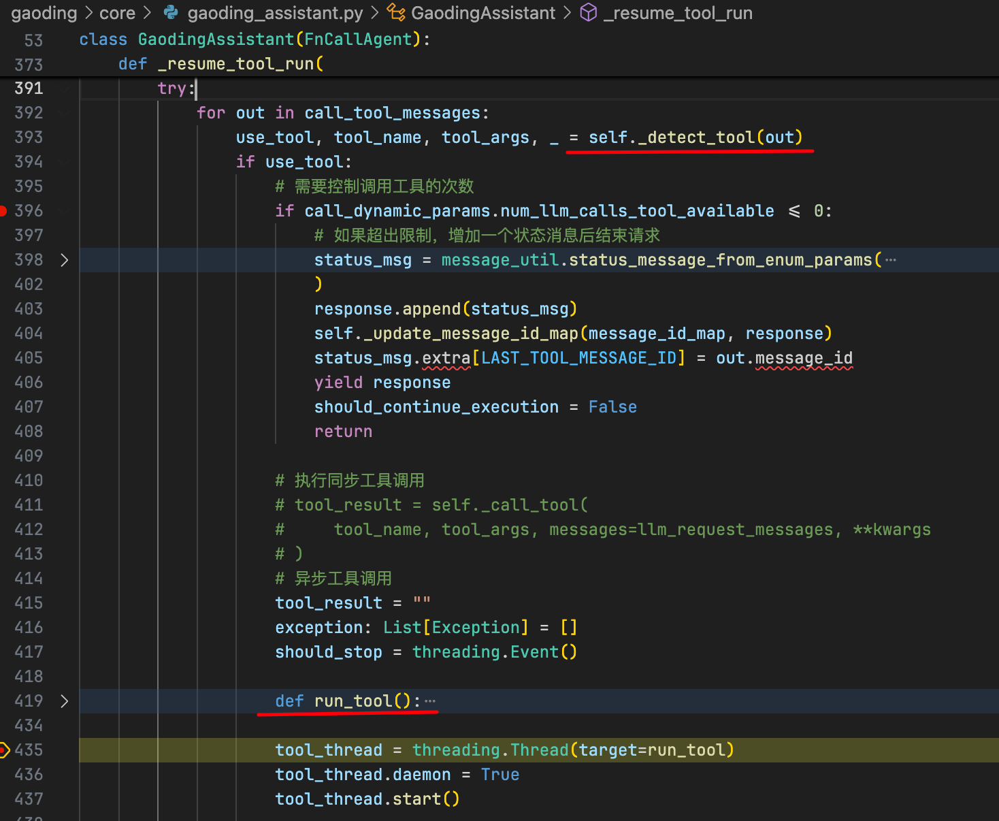

# Completion 接口与工具调用

## 一、概述

本文档介绍 Agent 系统中的 Completion 接口实现，重点讲解工具调用（Function Calling）的实现机制，以及如何统一不同模型的工具调用格式。

---

## 二、工具调用机制

### 2.1 Function Call Template

框架通过在 System Prompt 中注入工具调用指令，引导模型输出结构化的工具调用格式：

```python
FN_CALL_TEMPLATE = """# Tools

You may call one or more functions to assist with the user query.

You are provided with function signatures within XML tags:

{tool_descs}

For each function call, return a json object with function name and arguments within XML tags:

<tool_call>
{{"name": <function_name>, "arguments": <args_dict>}}
</tool_call>
"""
```

### 2.2 工具调用流程

#### 步骤 1：注入工具描述

在 System Prompt 中注入工具调用模板：



**示例：**
```python
system_prompt = FN_CALL_TEMPLATE.format(
    tool_descs="""
    <tool>
    <name>generate_image</name>
    <description>生成产品图像</description>
    <parameters>
      <parameter name="user_prompt" type="string" required="true"/>
      <parameter name="width" type="string" required="false" default="512"/>
      <parameter name="height" type="string" required="false" default="512"/>
    </parameters>
    </tool>
    """
)
```

#### 步骤 2：解析工具调用

持续解析模型响应中的 `<tool_call>` 标签：



**解析逻辑：**
```python
def parse_tool_call_streaming(response_stream):
    buffer = ""
    in_tool_call = False
    
    for chunk in response_stream:
        buffer += chunk
        
        # 检测工具调用开始
        if "<tool_call>" in buffer and not in_tool_call:
            in_tool_call = True
            start_pos = buffer.find("<tool_call>")
            # 输出之前的文本
            yield {"type": "text", "content": buffer[:start_pos]}
            buffer = buffer[start_pos:]
        
        # 检测工具调用结束
        if "</tool_call>" in buffer and in_tool_call:
            end_pos = buffer.find("</tool_call>") + len("</tool_call>")
            tool_call_xml = buffer[:end_pos]
            
            # 解析工具调用
            tool_call = parse_tool_call_xml(tool_call_xml)
            yield {"type": "tool_call", "content": tool_call}
            
            buffer = buffer[end_pos:]
            in_tool_call = False
```

#### 步骤 3：等待完整标签

直到模型输出完整的 `</tool_call>` 标签：



#### 步骤 4：执行工具调用

框架侧检测到完整的工具调用后，执行工具并返回结果：



```python
def execute_tool_call(tool_call):
    tool_name = tool_call['name']
    parameters = tool_call['arguments']
    
    # 获取工具实例
    tool = get_tool(tool_name)
    
    # 执行工具
    result = tool.run(**parameters)
    
    return {
        "role": "function",
        "name": tool_name,
        "content": result
    }
```

---

## 三、豆包模型适配

### 3.1 格式差异

豆包模型在训练时采用了不同的工具调用标签：

**豆包格式：**
```python
{
  "role": "assistant",
  "content": "<FunctionCallBegin> [{\"name\":\"通用\",\"parameters\":{\"user_prompt\":\"一支高端牙膏产品，直立放置在白色大理石台面上，牙膏管为银色与蓝色渐变设计，管口挤出少量白色牙膏膏体，呈现细腻泡沫质感，背景为简约白色，光线明亮柔和，突出产品细节，高清商品摄影风格，阴影自然，正面视角，构图居中，适合电商平台展示，高清画质，细节丰富\",\"width\":\"512\",\"height\":\"512\",\"code\":\"tongyong\"}}] <FunctionCallEnd>",
  "name": "Gaoding AI Agent"
}
```

**框架格式：**
```python
{
  "role": "assistant",
  "content": "<tool_call> {\"name\":\"通用\",\"parameters\":{\"user_prompt\":\"一支高端牙膏产品，直立放置在白色大理石台面上，牙膏管为银色与蓝色渐变设计，管口挤出少量白色牙膏膏体，呈现细腻泡沫质感，背景为简约白色，光线明亮柔和，突出产品细节，高清商品摄影风格，阴影自然，正面视角，构图居中，适合电商平台展示，高清画质，细节丰富\",\"width\":\"512\",\"height\":\"512\",\"code\":\"tongyong\"}} </tool_call>",
  "name": "Gaoding AI Agent"
}
```

### 3.2 关键差异

| 维度 | 豆包格式 | 框架格式 |
|------|----------|----------|
| 标签 | `<FunctionCallBegin>` / `<FunctionCallEnd>` | `<tool_call>` / `</tool_call>` |
| 内容结构 | JSON 数组 `[{...}, {...}]` | 单个 JSON 对象 `{...}` |
| 语义 | 支持多个工具调用 | 单次工具调用 |

### 3.3 统一工具调用格式的必要性

> 💡 **设计理念**  
> 框架的做法并无问题。从业界实现上看，LangChain 和 Claude 对模型返回工具调用指令的格式都有明确约定（本质是模型输出的结构化规范），其核心目的是 **"统一不同模型的工具调用输出格式"**，方便开发者对接各种工具。

---

## 四、行业标准：LangChain 工具调用格式

### 4.1 单次工具调用

```python
<tool_call>
{
  "name": "工具名称",  // 必须：与 LangChain 中注册的 Tool 名称完全一致
  "parameters": {      // 必须：工具所需参数，键值对格式
    "参数1": "值1",
    "参数2": "值2"
  }
}
</tool_call>
```

**示例：**
```python
<tool_call>
{
  "name": "generate_image",
  "parameters": {
    "user_prompt": "一支高端牙膏产品...",
    "width": "512",
    "height": "512"
  }
}
</tool_call>
```

### 4.2 连续多个工具调用

```python
<tool_call>
{
  "name": "get_weather",
  "parameters": {
    "city": "北京",
    "date": "2025-07-06"
  }
}
</tool_call>

<tool_call>
{
  "name": "get_flight_status",
  "parameters": {
    "flight_number": "CA1234",
    "date": "2025-07-06"
  }
}
</tool_call>
```

**处理方式：**
- LangChain 会按顺序解析并执行每个 `<tool_call>` 块
- 每个工具调用独立执行
- 工具执行结果按顺序返回

---

## 五、实现细节

### 5.1 工具描述生成

```python
def generate_tool_description(tool):
    """生成工具描述的 XML 格式"""
    params_xml = ""
    for param_name, param_info in tool.parameters.items():
        param_type = param_info.get('type', 'string')
        required = param_info.get('required', False)
        default = param_info.get('default', '')
        description = param_info.get('description', '')
        
        params_xml += f"""
        <parameter 
          name="{param_name}" 
          type="{param_type}" 
          required="{required}"
          {"default=\"" + str(default) + "\"" if default else ""}
        >
          {description}
        </parameter>
        """
    
    tool_xml = f"""
    <tool>
      <name>{tool.name}</name>
      <description>{tool.description}</description>
      <parameters>
        {params_xml}
      </parameters>
    </tool>
    """
    
    return tool_xml
```

### 5.2 工具调用解析

```python
import json
import re

def parse_tool_call_xml(xml_string):
    """解析工具调用 XML"""
    # 提取 <tool_call> 标签内的 JSON
    match = re.search(
        r'<tool_call>\s*({.*?})\s*</tool_call>', 
        xml_string, 
        re.DOTALL
    )
    
    if not match:
        raise ValueError("Invalid tool call format")
    
    json_str = match.group(1)
    tool_call = json.loads(json_str)
    
    # 验证必需字段
    if 'name' not in tool_call or 'parameters' not in tool_call:
        raise ValueError("Missing required fields: name or parameters")
    
    return tool_call
```

### 5.3 工具注册

```python
class ToolRegistry:
    """工具注册中心"""
    
    def __init__(self):
        self.tools = {}
    
    def register(self, tool):
        """注册工具"""
        self.tools[tool.name] = tool
    
    def get_tool(self, name):
        """获取工具"""
        if name not in self.tools:
            raise ValueError(f"Tool '{name}' not found")
        return self.tools[name]
    
    def get_all_tools(self):
        """获取所有工具"""
        return list(self.tools.values())
    
    def generate_tool_descriptions(self):
        """生成所有工具的描述"""
        descriptions = []
        for tool in self.get_all_tools():
            descriptions.append(generate_tool_description(tool))
        return "\n".join(descriptions)
```

### 5.4 工具执行器

```python
class ToolExecutor:
    """工具执行器"""
    
    def __init__(self, registry: ToolRegistry):
        self.registry = registry
    
    def execute(self, tool_call):
        """执行工具调用"""
        tool_name = tool_call['name']
        parameters = tool_call['parameters']
        
        try:
            tool = self.registry.get_tool(tool_name)
            result = tool.run(**parameters)
            
            return {
                "success": True,
                "result": result,
                "tool_name": tool_name
            }
        except Exception as e:
            return {
                "success": False,
                "error": str(e),
                "tool_name": tool_name
            }
```

---

## 六、完整示例

### 6.1 工具定义

```python
class ImageGenerationTool:
    """图像生成工具"""
    
    name = "generate_image"
    description = "生成产品图像"
    
    parameters = {
        "user_prompt": {
            "type": "string",
            "required": True,
            "description": "图像生成提示词"
        },
        "width": {
            "type": "string",
            "required": False,
            "default": "512",
            "description": "图像宽度"
        },
        "height": {
            "type": "string",
            "required": False,
            "default": "512",
            "description": "图像高度"
        }
    }
    
    def run(self, user_prompt, width="512", height="512"):
        """执行图像生成"""
        # 调用图像生成服务
        result = call_image_generation_service(
            prompt=user_prompt,
            width=int(width),
            height=int(height)
        )
        return result
```

### 6.2 完整流程

```python
# 1. 初始化工具注册中心
registry = ToolRegistry()
registry.register(ImageGenerationTool())

# 2. 生成工具描述
tool_descriptions = registry.generate_tool_descriptions()

# 3. 构建 System Prompt
system_prompt = FN_CALL_TEMPLATE.format(
    tool_descs=tool_descriptions
)

# 4. 调用 LLM
messages = [
    {"role": "system", "content": system_prompt},
    {"role": "user", "content": "帮我生成一张牙膏产品图"}
]

response_stream = llm.chat_completion_stream(messages)

# 5. 解析响应并执行工具
executor = ToolExecutor(registry)

for chunk in parse_tool_call_streaming(response_stream):
    if chunk['type'] == 'text':
        print(chunk['content'])
    elif chunk['type'] == 'tool_call':
        tool_result = executor.execute(chunk['content'])
        print(f"Tool executed: {tool_result}")
```

---

## 七、最佳实践

### 7.1 工具设计

**DO：**
- ✅ 工具名称清晰明确
- ✅ 参数定义完整（类型、必需性、默认值、描述）
- ✅ 工具描述详细，说明使用场景
- ✅ 参数验证严格
- ✅ 错误处理完善

**DON'T：**
- ❌ 工具名称模糊
- ❌ 参数缺少类型或描述
- ❌ 工具功能过于复杂
- ❌ 缺少错误处理

### 7.2 格式统一

**统一原则：**
1. 使用框架定义的 `<tool_call>` 标签
2. 工具调用采用 JSON 格式
3. 参数名称与工具定义一致
4. 支持单次和多次工具调用

**适配策略：**
- 针对不同模型实现适配层
- 统一转换为框架格式
- 保持工具定义不变

### 7.3 错误处理

```python
def safe_execute_tool(tool_call):
    """安全执行工具调用"""
    try:
        # 验证工具名称
        if 'name' not in tool_call:
            return error_response("Missing tool name")
        
        # 验证参数
        if 'parameters' not in tool_call:
            return error_response("Missing parameters")
        
        # 执行工具
        result = executor.execute(tool_call)
        
        if not result['success']:
            return error_response(result['error'])
        
        return success_response(result['result'])
    
    except Exception as e:
        logging.error(f"Tool execution failed: {e}")
        return error_response(str(e))
```

---

## 八、总结

### 8.1 核心设计

1. **统一格式**：使用 `<tool_call>` 标签统一工具调用格式
2. **结构化输出**：JSON 格式的工具调用和参数
3. **流式解析**：支持流式输出中解析工具调用
4. **多模型适配**：适配不同 LLM 的工具调用格式

### 8.2 关键流程

```
System Prompt 注入 
  → LLM 生成工具调用 
  → 流式解析 <tool_call> 
  → 执行工具 
  → 返回结果
```

### 8.3 优势

- ✅ 统一的工具调用接口
- ✅ 支持流式解析
- ✅ 易于扩展新工具
- ✅ 多模型兼容

---

*文档版本：v1.0*  
*最后更新：2025-01-26*
