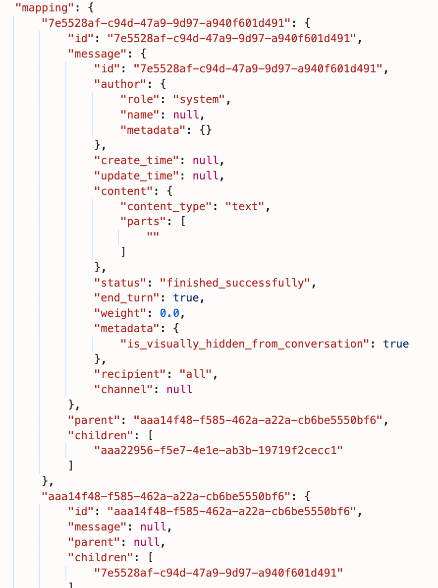
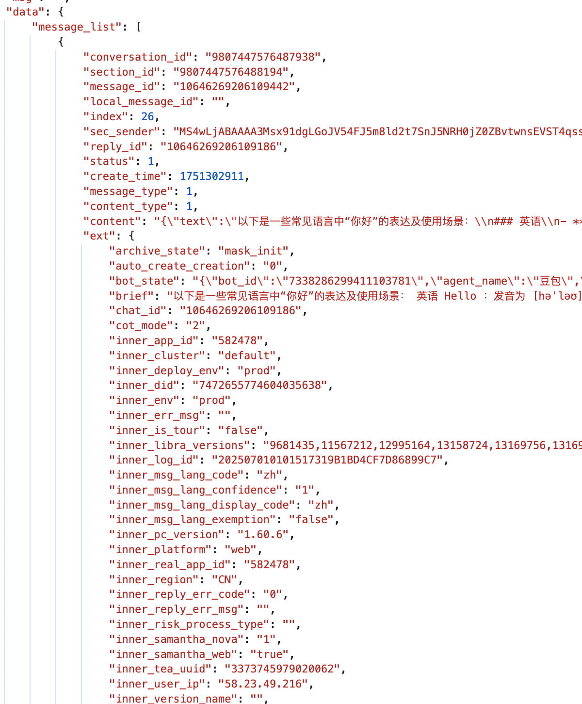
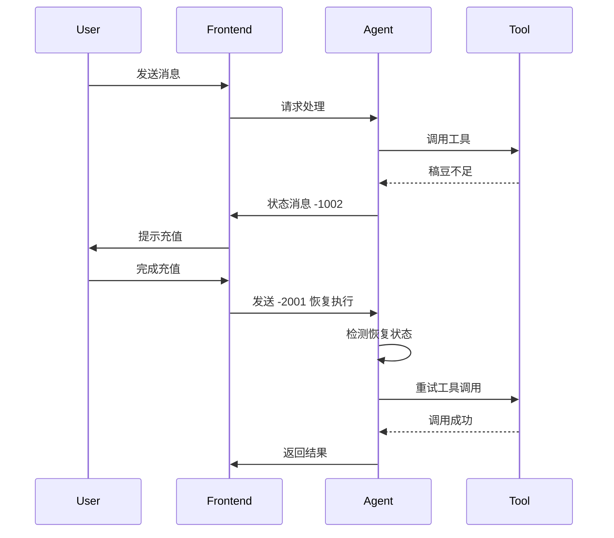

# Agent 消息结构设计

## 一、设计背景

### 1.1 为什么需要自定义消息格式？

在 AI Agent 系统中，直接使用 LLM 的消息格式存在以下问题：

**ChatGPT 链表结构：**



**豆包列表结构：**



**痛点：**
- ❌ LLM 消息格式不统一
- ❌ 缺少状态管理
- ❌ 不支持业务扩展字段
- ❌ 无法回溯完整状态

> 💡 **核心洞察**  
> 愈发觉得前期不应该把 LLM 的消息格式当作业务格式来使用。面向业务领域的消息格式，势必要考虑状态和交互的问题，否则无法通过一个源来回溯所有的状态。

---

## 二、Qwen-Agent 原始消息格式

### 2.1 消息转换逻辑

Qwen-Agent 给前端的原始消息需要经过转换，核心函数 `convert_fncall_to_text`:

**消息角色：**
- `system`：系统指令
- `user`：用户输入
- `assistant`：AI 助手回复
- `function`：工具调用结果

**转换逻辑：**

```python
def convert_fncall_to_text(messages: List[Dict]) -> List[Dict]:
    new_messages = []
    for msg in messages:
        role, content, reasoning_content, name = (
            msg[ROLE], msg[CONTENT], 
            msg.get(REASONING_CONTENT, ''), 
            msg.get(NAME, None)
        )
        content = (content or '').lstrip('\n').rstrip().replace('```', '')
        
        # system or user: 直接追加
        if role in (SYSTEM, USER):
            new_messages.append({
                ROLE: role, 
                CONTENT: content, 
                NAME: name
            })
        
        # assistant: 添加 thinking 内容
        elif role == ASSISTANT:
            if reasoning_content:
                thought = reasoning_content
                content = THINK.format(thought=thought) + content
            
            # 合并连续的 assistant 消息
            if (len(new_messages) > 0 and 
                new_messages[-1][ROLE] == ASSISTANT and 
                new_messages[-1][NAME] == name):
                new_messages[-1][CONTENT] += content
            else:
                new_messages.append({
                    ROLE: role, 
                    CONTENT: content, 
                    NAME: name
                })
        
        # function: 添加工具输出
        elif role == FUNCTION:
            assert new_messages[-1][ROLE] == ASSISTANT
            new_messages[-1][CONTENT] += TOOL_OUTPUT.format(
                tool_output=content
            )
        
        else:
            raise TypeError
    
    return new_messages
```

### 2.2 工具调用模板

**工具调用开始：**
```python
TOOL_CALL = '''
✱✱✱ Start calling tool "{tool_name}" ...

{tool_input}
✱✱✱
'''
```

**工具输出：**
```python
TOOL_OUTPUT = '''
✱✱✱ Finished tool calling.

{tool_output}
✱✱✱
'''
```

---

## 三、稿定消息格式

### 3.1 消息维度

考虑到消息入库、前端状态展示，我们对消息格式进行扩展，分为两大类：
- **消息维度**：消息字段的可见性
- **会话维度**：消息的可见性

### 3.2 字段定义

#### 一级字段

| 字段 | 类型 | 说明 |
|------|------|------|
| `thread_id` | varchar(100) | 会话 ID，由 Agent 后端生成；首次对话时前端传空 |
| `message_id` | varchar(100) | 消息唯一标识，由 Agent 后端生成，thread 内唯一 |
| `local_thread_id` | varchar(100) | 前端本地的会话 ID，Agent 会记录 |
| `local_message_id` | varchar(100) | 前端本地的消息 ID，Agent 会记录 |
| `role` | string | 消息角色/类型（见下表） |
| `content` | JSON | 消息内容（见 3.3） |
| `input_skill_id` | int | 用户选择的技能 ID |
| `attachments` | JSON Array | 附件列表 |
| `extra` | JSON | 额外信息 |

#### Role 类型

| Role | 说明 |
|------|------|
| `system` | 系统指令 |
| `user` | 用户输入 |
| `assistant` | AI 助手回复 |
| `function` | 工具调用 |
| `status` | 状态消息（见第四节） |
| `heartbeat` | 心跳包，仅保活使用 |

### 3.3 Content 结构

Content 是 JSON 结构，包含以下字段：

| 字段 | 说明 |
|------|------|
| `type` | 内容类型，影响对 content 的解析 |
| `text` | 文本内容，JSON 结构，根据 type 解析 |

#### Content Type 类型

| Type | 说明 |
|------|------|
| `plain` | 纯文本内容 |
| `function_call` | 工具调用指令 |
| `function_response` | 工具调用结果 |
| `reasoning` | Reasoning 模型的思考内容 |

### 3.4 技能 ID (input_skill_id)

| ID | 技能名称 |
|----|----------|
| 1 | 搜索 |
| 2 | 图像生成 |
| 3 | 视频生成 |
| ... | 其他技能 |

### 3.5 完整示例

**用户消息：**
```json
{
  "thread_id": "thread_abc123",
  "message_id": "msg_001",
  "local_thread_id": "local_thread_001",
  "local_message_id": "local_msg_001",
  "role": "user",
  "content": {
    "type": "plain",
    "text": "帮我生成一张牙膏产品图"
  },
  "input_skill_id": 2,
  "attachments": [],
  "extra": {}
}
```

**Assistant 消息（工具调用）：**
```json
{
  "thread_id": "thread_abc123",
  "message_id": "msg_002",
  "role": "assistant",
  "content": {
    "type": "function_call",
    "text": {
      "tool_name": "通用图像生成",
      "parameters": {
        "user_prompt": "一支高端牙膏产品...",
        "width": "512",
        "height": "512"
      }
    }
  },
  "extra": {}
}
```

**Function 消息（工具结果）：**
```json
{
  "thread_id": "thread_abc123",
  "message_id": "msg_003",
  "role": "function",
  "content": {
    "type": "function_response",
    "text": {
      "tool_name": "通用图像生成",
      "result": "success",
      "image_url": "https://example.com/image.png",
      "task_id": "task_123"
    }
  },
  "extra": {
    "deduct_points": 10
  }
}
```

---

## 四、状态消息

### 4.1 定义

状态消息是 `role = status` 的特殊消息，用于传递系统状态和控制指令。

### 4.2 Content 结构

```json
{
  "code": -1001,
  "message": "停止生成的原因",
  "extra": {
    "message_id": "msg_xxx"
  }
}
```

### 4.3 状态码定义

#### 后端生成的状态消息

| Code | Message | 说明 | Extra 定义 |
|------|---------|------|------------|
| -1001 | 停止生成的原因 | 用于停止生成 | `message_id`：被停止的消息 ID |
| -1002 | 稿豆不足 | 稿豆扣除失败<br/>前端需引导用户充值 | `last_tool_message_id`：最后一次工具调用的消息 ID |
| -1003 | LLM、工具调用超出限制 | 单轮对话中，LLM 或工具调用数超阈值 | - |
| -1004 | Token 过期 | 用户 token 过期<br/>前端需静默刷新或引导重新登录 | - |
| -1005 | 心跳消息 | 保持连接活跃 | - |
| -1006 | 中断并撤回 | Guardrails 检测到 jailbreak 等异常<br/>中断并撤回已输出内容 | `revoked_message_id`：被撤回的消息 ID |
| -1007 | 安全预警 | Guardrails 检测到风险词汇<br/>不中断输出，仅提示风险 | - |

#### 前端生成的状态消息

| Code | Message | 说明 | Extra 定义 |
|------|---------|------|------------|
| -2001 | 恢复执行 | 用户完成充值或登录后恢复执行<br/>后端检测到此消息时执行恢复流程 | `message_id`：中断时的消息 ID |

### 4.4 状态消息示例

**稿豆不足（后端 → 前端）：**
```json
{
  "thread_id": "thread_abc123",
  "message_id": "status_001",
  "role": "status",
  "content": {
    "code": -1002,
    "message": "稿豆不足",
    "extra": {
      "last_tool_message_id": "msg_003"
    }
  }
}
```

**恢复执行（前端 → 后端）：**
```json
{
  "thread_id": "thread_abc123",
  "message_id": "status_002",
  "role": "status",
  "content": {
    "code": -2001,
    "message": "恢复执行：用户完成充值",
    "extra": {
      "message_id": "status_001"
    }
  }
}
```

**安全预警（后端 → 前端）：**
```json
{
  "thread_id": "thread_abc123",
  "message_id": "status_003",
  "role": "status",
  "content": {
    "code": -1007,
    "message": "安全预警",
    "extra": {
      "warning": "输出内容可能包含风险词汇"
    }
  }
}
```

---

## 五、中断与恢复机制

### 5.1 中断场景

| 场景 | 触发条件 | 状态码 | 恢复方式 |
|------|----------|--------|----------|
| 稿豆不足 | 工具调用扣费失败 | -1002 | 用户充值后发送 -2001 |
| Token 过期 | 用户认证失效 | -1004 | 前端刷新 token 后重新请求 |
| 内容安全 | Guardrails 检测到风险 | -1006 | 撤回消息，用户修改输入 |
| 超限 | LLM/工具调用次数超阈值 | -1003 | 不可恢复，需新建会话 |

### 5.2 恢复流程



### 5.3 恢复逻辑

**后端检测逻辑：**
```python
def should_resume(thread_messages):
    """检查会话是否需要恢复执行"""
    if not thread_messages:
        return False
    
    last_message = thread_messages[-1]
    
    # 检查最后一条消息是否为恢复状态
    if (last_message.role == 'status' and 
        last_message.content.get('code') == -2001):
        return True
    
    return False

def resume_execution(thread_id, status_message):
    """恢复会话执行"""
    # 获取中断时的消息 ID
    interrupted_message_id = status_message.content['extra']['message_id']
    
    # 从中断点恢复
    # ...
```

---

## 六、最佳实践

### 6.1 消息设计原则

**DO：**
- ✅ 使用统一的消息格式
- ✅ 记录完整的状态信息
- ✅ 保持消息不可变性（一旦创建不修改）
- ✅ 使用状态消息传递控制指令
- ✅ 记录本地 ID 便于前端关联

**DON'T：**
- ❌ 直接使用 LLM 的消息格式
- ❌ 在消息中存储大文件（使用 attachments）
- ❌ 修改已创建的消息
- ❌ 在 content 中嵌套过深的 JSON

### 6.2 前端处理建议

**状态处理：**
```typescript
function handleStatusMessage(statusMessage) {
  const { code, message, extra } = statusMessage.content;
  
  switch (code) {
    case -1002: // 稿豆不足
      showRechargeDialog(extra.last_tool_message_id);
      break;
    
    case -1004: // Token 过期
      refreshToken().then(() => {
        // 重新发送请求
      });
      break;
    
    case -1006: // 中断并撤回
      revokeMessage(extra.revoked_message_id);
      break;
    
    case -1007: // 安全预警
      showWarningBanner(message);
      break;
    
    default:
      console.warn('Unknown status code:', code);
  }
}
```

**恢复执行：**
```typescript
function resumeAfterRecharge(threadId, interruptedMessageId) {
  const resumeMessage = {
    thread_id: threadId,
    role: 'status',
    content: {
      code: -2001,
      message: '恢复执行：用户完成充值',
      extra: {
        message_id: interruptedMessageId
      }
    }
  };
  
  sendMessage(resumeMessage);
}
```

---

## 七、总结

### 7.1 核心设计

1. **统一格式**：不依赖特定 LLM 的消息格式
2. **状态管理**：通过状态消息实现中断与恢复
3. **扩展性**：支持业务字段扩展
4. **可追溯**：完整记录消息历史

### 7.2 关键特性

- ✅ 支持多种消息类型（user、assistant、function、status）
- ✅ 完整的状态码体系
- ✅ 中断与恢复机制
- ✅ 本地 ID 关联
- ✅ 技能选择
- ✅ 附件支持

---

*文档版本：v1.0*  
*最后更新：2025-01-26*
