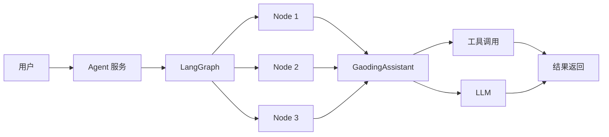
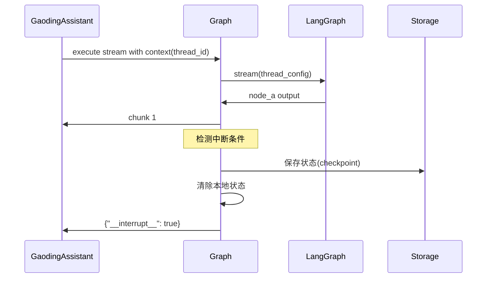
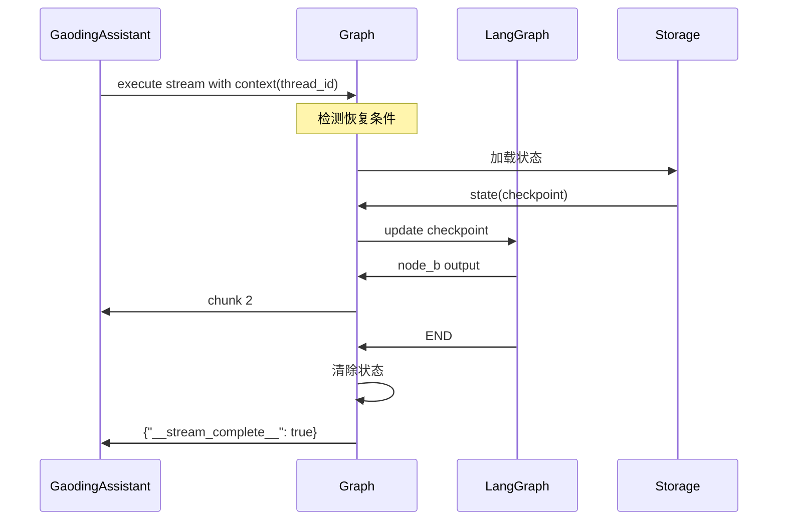
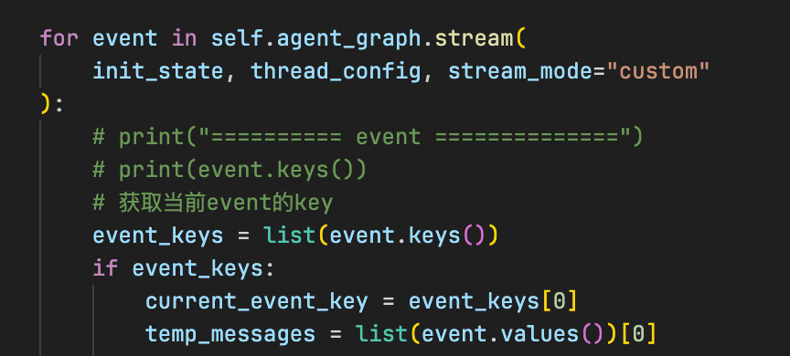
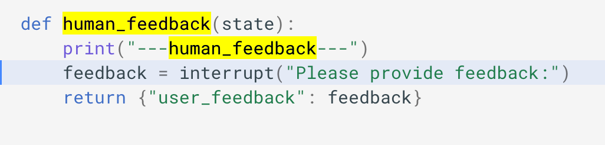
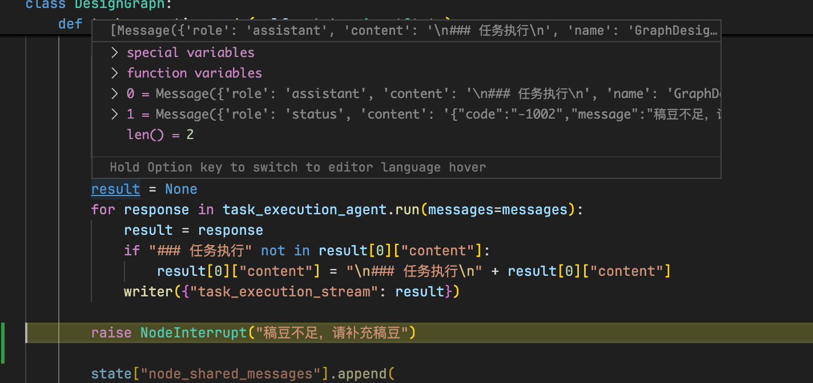
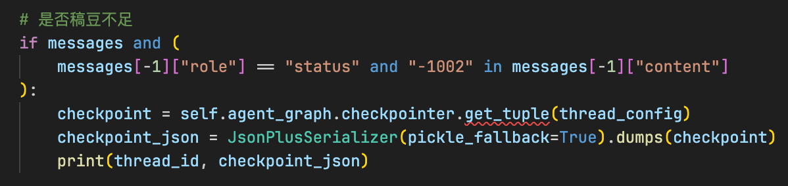
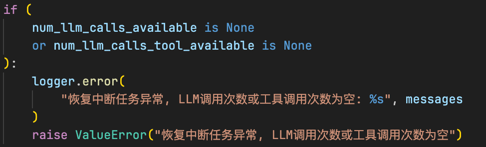
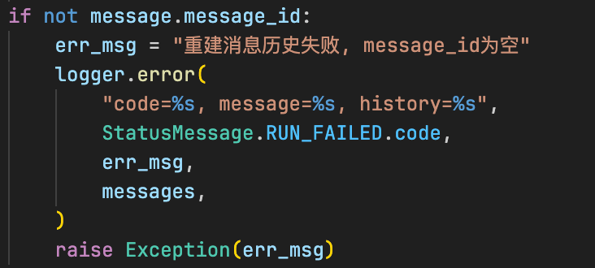
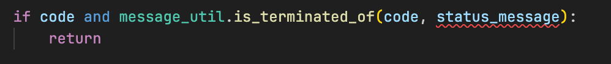

# LangGraph 接入方案

## 一、概述

LangGraph 是一个用于构建有状态、多轮对话应用的框架。本文档介绍如何将 LangGraph 集成到稿定 AI Agent 系统中，实现复杂的工作流编排和状态管理。

---

## 二、LangGraph 在架构中的位置

LangGraph 作为 Agent 的工作流编排引擎，位于 Agent 服务和 GaodingAssistant 之间：

```
用户请求 
  → Agent 服务 
  → LangGraph（工作流编排）
  → GaodingAssistant（LLM + 工具调用）
  → 工具执行 
  → 流式响应
```

### 2.1 架构关系



### 2.2 职责划分

| 组件 | 职责 |
|------|------|
| **Agent 服务** | 请求路由、会话管理、状态持久化 |
| **LangGraph** | 工作流编排、节点调度、中断与恢复 |
| **GaodingAssistant** | LLM 调用、工具调用、消息管理 |
| **工具层** | 具体能力实现（图像生成、搜索等） |

---

## 三、接入挑战

### 3.1 核心挑战

1. **状态序列化**  
   LangGraph 的状态对象需转换为可存储格式（如 JSON），以支持持久化

2. **分布式存储**  
   序列化后的状态需保存到存储中间件（如 Redis、PostgreSQL）

3. **一套上下文**  
   节点、Agent 之间需共享同一套上下文（messages、thread_id 等）

4. **两层中断 & 恢复**  
   - **节点级中断**：在节点执行过程中中断（如稿豆不足）
   - **工具级中断**：在工具调用过程中中断（如需要用户确认）

### 3.2 解决方案概览

| 挑战 | 解决方案 |
|------|----------|
| 状态序列化 | 使用 LangGraph 内置的 `JsonPlusSerializer` |
| 分布式存储 | 自定义 Checkpointer 集成 Redis/PostgreSQL |
| 一套上下文 | 通过 thread_id 关联 messages，统一状态管理 |
| 节点级中断 | 使用 `NodeInterrupt` 异常 + Checkpoint 保存 |
| 工具级中断 | 在 GaodingAssistant 中实现状态记录 |

---

## 四、最终流程设计

### 4.1 初始执行流程



**关键步骤：**
1. GaodingAssistant 调用 Graph 执行
2. Graph 通过 LangGraph 流式执行节点
3. 检测到中断条件（如稿豆不足）
4. 保存 checkpoint 到 Storage
5. 返回中断标记给调用方

### 4.2 恢复执行流程



**关键步骤：**
1. GaodingAssistant 再次调用（用户恢复操作后）
2. Graph 检测到恢复条件
3. 从 Storage 加载 checkpoint
4. 更新 LangGraph 状态
5. 从中断点继续执行
6. 执行完成，清除状态

---

## 五、节点级恢复机制

### 5.1 状态保存

#### LangGraph 的迭代器模式

LangGraph 通过 `stream` / `astream` 接口逐步执行，每一步都会产生输出（包括当前状态）：



**迭代器特性：**
```python
for event in graph.stream(init_state, thread_config):
    # 每次迭代都是一个执行步骤
    # 可以在任意步骤中断
    print(event)
```

这种迭代器模式给了我们**中断的机会**。

#### Node 执行限制

LangGraph 的 node 执行有一个重要限制：

> 💡 **重要约束**  
> 由于调用 LLM、Tool 只发生在 `agent.run()` 里，`run()` 之前的代码可以重复执行。

**官方示例：**



在上图中，`"---human_feedback---"` 会打印**两次**：

1. **第一次**：node 初次执行，在 interrupt 处临时中断、记录状态，交回控制权
2. **第二次**：用户响应后 resume，LangGraph 重新执行该 node，再次 print，但这次不会中断

**对我们的影响：**

这个限制是 node-level 中断 & 恢复的前提，但对稿定 Agent 影响不大：

```python
def my_node(state):
    # 这部分代码可能会执行多次（resume 时重新执行）
    context = prepare_context(state)
    
    # agent.run 只执行一次（初次执行或 resume 后）
    result = agent.run(context)
    
    return {"messages": result}
```

### 5.2 动态断点 (Dynamic Breakpoints)

要在 `run()` 方法里中断，需要使用 LangGraph 提供的**动态断点**能力：



**NodeInterrupt 异常：**
```python
from langgraph.errors import NodeInterrupt

def my_node(state):
    # 检查稿豆是否足够
    if not has_enough_points(state['user_id']):
        # 抛出 NodeInterrupt 异常
        raise NodeInterrupt("稿豆不足，需要充值")
    
    # 继续执行
    result = agent.run(state)
    return {"messages": result}
```

> ⚠️ **重要**  
> 只能用 `NodeInterrupt` 的方式中断。因为我们后续需要 LangGraph 帮我们从中断的节点恢复执行，使用它可以减少实现状态保存的成本。

### 5.3 保存 Checkpoint

当迭代器被打断后，保存最新的 checkpoint：



```python
def execute_with_interrupt_handling(graph, init_state, thread_config):
    """执行 Graph 并处理中断"""
    try:
        for event in graph.stream(init_state, thread_config, stream_mode="custom"):
            yield event
    
    except NodeInterrupt as e:
        # 获取最新的 checkpoint
        checkpointer = graph.checkpointer
        checkpoint_tuple = checkpointer.get_tuple(thread_config)
        
        # 序列化并保存
        checkpoint_json = JsonPlusSerializer(pickle_fallback=True).dumps(
            checkpoint_tuple
        )
        save_checkpoint_to_storage(
            thread_id=thread_config['configurable']['thread_id'],
            checkpoint=checkpoint_json
        )
        
        # 返回中断标记
        yield {"__interrupt__": True, "reason": str(e)}
```

#### Checkpoint 结构示例

```python
{
  "checkpoint": {
    "v": 1,
    "id": "checkpoint_123",
    "ts": "2025-07-08T12:00:00Z",
    "channel_versions": {...},
    "channel_values": {
      "messages": [...],
      "user_id": "user_123",
      ...
    }
  },
  "metadata": {
    "source": "loop",
    "step": 3,
    "writes": {...}
  },
  "config": {
    "configurable": {
      "thread_id": "thread_abc123",
      "checkpoint_id": "checkpoint_123"
    }
  }
}
```

### 5.4 状态清除

执行完成或中断后，清除本地状态：

```python
def cleanup_checkpoint(thread_id):
    """清除 checkpoint"""
    checkpointer = graph.checkpointer
    checkpointer.delete_thread(thread_id)
```

---

## 六、状态恢复

### 6.1 导入 Checkpoint

```python
from langgraph.checkpoint import CheckpointTuple
from langgraph.checkpoint.serde.jsonplus import JsonPlusSerializer

def restore_from_checkpoint(graph, checkpoint_json):
    """从 checkpoint 恢复状态"""
    # 反序列化 checkpoint
    checkpoint_tuple = CheckpointTuple(
        *JsonPlusSerializer(pickle_fallback=True).loads(
            checkpoint_json.encode()
        )
    )
    
    # 导入到 LangGraph
    graph.checkpointer.put(
        checkpoint_tuple.config,
        checkpoint_tuple.checkpoint,
        checkpoint_tuple.metadata,
        checkpoint_tuple.checkpoint["channel_versions"],
    )
    
    return checkpoint_tuple.config
```

### 6.2 Resume 执行

```python
def resume_execution(graph, checkpoint_json):
    """恢复执行"""
    # 导入 checkpoint
    thread_config = restore_from_checkpoint(graph, checkpoint_json)
    
    # ⚠️ LangGraph 的内部约定，resume 时 init_state 必须是 None
    init_state = None
    
    # 使用带 checkpoint_id 的 thread config
    for event in graph.stream(
        init_state, 
        thread_config, 
        stream_mode="custom"
    ):
        yield event
```

**关键点：**
1. `init_state` 必须是 `None`
2. `thread_config` 必须包含 `checkpoint_id`
3. 两者缺一不可

---

## 七、工具级恢复

### 7.1 工具级状态

工具级恢复所需的状态：

| 状态 | 说明 |
|------|------|
| `num_llm_calls_available` | 单轮对话剩余 LLM 迭代数 |
| `num_tool_calls_available` | 单轮对话剩余工具调用数 |
| `last_tool_message_id` | 指针，指向最后一次调用的工具消息 |

### 7.2 状态管理

这些状态记录在 `messages` 里，且恢复的逻辑实现在 `GaodingAssistant` 中：

```python
class GaodingAssistant:
    def run(self, state):
        messages = state.get('messages', [])
        
        # 从 messages 中恢复状态
        num_llm_calls = self._count_llm_calls(messages)
        num_tool_calls = self._count_tool_calls(messages)
        
        # 检查是否超限
        if num_llm_calls >= MAX_LLM_CALLS:
            raise NodeInterrupt("LLM 调用次数超限")
        
        if num_tool_calls >= MAX_TOOL_CALLS:
            raise NodeInterrupt("工具调用次数超限")
        
        # 继续执行...
```

### 7.3 恢复逻辑

由于状态都在 `messages` 中，理论上不用特殊处理即可实现工具级恢复：

```python
def resume_tool_execution(thread_id):
    """恢复工具执行"""
    # 加载 messages
    messages = load_messages(thread_id)
    
    # GaodingAssistant 自动从 messages 中恢复状态
    assistant = GaodingAssistant()
    result = assistant.run({"messages": messages})
    
    return result
```

---

## 八、开发约定

### 8.1 核心约定

1. **统一使用 GaodingAssistant**  
   使用 GaodingAssistant 调用 LLM 和工具，实现统一的工具调用能力和中断 & 恢复机制

2. **Node 实现限制**  
   Node 实现里最多只有一次 `GaodingAssistant.run`，且在 run 之前的代码可重复运行

3. **状态管理**  
   状态用 `messages` 承载，`messages` 由 `thread_id` 关联，减少状态保存的成本

4. **配置统一**  
   为了方便管理和一致性，统一使用经由 GaodingAssistant 传入的 LLM、Tools 配置

### 8.2 Node 实现示例

**✅ 正确示例：**
```python
def my_node(state):
    # 可重复执行的准备工作
    context = prepare_context(state)
    user_query = state['messages'][-1]['content']
    
    # 只调用一次 GaodingAssistant.run
    assistant = GaodingAssistant(
        llm=state['llm_config'],
        tools=state['tools']
    )
    result = assistant.run(user_query, context)
    
    return {"messages": result}
```

**❌ 错误示例：**
```python
def bad_node(state):
    # ❌ 多次调用 run
    result1 = assistant.run(query1)
    result2 = assistant.run(query2)
    
    # ❌ run 之前有不可重复执行的代码
    database.insert(record)  # 恢复时会重复插入
    result = assistant.run(query)
    
    return {"messages": result}
```

---

## 九、待定问题

### 9.1 Checkpoint 存储位置

**考虑因素：**
1. Checkpoint 不算小（可能几百 KB）
2. 只临时性用一次
3. 不适合存到 messages 里

**方案选择：**
- **方案 A**：单独存放，和 thread_id 关联（推荐）
- **方案 B**：使用 LangGraph 的 PostgresSaver

**延伸问题：**  
在通用 agent、IP design agent 等均使用 LangGraph 的情况下，要不要直接用 LangGraph 的 `PostgresSaver` 实现 Message 的存储？

### 9.2 统一中断方式

目前的几种中断实现各不相同、散落在各处：





**问题：**  
是否可以统一抛出 `NodeInterrupt` 异常在外层处理？

**建议：**  
统一使用 `NodeInterrupt`，在 Graph 层统一处理中断逻辑。

### 9.3 结构化输出

**需求：**  
前端可能需要适配 Graph 的结构化输出。

**示例（IP Design）：**
```python
{
  "image_candidates": [
    {"image_url": "xxxx"},
    {"image_url": "xxxx"},
    {"image_url": "xxxx"},
    {"image_url": "xxxx"}
  ]
}
```

**影响：**  
- Content 类型需要扩展（text、reasoning_content、json）
- 前端需要支持新的交互方式（如单选组件）

---

## 十、最佳实践

### 10.1 开发建议

**DO：**
- ✅ 使用 NodeInterrupt 实现中断
- ✅ 在 run 之前的代码保持幂等
- ✅ 状态存储在 messages 中
- ✅ 使用统一的 GaodingAssistant

**DON'T：**
- ❌ 在 node 中多次调用 run
- ❌ 在 run 之前执行副作用操作
- ❌ 自行实现状态序列化
- ❌ 直接操作 checkpoint

### 10.2 调试技巧

```python
# 启用 LangGraph 调试日志
import logging
logging.getLogger("langgraph").setLevel(logging.DEBUG)

# 查看 checkpoint
checkpointer = graph.checkpointer
checkpoint_tuple = checkpointer.get_tuple(thread_config)
print(checkpoint_tuple)

# 查看状态
state = graph.get_state(thread_config)
print(state)
```

---

## 十一、总结

### 11.1 核心机制

1. **节点级中断**：使用 NodeInterrupt + Checkpoint
2. **工具级中断**：状态记录在 messages 中
3. **状态管理**：统一使用 thread_id 关联
4. **恢复流程**：导入 checkpoint → resume 执行

### 11.2 关键设计

- ✅ 迭代器模式提供中断机会
- ✅ NodeInterrupt 统一中断方式
- ✅ Checkpoint 实现状态持久化
- ✅ messages 承载业务状态

---

*文档版本：v1.0*  
*最后更新：2025-01-26*
