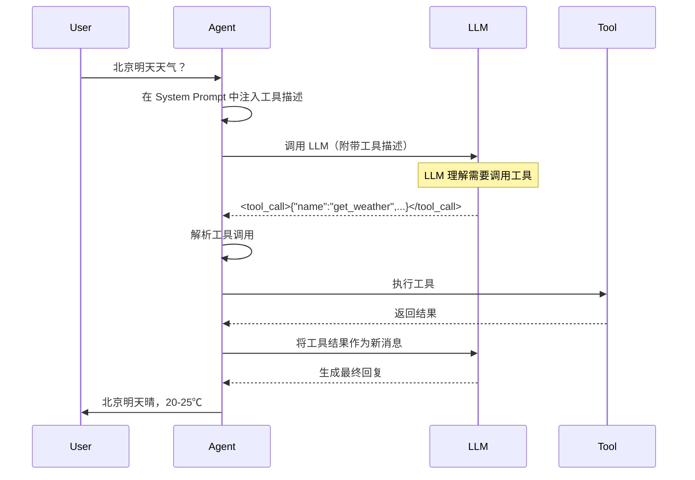

# 工具调用深入原理

> **Function Calling 的本质与实现**

---

## 一、什么是 Function Calling？

### 1.1 从问题出发

**问题**：LLM 的知识是静态的

```
用户：北京明天天气怎么样？
LLM：[查询训练数据] 我的知识截止到 2024年1月...

用户：帮我生成一张图片
LLM：[只能回复文字] 抱歉，我无法生成图片...
```

**解决方案**：让 LLM 调用外部工具

```
用户：北京明天天气怎么样？
LLM：我需要调用天气查询工具
  ↓
[调用 get_weather("北京", "明天")]
  ↓
工具返回：{"weather": "晴", "temp": "20-25℃"}
  ↓
LLM：根据查询结果，北京明天晴，温度 20-25℃
```

### 1.2 Function Calling 的本质

> 💡 **核心洞察**  
> Function Calling 的本质是：**让 LLM 输出结构化的函数调用指令**，而不是自然语言。

**传统方式（自然语言）**：
```
LLM输出：请调用天气查询API，城市参数是北京，日期是明天
```
问题：需要复杂的 NLP 解析

**Function Calling（结构化）**：
```json
{
  "name": "get_weather",
  "arguments": {
    "city": "北京",
    "date": "明天"
  }
}
```
优势：直接可执行

### 1.3 工作流程



---

## 二、System Prompt 注入工具描述

### 2.1 FN_CALL_TEMPLATE 剖析

从图片 `image2025-7-4_14-16-44.png` 可以看到完整的模板：

```python
FN_CALL_TEMPLATE = """# Tools

You may call one or more functions to assist with the user query.

You are provided with function signatures within XML tags:

{tool_descs}

For each function call, return a json object with function name and arguments within XML tags:

<tool_call>
{{"name": <function_name>, "arguments": <args_dict>}}
</tool_call>
"""
```

**设计分析**：

1. **使用 XML 标签**
   - `<tool_call>` 作为边界标记
   - 易于解析（不依赖复杂的正则表达式）
   - 可以处理嵌套的 JSON

2. **JSON 格式的参数**
   - 标准化的数据格式
   - LLM 生成JSON的能力强
   - 可以直接反序列化

3. **支持多个工具调用**
   - "one or more functions"
   - LLM 可以在一次回复中调用多个工具

### 2.2 工具描述的生成

从图片 `image2025-7-4_14-17-4.png` 可以看到工具描述的XML格式：

```xml
<tool>
  <name>通用</name>
  <description>根据需求生成图片</description>
  <parameters>
    <parameter>
      <name>width</name>
      <type>string</type>
      <description>宽度。Enum: ["512", "768", "1024"]</description>
      <required>true</required>
    </parameter>
    <parameter>
      <name>height</name>
      <type>string</type>
      <description>高度。Enum: ["512", "768", "1024"]</description>
      <required>true</required>
    </parameter>
    <parameter>
      <name>user_prompt</name>
      <type>string</type>
      <description>用户的图片需求描述</description>
      <required>true</required>
    </parameter>
  </parameters>
</tool>
```

**代码实现**（从图片 `image2025-7-4_16-34-8.png` 推导）：

```python
def generate_tool_description(tool: Tool) -> str:
    """生成单个工具的 XML 描述"""
    
    params_xml = []
    for param_name, param_def in tool.parameters.items():
        param_xml = f"""
    <parameter>
      <name>{param_name}</name>
      <type>{param_def['type']}</type>
      <description>{param_def['description']}</description>
      <required>{str(param_def.get('required', False)).lower()}</required>
    </parameter>"""
        params_xml.append(param_xml)
    
    tool_xml = f"""<tool>
  <name>{tool.name}</name>
  <description>{tool.description}</description>
  <parameters>
{''.join(params_xml)}
  </parameters>
</tool>"""
    
    return tool_xml


def generate_all_tools_description(tools: List[Tool]) -> str:
    """生成所有工具的描述"""
    tool_descs = [generate_tool_description(tool) for tool in tools]
    return '\n\n'.join(tool_descs)
```

### 2.3 完整的 System Prompt 构造

```python
def build_system_prompt(tools: List[Tool]) -> str:
    """构造包含工具描述的 System Prompt"""
    
    # 1. 基础指令
    base_instruction = """你是稿定 AI Agent，一个擅长设计和创作的助手。
你可以调用工具来帮助用户完成任务。"""
    
    # 2. 生成工具描述
    if tools:
        tool_descs = generate_all_tools_description(tools)
        fn_call_instruction = FN_CALL_TEMPLATE.format(
            tool_descs=tool_descs
        )
    else:
        fn_call_instruction = ""
    
    # 3. 合并
    system_prompt = base_instruction
    if fn_call_instruction:
        system_prompt += "\n\n" + fn_call_instruction
    
    return system_prompt
```

**示例输出**：

```
你是稿定 AI Agent，一个擅长设计和创作的助手。
你可以调用工具来帮助用户完成任务。

# Tools

You may call one or more functions to assist with the user query.

You are provided with function signatures within XML tags:

<tool>
  <name>通用</name>
  <description>根据需求生成图片</description>
  <parameters>
    <parameter>
      <name>width</name>
      <type>string</type>
      <description>宽度。Enum: ["512", "768", "1024"]</description>
      <required>true</required>
    </parameter>
    ...
  </parameters>
</tool>

For each function call, return a json object with function name and arguments within XML tags:

<tool_call>
{"name": <function_name>, "arguments": <args_dict>}
</tool_call>
```

---

## 三、流式解析工具调用

### 3.1 为什么需要流式解析？

**问题**：LLM 是流式输出的

```
Chunk 1: "我"
Chunk 2: "来"
Chunk 3: "帮"
Chunk 4: "你"
Chunk 5: "生"
Chunk 6: "成"
Chunk 7: "<tool_call>"
Chunk 8: '{"name"'
Chunk 9: ':"generate'
Chunk 10: '_image"'
...
```

**挑战**：
1. 工具调用可能跨越多个 chunk
2. 需要检测 `<tool_call>` 标签的开始和结束
3. 需要处理不完整的 JSON

### 3.2 流式解析算法

从图片 `image2025-7-4_14-41-48.png` 可以看到关键检测点：

```python
def parse_tool_call_streaming(response_stream):
    """
    流式解析工具调用
    
    状态机：
    - NORMAL: 普通文本
    - IN_TOOL_CALL: 在 <tool_call> 标签内
    - COMPLETE: 工具调用完成
    """
    
    buffer = ""
    state = "NORMAL"
    tool_call_content = ""
    
    for chunk in response_stream:
        buffer += chunk
        
        if state == "NORMAL":
            # 检测工具调用开始
            if "<tool_call>" in buffer:
                # 提取 <tool_call> 之前的内容（纯文本回复）
                idx = buffer.index("<tool_call>")
                if idx > 0:
                    yield {
                        "type": "text",
                        "content": buffer[:idx]
                    }
                
                # 进入工具调用状态
                state = "IN_TOOL_CALL"
                buffer = buffer[idx + len("<tool_call>"):]
                tool_call_content = ""
        
        elif state == "IN_TOOL_CALL":
            # 检测工具调用结束
            if "</tool_call>" in buffer:
                # 提取完整的工具调用
                idx = buffer.index("</tool_call>")
                tool_call_content += buffer[:idx]
                
                # 解析 JSON
                try:
                    tool_call = json.loads(tool_call_content)
                    yield {
                        "type": "tool_call",
                        "content": tool_call
                    }
                except json.JSONDecodeError as e:
                    yield {
                        "type": "error",
                        "content": f"Invalid tool call JSON: {e}"
                    }
                
                # 恢复普通状态
                state = "NORMAL"
                buffer = buffer[idx + len("</tool_call>"):]
                tool_call_content = ""
            else:
                # 还在工具调用内，继续累积
                tool_call_content += buffer
                buffer = ""
    
    # 处理剩余内容
    if buffer:
        yield {
            "type": "text",
            "content": buffer
        }
```

### 3.3 边界情况处理

**情况 1：工具调用跨 chunk 边界**

```
Chunk N:   ...{"name":"gen
Chunk N+1: erate_image"...
```

解决方案：累积到 buffer 中，直到遇到 `</tool_call>`

**情况 2：JSON 格式错误**

```xml
<tool_call>
{"name": "generate_image", "arguments": {invalid json}}
</tool_call>
```

解决方案：捕获 `json.JSONDecodeError`，返回错误消息

**情况 3：多个工具调用**

```xml
<tool_call>
{"name": "tool1", ...}
</tool_call>
一些文本
<tool_call>
{"name": "tool2", ...}
</tool_call>
```

解决方案：状态机在 `NORMAL` 和 `IN_TOOL_CALL` 之间切换

---

## 四、工具调用的执行

### 4.1 ToolRegistry 设计

从图片 `image2025-7-4_16-35-6.png` 可以看到工具注册表的设计：

```python
class ToolRegistry:
    """工具注册表"""
    
    def __init__(self):
        self._tools: Dict[str, Tool] = {}
    
    def register(self, tool: Tool):
        """注册工具"""
        if tool.name in self._tools:
            raise ValueError(f"Tool {tool.name} already registered")
        
        self._tools[tool.name] = tool
        logger.info(f"Registered tool: {tool.name}")
    
    def get(self, name: str) -> Optional[Tool]:
        """获取工具"""
        return self._tools.get(name)
    
    def list_all(self) -> List[Tool]:
        """列出所有工具"""
        return list(self._tools.values())
    
    def get_descriptions(self) -> str:
        """获取所有工具的描述（用于 System Prompt）"""
        return generate_all_tools_description(self.list_all())


# 全局单例
tool_registry = ToolRegistry()
```

### 4.2 Tool 抽象

```python
from abc import ABC, abstractmethod
from typing import Dict, Any

class Tool(ABC):
    """工具基类"""
    
    def __init__(
        self,
        name: str,
        description: str,
        parameters: Dict[str, Any]
    ):
        self.name = name
        self.description = description
        self.parameters = parameters
    
    @abstractmethod
    async def execute(self, **kwargs) -> Dict[str, Any]:
        """执行工具"""
        pass
    
    def validate_parameters(self, kwargs: Dict[str, Any]):
        """验证参数"""
        for param_name, param_def in self.parameters.items():
            # 检查必需参数
            if param_def.get('required', False) and param_name not in kwargs:
                raise ValueError(f"Missing required parameter: {param_name}")
            
            # 检查参数类型
            if param_name in kwargs:
                value = kwargs[param_name]
                expected_type = param_def['type']
                
                if expected_type == 'string' and not isinstance(value, str):
                    raise TypeError(f"Parameter {param_name} must be string")
                elif expected_type == 'number' and not isinstance(value, (int, float)):
                    raise TypeError(f"Parameter {param_name} must be number")
                elif expected_type == 'boolean' and not isinstance(value, bool):
                    raise TypeError(f"Parameter {param_name} must be boolean")
```

### 4.3 工具实现示例

**图像生成工具**：

```python
class GenerateImageTool(Tool):
    """图像生成工具"""
    
    def __init__(self):
        super().__init__(
            name="通用",
            description="根据需求生成图片",
            parameters={
                "user_prompt": {
                    "type": "string",
                    "description": "用户的图片需求描述",
                    "required": True
                },
                "width": {
                    "type": "string",
                    "description": "宽度。Enum: ['512', '768', '1024']",
                    "required": True
                },
                "height": {
                    "type": "string",
                    "description": "高度。Enum: ['512', '768', '1024']",
                    "required": True
                }
            }
        )
    
    async def execute(
        self,
        user_prompt: str,
        width: str,
        height: str,
        **kwargs
    ) -> Dict[str, Any]:
        """执行图像生成"""
        
        # 1. 验证参数
        self.validate_parameters(locals())
        
        # 2. 检查稿豆余额
        user_id = kwargs.get('user_id')
        required_points = self.calculate_points(width, height)
        
        balance = get_user_balance(user_id)
        if balance < required_points:
            return {
                "tool_name": self.name,
                "result": "failed",
                "error": "insufficient_points",
                "message": "稿豆不足",
                "required_points": required_points,
                "current_balance": balance
            }
        
        # 3. 调用图像生成服务
        try:
            result = await image_service.generate(
                prompt=user_prompt,
                width=int(width),
                height=int(height)
            )
            
            # 4. 扣除稿豆
            deduct_points(user_id, required_points)
            
            # 5. 返回结果
            return {
                "tool_name": self.name,
                "result": "success",
                "image_url": result['url'],
                "task_id": result['task_id'],
                "width": width,
                "height": height,
                "deduct_points": required_points
            }
        
        except Exception as e:
            logger.error(f"Image generation failed: {e}")
            return {
                "tool_name": self.name,
                "result": "failed",
                "error": "generation_failed",
                "message": str(e)
            }
    
    def calculate_points(self, width: str, height: str) -> int:
        """计算需要的稿豆"""
        w = int(width)
        h = int(height)
        pixels = w * h
        
        # 简单示例：每 100k 像素消耗 1 稿豆
        return max(1, pixels // 100000)


# 注册工具
tool_registry.register(GenerateImageTool())
```

### 4.4 ToolExecutor 设计

从图片 `image2025-7-4_16-36-34.png` 可以看到执行器的设计：

```python
class ToolExecutor:
    """工具执行器"""
    
    def __init__(self, registry: ToolRegistry):
        self.registry = registry
    
    async def execute(
        self,
        tool_call: Dict[str, Any],
        context: Dict[str, Any]
    ) -> Dict[str, Any]:
        """
        执行工具调用
        
        Args:
            tool_call: {"name": "tool_name", "arguments": {...}}
            context: {"user_id": "...", "thread_id": "...", ...}
        
        Returns:
            工具执行结果
        """
        
        tool_name = tool_call['name']
        arguments = tool_call['arguments']
        
        # 1. 获取工具
        tool = self.registry.get(tool_name)
        if not tool:
            return {
                "tool_name": tool_name,
                "result": "failed",
                "error": "tool_not_found",
                "message": f"Tool '{tool_name}' not found"
            }
        
        # 2. 合并上下文
        kwargs = {**arguments, **context}
        
        # 3. 执行工具
        try:
            result = await tool.execute(**kwargs)
            return result
        
        except Exception as e:
            logger.error(f"Tool execution failed: {tool_name}, error: {e}")
            return {
                "tool_name": tool_name,
                "result": "failed",
                "error": "execution_failed",
                "message": str(e)
            }
```

---

## 五、多模型适配

### 5.1 不同 LLM 的工具调用格式

| LLM | 标签格式 | JSON 格式 | 是否统一 |
|-----|----------|-----------|---------|
| **OpenAI** | 无（使用特殊字段）| 标准 | ✅ |
| **Claude** | `<tool_call>` | 标准 | ✅ |
| **Doubao** | `<FunctionCallBegin>` | 非标准 | ❌ |
| **Qwen** | `<tool_call>` 或 `✿FUNCTION✿` | 标准 | ⚠️ |

### 5.2 Doubao 的特殊格式

**Doubao 输出**：
```xml
<FunctionCallBegin>
[{"name":"通用","parameters":{"user_prompt":"...","width":"512","height":"512"}}]
</FunctionCallEnd>
```

**与标准格式的区别**：
1. 使用 `<FunctionCallBegin>` 而不是 `<tool_call>`
2. 使用 `parameters` 而不是 `arguments`
3. 是一个数组（支持多个工具调用）

### 5.3 统一适配层

```python
class LLMAdapter(ABC):
    """LLM 适配器基类"""
    
    @abstractmethod
    def parse_tool_call(self, response: str) -> List[Dict[str, Any]]:
        """解析工具调用"""
        pass


class DoubaoAdapter(LLMAdapter):
    """Doubao 适配器"""
    
    def parse_tool_call(self, response: str) -> List[Dict[str, Any]]:
        """解析 Doubao 的工具调用"""
        
        # 1. 提取 FunctionCall 标签内容
        pattern = r'<FunctionCallBegin>(.*?)</FunctionCallEnd>'
        matches = re.findall(pattern, response, re.DOTALL)
        
        if not matches:
            return []
        
        # 2. 解析 JSON 数组
        tool_calls = []
        for match in matches:
            try:
                calls = json.loads(match)
                
                # 3. 转换为标准格式
                for call in calls:
                    tool_calls.append({
                        "name": call['name'],
                        "arguments": call['parameters']  # 转换字段名
                    })
            
            except json.JSONDecodeError as e:
                logger.error(f"Failed to parse Doubao tool call: {e}")
        
        return tool_calls


class ClaudeAdapter(LLMAdapter):
    """Claude 适配器"""
    
    def parse_tool_call(self, response: str) -> List[Dict[str, Any]]:
        """解析 Claude 的工具调用"""
        
        # Claude 使用标准格式，直接解析
        pattern = r'<tool_call>(.*?)</tool_call>'
        matches = re.findall(pattern, response, re.DOTALL)
        
        tool_calls = []
        for match in matches:
            try:
                call = json.loads(match)
                tool_calls.append(call)
            except json.JSONDecodeError as e:
                logger.error(f"Failed to parse Claude tool call: {e}")
        
        return tool_calls


# 适配器工厂
class AdapterFactory:
    _adapters = {
        "doubao": DoubaoAdapter(),
        "claude": ClaudeAdapter(),
        "gpt": ClaudeAdapter(),  # GPT 使用标准格式
        "qwen": ClaudeAdapter()  # Qwen 也使用标准格式
    }
    
    @classmethod
    def get_adapter(cls, model: str) -> LLMAdapter:
        """根据模型获取适配器"""
        for key, adapter in cls._adapters.items():
            if key in model.lower():
                return adapter
        
        # 默认使用 Claude 适配器（标准格式）
        return cls._adapters["claude"]
```

### 5.4 统一的工具调用流程

```python
async def call_llm_with_tools(
    messages: List[Dict],
    tools: List[Tool],
    model: str = "doubao"
) -> AsyncGenerator:
    """
    调用 LLM 并支持工具调用
    """
    
    # 1. 构造 System Prompt
    system_prompt = build_system_prompt(tools)
    
    # 2. 调用 LLM
    response_stream = await llm_client.complete(
        model=model,
        messages=[
            {"role": "system", "content": system_prompt},
            *messages
        ],
        stream=True
    )
    
    # 3. 获取适配器
    adapter = AdapterFactory.get_adapter(model)
    
    # 4. 流式解析
    buffer = ""
    async for chunk in response_stream:
        buffer += chunk
        
        # 尝试解析工具调用
        if "</tool_call>" in buffer or "</FunctionCallEnd>" in buffer:
            tool_calls = adapter.parse_tool_call(buffer)
            
            if tool_calls:
                # 返回工具调用
                yield {
                    "type": "tool_calls",
                    "content": tool_calls
                }
                
                # 清空 buffer
                buffer = ""
        else:
            # 返回普通文本
            yield {
                "type": "text",
                "content": chunk
            }
```

---

## 六、工具调用的高级特性

### 6.1 并行工具调用

**问题**：一次调用多个工具

```
用户：帮我查询北京和上海的天气

LLM输出：
<tool_call>
{"name": "get_weather", "arguments": {"city": "北京"}}
</tool_call>
<tool_call>
{"name": "get_weather", "arguments": {"city": "上海"}}
</tool_call>
```

**处理方式**：

```python
async def execute_tool_calls_parallel(
    tool_calls: List[Dict],
    context: Dict
) -> List[Dict]:
    """并行执行多个工具调用"""
    
    tasks = [
        tool_executor.execute(call, context)
        for call in tool_calls
    ]
    
    results = await asyncio.gather(*tasks, return_exceptions=True)
    
    # 处理异常
    final_results = []
    for i, result in enumerate(results):
        if isinstance(result, Exception):
            final_results.append({
                "tool_name": tool_calls[i]['name'],
                "result": "failed",
                "error": "execution_failed",
                "message": str(result)
            })
        else:
            final_results.append(result)
    
    return final_results
```

### 6.2 工具调用链

**问题**：一个工具的输出作为另一个工具的输入

```
用户：生成一张图片，然后帮我分析图片内容

流程：
1. 调用 generate_image
2. 获取 image_url
3. 调用 analyze_image(image_url)
```

**实现方式**：

```python
async def execute_tool_chain(
    messages: List[Dict],
    tools: List[Tool],
    max_iterations: int = 10
) -> List[Dict]:
    """执行工具调用链"""
    
    current_messages = messages.copy()
    iteration = 0
    
    while iteration < max_iterations:
        iteration += 1
        
        # 1. 调用 LLM
        response = await call_llm_with_tools(
            current_messages,
            tools
        )
        
        # 2. 检查是否有工具调用
        tool_calls = extract_tool_calls(response)
        
        if not tool_calls:
            # 没有工具调用，返回最终结果
            return current_messages + [response]
        
        # 3. 执行工具调用
        tool_results = await execute_tool_calls_parallel(
            tool_calls,
            context
        )
        
        # 4. 将工具调用和结果添加到消息历史
        current_messages.append({
            "role": "assistant",
            "content": {
                "type": "function_call",
                "text": tool_calls
            }
        })
        
        for tool_result in tool_results:
            current_messages.append({
                "role": "function",
                "content": {
                    "type": "function_response",
                    "text": tool_result
                }
            })
    
    raise Exception("Max iterations reached")
```

### 6.3 工具调用的重试机制

```python
async def execute_tool_with_retry(
    tool_call: Dict,
    context: Dict,
    max_retries: int = 3
) -> Dict:
    """带重试的工具执行"""
    
    for attempt in range(max_retries):
        try:
            result = await tool_executor.execute(tool_call, context)
            
            # 检查结果
            if result['result'] == 'success':
                return result
            
            # 失败但可重试（如网络错误）
            if result.get('error') in ['network_error', 'timeout']:
                logger.warning(
                    f"Tool execution failed (attempt {attempt + 1}): "
                    f"{result.get('message')}"
                )
                await asyncio.sleep(2 ** attempt)  # 指数退避
                continue
            
            # 不可重试的错误（如参数错误）
            return result
        
        except Exception as e:
            logger.error(f"Tool execution exception: {e}")
            if attempt == max_retries - 1:
                return {
                    "tool_name": tool_call['name'],
                    "result": "failed",
                    "error": "max_retries_exceeded",
                    "message": str(e)
                }
            
            await asyncio.sleep(2 ** attempt)
    
    return {
        "tool_name": tool_call['name'],
        "result": "failed",
        "error": "max_retries_exceeded"
    }
```

---

## 七、最佳实践

### 7.1 工具设计原则

**DO：**
- ✅ 单一职责：一个工具只做一件事
- ✅ 幂等性：相同输入产生相同输出
- ✅ 详细描述：让 LLM 理解工具的用途
- ✅ 参数验证：检查参数类型和必需性
- ✅ 错误处理：返回结构化的错误信息

**DON'T：**
- ❌ 工具太复杂（应该拆分）
- ❌ 缺少描述（LLM 不知道何时调用）
- ❌ 参数太多（LLM 容易出错）
- ❌ 返回格式不一致

### 7.2 参数设计建议

**好的参数设计**：

```python
{
    "user_prompt": {
        "type": "string",
        "description": "用户的图片需求描述，例如：'一张牙膏产品图，简约风格'",
        "required": True
    },
    "style": {
        "type": "string",
        "description": "图片风格。可选值：简约、复古、现代、卡通",
        "enum": ["简约", "复古", "现代", "卡通"],
        "required": False
    }
}
```

**不好的参数设计**：

```python
{
    "params": {
        "type": "string",
        "description": "所有参数的 JSON 字符串",  # ❌ 太模糊
        "required": True
    }
}
```

### 7.3 工具描述的 Prompt Engineering

**好的描述**：

```
name: generate_image
description: 根据用户的文字描述生成图片。支持多种尺寸和风格。

使用场景：
- 用户要求生成图片
- 用户描述了想要的图片内容
- 用户没有提供现成的图片

不适用场景：
- 用户已经上传了图片（应该使用 analyze_image）
- 用户只是在讨论图片，但没有明确要求生成
```

**不好的描述**：

```
name: generate_image
description: 生成图片  # ❌ 太简单，LLM 不知道何时调用
```

---

## 八、总结

### 8.1 核心概念

1. **Function Calling 的本质**：让 LLM 输出结构化指令
2. **System Prompt 注入**：将工具描述注入到系统提示中
3. **流式解析**：处理 LLM 的流式输出
4. **多模型适配**：统一不同 LLM 的工具调用格式

### 8.2 关键实现

- ✅ ToolRegistry：工具注册表
- ✅ ToolExecutor：工具执行器
- ✅ LLMAdapter：多模型适配器
- ✅ 并行执行：支持多个工具同时调用
- ✅ 重试机制：处理临时失败

### 8.3 下一步

- **[工作流编排](04-工作流编排.md)**：了解 LangGraph 如何编排工具调用
- **[中断与恢复](06-中断与恢复.md)**：学习如何处理工具调用中断

---

*文档版本：v1.0*  
*最后更新：2026-01-26*

**上一篇**：[← 消息系统](02-消息系统.md) | **下一篇**：[工作流编排 →](04-工作流编排.md)
