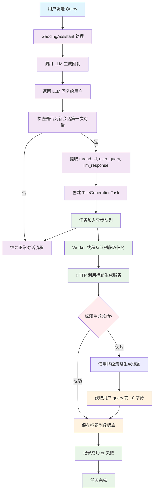

# 会话标题生成

## 一、概述

在新会话开始时自动生成有意义的标题，提升用户体验。本文档介绍会话标题的生成机制、流程设计和实现方案。

---

## 二、设计原则

### 2.1 核心原则

1. **异步非阻塞**  
   标题生成不影响主对话流程

2. **轻量级实现**  
   基于当前服务内部队列，无需额外服务

3. **智能触发**  
   仅在新会话时触发，避免资源浪费

4. **容错性强**  
   生成失败不影响正常对话功能

---

## 三、生成流程

### 3.1 流程图



### 3.2 关键步骤

#### 步骤 1：检测新会话

```python
def is_new_conversation(thread_id):
    """检查是否为新会话"""
    # 查询该 thread 的消息数
    message_count = count_messages(thread_id)
    
    # 只有2条消息（用户 query + assistant 回复）时认为是新会话
    return message_count == 2
```

#### 步骤 2：提取信息

```python
def extract_title_context(thread_id):
    """提取标题生成所需的上下文"""
    messages = get_messages(thread_id)
    
    # 获取用户的第一条消息
    user_query = messages[0]['content']['text']
    
    # 获取 assistant 的第一条回复
    llm_response = messages[1]['content']['text']
    
    return {
        "thread_id": thread_id,
        "user_query": user_query,
        "llm_response": llm_response
    }
```

#### 步骤 3：创建异步任务

```python
from dataclasses import dataclass
from queue import Queue

@dataclass
class TitleGenerationTask:
    """标题生成任务"""
    thread_id: str
    user_query: str
    llm_response: str
    created_at: datetime

# 全局任务队列
title_generation_queue = Queue()

def queue_title_generation(context):
    """将标题生成任务加入队列"""
    task = TitleGenerationTask(
        thread_id=context['thread_id'],
        user_query=context['user_query'],
        llm_response=context['llm_response'],
        created_at=datetime.now()
    )
    title_generation_queue.put(task)
```

#### 步骤 4：Worker 处理

```python
import threading
import requests

def title_generation_worker():
    """标题生成 Worker"""
    while True:
        try:
            # 从队列获取任务
            task = title_generation_queue.get(timeout=1)
            
            # 生成标题
            title = generate_title_with_fallback(task)
            
            # 保存到数据库
            save_thread_title(task.thread_id, title)
            
            # 记录日志
            logging.info(f"Title generated for thread {task.thread_id}: {title}")
            
        except Empty:
            # 队列为空，继续等待
            continue
        except Exception as e:
            logging.error(f"Title generation failed: {e}")
        finally:
            title_generation_queue.task_done()

# 启动 Worker 线程
worker_thread = threading.Thread(
    target=title_generation_worker, 
    daemon=True
)
worker_thread.start()
```

#### 步骤 5：标题生成（带降级）

```python
def generate_title_with_fallback(task):
    """生成标题（带降级策略）"""
    try:
        # 调用标题生成服务
        title = call_title_generation_service(
            user_query=task.user_query,
            llm_response=task.llm_response
        )
        return title
    
    except Exception as e:
        logging.warning(f"Title generation service failed: {e}, using fallback")
        
        # 降级：截取用户 query 前 10 字符
        fallback_title = task.user_query[:10]
        if len(task.user_query) > 10:
            fallback_title += "..."
        
        return fallback_title

def call_title_generation_service(user_query, llm_response):
    """调用标题生成服务"""
    response = requests.post(
        "https://api.gaoding.com/agent/generate-title",
        json={
            "user_query": user_query,
            "llm_response": llm_response
        },
        timeout=5
    )
    
    if response.status_code != 200:
        raise Exception(f"Service returned {response.status_code}")
    
    return response.json()['title']
```

---

## 四、数据库设计

### 4.1 表结构

`thread_metadata` 表用于存储会话的补充信息：

| 列 | 类型 | 默认值 | 约束 | 描述 |
|----|------|--------|------|------|
| `thread_id` | `varchar(100)` | - | PRIMARY KEY | 会话 ID |
| `thread_name` | `varchar(100)` | - | NOT NULL | 会话名称 |
| `is_deleted` | `bool` | `false` | NOT NULL | 是否已删除 |
| `created_at` | `timestamp` | `NOW()` | NOT NULL | 创建时间 |
| `updated_at` | `timestamp` | `NOW()` | NOT NULL | 更新时间 |

### 4.2 DDL

```sql
CREATE TABLE thread_metadata (
    thread_id VARCHAR(100) PRIMARY KEY,
    thread_name VARCHAR(100) NOT NULL,
    is_deleted BOOLEAN NOT NULL DEFAULT FALSE,
    created_at TIMESTAMP NOT NULL DEFAULT CURRENT_TIMESTAMP,
    updated_at TIMESTAMP NOT NULL DEFAULT CURRENT_TIMESTAMP ON UPDATE CURRENT_TIMESTAMP
);

-- 索引
CREATE INDEX idx_thread_metadata_created_at ON thread_metadata(created_at);
CREATE INDEX idx_thread_metadata_is_deleted ON thread_metadata(is_deleted);
```

### 4.3 CRUD 操作

```python
def save_thread_title(thread_id, title):
    """保存会话标题"""
    query = """
    INSERT INTO thread_metadata (thread_id, thread_name)
    VALUES (%s, %s)
    ON DUPLICATE KEY UPDATE 
        thread_name = VALUES(thread_name),
        updated_at = NOW()
    """
    execute_query(query, (thread_id, title))

def get_thread_title(thread_id):
    """获取会话标题"""
    query = """
    SELECT thread_name 
    FROM thread_metadata 
    WHERE thread_id = %s AND is_deleted = FALSE
    """
    result = execute_query(query, (thread_id,))
    return result[0]['thread_name'] if result else None

def list_user_threads(user_id, limit=20, offset=0):
    """列出用户的会话列表"""
    query = """
    SELECT 
        tm.thread_id, 
        tm.thread_name, 
        tm.created_at,
        tm.updated_at
    FROM thread_metadata tm
    JOIN messages m ON tm.thread_id = m.thread_id
    WHERE m.user_id = %s 
      AND tm.is_deleted = FALSE
    GROUP BY tm.thread_id
    ORDER BY tm.updated_at DESC
    LIMIT %s OFFSET %s
    """
    return execute_query(query, (user_id, limit, offset))

def delete_thread(thread_id):
    """删除会话（软删除）"""
    query = """
    UPDATE thread_metadata 
    SET is_deleted = TRUE, updated_at = NOW()
    WHERE thread_id = %s
    """
    execute_query(query, (thread_id,))
```

---

## 五、标题生成策略

### 5.1 主策略：LLM 生成

调用专门的标题生成服务（可以是 Dify workflow）：

**Prompt 示例：**
```
基于以下对话，生成一个简洁的标题（不超过20个字）：

用户：{user_query}
助手：{llm_response}

要求：
1. 标题需要准确概括对话主题
2. 不超过20个字
3. 直接输出标题，不要其他内容
```

### 5.2 降级策略：截取 Query

当 LLM 生成失败时，使用降级策略：

```python
def fallback_title(user_query):
    """降级标题生成"""
    # 去除前后空格
    query = user_query.strip()
    
    # 截取前 10 个字符
    title = query[:10]
    
    # 如果原文更长，加省略号
    if len(query) > 10:
        title += "..."
    
    return title
```

---

## 六、实现示例

### 6.1 完整实现

```python
import logging
import threading
from queue import Queue, Empty
from datetime import datetime
from dataclasses import dataclass

@dataclass
class TitleGenerationTask:
    thread_id: str
    user_query: str
    llm_response: str
    created_at: datetime

class TitleGenerationService:
    """标题生成服务"""
    
    def __init__(self):
        self.queue = Queue()
        self.worker = None
    
    def start(self):
        """启动 Worker"""
        if self.worker is None:
            self.worker = threading.Thread(
                target=self._worker_loop,
                daemon=True
            )
            self.worker.start()
            logging.info("Title generation worker started")
    
    def queue_generation(self, thread_id, user_query, llm_response):
        """加入生成队列"""
        task = TitleGenerationTask(
            thread_id=thread_id,
            user_query=user_query,
            llm_response=llm_response,
            created_at=datetime.now()
        )
        self.queue.put(task)
        logging.info(f"Title generation task queued for thread {thread_id}")
    
    def _worker_loop(self):
        """Worker 循环"""
        while True:
            try:
                # 获取任务（1秒超时）
                task = self.queue.get(timeout=1)
                
                # 生成标题
                title = self._generate_title(task)
                
                # 保存到数据库
                save_thread_title(task.thread_id, title)
                
                logging.info(
                    f"Title generated for thread {task.thread_id}: {title}"
                )
                
            except Empty:
                continue
            except Exception as e:
                logging.error(f"Title generation error: {e}", exc_info=True)
            finally:
                self.queue.task_done()
    
    def _generate_title(self, task):
        """生成标题（带降级）"""
        try:
            # 调用 LLM 生成
            return self._call_llm_service(task)
        except Exception as e:
            logging.warning(f"LLM generation failed: {e}, using fallback")
            # 降级策略
            return self._fallback_title(task.user_query)
    
    def _call_llm_service(self, task):
        """调用 LLM 服务"""
        import requests
        
        response = requests.post(
            "https://api.gaoding.com/agent/generate-title",
            json={
                "user_query": task.user_query,
                "llm_response": task.llm_response
            },
            timeout=5
        )
        
        if response.status_code != 200:
            raise Exception(f"Service error: {response.status_code}")
        
        return response.json()['title']
    
    def _fallback_title(self, user_query):
        """降级标题"""
        title = user_query.strip()[:10]
        if len(user_query.strip()) > 10:
            title += "..."
        return title

# 全局实例
title_service = TitleGenerationService()
title_service.start()
```

### 6.2 集成到 Agent

```python
def handle_user_message(thread_id, user_id, message):
    """处理用户消息"""
    # 1. 处理消息
    response = agent.process(thread_id, user_id, message)
    
    # 2. 检查是否为新会话
    if is_new_conversation(thread_id):
        # 3. 异步生成标题
        title_service.queue_generation(
            thread_id=thread_id,
            user_query=message['content']['text'],
            llm_response=response['content']['text']
        )
    
    return response
```

---

## 七、监控与告警

### 7.1 关键指标

| 指标 | 说明 | 告警阈值 |
|------|------|----------|
| 标题生成成功率 | 近 5 分钟生成成功率 | < 50% |
| 标题生成延迟 | P99 延迟 | > 10s |
| 队列积压 | 队列中任务数量 | > 100 |
| Worker 存活 | Worker 线程是否存活 | 否 |

### 7.2 日志记录

```python
# 任务入队
logging.info(f"Title task queued: thread={thread_id}")

# 生成成功
logging.info(f"Title generated: thread={thread_id}, title={title}")

# 生成失败
logging.error(f"Title generation failed: thread={thread_id}, error={e}")

# 降级策略
logging.warning(f"Using fallback title: thread={thread_id}")
```

---

## 八、最佳实践

### 8.1 设计原则

**DO：**
- ✅ 异步处理，不阻塞主流程
- ✅ 提供降级策略
- ✅ 记录完整日志
- ✅ 监控关键指标

**DON'T：**
- ❌ 同步调用 LLM
- ❌ 没有超时设置
- ❌ 没有降级方案
- ❌ 忽略错误处理

### 8.2 性能优化

**队列管理：**
```python
# 限制队列大小
title_queue = Queue(maxsize=1000)

# 批量处理（可选）
def batch_generate_titles(tasks):
    """批量生成标题"""
    # 一次性调用多个标题生成
    pass
```

**缓存策略：**
```python
# 缓存相似 query 的标题
from functools import lru_cache

@lru_cache(maxsize=1000)
def generate_title_cached(user_query_hash):
    """带缓存的标题生成"""
    pass
```

---

## 九、总结

### 9.1 核心设计

1. **异步非阻塞**：基于队列 + Worker 线程
2. **智能触发**：仅在新会话时触发
3. **降级策略**：LLM 生成失败时截取 query
4. **数据持久化**：存储到 thread_metadata 表

### 9.2 关键流程

```
用户消息 
  → 检测新会话 
  → 提取上下文 
  → 加入队列 
  → Worker 处理 
  → LLM 生成 / 降级 
  → 保存标题
```

### 9.3 优势

- ✅ 不影响主对话性能
- ✅ 提升用户体验
- ✅ 降级策略保证可用性
- ✅ 易于监控和调试

---

*文档版本：v1.0*  
*最后更新：2025-01-26*
