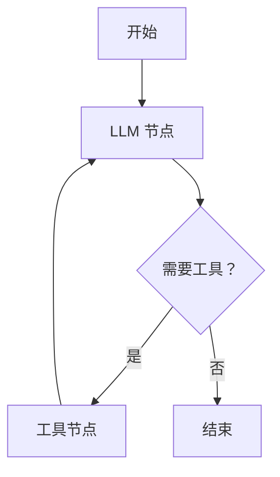
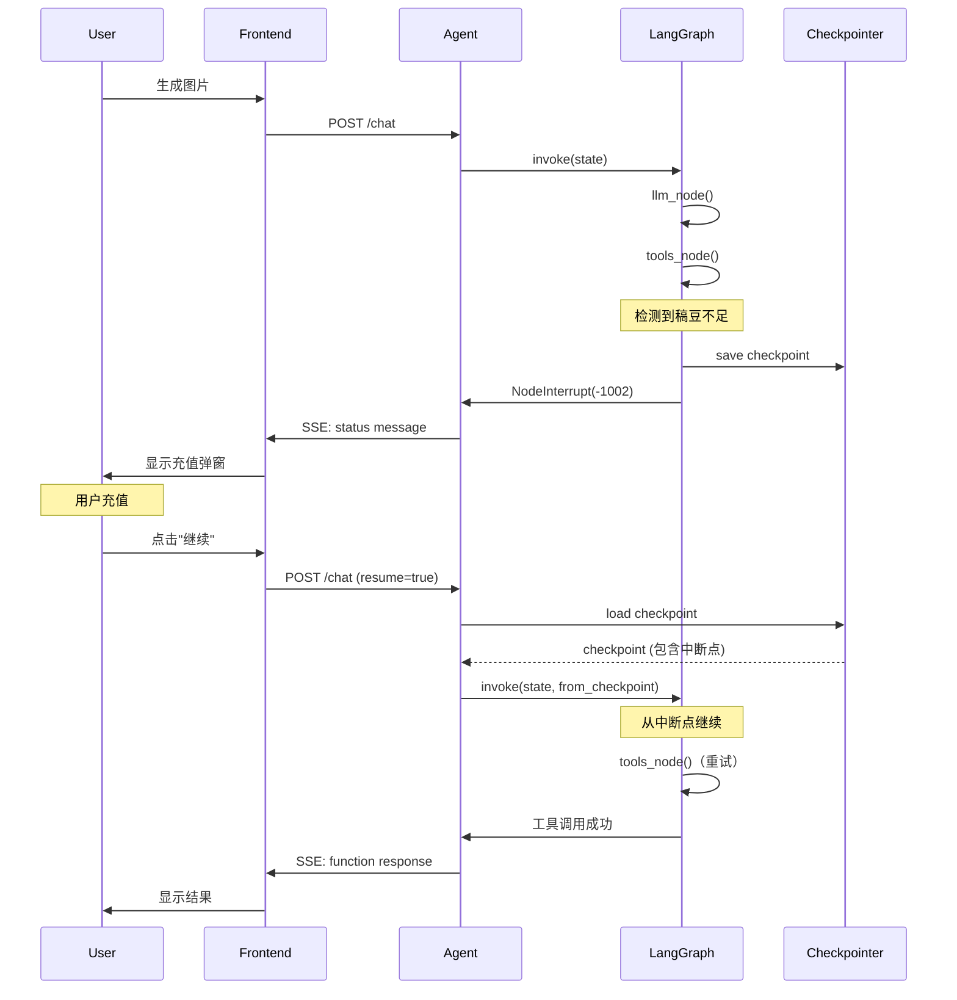

# 工作流编排深入原理

> **LangGraph 与状态管理的本质**

---

## 一、为什么需要工作流编排？

### 1.1 从简单到复杂

**简单场景**：单次工具调用

```
用户：北京天气怎么样？
  ↓
LLM：调用 get_weather("北京")
  ↓
工具：返回天气数据
  ↓
LLM：整合结果并回复
```

这可以用简单的代码实现：

```python
async def simple_agent(user_input):
    # 1. 调用 LLM
    response = await llm.complete(user_input)
    
    # 2. 解析工具调用
    tool_call = parse_tool_call(response)
    
    # 3. 执行工具
    tool_result = await execute_tool(tool_call)
    
    # 4. 让 LLM 整合结果
    final_response = await llm.complete(
        messages=[
            user_input,
            response,
            tool_result
        ]
    )
    
    return final_response
```

**复杂场景**：多轮对话 + 多次工具调用 + 中断恢复

```
用户：帮我设计一套品牌视觉
  ↓
LLM：我需要先了解你的品牌定位...
用户：我是一个牙膏品牌，主打健康
  ↓
LLM：调用 generate_logo("牙膏品牌logo")
  ↓
[稿豆不足，中断]
  ↓
[用户充值]
  ↓
用户：继续
  ↓
[从中断点恢复]
  ↓
工具：返回 logo 图片
  ↓
LLM：调用 generate_color_scheme("牙膏品牌配色")
  ↓
工具：返回配色方案
  ↓
LLM：调用 generate_poster("品牌海报", logo, colors)
  ↓
工具：返回海报
  ↓
LLM：整合所有结果并展示
```

**挑战**：
1. **状态管理**：如何记录当前执行到哪一步？
2. **中断恢复**：如何从中断点继续？
3. **错误处理**：如何处理工具调用失败？
4. **循环控制**：如何防止无限循环？

### 1.2 LangGraph 的价值

> 💡 **核心洞察**  
> LangGraph 的本质是：**一个有状态的、可中断恢复的、基于图的工作流编排引擎**。

**类比**：
- **简单 Agent**：像一个函数调用
- **LangGraph**：像一个状态机 + 任务调度器

---

## 二、LangGraph 核心概念

### 2.1 图 (Graph)

**图 = 节点 (Nodes) + 边 (Edges)**

```python
from langgraph.graph import StateGraph

# 创建图
graph = StateGraph(AgentState)

# 添加节点
graph.add_node("llm", llm_node)
graph.add_node("tools", tools_node)
graph.add_node("should_continue", should_continue_node)

# 添加边
graph.add_edge("llm", "should_continue")
graph.add_conditional_edges(
    "should_continue",
    route_function,
    {
        "continue": "tools",
        "end": END
    }
)
graph.add_edge("tools", "llm")

# 编译
app = graph.compile(checkpointer=checkpointer)
```

**图结构**：



### 2.2 状态 (State)

**状态是图中所有节点共享的数据**。

```python
from typing import TypedDict, Annotated, Sequence
from langgraph.graph import add_messages

class AgentState(TypedDict):
    """Agent 状态"""
    
    # 消息列表（自动合并）
    messages: Annotated[Sequence[dict], add_messages]
    
    # LLM 调用次数
    llm_calls: int
    
    # 工具调用次数
    tool_calls: int
    
    # 是否需要恢复
    needs_resume: bool
    
    # 用户信息
    user_id: str
    thread_id: str
```

**关键特性**：

1. **TypedDict**：类型安全
2. **Annotated[..., add_messages]**：自动合并消息
3. **共享**：所有节点都可以读写状态

### 2.3 节点 (Node)

**节点是一个函数，输入状态，输出状态更新**。

```python
async def llm_node(state: AgentState) -> dict:
    """LLM 节点"""
    
    # 1. 读取状态
    messages = state["messages"]
    llm_calls = state.get("llm_calls", 0)
    
    # 2. 检查调用次数
    if llm_calls >= MAX_LLM_CALLS:
        raise NodeInterrupt(
            code=-1003,
            message="LLM 调用次数超限"
        )
    
    # 3. 调用 LLM
    response = await llm.complete(messages)
    
    # 4. 返回状态更新
    return {
        "messages": [response],  # 会被自动追加到 messages
        "llm_calls": llm_calls + 1
    }
```

**节点类型**：

| 类型 | 作用 | 示例 |
|------|------|------|
| **Action Node** | 执行操作 | `llm_node`, `tools_node` |
| **Decision Node** | 条件判断 | `should_continue_node` |
| **Start Node** | 入口 | 自动生成 |
| **End Node** | 出口 | `END` |

### 2.4 边 (Edge)

**边定义节点之间的连接**。

**普通边**：

```python
# A -> B
graph.add_edge("node_a", "node_b")
```

**条件边**：

```python
def route_function(state: AgentState) -> str:
    """路由函数"""
    messages = state["messages"]
    last_message = messages[-1]
    
    # 检查是否有工具调用
    if has_tool_call(last_message):
        return "continue"
    else:
        return "end"

# 根据条件选择下一个节点
graph.add_conditional_edges(
    "should_continue",
    route_function,
    {
        "continue": "tools",
        "end": END
    }
)
```

---

## 三、Checkpoint 机制（核心）

### 3.1 什么是 Checkpoint？

> 💡 **核心洞察**  
> Checkpoint 是**图执行过程中的状态快照**，用于中断恢复。

**类比**：
- **视频游戏的存档点**：随时可以从存档点恢复
- **数据库的事务日志**：可以回滚到任意时间点

**Checkpoint 包含**：
1. **当前状态**：所有 state 字段的值
2. **执行位置**：当前在哪个节点
3. **元数据**：thread_id, checkpoint_id, parent_checkpoint_id

### 3.2 Checkpoint 的存储

**数据结构**：

```python
@dataclass
class Checkpoint:
    """Checkpoint 数据结构"""
    
    # Checkpoint ID
    checkpoint_id: str
    
    # 父 Checkpoint ID（用于构建执行链）
    parent_checkpoint_id: Optional[str]
    
    # Thread ID
    thread_id: str
    
    # 当前节点
    current_node: str
    
    # 状态快照
    state: dict
    
    # 创建时间
    created_at: datetime
```

**存储方案**：

| 方案 | 优点 | 缺点 | 适用场景 |
|------|------|------|----------|
| **内存** | 快速 | 不持久化 | 开发测试 |
| **Redis** | 快速 + 持久化 | 需要单独部署 | 生产环境（短期） |
| **PostgreSQL** | 持久化 + 可查询 | 相对慢 | 生产环境（长期） |

### 3.3 Checkpoint 的序列化

**挑战**：状态中可能包含不可序列化的对象

```python
state = {
    "messages": [...],
    "user_id": "user_123",
    "llm_client": <LLMClient object>,  # ❌ 不可序列化
    "callback": lambda x: x + 1,       # ❌ 不可序列化
}
```

**解决方案**：JsonPlusSerializer

从现有文档可以看到，系统使用 `JsonPlusSerializer`：

```python
from langgraph.checkpoint.base import Serializer, SerializerProtocol

class JsonPlusSerializer(Serializer):
    """
    支持更多类型的 JSON 序列化器
    """
    
    def dumps(self, obj: Any) -> bytes:
        """序列化对象"""
        return json.dumps(
            obj,
            default=self._default_handler,
            ensure_ascii=False
        ).encode('utf-8')
    
    def loads(self, data: bytes) -> Any:
        """反序列化对象"""
        return json.loads(data.decode('utf-8'))
    
    def _default_handler(self, obj: Any) -> Any:
        """处理不可序列化的对象"""
        
        # 1. datetime
        if isinstance(obj, datetime):
            return {
                "__type__": "datetime",
                "value": obj.isoformat()
            }
        
        # 2. UUID
        if isinstance(obj, uuid.UUID):
            return {
                "__type__": "uuid",
                "value": str(obj)
            }
        
        # 3. Pydantic 模型
        if hasattr(obj, 'model_dump'):
            return {
                "__type__": "pydantic",
                "class": obj.__class__.__name__,
                "value": obj.model_dump()
            }
        
        # 4. 不支持的类型：跳过
        return {
            "__type__": "unsupported",
            "class": obj.__class__.__name__
        }
```

### 3.4 自定义 Checkpointer

```python
from langgraph.checkpoint.base import BaseCheckpointSaver

class RedisCheckpointer(BaseCheckpointSaver):
    """基于 Redis 的 Checkpointer"""
    
    def __init__(self, redis_client, serializer=None):
        self.redis = redis_client
        self.serializer = serializer or JsonPlusSerializer()
    
    def put(
        self,
        config: dict,
        checkpoint: Checkpoint,
        metadata: dict
    ) -> dict:
        """保存 Checkpoint"""
        
        # 1. 生成 checkpoint_id
        checkpoint_id = str(uuid.uuid4())
        
        # 2. 序列化
        data = self.serializer.dumps({
            "checkpoint": checkpoint,
            "metadata": metadata
        })
        
        # 3. 存储到 Redis
        key = f"checkpoint:{config['thread_id']}:{checkpoint_id}"
        self.redis.set(key, data, ex=3600 * 24 * 7)  # 7天过期
        
        # 4. 更新最新 checkpoint 指针
        latest_key = f"checkpoint:{config['thread_id']}:latest"
        self.redis.set(latest_key, checkpoint_id, ex=3600 * 24 * 7)
        
        return {"checkpoint_id": checkpoint_id}
    
    def get(
        self,
        config: dict,
        checkpoint_id: Optional[str] = None
    ) -> Optional[Checkpoint]:
        """获取 Checkpoint"""
        
        # 1. 如果没有指定 checkpoint_id，获取最新的
        if checkpoint_id is None:
            latest_key = f"checkpoint:{config['thread_id']}:latest"
            checkpoint_id = self.redis.get(latest_key)
            
            if checkpoint_id is None:
                return None
            
            checkpoint_id = checkpoint_id.decode('utf-8')
        
        # 2. 获取 checkpoint 数据
        key = f"checkpoint:{config['thread_id']}:{checkpoint_id}"
        data = self.redis.get(key)
        
        if data is None:
            return None
        
        # 3. 反序列化
        checkpoint_data = self.serializer.loads(data)
        
        return checkpoint_data["checkpoint"]
```

---

## 四、中断与恢复机制

### 4.1 两种中断方式

#### 方式 1：NodeInterrupt（节点级中断）

**原理**：在节点内抛出 `NodeInterrupt` 异常

```python
from langgraph.errors import NodeInterrupt

async def tools_node(state: AgentState) -> dict:
    """工具节点"""
    
    messages = state["messages"]
    last_message = messages[-1]
    tool_calls = extract_tool_calls(last_message)
    
    results = []
    for tool_call in tool_calls:
        # 执行工具
        result = await execute_tool(tool_call, state)
        
        # 检查是否稿豆不足
        if result.get("error") == "insufficient_points":
            # 抛出中断异常
            raise NodeInterrupt(
                code=-1002,
                message="稿豆不足",
                extra={
                    "last_tool_message_id": tool_call['id']
                }
            )
        
        results.append(result)
    
    return {"messages": results}
```

**LangGraph 的处理**：

```python
# LangGraph 内部逻辑（简化）
try:
    # 执行节点
    result = await node_function(state)
    
    # 更新状态
    state.update(result)
    
    # 保存 Checkpoint
    checkpointer.put(config, state)
    
except NodeInterrupt as e:
    # 1. 保存当前 Checkpoint（包含中断信息）
    state["__interrupt__"] = {
        "code": e.code,
        "message": e.message,
        "extra": e.extra
    }
    checkpointer.put(config, state)
    
    # 2. 发送状态消息给前端
    send_status_message(e.code, e.message, e.extra)
    
    # 3. 停止执行
    return
```

#### 方式 2：状态标记（工具级中断）

**原理**：在状态中设置标记，由下一个节点检测

```python
async def tools_node(state: AgentState) -> dict:
    """工具节点"""
    
    # ... 执行工具 ...
    
    if result.get("error") == "insufficient_points":
        # 不抛异常，而是设置状态标记
        return {
            "messages": [{
                "role": "status",
                "content": {
                    "code": -1002,
                    "message": "稿豆不足"
                }
            }],
            "needs_resume": True
        }
    
    return {"messages": [result]}


async def should_continue_node(state: AgentState) -> str:
    """判断是否继续"""
    
    # 检查是否需要恢复
    if state.get("needs_resume"):
        return "interrupt"
    
    # 检查是否还有工具调用
    last_message = state["messages"][-1]
    if has_tool_call(last_message):
        return "continue"
    
    return "end"
```

### 4.2 恢复执行

**前端发送恢复消息**：

```python
POST /api/agent/chat
{
  "thread_id": "thread_123",
  "message": null,  # 不需要新消息
  "resume": true    # 标记为恢复请求
}
```

**后端处理恢复**：

```python
async def handle_resume(thread_id: str):
    """处理恢复请求"""
    
    # 1. 加载最新的 Checkpoint
    config = {"thread_id": thread_id}
    checkpoint = checkpointer.get(config)
    
    if checkpoint is None:
        raise ValueError("No checkpoint found")
    
    # 2. 恢复状态
    state = checkpoint.state
    
    # 3. 检查中断类型
    if "__interrupt__" in state:
        # 节点级中断：从中断点重新执行
        interrupt_info = state.pop("__interrupt__")
        
        # 添加恢复消息
        state["messages"].append({
            "role": "status",
            "content": {
                "code": -2001,
                "message": "恢复执行"
            }
        })
    
    elif state.get("needs_resume"):
        # 工具级中断：清除标记
        state["needs_resume"] = False
        
        # 添加恢复消息
        state["messages"].append({
            "role": "status",
            "content": {
                "code": -2001,
                "message": "恢复执行"
            }
        })
    
    # 4. 继续执行图
    result = await app.ainvoke(
        state,
        config=config
    )
    
    return result
```

### 4.3 恢复流程图



---

## 五、完整的 Agent 实现

### 5.1 定义状态

```python
from typing import TypedDict, Annotated, Sequence
from langgraph.graph import add_messages

class AgentState(TypedDict):
    """Agent 状态"""
    
    # 消息历史
    messages: Annotated[Sequence[dict], add_messages]
    
    # 计数器
    llm_calls: int
    tool_calls: int
    
    # 上下文信息
    user_id: str
    thread_id: str
    input_skill_id: Optional[int]
    
    # 中断恢复
    needs_resume: bool
```

### 5.2 实现节点

```python
async def llm_node(state: AgentState) -> dict:
    """LLM 节点"""
    
    # 1. 检查调用次数
    llm_calls = state.get("llm_calls", 0)
    if llm_calls >= MAX_LLM_CALLS:
        raise NodeInterrupt(
            code=-1003,
            message="LLM 调用次数超限"
        )
    
    # 2. 构造 System Prompt
    tools = get_available_tools(state.get("input_skill_id"))
    system_prompt = build_system_prompt(tools)
    
    # 3. 调用 LLM
    messages = state["messages"]
    response = await llm.complete(
        messages=[
            {"role": "system", "content": system_prompt},
            *messages
        ],
        stream=True
    )
    
    # 4. 流式返回 + 收集完整响应
    full_response = ""
    async for chunk in response:
        full_response += chunk
        yield {
            "type": "chunk",
            "content": chunk
        }
    
    # 5. 返回状态更新
    return {
        "messages": [{
            "role": "assistant",
            "content": {"type": "plain", "text": full_response}
        }],
        "llm_calls": llm_calls + 1
    }


async def tools_node(state: AgentState) -> dict:
    """工具节点"""
    
    # 1. 提取工具调用
    messages = state["messages"]
    last_message = messages[-1]
    tool_calls = extract_tool_calls(last_message)
    
    if not tool_calls:
        return {}
    
    # 2. 执行工具
    tool_calls_count = state.get("tool_calls", 0)
    results = []
    
    for tool_call in tool_calls:
        # 检查调用次数
        if tool_calls_count >= MAX_TOOL_CALLS:
            raise NodeInterrupt(
                code=-1003,
                message="工具调用次数超限"
            )
        
        # 执行工具
        result = await execute_tool(
            tool_call,
            context={
                "user_id": state["user_id"],
                "thread_id": state["thread_id"]
            }
        )
        
        # 检查稿豆不足
        if result.get("error") == "insufficient_points":
            raise NodeInterrupt(
                code=-1002,
                message="稿豆不足",
                extra={
                    "last_tool_message_id": tool_call.get("id")
                }
            )
        
        results.append({
            "role": "function",
            "content": {
                "type": "function_response",
                "text": result
            },
            "extra": {
                "deduct_points": result.get("deduct_points", 0)
            }
        })
        
        tool_calls_count += 1
    
    # 3. 返回状态更新
    return {
        "messages": results,
        "tool_calls": tool_calls_count
    }


def should_continue(state: AgentState) -> str:
    """判断是否继续"""
    
    # 检查恢复标记
    if state.get("needs_resume"):
        return "interrupt"
    
    # 检查最后一条消息
    messages = state["messages"]
    if not messages:
        return "end"
    
    last_message = messages[-1]
    
    # 如果是 assistant 消息且包含工具调用
    if (last_message["role"] == "assistant" and
        has_tool_call(last_message)):
        return "continue"
    
    # 否则结束
    return "end"
```

### 5.3 构建图

```python
from langgraph.graph import StateGraph, END

def create_agent_graph(checkpointer):
    """创建 Agent 图"""
    
    # 1. 创建图
    graph = StateGraph(AgentState)
    
    # 2. 添加节点
    graph.add_node("llm", llm_node)
    graph.add_node("tools", tools_node)
    
    # 3. 设置入口
    graph.set_entry_point("llm")
    
    # 4. 添加条件边
    graph.add_conditional_edges(
        "llm",
        should_continue,
        {
            "continue": "tools",
            "end": END,
            "interrupt": END
        }
    )
    
    # 5. tools -> llm
    graph.add_edge("tools", "llm")
    
    # 6. 编译
    app = graph.compile(checkpointer=checkpointer)
    
    return app
```

### 5.4 使用 Agent

```python
# 初始化
checkpointer = RedisCheckpointer(redis_client)
app = create_agent_graph(checkpointer)

# 首次调用
async def chat(user_input: str, thread_id: str, user_id: str):
    """发送消息"""
    
    # 1. 构造初始状态
    state = {
        "messages": [{
            "role": "user",
            "content": {"type": "plain", "text": user_input}
        }],
        "llm_calls": 0,
        "tool_calls": 0,
        "user_id": user_id,
        "thread_id": thread_id,
        "needs_resume": False
    }
    
    # 2. 配置
    config = {
        "thread_id": thread_id,
        "recursion_limit": 20
    }
    
    # 3. 执行
    try:
        async for event in app.astream(state, config=config):
            # 流式返回结果
            yield event
    
    except NodeInterrupt as e:
        # 中断：发送状态消息
        yield {
            "type": "status",
            "content": {
                "code": e.code,
                "message": e.message,
                "extra": e.extra
            }
        }


# 恢复调用
async def resume(thread_id: str):
    """恢复执行"""
    
    # 1. 加载 Checkpoint
    config = {"thread_id": thread_id}
    checkpoint = checkpointer.get(config)
    
    # 2. 更新状态
    state = checkpoint.state
    state["needs_resume"] = False
    state["messages"].append({
        "role": "status",
        "content": {
            "code": -2001,
            "message": "恢复执行"
        }
    })
    
    # 3. 继续执行
    async for event in app.astream(state, config=config):
        yield event
```

---

## 六、最佳实践

### 6.1 状态设计

**DO：**
- ✅ 使用 TypedDict 定义状态类型
- ✅ 使用 `add_messages` 自动合并消息
- ✅ 只存储可序列化的数据
- ✅ 将大对象（如 LLM client）放在全局

**DON'T：**
- ❌ 在状态中存储连接对象
- ❌ 在状态中存储 lambda 函数
- ❌ 状态字段过多（影响序列化性能）

### 6.2 节点设计

**DO：**
- ✅ 节点应该是纯函数（输入状态，输出状态更新）
- ✅ 使用 `NodeInterrupt` 中断执行
- ✅ 记录节点执行日志
- ✅ 处理异常并返回错误状态

**DON'T：**
- ❌ 在节点中修改全局变量
- ❌ 在节点中直接操作数据库（应该通过工具）
- ❌ 节点之间有隐式依赖

### 6.3 Checkpoint 管理

**DO：**
- ✅ 定期清理过期 Checkpoint
- ✅ 使用合适的存储方案（开发用内存，生产用 Redis/PostgreSQL）
- ✅ 监控 Checkpoint 大小
- ✅ 设置过期时间

**DON'T：**
- ❌ 在 Checkpoint 中存储敏感信息（如密码）
- ❌ 无限制保存 Checkpoint
- ❌ 在节点间传递大文件

---

## 七、总结

### 7.1 核心概念

1. **LangGraph** 是有状态的工作流编排引擎
2. **Checkpoint** 是状态快照，用于中断恢复
3. **NodeInterrupt** 用于节点级中断
4. **状态标记** 用于工具级中断

### 7.2 关键实现

- ✅ StateGraph：定义图结构
- ✅ Checkpointer：保存和加载状态
- ✅ JsonPlusSerializer：序列化状态
- ✅ 中断与恢复：支持暂停和继续

### 7.3 下一步

- **[网络架构](05-网络架构.md)**：了解系统的网络设计
- **[中断与恢复](06-中断与恢复.md)**：深入学习中断恢复机制

---

*文档版本：v1.0*  
*最后更新：2026-01-26*

**上一篇**：[← 工具调用](03-工具调用.md) | **下一篇**：[网络架构 →](05-网络架构.md)
