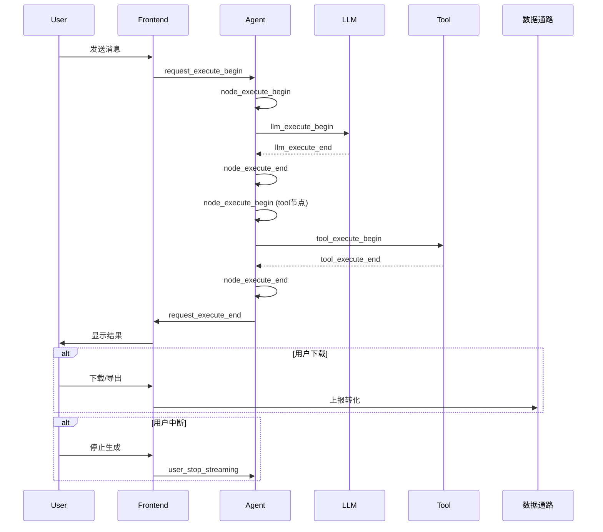
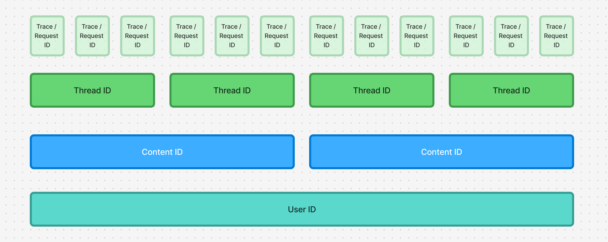

# Agent 链路追踪与监控

## 一、概述

本文档介绍 Agent 系统的可观测性方案，包括链路追踪、日志采集、监控指标和告警规则，支撑系统的稳定运行和成本管控。

> 📋 **需求背景**  
> 需求稿：Agent2.0 建立链路追踪、可观测以及成本管控等非功能特性

---

## 二、一条 Message 的生命周期

### 2.1 生命周期 Checkpoints

| Checkpoint | 定义 | 支撑判断 | 所属模块 |
|-----------|------|---------|----------|
| **请求接收** | `request_execute_begin` | 会话数、新会话数、请求数、首次任务完成率、技能使用率、模式使用率 | Gaoding-AI-Agent |
| **节点执行** | `node_execute_begin` / `node_execute_end` | 节点执行成功率、节点执行耗时 | Gaoding-AI-Agent |
| **LLM 调用** | `llm_execute_begin` / `llm_execute_end` | 模型 token 消耗、模型响应耗时 | Gaoding-AI-Agent |
| **工具调用** | `tool_execute_begin` / `tool_execute_end` | 工具调用成功率、工具调用耗时 | Gaoding-AI-Agent, gdesign-tool |
| **请求完成** | `request_execute_end` | 请求处理时长 | Gaoding-AI-Agent |
| **用户下载/导出** | *复用数据通路上报* | 采纳率 / 转化漏斗 | 前端 |
| **用户中断** | `user_stop_streaming` | 任务未完成率（生成中主动退出） | 前端 |

### 2.2 生命周期流程图



---

## 三、Checkpoint 详细定义

### 3.1 请求开始 (request_execute_begin)

**时机**：Agent 收到用户请求，开始处理

**字段：**
| 字段 | 类型 | 说明 |
|------|------|------|
| `text` | string | 用户指令 |
| `is_new` | boolean | 是否是新会话 |
| `input_skill_id` | int | 用户选择的技能 ID |
| `mode` | string | 模式：普通 / 高级 |
| `attachments` | array | 附件列表 |

**示例：**
```json
{
  "event": "request_execute_begin",
  "trace_id": "trace_123",
  "thread_id": "thread_abc",
  "user_id": "user_456",
  "data": {
    "text": "帮我生成一张牙膏产品图",
    "is_new": true,
    "input_skill_id": 2,
    "mode": "normal",
    "attachments": []
  },
  "timestamp": "2025-07-08T12:00:00Z"
}
```

### 3.2 节点执行 (node_execute_begin / node_execute_end)

**时机**：Agent 工作流节点执行前后

**开始字段：**
| 字段 | 类型 | 说明 |
|------|------|------|
| `graph_name` | string | 工作流名称 |
| `node_name` | string | 节点名称 |

**结束字段：**
| 字段 | 类型 | 说明 |
|------|------|------|
| `graph_name` | string | 工作流名称 |
| `node_name` | string | 节点名称 |
| `duration_ms` | int | 执行耗时（毫秒） |
| `status` | string | 成功 / 失败 |
| `error` | string | 错误信息（如果失败） |

**示例：**
```json
{
  "event": "node_execute_begin",
  "trace_id": "trace_123",
  "data": {
    "graph_name": "image_generation_workflow",
    "node_name": "generate_prompt"
  },
  "timestamp": "2025-07-08T12:00:01Z"
}
```

### 3.3 LLM 调用 (llm_execute_begin / llm_execute_end)

**时机**：Agent 调用模型前后

**开始字段：**
| 字段 | 类型 | 说明 |
|------|------|------|
| `model_name` | string | 使用的模型名 |
| `original_messages` | array | 原始的 messages（仅非 prod 环境） |
| `llm_messages` | array | 面向 LLM 的消息（仅非 prod 环境） |

**结束字段：**
| 字段 | 类型 | 说明 |
|------|------|------|
| `llm_calls_num` | int | 迭代次数 |
| `prompt_tokens` | int | 输入 tokens |
| `completion_tokens` | int | 输出 tokens |
| `reasoning_tokens` | int | 思考 tokens（reasoning 模型） |
| `cached_tokens` | int | 命中缓存的 tokens 数量 |
| `text_tokens` | int | 命中缓存的 text tokens 数量 |
| `messages` | array | 响应的 messages（仅非 prod 环境） |

**示例：**
```json
{
  "event": "llm_execute_end",
  "trace_id": "trace_123",
  "data": {
    "llm_calls_num": 1,
    "prompt_tokens": 150,
    "completion_tokens": 80,
    "reasoning_tokens": 0,
    "cached_tokens": 50,
    "text_tokens": 45
  },
  "timestamp": "2025-07-08T12:00:03Z"
}
```

### 3.4 工具调用 (tool_execute_begin / tool_execute_end)

**时机**：Agent 或 gdesign-tool 执行工具前后

**开始字段（Agent）：**
| 字段 | 类型 | 说明 |
|------|------|------|
| `tool_call_id` | string | 工具调用 ID（Agent 本地识别） |
| `func_name` | string | 工具名称 |
| `params` | object | 调用参数 |

**结束字段（Agent）：**
| 字段 | 类型 | 说明 |
|------|------|------|
| `tool_call_id` | string | 工具调用 ID |
| `result` | string | 调用结果："success" / "failed" |
| `task_id` | string | gdesign-tool 生成的任务 ID |
| `deduct_points` | int | 扣除的稿豆数 |
| `exception_message` | string | 异常信息 |

**结束字段（gdesign-tool）：**
| 字段 | 类型 | 说明 |
|------|------|------|
| `trace_id` | string | 请求 ID |
| `result` | string | "success" / "failed" |
| `task_id` | string | 任务 ID |
| `scene_code` | string | 对应轻舟的场景 code |
| `deduct_points` | int | 扣除的稿豆数 |
| `exception_message` | string | 异常信息 |

**示例：**
```json
{
  "event": "tool_execute_end",
  "trace_id": "trace_123",
  "data": {
    "tool_call_id": "tool_call_001",
    "result": "success",
    "task_id": "task_abc123",
    "deduct_points": 10,
    "exception_message": null
  },
  "timestamp": "2025-07-08T12:00:05Z"
}
```

### 3.5 请求结束 (request_execute_end)

**时机**：Agent 完成用户请求

**字段：**
| 字段 | 类型 | 说明 |
|------|------|------|
| `reason` | string | 结束原因：completed / interrupted / error |

**示例：**
```json
{
  "event": "request_execute_end",
  "trace_id": "trace_123",
  "data": {
    "reason": "completed"
  },
  "timestamp": "2025-07-08T12:00:10Z"
}
```

### 3.6 用户中断 (user_stop_streaming)

**时机**：用户主动中断输出

**字段：**
| 字段 | 类型 | 说明 |
|------|------|------|
| `thread_id` | string | 会话 ID |
| `user_id` | string | 用户 ID |
| `message_id` | string | 消息 ID |

**示例：**
```json
{
  "event": "user_stop_streaming",
  "data": {
    "thread_id": "thread_abc",
    "user_id": "user_456",
    "message_id": "msg_789"
  },
  "timestamp": "2025-07-08T12:00:08Z"
}
```

---

## 四、ID 关系与透传

### 4.1 ID 体系



| ID 类型 | 生成者 | 作用域 | 说明 |
|---------|--------|--------|------|
| `trace_id` | Agent / Frontend | 单次请求 | 追踪完整请求链路 |
| `thread_id` | Agent | 会话 | 标识一个对话会话 |
| `message_id` | Agent | 会话内 | 标识单条消息 |
| `tool_call_id` | Agent | 单次工具调用 | 标识工具调用 |
| `task_id` | gdesign-tool | 工具执行 | 标识具体任务 |

### 4.2 公共上报字段

**Gaoding-AI-Agent：**
- `trace_id`：请求 ID
- `thread_id`：会话 ID
- `user_id`：用户 ID

**gdesign-tool：**
- `trace_id`：请求 ID
- `func_name`：工具名称（复用索引）

### 4.3 task_id 和 deduct_points 透传

由于 response body 为 json-rpc 格式，不方便透传，**放到 response header 里**：

```python
# gdesign-tool 响应
response.headers['X-Task-ID'] = task_id
response.headers['X-Deduct-Points'] = str(deduct_points)

# Agent 解析
task_id = response.headers.get('X-Task-ID')
deduct_points = int(response.headers.get('X-Deduct-Points', 0))
```

---

## 五、监控指标

### 5.1 核心指标

| 指标类型 | 指标名 | 计算方式 | 作用 |
|---------|--------|---------|------|
| **请求** | 会话数 | COUNT(DISTINCT thread_id) | 总会话量 |
| **请求** | 新会话数 | COUNT WHERE is_new=true | 新用户活跃度 |
| **请求** | 请求数 | COUNT(trace_id) | 总请求量 |
| **成功率** | 首次任务完成率 | (完成数 / 总请求数) * 100% | 任务完结情况 |
| **成功率** | 工具调用总成功率 | (成功数 / 总调用数) * 100% | 工具整体可用性 |
| **成功率** | 单工具调用成功率 | (该工具成功数 / 该工具调用数) * 100% | 单个工具可用性 |
| **延迟** | 首响应延迟 P99 | P99(首条 Response 时间) | 用户体验 |
| **延迟** | 请求处理时长 P99 | P99(request_execute_end - request_execute_begin) | 整体性能 |
| **延迟** | LLM 响应时长 P99 | P99(llm_execute_end - llm_execute_begin) | LLM 性能 |
| **延迟** | 工具调用时长 P99 | P99(tool_execute_end - tool_execute_begin) | 工具性能 |
| **成本** | Token 消耗 | SUM(prompt_tokens + completion_tokens) | LLM 成本 |
| **成本** | 稿豆消耗 | SUM(deduct_points) | 工具成本 |
| **业务** | 技能使用率 | COUNT BY input_skill_id | 技能热度 |
| **业务** | 模式使用率 | COUNT BY mode | 模式偏好 |
| **业务** | 采纳率 | (下载数 / 完成数) * 100% | 用户满意度 |
| **业务** | 任务未完成率 | (中断数 / 总请求数) * 100% | 用户流失 |

---

## 六、告警规则

### 6.1 告警配置

| 指标名 | 告警规则 | 告警级别 | 下一步 |
|--------|---------|----------|--------|
| **对话请求成功率** | 近 5 分钟 < 50% | P0 | 会话异常结束原因分析 |
| **工具调用总成功率** | 近 5 分钟 < 50% | P1 | 工具调用失败原因分析、工具 QPS 检查 |
| **单工具调用成功率** | 近 5 分钟 < 50% | P1 | 单工具故障分析 |
| **首响应延迟** | 近 5 分钟 P99 > 10s 且占比 > 20% | P1 | 系统扩容 / Graph 优化 / 选择更快的 LLM |
| **标题生成成功率** | 近 5 分钟 < 50% | P2 | gdesign-tool 调用 Dify 链路分析、Dify workflow 错误分析 |
| **Auth Key 刷新成功率** | 近 10 分钟均失败 | P0 | FileMS 是否正常、Redis 是否正常 |

### 6.2 告警分级

| 级别 | 响应时间 | 影响范围 |
|------|---------|----------|
| **P0** | 5 分钟 | 核心功能不可用 |
| **P1** | 15 分钟 | 重要功能受影响 |
| **P2** | 30 分钟 | 次要功能异常 |

---

## 七、日志采集

### 7.1 日志格式

```json
{
  "timestamp": "2025-07-08T12:00:00Z",
  "level": "INFO",
  "event": "request_execute_begin",
  "trace_id": "trace_123",
  "thread_id": "thread_abc",
  "user_id": "user_456",
  "module": "Gaoding-AI-Agent",
  "data": {
    "text": "帮我生成一张牙膏产品图",
    "is_new": true
  }
}
```

### 7.2 日志级别

| 级别 | 用途 |
|------|------|
| **DEBUG** | 调试信息（仅开发环境） |
| **INFO** | 正常流程日志 |
| **WARNING** | 警告信息（降级、重试） |
| **ERROR** | 错误信息 |
| **CRITICAL** | 严重错误 |

### 7.3 敏感信息处理

**脱敏规则：**
- `original_messages` / `llm_messages`：仅在非 prod 环境上报
- 用户输入：不记录敏感词
- API Key：永不记录

---

## 八、实现示例

### 8.1 日志记录

```python
import logging
import json
from datetime import datetime

def log_checkpoint(event, trace_id, thread_id, user_id, data):
    """记录 checkpoint 日志"""
    log_entry = {
        "timestamp": datetime.utcnow().isoformat() + "Z",
        "level": "INFO",
        "event": event,
        "trace_id": trace_id,
        "thread_id": thread_id,
        "user_id": user_id,
        "module": "Gaoding-AI-Agent",
        "data": data
    }
    logging.info(json.dumps(log_entry))

# 使用示例
log_checkpoint(
    event="request_execute_begin",
    trace_id="trace_123",
    thread_id="thread_abc",
    user_id="user_456",
    data={
        "text": "帮我生成一张牙膏产品图",
        "is_new": True,
        "input_skill_id": 2
    }
)
```

### 8.2 指标上报

```python
from prometheus_client import Counter, Histogram, Gauge

# 定义指标
request_total = Counter(
    'agent_request_total', 
    'Total number of requests',
    ['status', 'skill_id']
)

request_duration = Histogram(
    'agent_request_duration_seconds',
    'Request duration in seconds'
)

llm_tokens = Counter(
    'agent_llm_tokens_total',
    'Total LLM tokens consumed',
    ['token_type', 'model']
)

# 使用示例
request_total.labels(status='success', skill_id='2').inc()
request_duration.observe(5.2)
llm_tokens.labels(token_type='prompt', model='doubao').inc(150)
```

---

## 九、数据分析

### 9.1 关键查询

**会话统计：**
```sql
SELECT 
    DATE(timestamp) as date,
    COUNT(DISTINCT thread_id) as total_threads,
    COUNT(DISTINCT CASE WHEN is_new THEN thread_id END) as new_threads
FROM agent_logs
WHERE event = 'request_execute_begin'
GROUP BY date
ORDER BY date DESC;
```

**成功率分析：**
```sql
SELECT 
    func_name,
    COUNT(*) as total_calls,
    SUM(CASE WHEN result = 'success' THEN 1 ELSE 0 END) as success_calls,
    ROUND(100.0 * SUM(CASE WHEN result = 'success' THEN 1 ELSE 0 END) / COUNT(*), 2) as success_rate
FROM agent_logs
WHERE event = 'tool_execute_end'
GROUP BY func_name
ORDER BY total_calls DESC;
```

**成本分析：**
```sql
SELECT 
    DATE(timestamp) as date,
    SUM(prompt_tokens + completion_tokens) as total_tokens,
    SUM(deduct_points) as total_points
FROM agent_logs
WHERE event IN ('llm_execute_end', 'tool_execute_end')
GROUP BY date
ORDER BY date DESC;
```

---

## 十、总结

### 10.1 核心设计

1. **完整链路追踪**：覆盖请求全生命周期
2. **精细化指标**：支持成本管控和性能优化
3. **分级告警**：快速发现和响应问题
4. **数据驱动**：支撑业务决策

### 10.2 关键能力

- ✅ 链路追踪：trace_id 贯穿全链路
- ✅ 性能监控：延迟、成功率、吞吐量
- ✅ 成本管控：Token 和稿豆消耗
- ✅ 业务洞察：技能使用、用户行为

---

*文档版本：v1.0*  
*最后更新：2025-01-26*
