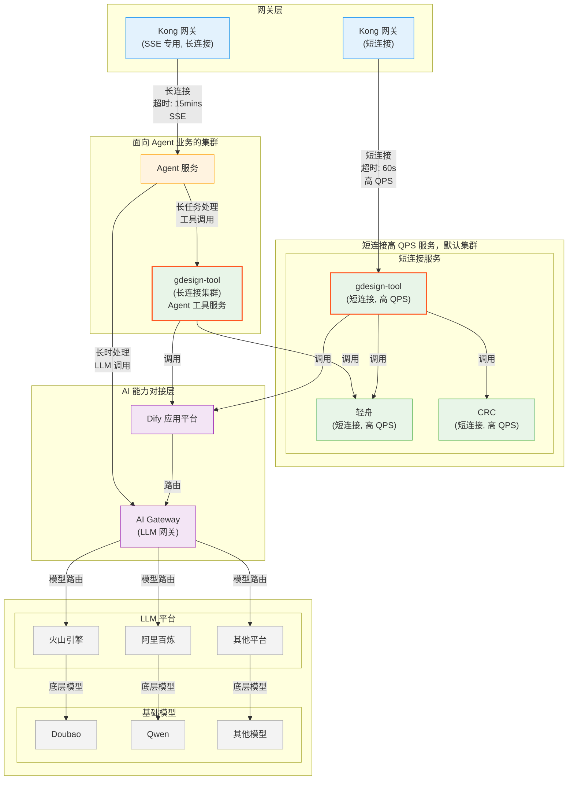
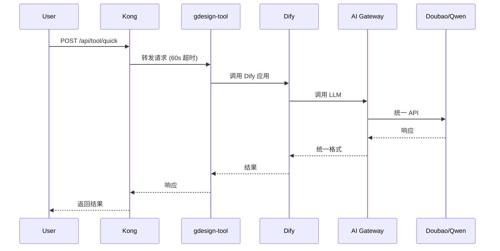
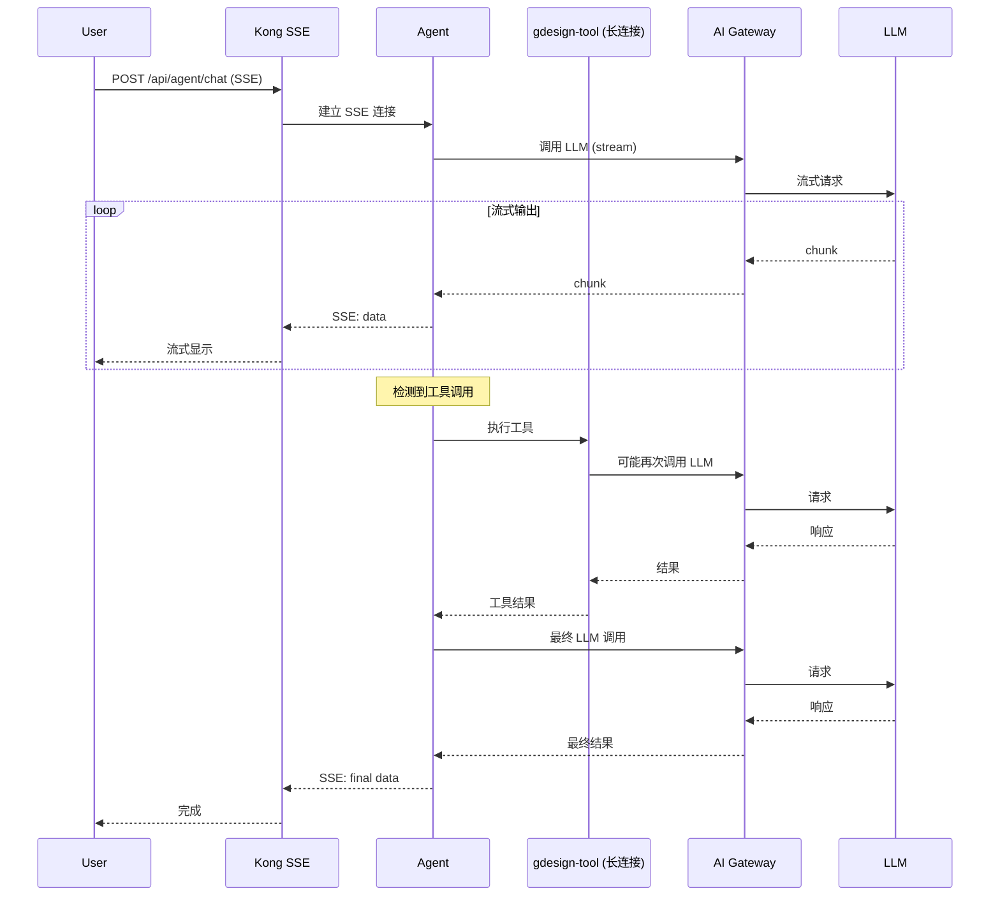

# 网络架构深入原理

> **从系统设计理解分层架构的本质**

---

## 一、为什么需要这样的架构？

### 1.1 从单体到分层

**传统单体架构的问题**：

```
┌──────────────────────────────┐
│  单体 Agent 服务              │
│  - 处理用户请求               │
│  - 调用 LLM                  │
│  - 调用工具                  │
│  - 长连接管理                │
│  - 短连接处理                │
└──────────────────────────────┘
```

**问题**：
1. **资源竞争**：长连接和短连接争抢资源
2. **扩展困难**：无法针对不同场景独立扩容
3. **故障传导**：一个模块故障影响全局
4. **超时冲突**：长短连接需要不同的超时配置

### 1.2 分层架构的设计思想

> 💡 **核心洞察**  
> 分层架构的本质是：**按照职责和特性进行垂直拆分，按照负载特征进行水平隔离**。

**设计原则**：

1. **职责分离**  
   网关、服务、AI 能力、LLM 各司其职

2. **特性隔离**  
   长连接和短连接集群物理隔离

3. **统一接入**  
   AI Gateway 统一 LLM 接入

4. **弹性扩展**  
   每层独立扩缩容

---

## 二、整体架构解析

### 2.1 完整架构图



### 2.2 为什么是四层架构？

**Layer 1: 网关层**
- **职责**：流量入口、路由转发、协议转换
- **价值**：统一入口、安全控制、流量治理

**Layer 2: 服务层**
- **职责**：业务逻辑、状态管理、工具编排
- **价值**：核心业务逻辑、可独立演进

**Layer 3: AI 能力层**
- **职责**：LLM 接入、应用编排、能力封装
- **价值**：抽象 AI 能力、屏蔽平台差异

**Layer 4: LLM 平台层**
- **职责**：提供基础模型能力
- **价值**：多模型支持、成本优化

---

## 三、关键设计决策深度解析

### 3.1 为什么分离短连接和长连接集群？

#### 负载特性对比

| 维度 | 短连接 | 长连接 (SSE) |
|------|--------|-------------|
| **QPS** | 高（1000+） | 低（10-100） |
| **连接时长** | 秒级 | 分钟级（最长15分钟） |
| **资源占用** | 低（快速释放） | 高（长时持有） |
| **并发数** | 高 | 低 |
| **超时配置** | 60s | 15mins |
| **典型场景** | 状态查询、快速工具调用 | 复杂对话、流式生成 |

#### 不分离的问题

**问题 1：连接资源耗尽**

```
假设服务器最大连接数 = 10,000

情况 A（混合部署）：
- 短连接请求：QPS 1000，每个持续 0.1s
- 长连接请求：QPS 10，每个持续 300s（5分钟）
- 长连接占用：10 * 300 = 3,000 连接
- 短连接可用：7,000 连接
- 短连接 QPS 上限：7,000 / 0.1 = 700 QPS ❌

情况 B（集群隔离）：
- 短连接集群：10,000 连接 → 支持 1000 QPS ✅
- 长连接集群：1,000 连接 → 支持 10 QPS ✅
```

**问题 2：CPU/内存资源争抢**

长连接任务通常涉及：
- 多次 LLM 调用
- 多次工具调用
- 复杂的状态管理

这会占用大量 CPU 和内存，影响短连接的快速响应。

#### 隔离的收益

1. **资源隔离**  
   各自独立的资源池，互不影响

2. **独立扩容**  
   根据负载特性独立扩缩容

3. **故障隔离**  
   长连接集群故障不影响短连接

4. **监控独立**  
   不同的监控策略和告警规则

### 3.2 为什么需要两个 Kong 网关？

#### SSE 的特殊性

**Server-Sent Events (SSE)** 是一种特殊的 HTTP 长连接：

```http
HTTP/1.1 200 OK
Content-Type: text/event-stream
Cache-Control: no-cache
Connection: keep-alive

data: {"type": "chunk", "content": "你好"}

data: {"type": "chunk", "content": "，我是"}

data: {"type": "chunk", "content": "AI Agent"}
```

**特点**：
- 单向推送（服务器→客户端）
- 长连接保持
- 流式传输

#### Kong 配置差异

| 配置项 | 短连接网关 | SSE 长连接网关 |
|--------|-----------|---------------|
| `upstream_connect_timeout` | 60s | 900s (15min) |
| `upstream_send_timeout` | 60s | 900s |
| `upstream_read_timeout` | 60s | 900s |
| `client_body_timeout` | 60s | 900s |
| `send_timeout` | 60s | 900s |
| `keepalive_timeout` | 75s | 900s |

**为什么要分离？**

1. **超时配置冲突**  
   短连接和长连接需要完全不同的超时配置

2. **连接池管理**  
   SSE 需要特殊的连接池管理策略

3. **负载均衡策略**  
   长连接需要更稳定的路由策略（避免频繁切换）

4. **监控和告警**  
   不同的监控指标和告警规则

### 3.3 为什么需要 AI Gateway？

#### 问题：直接调用 LLM 平台的痛点

**痛点 1：API 不统一**

```python
# 调用 Doubao
response = doubao_client.complete(
    model="doubao-pro-128k",
    messages=[{"role": "user", "content": "..."}]
)

# 调用 Qwen
response = qwen_client.chat.completions.create(
    model="qwen-turbo",
    messages=[{"role": "user", "content": "..."}]
)

# 调用 OpenAI
response = openai_client.chat.completions.create(
    model="gpt-4",
    messages=[{"role": "user", "content": "..."}]
)
```

每个平台的 API 都不同，需要适配层。

**痛点 2：无法统一管理**

- 无法统一监控
- 无法统一限流
- 无法统一降级

**痛点 3：切换成本高**

更换 LLM 需要改代码。

#### AI Gateway 的价值

```python
# 统一的 API Gateway
response = ai_gateway.complete(
    model="doubao-pro-128k",  # 或 "qwen-turbo", "gpt-4"
    messages=[{"role": "user", "content": "..."}]
)
```

**价值 1：统一接口**

```python
class AIGateway:
    def complete(self, model: str, messages: List[Dict]) -> str:
        # 1. 根据模型名路由到对应平台
        platform = self.get_platform(model)
        
        # 2. 转换请求格式
        platform_request = self.convert_request(messages, platform)
        
        # 3. 调用平台 API
        response = platform.call(platform_request)
        
        # 4. 转换响应格式
        unified_response = self.convert_response(response, platform)
        
        return unified_response
```

**价值 2：统一监控**

```python
# 在 Gateway 层统一埋点
@monitor_llm_call
def complete(self, model: str, messages: List[Dict]) -> str:
    start_time = time.time()
    
    try:
        response = self._call_llm(model, messages)
        
        # 记录成功
        metrics.llm_call_success.inc()
        metrics.llm_call_latency.observe(time.time() - start_time)
        metrics.llm_token_usage.inc(response.usage.total_tokens)
        
        return response
    
    except Exception as e:
        # 记录失败
        metrics.llm_call_failed.inc()
        raise
```

**价值 3：统一限流和降级**

```python
class AIGateway:
    def complete(self, model: str, messages: List[Dict]) -> str:
        # 1. 限流检查
        if not self.rate_limiter.acquire(model):
            raise RateLimitError()
        
        # 2. 尝试调用主模型
        try:
            return self._call_primary(model, messages)
        
        except Exception as e:
            # 3. 降级到备用模型
            logger.warning(f"Primary model {model} failed, fallback")
            return self._call_fallback(model, messages)
```

**价值 4：成本优化**

```python
# 基于成本的模型路由
class CostBasedRouter:
    def select_model(self, task_complexity: str) -> str:
        if task_complexity == "simple":
            return "doubao-lite"  # 便宜
        elif task_complexity == "medium":
            return "qwen-turbo"   # 中等
        else:
            return "doubao-pro"   # 高质量
```

---

## 四、调用链路深度剖析

### 4.1 短连接链路

**完整流程**：

```
用户浏览器
  ↓ [HTTPS]
Kong 短连接网关 (60s 超时)
  ↓ [HTTP]
gdesign-tool (短连接集群)
  ↓
  ├→ 轻舟 (设计工具)
  ├→ CRC (审核服务)
  └→ Dify (AI 应用)
      ↓ [HTTP]
    AI Gateway
      ↓ [HTTP]
    火山引擎 / 阿里百炼
      ↓
    Doubao / Qwen
```

**时序图**：



**关键指标**：
- **P99 延迟**：< 2s
- **QPS**：1000+
- **成功率**：> 99%

### 4.2 长连接链路（SSE）

**完整流程**：

```
用户浏览器
  ↓ [SSE]
Kong SSE 网关 (15min 超时)
  ↓ [SSE]
Agent 服务
  ↓
  ├→ gdesign-tool (长连接集群)
  │   ├→ 轻舟
  │   └→ Dify → AI Gateway → LLM
  │
  └→ AI Gateway → LLM
```

**时序图**：



**关键指标**：
- **P99 延迟**：< 30s（首字时间）
- **QPS**：10-100
- **连接时长**：平均 2-5 分钟，最长 15 分钟
- **成功率**：> 95%

---

## 五、性能与可用性设计

### 5.1 超时策略设计

**超时的本质**：**防止资源被长时间占用**

**多层超时设计**：

```
用户超时 (前端)
  ↓ 60s
Kong 超时 (网关)
  ↓ 50s
gdesign-tool 超时 (服务)
  ↓ 40s
LLM 超时 (AI Gateway)
  ↓ 30s
LLM 平台超时 (底层)
```

**为什么逐层递减？**

确保上层能够感知到下层的超时，而不是自己先超时。

**示例**：

```python
# 错误的超时配置
kong_timeout = 30s
service_timeout = 60s  # ❌ 比网关长

# 正确的超时配置
kong_timeout = 60s
service_timeout = 50s  # ✅ 比网关短
llm_timeout = 40s      # ✅ 比服务短
```

### 5.2 高可用设计

**服务层面**：

```python
# 健康检查
@app.get("/health")
async def health_check():
    # 1. 检查服务自身
    if not self_check():
        raise HTTPException(status_code=503)
    
    # 2. 检查依赖服务
    if not check_dependencies():
        raise HTTPException(status_code=503)
    
    return {"status": "healthy"}

# 自动重启
# 在 K8s 中配置 livenessProbe 和 readinessProbe
livenessProbe:
  httpGet:
    path: /health
    port: 8080
  initialDelaySeconds: 30
  periodSeconds: 10
```

**网关层面**：

```nginx
# Kong 熔断配置
upstream agent_service {
    server agent-1:8000 max_fails=3 fail_timeout=30s;
    server agent-2:8000 max_fails=3 fail_timeout=30s;
    server agent-3:8000 max_fails=3 fail_timeout=30s;
    keepalive 100;
}
```

**LLM 层面**：

```python
class AIGateway:
    def complete(self, model: str, messages: List[Dict]) -> str:
        # 1. 尝试主模型
        try:
            return self._call_llm(model, messages)
        
        except RateLimitError:
            # 2. 降级到备用模型
            logger.warning(f"Model {model} rate limited, fallback")
            fallback_model = self.get_fallback_model(model)
            return self._call_llm(fallback_model, messages)
        
        except Exception as e:
            # 3. 最后的兜底
            logger.error(f"All models failed: {e}")
            return "抱歉，服务暂时不可用，请稍后再试"
```

---

## 六、扩展性设计

### 6.1 横向扩展

**服务扩展**：

```yaml
# K8s HPA (Horizontal Pod Autoscaler)
apiVersion: autoscaling/v2
kind: HorizontalPodAutoscaler
metadata:
  name: agent-service-hpa
spec:
  scaleTargetRef:
    apiVersion: apps/v1
    kind: Deployment
    name: agent-service
  minReplicas: 3
  maxReplicas: 10
  metrics:
  - type: Resource
    resource:
      name: cpu
      target:
        type: Utilization
        averageUtilization: 70
  - type: Resource
    resource:
      name: memory
      target:
        type: Utilization
        averageUtilization: 80
```

**LLM 扩展**：

```python
# 添加新的 LLM 平台
class AIGateway:
    def __init__(self):
        self.platforms = {
            "doubao": DoubaoAdapter(),
            "qwen": QwenAdapter(),
            "claude": ClaudeAdapter(),  # 新增
            "gpt": GPTAdapter(),        # 新增
        }
    
    def get_platform(self, model: str) -> LLMAdapter:
        for platform_name, adapter in self.platforms.items():
            if platform_name in model.lower():
                return adapter
        
        raise ValueError(f"Unknown model: {model}")
```

### 6.2 功能扩展

**工具生态扩展**：

```python
# 注册新工具
@tool_registry.register
class NewTool(Tool):
    def __init__(self):
        super().__init__(
            name="new_tool",
            description="新工具的描述",
            parameters={...}
        )
    
    async def execute(self, **kwargs) -> Dict:
        # 工具实现
        pass
```

---

## 七、监控与告警

### 7.1 监控指标

**网关层**：
- QPS（按路径、状态码）
- P50/P95/P99 延迟
- 错误率
- 连接数

**服务层**：
- 可用性（健康检查）
- 请求成功率
- 处理延迟
- 并发数

**LLM 层**：
- API 调用成功率
- Token 消耗
- 调用延迟
- 成本

### 7.2 告警规则

| 指标 | 阈值 | 告警级别 |
|------|------|----------|
| 服务可用性 | < 99% | P0 |
| 请求成功率 | < 95% | P1 |
| P99 延迟 | > 10s | P2 |
| LLM 调用失败率 | > 10% | P1 |
| 稿豆消耗异常 | > 阈值 | P2 |

---

## 八、总结

### 8.1 核心设计

1. **四层架构**：网关、服务、AI 能力、LLM 平台
2. **集群隔离**：短连接和长连接物理隔离
3. **网关分离**：SSE 专用网关独立部署
4. **统一接入**：AI Gateway 统一 LLM 管理

### 8.2 架构优势

- ✅ **高性能**：短连接高 QPS，长连接流式输出
- ✅ **高可用**：多层级故障隔离，自动降级
- ✅ **易扩展**：模块化设计，支持横向扩展
- ✅ **可观测**：完整的监控和告警体系

---

*文档版本：v1.0*  
*最后更新：2026-01-26*

**上一篇**：[← 工作流编排](04-工作流编排.md) | **下一篇**：[中断与恢复 →](06-中断与恢复.md)
