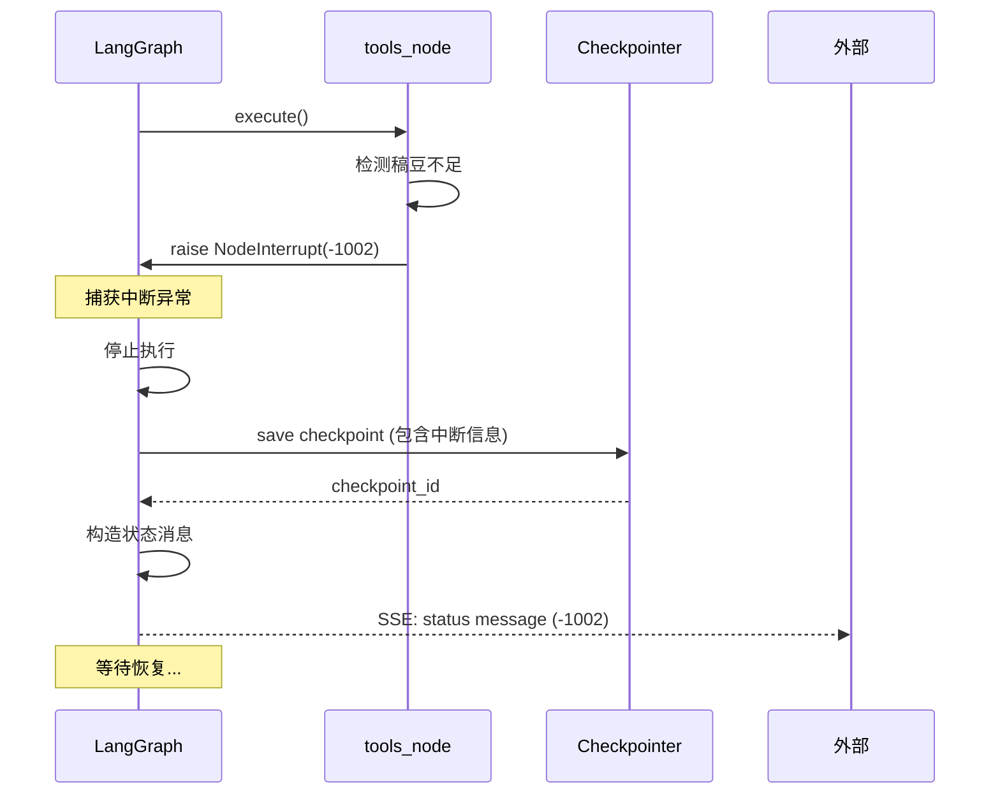

# 中断与恢复机制深入原理

> **理解状态管理的核心：如何暂停和继续**

---

## 一、为什么需要中断与恢复？

### 1.1 真实场景

**场景 1：稿豆不足**

```
用户：生成一张图片
  ↓
Agent：检查稿豆余额 → 不足
  ↓
[中断] 提示用户充值
  ↓
用户充值完成
  ↓
用户：继续
  ↓
[恢复] 从中断点继续生成图片
```

**场景 2：Token 过期**

```
用户：帮我设计海报
  ↓
Agent：调用工具 → Token 过期
  ↓
[中断] 静默刷新 Token
  ↓
[自动恢复] 继续执行
```

**场景 3：内容风险**

```
用户：生成敏感内容
  ↓
Agent：生成中... → Guardrails 检测到风险
  ↓
[中断并撤回] 停止生成，撤回已输出内容
```

### 1.2 没有中断恢复的问题

**问题 1：用户体验差**

```
传统方式：
用户：生成图片
Agent：稿豆不足
用户：充值
用户：再次输入"生成图片"  ← 重复输入
```

**问题 2：状态丢失**

```
用户：帮我设计一套品牌视觉
Agent：
  1. 生成 Logo ✅
  2. 生成配色方案 ✅
  3. 生成海报 → 稿豆不足 ❌

传统方式：
用户充值后需要重新开始，前面的工作丢失 ❌
```

**问题 3：成本浪费**

已经消耗的 LLM Token 和稿豆无法复用。

---

## 二、中断与恢复的本质

> 💡 **核心洞察**  
> 中断与恢复的本质是：**在任意时刻保存完整状态，并能从该状态继续执行**。

### 2.1 状态机视角

```
┌─────────────┐
│  State 0    │  初始状态
│  (用户输入)  │
└──────┬──────┘
       ↓
┌─────────────┐
│  State 1    │  LLM 处理
│  (调用 LLM)  │
└──────┬──────┘
       ↓
┌─────────────┐
│  State 2    │  工具调用
│ (执行工具)   │  ← [中断点]
└──────┬──────┘
       ↓
    [恢复]
       ↓
┌─────────────┐
│  State 3    │  继续执行
│ (工具结果)   │
└──────┬──────┘
       ↓
┌─────────────┐
│  State 4    │  最终结果
│  (完成)      │
└─────────────┘
```

**关键点**：
1. 每个状态都是**完整的**，包含所有上下文
2. 从任意状态都可以**继续执行**
3. 状态之间的转移是**确定的**

### 2.2 Checkpoint 的作用

**Checkpoint = 状态快照 + 执行位置**

```python
@dataclass
class Checkpoint:
    # 执行位置
    current_node: str  # 当前在哪个节点
    next_node: Optional[str]  # 下一个要执行的节点
    
    # 完整状态
    state: AgentState  # 包含所有消息、计数器等
    
    # 元数据
    checkpoint_id: str
    thread_id: str
    created_at: datetime
    
    # 中断信息（如果有）
    interrupt_info: Optional[InterruptInfo]
```

---

## 三、两种中断方式详解

### 3.1 节点级中断 (NodeInterrupt)

**原理**：在节点执行过程中抛出异常

```python
from langgraph.errors import NodeInterrupt

async def tools_node(state: AgentState) -> dict:
    """工具节点"""
    
    tool_calls = extract_tool_calls(state["messages"][-1])
    
    for tool_call in tool_calls:
        # 执行工具
        result = await execute_tool(tool_call, state)
        
        # 检查稿豆
        if result.get("error") == "insufficient_points":
            # 抛出中断异常
            raise NodeInterrupt(
                code=-1002,
                message="稿豆不足",
                extra={
                    "required_points": result["required_points"],
                    "current_balance": result["current_balance"],
                    "tool_call_id": tool_call["id"]
                }
            )
    
    return {"messages": results}
```

**LangGraph 的处理流程**：



**Checkpoint 内容**：

```python
{
    "checkpoint_id": "ckpt_123",
    "thread_id": "thread_abc",
    "current_node": "tools",  # 中断时所在节点
    "state": {
        "messages": [
            {"role": "user", "content": "生成图片"},
            {"role": "assistant", "content": "<tool_call>...</tool_call>"}
        ],
        "llm_calls": 1,
        "tool_calls": 0
    },
    "interrupt_info": {
        "code": -1002,
        "message": "稿豆不足",
        "extra": {
            "required_points": 10,
            "current_balance": 0,
            "tool_call_id": "call_001"
        }
    }
}
```

**恢复流程**：

```python
async def resume_from_checkpoint(thread_id: str):
    """从 Checkpoint 恢复"""
    
    # 1. 加载 Checkpoint
    checkpoint = checkpointer.get(thread_id)
    
    # 2. 恢复状态
    state = checkpoint.state
    
    # 3. 添加恢复消息
    state["messages"].append({
        "role": "status",
        "content": {
            "code": -2001,
            "message": "恢复执行"
        }
    })
    
    # 4. 继续执行（从中断的节点重新开始）
    result = await app.ainvoke(
        state,
        config={
            "thread_id": thread_id,
            "checkpoint_id": checkpoint.checkpoint_id  # 从此 checkpoint 继续
        }
    )
    
    return result
```

**为什么从中断节点重新执行？**

```
中断前：
llm_node → tools_node [中断] → (未执行)

恢复后：
[加载状态] → tools_node [重新执行] → llm_node → END
```

这样可以确保工具调用在充值后成功执行。

### 3.2 工具级中断 (状态标记)

**原理**：不抛异常，而是在状态中设置标记

```python
async def tools_node(state: AgentState) -> dict:
    """工具节点"""
    
    tool_calls = extract_tool_calls(state["messages"][-1])
    results = []
    
    for tool_call in tool_calls:
        # 执行工具
        result = await execute_tool(tool_call, state)
        
        # 检查稿豆
        if result.get("error") == "insufficient_points":
            # 不抛异常，设置状态标记
            return {
                "messages": [{
                    "role": "status",
                    "content": {
                        "code": -1002,
                        "message": "稿豆不足"
                    }
                }],
                "needs_resume": True,  # 标记需要恢复
                "interrupted_at": "tools",
                "tool_call_id": tool_call["id"]
            }
        
        results.append(result)
    
    return {"messages": results}


def should_continue(state: AgentState) -> str:
    """路由函数"""
    
    # 检查是否需要恢复
    if state.get("needs_resume"):
        return "interrupt"  # 路由到 END，等待恢复
    
    # 正常流程
    last_message = state["messages"][-1]
    if has_tool_call(last_message):
        return "continue"
    
    return "end"
```

**两种方式对比**：

| 维度 | NodeInterrupt | 状态标记 |
|------|---------------|----------|
| **实现方式** | 抛异常 | 设置标记 |
| **LangGraph感知** | 是 | 否 |
| **Checkpoint保存** | 自动 | 手动 |
| **恢复位置** | 中断节点 | 任意节点 |
| **适用场景** | 系统级中断（如资源不足） | 业务级中断（如审核失败） |
| **复杂度** | 低 | 中 |

**选择建议**：

- **NodeInterrupt**：推荐用于不可恢复或需要外部操作的中断（稿豆不足、Token过期）
- **状态标记**：用于可恢复或需要复杂控制流的中断（审核失败、需要人工介入）

---

## 四、完整的中断恢复实现

### 4.1 中断信息的设计

```python
@dataclass
class InterruptInfo:
    """中断信息"""
    
    # 状态码
    code: int  # -1002, -1004, etc.
    
    # 描述信息
    message: str
    
    # 中断时间
    interrupted_at: datetime
    
    # 中断位置
    node: str  # 哪个节点中断的
    
    # 额外信息
    extra: Dict[str, Any]
    
    # 是否可恢复
    recoverable: bool
```

### 4.2 完整的 Agent 实现

```python
from langgraph.graph import StateGraph, END
from langgraph.errors import NodeInterrupt

class AgentWithResume:
    """支持中断恢复的 Agent"""
    
    def __init__(self, checkpointer):
        self.checkpointer = checkpointer
        self.app = self._build_graph()
    
    def _build_graph(self):
        """构建图"""
        graph = StateGraph(AgentState)
        
        # 添加节点
        graph.add_node("llm", self.llm_node)
        graph.add_node("tools", self.tools_node)
        
        # 设置入口
        graph.set_entry_point("llm")
        
        # 添加条件边
        graph.add_conditional_edges(
            "llm",
            self.should_continue,
            {
                "continue": "tools",
                "end": END,
                "interrupt": END
            }
        )
        
        # tools -> llm
        graph.add_edge("tools", "llm")
        
        # 编译
        return graph.compile(checkpointer=self.checkpointer)
    
    async def llm_node(self, state: AgentState) -> dict:
        """LLM 节点"""
        # ... LLM 调用逻辑 ...
        pass
    
    async def tools_node(self, state: AgentState) -> dict:
        """工具节点"""
        tool_calls = extract_tool_calls(state["messages"][-1])
        results = []
        
        for tool_call in tool_calls:
            result = await execute_tool(tool_call, state)
            
            # 检查各种错误
            if result.get("error") == "insufficient_points":
                raise NodeInterrupt(
                    code=-1002,
                    message="稿豆不足",
                    extra=result
                )
            
            elif result.get("error") == "token_expired":
                raise NodeInterrupt(
                    code=-1004,
                    message="Token 过期",
                    extra=result
                )
            
            results.append({
                "role": "function",
                "content": {
                    "type": "function_response",
                    "text": result
                }
            })
        
        return {"messages": results}
    
    def should_continue(self, state: AgentState) -> str:
        """路由函数"""
        if state.get("needs_resume"):
            return "interrupt"
        
        last_message = state["messages"][-1]
        if has_tool_call(last_message):
            return "continue"
        
        return "end"
    
    async def run(self, user_input: str, thread_id: str, user_id: str):
        """执行 Agent"""
        
        # 1. 构造初始状态
        state = {
            "messages": [{
                "role": "user",
                "content": {"type": "plain", "text": user_input}
            }],
            "llm_calls": 0,
            "tool_calls": 0,
            "user_id": user_id,
            "thread_id": thread_id
        }
        
        # 2. 配置
        config = {"thread_id": thread_id}
        
        # 3. 执行
        try:
            async for event in self.app.astream(state, config=config):
                yield event
        
        except NodeInterrupt as e:
            # 中断：发送状态消息
            yield {
                "type": "status",
                "content": {
                    "code": e.code,
                    "message": e.message,
                    "extra": e.extra
                }
            }
    
    async def resume(self, thread_id: str):
        """恢复执行"""
        
        # 1. 加载最新的 Checkpoint
        checkpoint = self.checkpointer.get(thread_id)
        
        if not checkpoint:
            raise ValueError("No checkpoint found")
        
        # 2. 恢复状态
        state = checkpoint.state
        
        # 3. 清除中断标记
        if "needs_resume" in state:
            state["needs_resume"] = False
        
        # 4. 添加恢复消息
        state["messages"].append({
            "role": "status",
            "content": {
                "code": -2001,
                "message": "恢复执行"
            }
        })
        
        # 5. 继续执行
        config = {"thread_id": thread_id}
        async for event in self.app.astream(state, config=config):
            yield event
```

### 4.3 API 层实现

```python
from fastapi import FastAPI, HTTPException
from fastapi.responses import StreamingResponse
from pydantic import BaseModel

app = FastAPI()
agent = AgentWithResume(checkpointer=redis_checkpointer)

class ChatRequest(BaseModel):
    message: Optional[str]
    thread_id: Optional[str]
    user_id: str
    resume: bool = False

@app.post("/api/agent/chat")
async def chat(request: ChatRequest):
    """聊天接口"""
    
    # 生成 thread_id（如果是新会话）
    thread_id = request.thread_id or generate_thread_id()
    
    async def event_generator():
        """SSE 事件生成器"""
        
        if request.resume:
            # 恢复执行
            async for event in agent.resume(thread_id):
                yield f"data: {json.dumps(event)}\n\n"
        
        else:
            # 新消息
            if not request.message:
                raise HTTPException(400, "Message required")
            
            async for event in agent.run(
                request.message,
                thread_id,
                request.user_id
            ):
                yield f"data: {json.dumps(event)}\n\n"
    
    return StreamingResponse(
        event_generator(),
        media_type="text/event-stream"
    )
```

---

## 五、特殊场景处理

### 5.1 并发恢复

**问题**：用户在不同设备上同时点击"继续"

```python
import asyncio
from contextlib import asynccontextmanager

class ConcurrentResumeGuard:
    """并发恢复保护"""
    
    def __init__(self, redis_client):
        self.redis = redis_client
        self.locks = {}
    
    @asynccontextmanager
    async def acquire(self, thread_id: str):
        """获取锁"""
        lock_key = f"resume_lock:{thread_id}"
        
        # 尝试获取锁（5秒超时）
        acquired = await self.redis.set(
            lock_key,
            "locked",
            ex=5,
            nx=True
        )
        
        if not acquired:
            raise HTTPException(409, "Another resume is in progress")
        
        try:
            yield
        finally:
            # 释放锁
            await self.redis.delete(lock_key)

# 使用
resume_guard = ConcurrentResumeGuard(redis_client)

@app.post("/api/agent/chat")
async def chat(request: ChatRequest):
    if request.resume:
        async with resume_guard.acquire(request.thread_id):
            # 执行恢复
            ...
```

### 5.2 超时恢复

**问题**：用户充值后很久才点击"继续"

```python
async def resume(self, thread_id: str):
    """恢复执行"""
    
    # 1. 加载 Checkpoint
    checkpoint = self.checkpointer.get(thread_id)
    
    # 2. 检查是否过期（如 24 小时）
    if checkpoint.interrupted_at < datetime.now() - timedelta(hours=24):
        raise HTTPException(410, "Checkpoint expired")
    
    # 3. 继续恢复流程
    ...
```

### 5.3 部分恢复

**问题**：复杂任务中断后，用户只想恢复部分

```python
class ChatRequest(BaseModel):
    resume: bool = False
    resume_from: Optional[str] = None  # 从哪个步骤恢复

async def resume(self, thread_id: str, resume_from: Optional[str] = None):
    """部分恢复"""
    
    checkpoint = self.checkpointer.get(thread_id)
    state = checkpoint.state
    
    if resume_from:
        # 清除指定步骤之后的消息
        messages = state["messages"]
        state["messages"] = [
            msg for msg in messages
            if msg.get("step_id", "") <= resume_from
        ]
    
    # 继续执行
    ...
```

---

## 六、最佳实践

### 6.1 中断设计原则

**DO：**
- ✅ 使用 NodeInterrupt 处理系统级中断
- ✅ 保存完整的上下文信息
- ✅ 提供清晰的错误描述
- ✅ 区分可恢复和不可恢复的错误
- ✅ 设置合理的 Checkpoint 过期时间

**DON'T：**
- ❌ 在中断信息中存储敏感数据
- ❌ 过度使用中断（影响用户体验）
- ❌ 忘记清理过期的 Checkpoint
- ❌ 不处理并发恢复

### 6.2 恢复策略

| 场景 | 策略 |
|------|------|
| **稿豆不足** | 等待用户充值，手动恢复 |
| **Token过期** | 自动刷新，自动恢复 |
| **网络错误** | 自动重试，自动恢复 |
| **内容风险** | 中断并撤回，不恢复 |
| **超时** | 提示用户，手动恢复或放弃 |

---

## 七、总结

### 7.1 核心概念

1. **中断恢复的本质**：保存完整状态，从任意点继续
2. **两种中断方式**：NodeInterrupt（系统级）和状态标记（业务级）
3. **Checkpoint 机制**：状态快照 + 执行位置
4. **恢复流程**：加载状态 → 清除标记 → 继续执行

### 7.2 关键实现

- ✅ NodeInterrupt 异常处理
- ✅ Checkpoint 序列化和存储
- ✅ 并发恢复保护
- ✅ 超时和过期处理
- ✅ 完整的 API 设计

---

*文档版本：v1.0*  
*最后更新：2026-01-26*

**上一篇**：[← 网络架构](05-网络架构.md) | **下一篇**：[业务功能 →](07-业务功能.md)
