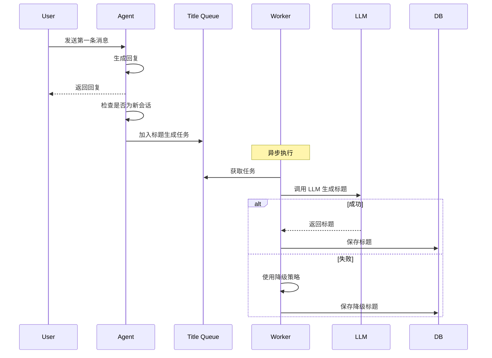

# 业务功能实践

> **真实场景的解决方案**

---

## 一、会话标题生成

### 1.1 为什么需要自动生成标题？

**传统方式的问题**：

```
会话列表：
- 新的聊天
- 新的聊天 (1)
- 新的聊天 (2)
- 新的聊天 (3)
```

用户无法快速找到历史会话。

**自动生成标题后**：

```
会话列表：
- 牙膏产品图设计
- 品牌 Logo 生成
- 海报排版优化
- ...
```

用户可以一眼看出每个会话的主题。

### 1.2 设计原则

**1. 异步非阻塞**

标题生成不应该阻塞主对话流程。

```python
用户：生成图片
  ↓
Agent：[立即响应] 开始生成...
  ↓
[后台异步] 生成会话标题
```

**2. 轻量级实现**

基于服务内部队列，无需额外服务。

```python
# 使用 Python 的 Queue
import queue
import threading

title_queue = queue.Queue()

# Worker 线程
def title_generation_worker():
    while True:
        task = title_queue.get()
        generate_title(task)
        title_queue.task_done()

# 启动 Worker
threading.Thread(target=title_generation_worker, daemon=True).start()
```

**3. 智能触发**

仅在新会话时触发。

```python
def should_generate_title(thread_id: str) -> bool:
    """判断是否需要生成标题"""
    
    # 1. 检查是否已有标题
    if has_title(thread_id):
        return False
    
    # 2. 检查消息数量（只有首次对话后才生成）
    message_count = count_messages(thread_id)
    return message_count == 2  # user + assistant
```

**4. 容错性强**

生成失败不影响正常对话。

```python
try:
    title = await generate_title_with_llm(context)
except Exception as e:
    logger.error(f"Title generation failed: {e}")
    # 降级：使用用户输入的前 10 个字
    title = user_query[:10] + "..."
```

### 1.3 完整流程



### 1.4 实现代码

**标题生成任务**：

```python
from dataclasses import dataclass
from typing import Optional

@dataclass
class TitleGenerationTask:
    """标题生成任务"""
    thread_id: str
    user_query: str
    assistant_response: str
    created_at: datetime


class TitleGenerator:
    """标题生成器"""
    
    def __init__(self, llm_client, db):
        self.llm = llm_client
        self.db = db
        self.queue = queue.Queue()
        self._start_worker()
    
    def _start_worker(self):
        """启动 Worker 线程"""
        def worker():
            while True:
                try:
                    task = self.queue.get(timeout=1)
                    self._process_task(task)
                except queue.Empty:
                    continue
                except Exception as e:
                    logger.error(f"Worker error: {e}")
        
        thread = threading.Thread(target=worker, daemon=True)
        thread.start()
    
    def enqueue(self, task: TitleGenerationTask):
        """加入队列"""
        self.queue.put(task)
    
    def _process_task(self, task: TitleGenerationTask):
        """处理任务"""
        try:
            # 1. 调用 LLM 生成标题
            title = self._generate_with_llm(task)
        
        except Exception as e:
            logger.warning(f"LLM title generation failed: {e}")
            # 2. 降级策略
            title = self._fallback_title(task)
        
        # 3. 保存到数据库
        self._save_title(task.thread_id, title)
    
    def _generate_with_llm(self, task: TitleGenerationTask) -> str:
        """使用 LLM 生成标题"""
        
        prompt = f"""根据以下对话，生成一个简短的标题（不超过 15 个字）。

用户：{task.user_query}
助手：{task.assistant_response}

标题："""
        
        response = self.llm.complete(
            messages=[{"role": "user", "content": prompt}],
            max_tokens=30,
            temperature=0.7
        )
        
        title = response.strip()
        
        # 限制长度
        if len(title) > 15:
            title = title[:15] + "..."
        
        return title
    
    def _fallback_title(self, task: TitleGenerationTask) -> str:
        """降级策略"""
        # 使用用户输入的前 10 个字
        return task.user_query[:10] + ("..." if len(task.user_query) > 10 else "")
    
    def _save_title(self, thread_id: str, title: str):
        """保存标题"""
        self.db.execute(
            "UPDATE threads SET title = ? WHERE thread_id = ?",
            (title, thread_id)
        )
```

**集成到 Agent**：

```python
class AgentService:
    def __init__(self):
        self.title_generator = TitleGenerator(llm_client, db)
    
    async def chat(self, user_input: str, thread_id: str):
        """聊天接口"""
        
        # 1. 处理用户消息
        response = await self.process_message(user_input, thread_id)
        
        # 2. 检查是否需要生成标题
        if self._should_generate_title(thread_id):
            # 3. 异步生成标题
            task = TitleGenerationTask(
                thread_id=thread_id,
                user_query=user_input,
                assistant_response=response,
                created_at=datetime.now()
            )
            self.title_generator.enqueue(task)
        
        return response
    
    def _should_generate_title(self, thread_id: str) -> bool:
        """判断是否需要生成标题"""
        # 检查是否已有标题
        thread = self.db.get_thread(thread_id)
        if thread and thread.title:
            return False
        
        # 检查消息数量
        message_count = self.db.count_messages(thread_id)
        return message_count == 2
```

### 1.5 数据库设计

```sql
-- threads 表
CREATE TABLE threads (
    thread_id VARCHAR(100) PRIMARY KEY,
    user_id VARCHAR(100) NOT NULL,
    title VARCHAR(255),  -- 会话标题
    created_at TIMESTAMP DEFAULT CURRENT_TIMESTAMP,
    updated_at TIMESTAMP DEFAULT CURRENT_TIMESTAMP ON UPDATE CURRENT_TIMESTAMP,
    
    INDEX idx_user_id (user_id),
    INDEX idx_created_at (created_at)
);

-- 或者单独的 metadata 表
CREATE TABLE thread_metadata (
    id BIGINT PRIMARY KEY AUTO_INCREMENT,
    thread_id VARCHAR(100) NOT NULL,
    key VARCHAR(100) NOT NULL,
    value TEXT,
    created_at TIMESTAMP DEFAULT CURRENT_TIMESTAMP,
    
    UNIQUE KEY uk_thread_key (thread_id, key),
    INDEX idx_thread_id (thread_id)
);

-- 存储标题
INSERT INTO thread_metadata (thread_id, key, value)
VALUES ('thread_123', 'title', '牙膏产品图设计')
ON DUPLICATE KEY UPDATE value = VALUES(value);
```

---

## 二、其他业务功能

### 2.1 技能（Skill）管理

**技能的本质**：预定义的工具集合 + System Prompt

```python
@dataclass
class Skill:
    """技能定义"""
    skill_id: int
    name: str
    description: str
    system_prompt: str
    available_tools: List[str]
    icon: str


# 示例技能
SKILLS = {
    1: Skill(
        skill_id=1,
        name="通用助手",
        description="可以回答各种问题，进行对话",
        system_prompt="你是一个通用助手...",
        available_tools=[],
        icon="💬"
    ),
    2: Skill(
        skill_id=2,
        name="图像生成",
        description="根据描述生成图片",
        system_prompt="你是一个图像生成助手，擅长理解用户需求并生成图片...",
        available_tools=["通用", "AI修图", "图片编辑"],
        icon="🎨"
    ),
    3: Skill(
        skill_id=3,
        name="视频生成",
        description="生成短视频",
        system_prompt="你是一个视频生成助手...",
        available_tools=["视频生成", "视频编辑"],
        icon="🎬"
    )
}


def get_skill_config(skill_id: int) -> Skill:
    """获取技能配置"""
    return SKILLS.get(skill_id, SKILLS[1])  # 默认通用助手
```

**在 Agent 中使用技能**：

```python
async def chat(self, user_input: str, thread_id: str, skill_id: int = 1):
    """聊天接口"""
    
    # 1. 获取技能配置
    skill = get_skill_config(skill_id)
    
    # 2. 构造 System Prompt
    system_prompt = skill.system_prompt
    
    # 3. 获取可用工具
    available_tools = [
        tool_registry.get(tool_name)
        for tool_name in skill.available_tools
    ]
    
    # 4. 执行 Agent
    result = await agent.run(
        user_input=user_input,
        thread_id=thread_id,
        system_prompt=system_prompt,
        tools=available_tools
    )
    
    return result
```

### 2.2 附件处理

**支持的附件类型**：
- 图片：用于图生图、图片编辑
- 文件：用于文档理解、数据分析

**附件数据结构**：

```python
@dataclass
class Attachment:
    """附件"""
    attachment_id: str
    type: str  # "image", "file"
    url: str
    file_name: str
    file_size: int
    mime_type: str


# 在消息中携带附件
{
    "role": "user",
    "content": {
        "type": "plain",
        "text": "帮我修这张图"
    },
    "attachments": [
        {
            "attachment_id": "att_123",
            "type": "image",
            "url": "https://cdn.gaoding.com/xxx.jpg",
            "file_name": "原图.jpg",
            "file_size": 102400,
            "mime_type": "image/jpeg"
        }
    ]
}
```

**在工具中使用附件**：

```python
class ImageEditTool(Tool):
    """图片编辑工具"""
    
    async def execute(
        self,
        user_prompt: str,
        attachments: List[Attachment],
        **kwargs
    ) -> Dict:
        """执行图片编辑"""
        
        # 1. 检查是否有图片附件
        image_attachments = [
            att for att in attachments
            if att.type == "image"
        ]
        
        if not image_attachments:
            return {
                "tool_name": self.name,
                "result": "failed",
                "error": "no_image",
                "message": "请上传图片"
            }
        
        # 2. 调用图片编辑服务
        original_image_url = image_attachments[0].url
        edited_image_url = await edit_image_service.edit(
            image_url=original_image_url,
            prompt=user_prompt
        )
        
        # 3. 返回结果
        return {
            "tool_name": self.name,
            "result": "success",
            "original_image_url": original_image_url,
            "edited_image_url": edited_image_url
        }
```

---

## 三、总结

### 3.1 业务功能设计原则

**DO：**
- ✅ 异步非阻塞（不影响主流程）
- ✅ 容错性强（降级策略）
- ✅ 轻量级实现（避免过度设计）
- ✅ 用户体验优先

**DON'T：**
- ❌ 阻塞主流程
- ❌ 没有降级方案
- ❌ 过度依赖外部服务
- ❌ 忽略边界情况

### 3.2 关键实现

- ✅ 异步队列 + Worker 线程
- ✅ LLM 生成 + 降级策略
- ✅ 技能管理
- ✅ 附件处理

---

*文档版本：v1.0*  
*最后更新：2026-01-26*

**上一篇**：[← 中断与恢复](06-中断与恢复.md) | **下一篇**：[可观测性 →](08-可观测性.md)
