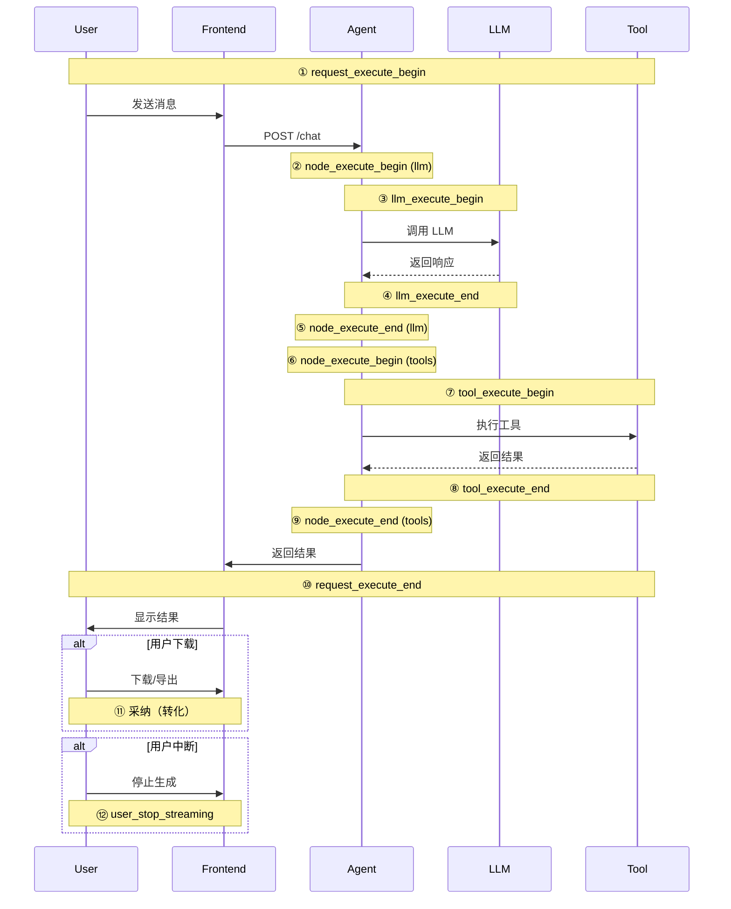

# 可观测性：链路追踪与监控

> **确保系统稳定、性能优化、成本可控**

---

## 一、为什么需要可观测性？

### 1.1 没有可观测性的问题

**问题 1：故障难以定位**

```
用户反馈：Agent 响应很慢

问题可能在：
- Kong 网关？
- Agent 服务？
- LLM 调用？
- 工具调用？
- 网络延迟？

❌ 无法快速定位
```

**问题 2：性能无法优化**

```
不知道：
- 哪个环节最慢？
- Token 消耗分布？
- 工具调用成功率？
- 用户采纳率？

❌ 无法针对性优化
```

**问题 3：成本失控**

```
不知道：
- 总Token消耗？
- 各模型的使用比例？
- 稿豆消耗趋势？

❌ 成本不可控
```

### 1.2 可观测性的三大支柱

```
可观测性 = 日志 (Logging) + 指标 (Metrics) + 追踪 (Tracing)
```

**日志 (Logging)**：
- 记录事件和错误
- 用于故障诊断

**指标 (Metrics)**：
- 聚合数据（QPS、延迟、成功率）
- 用于性能监控和告警

**追踪 (Tracing)**：
- 跨服务的请求链路
- 用于性能分析

---

## 二、Message 生命周期

### 2.1 完整的生命周期



### 2.2 Checkpoint 定义

#### ① request_execute_begin

**时机**：Agent 收到用户请求

**字段**：

```python
{
    "event": "request_execute_begin",
    "trace_id": "trace_123",
    "thread_id": "thread_abc",
    "message_id": "msg_001",
    "user_id": "user_456",
    "timestamp": "2026-01-26T12:00:00Z",
    "data": {
        "text": "帮我生成一张牙膏产品图",
        "is_new": True,  # 是否新会话
        "input_skill_id": 2,
        "mode": "normal",
        "attachments": []
    }
}
```

#### ② node_execute_begin / ⑤ node_execute_end

**时机**：节点执行前后

```python
{
    "event": "node_execute_begin",
    "trace_id": "trace_123",
    "thread_id": "thread_abc",
    "node_name": "llm",  # 或 "tools"
    "timestamp": "2026-01-26T12:00:01Z"
}

{
    "event": "node_execute_end",
    "trace_id": "trace_123",
    "thread_id": "thread_abc",
    "node_name": "llm",
    "duration_ms": 1500,
    "status": "success",  # 或 "failed"
    "timestamp": "2026-01-26T12:00:02.5Z"
}
```

#### ③ llm_execute_begin / ④ llm_execute_end

**时机**：LLM 调用前后

```python
{
    "event": "llm_execute_begin",
    "trace_id": "trace_123",
    "thread_id": "thread_abc",
    "model": "doubao-pro-128k",
    "input_tokens": 150,
    "timestamp": "2026-01-26T12:00:01Z"
}

{
    "event": "llm_execute_end",
    "trace_id": "trace_123",
    "thread_id": "thread_abc",
    "model": "doubao-pro-128k",
    "input_tokens": 150,
    "output_tokens": 50,
    "total_tokens": 200,
    "duration_ms": 1200,
    "status": "success",
    "timestamp": "2026-01-26T12:00:02.2Z"
}
```

#### ⑦ tool_execute_begin / ⑧ tool_execute_end

**时机**：工具执行前后

```python
{
    "event": "tool_execute_begin",
    "trace_id": "trace_123",
    "thread_id": "thread_abc",
    "tool_call_id": "call_001",
    "tool_name": "通用",
    "parameters": {
        "user_prompt": "牙膏产品图",
        "width": "512",
        "height": "512"
    },
    "timestamp": "2026-01-26T12:00:03Z"
}

{
    "event": "tool_execute_end",
    "trace_id": "trace_123",
    "thread_id": "thread_abc",
    "tool_call_id": "call_001",
    "tool_name": "通用",
    "status": "success",  # 或 "failed"
    "duration_ms": 3000,
    "deduct_points": 10,
    "task_id": "task_123",
    "timestamp": "2026-01-26T12:00:06Z"
}
```

#### ⑩ request_execute_end

**时机**：请求完成

```python
{
    "event": "request_execute_end",
    "trace_id": "trace_123",
    "thread_id": "thread_abc",
    "message_id": "msg_001",
    "status": "success",  # 或 "interrupted", "failed"
    "total_duration_ms": 6000,
    "llm_calls": 2,
    "tool_calls": 1,
    "total_tokens": 350,
    "total_points": 10,
    "timestamp": "2026-01-26T12:00:07Z"
}
```

#### ⑫ user_stop_streaming

**时机**：用户主动停止

```python
{
    "event": "user_stop_streaming",
    "trace_id": "trace_123",
    "thread_id": "thread_abc",
    "message_id": "msg_001",
    "stop_reason": "user_click",  # 或 "timeout", "error"
    "partial_content_length": 150,
    "timestamp": "2026-01-26T12:00:05Z"
}
```

---

## 三、ID 关系与追踪

### 3.1 ID 体系

```
trace_id (贯穿整个请求)
  ↓
thread_id (会话级别)
  ↓
message_id (消息级别)
  ↓
tool_call_id (工具调用级别)
  ↓
task_id (任务级别，如图片生成任务)
```

### 3.2 ID 生成规则

```python
import uuid
from datetime import datetime

def generate_trace_id() -> str:
    """生成 trace_id"""
    # 使用时间戳 + UUID
    timestamp = datetime.now().strftime("%Y%m%d%H%M%S")
    random_part = str(uuid.uuid4())[:8]
    return f"trace_{timestamp}_{random_part}"

def generate_thread_id() -> str:
    """生成 thread_id"""
    return f"thread_{uuid.uuid4().hex}"

def generate_message_id() -> str:
    """生成 message_id"""
    return f"msg_{uuid.uuid4().hex[:16]}"

def generate_tool_call_id() -> str:
    """生成 tool_call_id"""
    return f"call_{uuid.uuid4().hex[:12]}"
```

### 3.3 追踪上下文传递

```python
class TraceContext:
    """追踪上下文"""
    
    def __init__(self, trace_id: str, thread_id: str, user_id: str):
        self.trace_id = trace_id
        self.thread_id = thread_id
        self.user_id = user_id
        self.start_time = time.time()
    
    def log(self, event: str, data: dict = None):
        """记录日志"""
        log_entry = {
            "event": event,
            "trace_id": self.trace_id,
            "thread_id": self.thread_id,
            "user_id": self.user_id,
            "timestamp": datetime.utcnow().isoformat(),
            "data": data or {}
        }
        
        logger.info(json.dumps(log_entry))
    
    def metric(self, name: str, value: float, labels: dict = None):
        """记录指标"""
        metric_labels = {
            "trace_id": self.trace_id,
            **(labels or {})
        }
        
        metrics.record(name, value, labels=metric_labels)


# 使用
async def chat(user_input: str, thread_id: str, user_id: str):
    # 创建追踪上下文
    ctx = TraceContext(
        trace_id=generate_trace_id(),
        thread_id=thread_id,
        user_id=user_id
    )
    
    # 记录开始
    ctx.log("request_execute_begin", {
        "text": user_input,
        "is_new": is_new_conversation(thread_id)
    })
    
    try:
        # 执行 Agent
        result = await agent.run(user_input, thread_id, ctx)
        
        # 记录成功
        ctx.log("request_execute_end", {
            "status": "success",
            "duration_ms": (time.time() - ctx.start_time) * 1000
        })
        
        return result
    
    except Exception as e:
        # 记录失败
        ctx.log("request_execute_end", {
            "status": "failed",
            "error": str(e)
        })
        raise
```

---

## 四、监控指标

### 4.1 核心指标

| 指标类别 | 指标名称 | 说明 | 目标值 |
|---------|---------|------|--------|
| **可用性** | 服务可用性 | 健康检查通过率 | > 99.9% |
| **性能** | P50 延迟 | 50% 请求的响应时间 | < 2s |
| **性能** | P95 延迟 | 95% 请求的响应时间 | < 5s |
| **性能** | P99 延迟 | 99% 请求的响应时间 | < 10s |
| **成功率** | 请求成功率 | 成功 / 总请求 | > 95% |
| **成功率** | LLM 调用成功率 | LLM 成功 / LLM 总调用 | > 98% |
| **成功率** | 工具调用成功率 | 工具成功 / 工具总调用 | > 95% |
| **成本** | Token 消耗（每日） | 每日消耗的总 Token | 监控趋势 |
| **成本** | 稿豆消耗（每日） | 每日消耗的总稿豆 | 监控趋势 |
| **业务** | 新会话数 | 每日新建会话数 | 监控趋势 |
| **业务** | 消息数 | 每日消息总数 | 监控趋势 |
| **业务** | 采纳率 | 下载/导出 / 成功生成 | > 20% |
| **业务** | 技能使用率 | 各技能的使用比例 | 监控分布 |
| **业务** | 任务未完成率 | 用户中断 / 总任务 | < 10% |

### 4.2 Prometheus 指标定义

```python
from prometheus_client import Counter, Histogram, Gauge

# 请求计数器
request_counter = Counter(
    'agent_requests_total',
    'Total number of requests',
    ['status', 'skill_id']
)

# 延迟直方图
request_duration = Histogram(
    'agent_request_duration_seconds',
    'Request duration in seconds',
    ['skill_id'],
    buckets=[0.1, 0.5, 1, 2, 5, 10, 30]
)

# LLM Token 消耗
llm_token_usage = Counter(
    'agent_llm_tokens_total',
    'Total LLM tokens used',
    ['model', 'type']  # type: input/output
)

# 稿豆消耗
points_usage = Counter(
    'agent_points_total',
    'Total points used',
    ['tool_name']
)

# 并发连接数
concurrent_connections = Gauge(
    'agent_concurrent_connections',
    'Number of concurrent connections'
)


# 使用示例
@request_duration.time()
async def chat(user_input: str, thread_id: str, skill_id: int):
    try:
        result = await agent.run(user_input, thread_id)
        
        # 记录成功
        request_counter.labels(status='success', skill_id=skill_id).inc()
        
        # 记录 Token 消耗
        llm_token_usage.labels(
            model='doubao-pro-128k',
            type='input'
        ).inc(result['input_tokens'])
        
        llm_token_usage.labels(
            model='doubao-pro-128k',
            type='output'
        ).inc(result['output_tokens'])
        
        return result
    
    except Exception as e:
        # 记录失败
        request_counter.labels(status='failed', skill_id=skill_id).inc()
        raise
```

---

## 五、告警规则

### 5.1 告警级别

| 级别 | 说明 | 响应时间 | 通知方式 |
|------|------|---------|----------|
| **P0** | 严重故障，影响核心功能 | 5 分钟内 | 电话 + 短信 + 钉钉 |
| **P1** | 重要故障，影响部分功能 | 15 分钟内 | 短信 + 钉钉 |
| **P2** | 一般告警，需要关注 | 1 小时内 | 钉钉 |
| **P3** | 提醒，不紧急 | 24 小时内 | 钉钉 |

### 5.2 告警规则

```yaml
groups:
- name: agent_alerts
  rules:
  
  # P0: 服务不可用
  - alert: ServiceDown
    expr: up{job="agent-service"} == 0
    for: 1m
    labels:
      severity: P0
    annotations:
      summary: "Agent service is down"
      description: "Agent service has been down for more than 1 minute"
  
  # P0: 成功率过低
  - alert: LowSuccessRate
    expr: |
      rate(agent_requests_total{status="success"}[5m])
      /
      rate(agent_requests_total[5m])
      < 0.90
    for: 5m
    labels:
      severity: P0
    annotations:
      summary: "Request success rate < 90%"
  
  # P1: 延迟过高
  - alert: HighLatency
    expr: |
      histogram_quantile(0.99, rate(agent_request_duration_seconds_bucket[5m]))
      > 10
    for: 5m
    labels:
      severity: P1
    annotations:
      summary: "P99 latency > 10s"
  
  # P1: LLM 调用失败率过高
  - alert: LLMHighFailureRate
    expr: |
      rate(agent_llm_calls_total{status="failed"}[5m])
      /
      rate(agent_llm_calls_total[5m])
      > 0.10
    for: 5m
    labels:
      severity: P1
    annotations:
      summary: "LLM call failure rate > 10%"
  
  # P2: Token 消耗异常
  - alert: HighTokenUsage
    expr: |
      rate(agent_llm_tokens_total[1h])
      > 1000000
    for: 10m
    labels:
      severity: P2
    annotations:
      summary: "Token usage > 1M/hour"
```

---

## 六、总结

### 6.1 可观测性的价值

- ✅ **快速定位问题**：通过 trace_id 追踪完整链路
- ✅ **性能优化**：识别瓶颈，针对性优化
- ✅ **成本管控**：监控 Token 和稿豆消耗
- ✅ **业务洞察**：了解用户行为和需求

### 6.2 关键实现

- ✅ 完整的生命周期 Checkpoint
- ✅ 统一的 ID 体系
- ✅ Prometheus 指标采集
- ✅ 分级告警规则

---

*文档版本：v1.0*  
*最后更新：2026-01-26*

**上一篇**：[← 业务功能](07-业务功能.md) | **下一篇**：[最佳实践 →](09-最佳实践.md)
