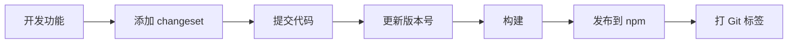

# 版本管理与发布

> **目标读者**：包维护者、发布管理员  
> **难度等级**：⭐⭐ 中级

---

## 概述

本文档介绍稿定 Monorepo 中 npm 包的版本管理和发布流程，使用 **Changesets** 作为核心工具，遵循**语义化版本规范（Semver）**。

---

## 语义化版本（Semver）

### 版本号格式

版本号格式：`MAJOR.MINOR.PATCH`（例如：`1.2.3`）

- **MAJOR（主版本号）**：不兼容的 API 变更
- **MINOR（次版本号）**：向后兼容的功能新增
- **PATCH（修订号）**：向后兼容的问题修复

### 版本递增规则

| 变更类型 | 示例 | 版本变化 |
|---------|------|---------|
| 修复 bug | 修复函数返回值错误 | `1.0.0` → `1.0.1` |
| 新增功能（兼容） | 添加新的 API 方法 | `1.0.1` → `1.1.0` |
| 破坏性变更 | 删除或修改现有 API | `1.1.0` → `2.0.0` |

---

### 预发布版本

格式：`MAJOR.MINOR.PATCH-TAG.N`

**常见标签**：
- **alpha**：内部测试版（可能不稳定）
- **beta**：公开测试版（功能基本完成）
- **rc**（Release Candidate）：发布候选版本

**示例**：
```
1.0.0-alpha.1    // 第一个 alpha 版本
1.0.0-alpha.2    // 第二个 alpha 版本
1.0.0-beta.1     // 第一个 beta 版本
1.0.0-rc.1       // 第一个 rc 版本
1.0.0            // 正式版本
```

**发布命令**：
```bash
pnpm changeset version --snapshot alpha
pnpm changeset publish --tag alpha
```

---

### 版本范围

**package.json 中的依赖版本**：

| 符号 | 含义 | 示例 | 匹配版本 |
|-----|------|------|---------|
| `^` | 兼容性更新（推荐） | `^1.2.3` | `>=1.2.3 <2.0.0` |
| `~` | 修订更新 | `~1.2.3` | `>=1.2.3 <1.3.0` |
| `*` | 任意版本 | `*` | 所有版本 |
| 精确版本 | 锁定版本 | `1.2.3` | `1.2.3` |

**推荐用法**：
- **dependencies**：使用 `^`（允许兼容性更新）
- **devDependencies**：使用 `^` 或 `~`
- **peerDependencies**：使用宽松范围（如 `>=16.8.0`）

---

## Changesets 工作流

### 什么是 Changesets？

Changesets 是一个用于管理 Monorepo 版本和发布的工具，核心概念：

1. **Changeset 文件**：描述一次变更的 Markdown 文件
2. **版本计算**：根据 changeset 自动计算新版本号
3. **依赖更新**：自动更新依赖该包的其他包
4. **变更日志**：自动生成 CHANGELOG.md

---

### 工作流程



---

## 实战指南

### 1. 开发阶段

**修改包代码**：
```bash
cd packages/utils
# 修改代码...
```

**添加 changeset**：
```bash
pnpm changeset
```

**交互式问答**：
```
? 选择要发布的包: (按空格选择)
  ◉ @gaoding/utils
  ◯ @gaoding/design-tokens

? 选择变更类型: (Use arrow keys)
  ❯ patch (修复 bug)
    minor (新增功能)
    major (破坏性变更)

? 请描述此次变更:
  修复了工具函数的类型定义错误
```

**生成的 changeset 文件**：
```markdown
// .changeset/brown-lions-travel.md
---
"@gaoding/utils": patch
---

修复了工具函数的类型定义错误
```

**提交代码**：
```bash
git add .
git commit -m "fix: 修复工具函数类型定义"
git push
```

---

### 2. 版本更新

**更新版本号**：
```bash
pnpm changeset version
```

**执行结果**：
1. 删除 `.changeset/` 中的 changeset 文件
2. 更新包的 `package.json` 版本号
3. 生成或更新 `CHANGELOG.md`

**示例**：
```json
// packages/utils/package.json
{
  "name": "@gaoding/utils",
  "version": "1.0.1"  // 从 1.0.0 更新到 1.0.1
}
```

```markdown
// packages/utils/CHANGELOG.md
# @gaoding/utils

## 1.0.1

### Patch Changes

- 修复了工具函数的类型定义错误
```

**提交版本更新**：
```bash
git add .
git commit -m "chore: release utils v1.0.1"
git push
```

---

### 3. 构建与发布

**构建所有包**：
```bash
pnpm build
```

**发布到 npm**：
```bash
pnpm changeset publish
```

**执行结果**：
1. 发布更新的包到 npm
2. 在 Git 中创建版本标签（如 `@gaoding/utils@1.0.1`）

**推送标签**：
```bash
git push --follow-tags
```

---

### 完整示例

**场景**：修复 `@gaoding/utils` 的一个 bug

```bash
# 1. 修改代码
cd packages/utils
vim src/index.ts

# 2. 添加 changeset
pnpm changeset
# 选择: @gaoding/utils
# 类型: patch
# 描述: 修复了 formatDate 函数时区问题

# 3. 提交代码
git add .
git commit -m "fix(utils): 修复 formatDate 时区问题"
git push

# 4. 更新版本（由 CI 或手动执行）
pnpm changeset version
git add .
git commit -m "chore: release utils v1.0.2"
git push

# 5. 构建和发布（由 CI 或手动执行）
pnpm build
pnpm changeset publish
git push --follow-tags
```

---

## 高级场景

### 场景 1：同时发布多个包

**changeset 文件**：
```markdown
// .changeset/happy-cats-dance.md
---
"@gaoding/utils": minor
"@gaoding/design-tokens": patch
"@gaoding/react-hooks": patch
---

- utils: 新增 debounce 函数
- design-tokens: 修复颜色值错误
- react-hooks: 修复 useDebounce 类型定义
```

**执行 `pnpm changeset version` 后**：
```json
// packages/utils/package.json
{ "version": "1.1.0" }  // minor 更新

// packages/design-tokens/package.json
{ "version": "1.0.1" }  // patch 更新

// packages/react-hooks/package.json
{ "version": "1.0.1" }  // patch 更新
```

---

### 场景 2：依赖包自动更新

**依赖关系**：
```
@gaoding/react-hooks  依赖→  @gaoding/utils
```

**changeset**：
```markdown
---
"@gaoding/utils": minor
---

新增 debounce 函数
```

**执行 `pnpm changeset version` 后**：
```json
// packages/utils/package.json
{ "version": "1.1.0" }

// packages/react-hooks/package.json（自动更新）
{
  "version": "1.0.1",  // 自动 patch 更新
  "dependencies": {
    "@gaoding/utils": "^1.1.0"  // 自动更新依赖版本
  }
}
```

**CHANGELOG**：
```markdown
// packages/react-hooks/CHANGELOG.md
## 1.0.1

### Patch Changes

- Updated dependencies
  - @gaoding/utils@1.1.0
```

---

### 场景 3：预发布版本

**发布 alpha 版本**：
```bash
# 1. 添加 changeset
pnpm changeset
pnpm changeset version

# 2. 进入预发布模式
pnpm changeset pre enter alpha

# 3. 更新版本号（会添加 -alpha.0 后缀）
pnpm changeset version
# 版本变为: 1.1.0-alpha.0

# 4. 发布到 npm（带 alpha 标签）
pnpm build
pnpm changeset publish --tag alpha

# 5. 退出预发布模式
pnpm changeset pre exit
```

**用户安装 alpha 版本**：
```bash
npm install @gaoding/utils@alpha
npm install @gaoding/utils@1.1.0-alpha.0
```

---

### 场景 4：热修复（Hotfix）

**场景**：生产环境发现严重 bug，需要快速修复并发布。

```bash
# 1. 基于最新 release 分支创建 hotfix 分支
git checkout v1.0.0
git checkout -b hotfix/fix-critical-bug

# 2. 修复 bug
vim packages/utils/src/index.ts

# 3. 添加 changeset
pnpm changeset
# 类型: patch
# 描述: 修复安全漏洞

# 4. 更新版本（1.0.0 → 1.0.1）
pnpm changeset version

# 5. 构建和发布
pnpm build
pnpm changeset publish

# 6. 合并回主分支
git checkout main
git merge hotfix/fix-critical-bug
git push
```

---

## CI/CD 集成

### GitHub Actions 示例

**自动化版本更新和发布**：

```yaml
# .github/workflows/release.yml
name: Release

on:
  push:
    branches:
      - main

jobs:
  release:
    runs-on: ubuntu-latest
    steps:
      - uses: actions/checkout@v4
      - uses: pnpm/action-setup@v2
      - uses: actions/setup-node@v4
        with:
          node-version: 18
          cache: 'pnpm'

      - name: Install dependencies
        run: pnpm install

      - name: Build
        run: pnpm build

      - name: Create Release PR or Publish
        uses: changesets/action@v1
        with:
          publish: pnpm changeset publish
        env:
          GITHUB_TOKEN: ${{ secrets.GITHUB_TOKEN }}
          NPM_TOKEN: ${{ secrets.NPM_TOKEN }}
```

**工作流程**：
1. **有 changeset**：创建/更新 "Version Packages" PR
2. **合并 PR**：自动发布到 npm 并打 Git 标签

---

### GitLab CI 示例

```yaml
# .gitlab-ci.yml
release:
  stage: deploy
  only:
    - main
  script:
    - pnpm install
    - pnpm build
    - |
      if pnpm changeset status --since=HEAD~1 | grep -q "pending changesets"; then
        pnpm changeset version
        git add .
        git commit -m "chore: version packages"
        git push
        pnpm changeset publish
        git push --follow-tags
      fi
  variables:
    NPM_TOKEN: $NPM_TOKEN
```

---

## 最佳实践

### ✅ 推荐做法

1. **每次 PR 添加 changeset**
   - 功能开发、bug 修复都需要添加
   - 仅文档、测试更新可以跳过

2. **明确的变更描述**
   - 使用清晰的语言描述变更
   - 从用户角度描述影响

3. **慎重处理破坏性变更**
   - Major 版本更新需要团队评审
   - 提供迁移指南

4. **使用 CI/CD 自动化**
   - 减少人为错误
   - 统一发布流程

5. **发布前检查**
   - 运行完整测试
   - 检查构建产物
   - 验证 `package.json` 配置

---

### ❌ 避免的做法

1. **不要手动修改版本号**
   ```bash
   # ❌ 错误
   vim package.json  # 手动改 version
   
   # ✅ 正确
   pnpm changeset && pnpm changeset version
   ```

2. **不要跳过 changeset**
   ```bash
   # ❌ 错误
   git commit -m "feat: 新功能" --no-verify
   
   # ✅ 正确
   pnpm changeset  # 先添加 changeset
   git commit -m "feat: 新功能"
   ```

3. **不要在未测试的情况下发布**
   ```bash
   # ❌ 错误
   pnpm changeset publish  # 没有运行测试
   
   # ✅ 正确
   pnpm test && pnpm build && pnpm changeset publish
   ```

4. **不要随意发布 Major 版本**
   - Major 版本更新影响所有用户
   - 需要团队评审和充分测试

---

## 常见问题

### Q: 如何撤销错误的发布？

**A**: 使用 `npm deprecate` 废弃错误版本：

```bash
npm deprecate @gaoding/utils@1.0.1 "此版本有严重 bug，请升级到 1.0.2"
```

**注意**：npm 不支持删除已发布的版本（24 小时内除外）。

---

### Q: 如何发布私有包？

**A**: 在 `package.json` 中设置：

```json
{
  "private": true,  // 防止意外发布到公共 npm
  "publishConfig": {
    "registry": "https://npm.internal.gaoding.com"
  }
}
```

---

### Q: 如何跳过某些包的发布？

**A**: Changesets 默认只发布有变更的包。如果需要永久跳过：

```json
// package.json
{
  "private": true  // 标记为私有包
}
```

---

### Q: 如何查看待发布的包？

**A**: 使用 `changeset status`：

```bash
pnpm changeset status
```

**输出示例**：
```
@gaoding/utils: minor (新增功能)
@gaoding/design-tokens: patch (修复 bug)
```

---

## 检查清单

发布前请确认：

- [ ] 添加了 changeset 文件（`pnpm changeset`）
- [ ] Changeset 描述清晰准确
- [ ] 版本类型正确（patch/minor/major）
- [ ] 通过了所有测试（`pnpm test`）
- [ ] 构建成功（`pnpm build`）
- [ ] 检查了 `package.json` 配置（exports、files）
- [ ] 更新了 README 和相关文档
- [ ] 验证了构建产物（`npm pack --dry-run`）
- [ ] 对于 Major 版本：提供了迁移指南

---

## 相关资源

### 工具
- [Changesets 官方文档](https://github.com/changesets/changesets)
- [Semantic Versioning](https://semver.org/)
- [npm CLI 文档](https://docs.npmjs.com/cli)

### 内部文档
- [Package.json 规范](../01-基础规范/Package.json规范.md)
- [Package Exports 最佳实践](../02-导出声明/Package-Exports最佳实践.md)
- [Monorepo CI/CD 工作流](../../monorepo/02-工作流设计/CI-CD工作流设计.md)

---

## 附录：Changesets 配置

### .changeset/config.json

```json
{
  "$schema": "https://unpkg.com/@changesets/config@2.3.0/schema.json",
  "changelog": "@changesets/cli/changelog",
  "commit": false,
  "fixed": [],
  "linked": [],
  "access": "public",
  "baseBranch": "main",
  "updateInternalDependencies": "patch",
  "ignore": []
}
```

**关键配置**：
- **changelog**：CHANGELOG 生成器
- **commit**：是否自动提交
- **access**：`public`（公开）或 `restricted`（私有）
- **updateInternalDependencies**：依赖包更新时的版本类型
- **ignore**：忽略的包列表

---

### package.json scripts

```json
{
  "scripts": {
    "changeset": "changeset",
    "version-packages": "changeset version",
    "release": "pnpm build && changeset publish"
  }
}
```

**使用方式**：
```bash
pnpm changeset              # 添加 changeset
pnpm version-packages       # 更新版本号
pnpm release               # 构建并发布
```
