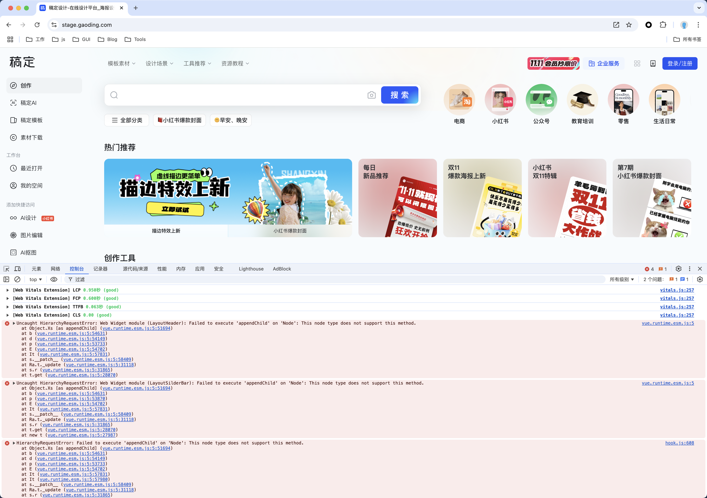
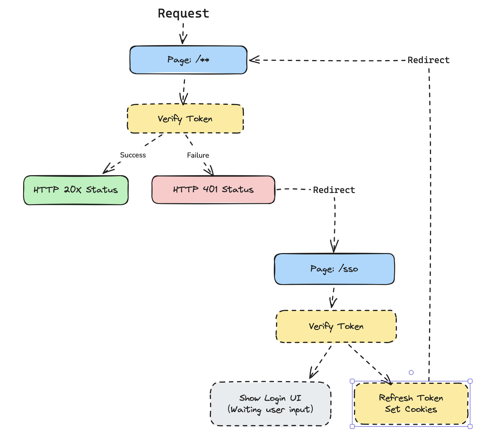
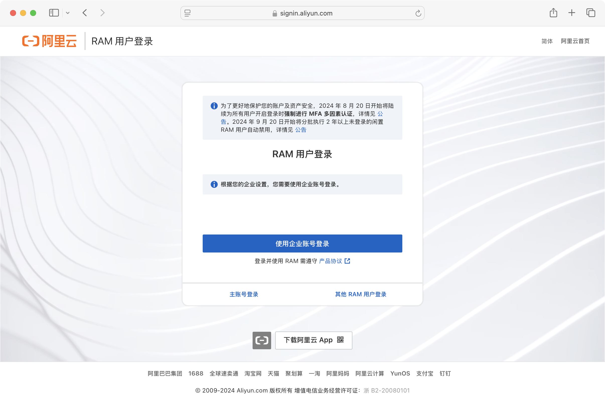

# RFC 16: SSR 鉴权流程标准化提议

> **文档来源**  
> Confluence: https://doc.huanleguang.com/pages/viewpage.action?pageId=415244577

---

## 文档概述

本 RFC 提出了 **SSR 场景下页面级鉴权流程的标准化方案**，通过行业通用的认证流程来提高站点的可用性和稳定性。

**核心目标**：
- 🎯 统一 SSR 鉴权流程
- 🔒 解决水合失败问题
- 🚫 避免缓存污染
- ✅ 符合 HTTP 语义
- 🌐 跨端一致体验

**状态**：
- ✅ 与基建团队达成共识
- ✅ 与业务相关团队达成共识
- ✅ 输出排期
- ✅ 输出 PR
- ✅ 已上线

**相关链接**：
- [会议沟通备忘录](https://doc.huanleguang.com/wiki/pages/viewpage.action?pageId=415262669)
- [排期计划](https://pingcode.intra.gaoding.com/pjm/projects/SREJC/backlog/652692bfa5244157b8845984)

---

## 一、介绍

### 1.1 文档范围

**本 RFC 涵盖**：
- ✅ 页面级的鉴权流程
- ✅ SSR 环境下的认证处理
- ✅ 浏览器、App WebView 的统一方案

**不在范围内**：
- ❌ API 的鉴权（API 有独立的鉴权机制）
- ❌ 微服务间的认证
- ❌ 具体的 Token 格式设计

### 1.2 历史背景

**早期尝试**：
- 多个技术文档或 PR 涉及过这个问题
- 因为各种原因没有继续推进
- 当初的一些结论也丢失了

**现在**：
- ✅ SSR 已成为主流架构
- ✅ 技术栈更加成熟
- ✅ 业务场景更加清晰
- ✅ 是时候标准化了

---

## 二、动机

### 2.1 核心问题

**背景**：
- 如今我们已经是 **SSR 优先**的网站架构
- 但留下了一个模糊的问题：**SSR 应当如何处理认证失败的情况？**

### 2.2 现状分析

**当前策略**：

```
SSR 阶段认证失败
   ↓
HTTP Status 200 + 未登录状态的页面
   ↓
客户端 JS 处理登录 Token 刷新
   ↓
重新认证、重新渲染组件
```

**问题表现**：

| 阶段 | 状态 | 问题 |
|------|------|------|
| **服务端渲染** | 未登录 | 输出未登录的 HTML |
| **客户端水合** | 已登录 | Token 刷新成功，状态变为已登录 |
| **结果** | 不一致 | 🔴 水合失败、缓存污染 |

### 2.3 问题一：无法点击的错误

**现象截图**：



**问题分析**：

**Vue/React 的要求**：
- 组件在服务端与客户端状态必须保持一致
- 状态不一致时框架会尝试错误恢复

**我们的现状**：
- 服务端：未登录状态
- 客户端：登录状态
- 结果：违反了一致性要求

**框架错误恢复的问题**：

```
前端框架宣称能处理状态不一致：
   ├─ 抛弃服务端渲染的 HTML
   └─ 完全由客户端重新输出 HTML
      ↓
   然而这个承诺并非 100% 可靠！
```

**实际情况**：

1. **Vue 2 的 BUG**：
   ```
   当遇到 v-if 指令的值（状态）双端不一致时
      ↓
   Vue 2 会崩溃且无法恢复 ❌
   ```

2. **严重的页面闪烁**：
   ```
   服务端输出：未登录页面（大量内容）
      ↓
   客户端水合：登录页面（完全不同的内容）
      ↓
   错误恢复：重新渲染整个页面
      ↓
   用户体验：严重闪烁 ❌
   ```

**结论**：

> 我们 SSR 面对登录过期的问题和使用 Vue 还是 jQuery 其实没有关系，  
> 靠框架或者手工处理这种细节都是不可靠的。

### 2.4 问题二：缓存污染

**问题描述**：

```
SSR 认证失败
   ↓
返回 HTTP Status 200
   +
Cache-Control: max-age=600
   ↓
CDN 缓存这个"未登录"的页面
   ↓
其他用户访问也看到"未登录"页面
   ↓
即使他们是登录状态！❌
```

**影响**：
- 🔴 已登录用户看到未登录页面
- 🔴 缓存了错误的内容
- 🔴 需要等待缓存过期（10分钟）

**示例场景**：

```
时间线：
10:00 - 用户 A Token 过期，访问首页
        → SSR 返回 200 + 未登录页面
        → CDN 缓存这个页面（10分钟）

10:01 - 用户 B（已登录）访问首页
        → CDN 返回缓存的"未登录"页面
        → 用户 B 看到未登录状态 ❌

10:05 - 用户 C（已登录）访问首页
        → 依然是缓存的"未登录"页面 ❌

10:10 - 缓存过期，恢复正常
```

---

## 三、提议内容

### 3.1 核心提议

> **提议**：采用行业主流的鉴权业务流程，在符合 HTTP Status 语义的前提下保证登录状态在多个端的一致，彻底避免具体技术栈、业务逻辑处理不当导致的稳定性隐患。

### 3.2 关键原则

| 原则 | 说明 | 收益 |
|------|------|------|
| **HTTP 语义正确** | 认证失败返回 401 | ✅ 符合标准、CDN 不缓存 |
| **状态一致** | 服务端客户端登录状态一致 | ✅ 避免水合失败 |
| **自动续签** | Token 可续期时自动刷新 | ✅ 提升用户体验 |
| **跨端统一** | Web/App 统一的处理流程 | ✅ 降低维护成本 |

---

## 四、详细设计

### 4.1 整体流程图



**流程概览**：

```
用户请求页面
   ↓
SSR 鉴权检查
   ├─ 成功 → 渲染页面
   └─ 失败 → 返回 401 + Location 头
      ↓
浏览器收到 401
   ↓
重定向到 /sso
   ↓
SSO 再次验证
   ├─ 可续期 → 302 + 刷新 Token → 返回业务页面
   └─ 完全过期 → 显示登录页面
```

### 4.2 SSR 端流程

**步骤详解**：

**步骤 1：接收请求并验证**

```javascript
// SSR 服务
app.get('/dashboard', async (req, res) => {
  // 调用 User API 或直接验证 JWT
  const authResult = await verifyAuth(req.headers.cookie);
  
  if (!authResult.success) {
    // 认证失败
    return res.status(401)
      .header('Location', `/sso?redirect=${encodeURIComponent(req.url)}`)
      .send(renderErrorPage('需要登录'));
  }
  
  // 认证成功，渲染页面
  const html = await renderPage(req, authResult.user);
  res.send(html);
});
```

**步骤 2：返回 401 状态**

```
HTTP/1.1 401 Unauthorized
Location: /sso?redirect=/dashboard
Content-Type: text/html

<!DOCTYPE html>
<html>
  <head>
    <title>需要登录</title>
  </head>
  <body>
    <p>正在跳转到登录页面...</p>
  </body>
</html>
```

**关键特性**：

| 特性 | 说明 | 作用 |
|------|------|------|
| **HTTP 401** | 表示未授权 | CDN 不会缓存此响应 |
| **Location 头** | 重定向地址 | 浏览器自动重定向 |
| **redirect 参数** | 原始请求的 URL | 登录后返回原页面 |

**步骤 3：验证方式选择**

**方式 A：调用 User API**

```javascript
async function verifyAuth(cookie) {
  const response = await fetch('https://api.gaoding.com/user/info', {
    headers: { Cookie: cookie }
  });
  
  if (response.ok) {
    return { success: true, user: await response.json() };
  }
  
  return { success: false };
}
```

**优点**：
- ✅ 最新的用户信息
- ✅ 服务端控制权限
- ✅ 可以处理复杂的鉴权逻辑

**缺点**：
- ⚠️ 增加一次网络请求
- ⚠️ 依赖 User API 可用性

**方式 B：直接验证 JWT**

```javascript
import jwt from 'jsonwebtoken';

async function verifyAuth(cookie) {
  const token = parseCookie(cookie).access_token;
  
  try {
    const decoded = jwt.verify(token, process.env.JWT_SECRET);
    return { success: true, user: decoded };
  } catch (error) {
    return { success: false };
  }
}
```

**优点**：
- ✅ 无需额外请求
- ✅ 性能更好
- ✅ 降低对 User API 的依赖

**缺点**：
- ⚠️ 无法实时吊销 Token
- ⚠️ 用户信息可能不是最新的

**推荐**：
- 🎯 一般页面：使用 JWT 验证（性能优先）
- 🎯 敏感页面：调用 User API（安全优先）

### 4.3 Web 浏览器端流程

#### 业务路由处理

**步骤 1：浏览器接收 401 响应**

```javascript
// 浏览器行为（自动）
fetch('/dashboard')
  .then(response => {
    if (response.status === 401) {
      // 浏览器看到 Location 头，自动重定向
      window.location.href = response.headers.get('Location');
    }
  });
```

**步骤 2：登录 SDK 优先使用 Cookies**

```javascript
// 登录 SDK
class AuthSDK {
  getToken() {
    // ✅ 优先从 Cookie 获取（服务端可以更新）
    const token = this.getTokenFromCookie();
    
    if (token) {
      return token;
    }
    
    // 降级：从 localStorage 获取
    return localStorage.getItem('access_token');
  }
  
  getTokenFromCookie() {
    const cookies = document.cookie.split(';');
    for (const cookie of cookies) {
      const [key, value] = cookie.trim().split('=');
      if (key === 'access_token') {
        return value;
      }
    }
    return null;
  }
}
```

**为什么优先使用 Cookie？**

| 存储方式 | 服务端可更新 | 跨域支持 | 安全性 | 推荐 |
|---------|------------|---------|--------|------|
| **Cookie** | ✅ 是 | ✅ 支持 | ✅ HttpOnly | 🎯 推荐 |
| **localStorage** | ❌ 否 | ❌ 不支持 | ⚠️ 易受 XSS | ⚠️ 降级 |

#### SSO 路由处理

**SSO 路由的职责**：

```javascript
// /sso 路由
app.get('/sso', async (req, res) => {
  const redirectUrl = req.query.redirect || '/';
  
  // 再次验证 Token
  const authResult = await verifyAndRefreshAuth(req.headers.cookie);
  
  if (authResult.success) {
    // 情况 1：Token 可续期
    if (authResult.refreshed) {
      // 更新 Cookie
      res.cookie('access_token', authResult.newToken, {
        httpOnly: true,
        secure: true,
        maxAge: 7 * 24 * 60 * 60 * 1000  // 7天
      });
      
      // 重定向回业务页面
      return res.redirect(302, redirectUrl);
    }
    
    // 情况 2：Token 依然有效（可能是网络抖动）
    return res.redirect(302, redirectUrl);
  }
  
  // 情况 3：完全过期，显示登录页面
  res.send(renderLoginPage(redirectUrl));
});
```

**处理流程图**：

```
/sso 收到请求
   ↓
验证 Token
   ├─ 有效 → 302 重定向回业务页面
   ├─ 可续期 → 刷新 Token + 302 重定向
   └─ 完全过期 → 显示登录页面
```

**响应示例**：

**场景 A：Token 续期成功**

```
HTTP/1.1 302 Found
Location: /dashboard
Set-Cookie: access_token=new_token; HttpOnly; Secure; Max-Age=604800
Set-Cookie: refresh_token=new_refresh; HttpOnly; Secure; Max-Age=2592000
```

**场景 B：Token 完全过期**

```
HTTP/1.1 200 OK
Content-Type: text/html

<!DOCTYPE html>
<html>
  <head><title>登录</title></head>
  <body>
    <form action="/api/login" method="POST">
      <input name="username" />
      <input name="password" type="password" />
      <button type="submit">登录</button>
    </form>
  </body>
</html>
```

### 4.4 App WebView 端流程

**特殊考虑**：

> App 端有自己的 Token 托管方法，应当避免服务端和客户端都在刷 Token 造成冲突。

**流程设计**：

**步骤 1：忽略 Location 头**

```java
// Android WebView
webView.setWebViewClient(new WebViewClient() {
    @Override
    public boolean shouldOverrideUrlLoading(WebView view, String url) {
        if (url.startsWith("/sso")) {
            // ❌ 不执行重定向
            // ✅ 交给原生处理
            handleAuthByNative();
            return true;
        }
        return false;
    }
    
    @Override
    public void onReceivedHttpError(WebView view, WebResourceRequest request, WebResourceResponse errorResponse) {
        if (errorResponse.getStatusCode() == 401) {
            // Token 过期，原生处理
            handleAuthByNative();
        }
    }
});
```

```swift
// iOS WKWebView
func webView(_ webView: WKWebView, decidePolicyFor navigationResponse: WKNavigationResponse, decisionHandler: @escaping (WKNavigationResponsePolicy) -> Void) {
    if let httpResponse = navigationResponse.response as? HTTPURLResponse {
        if httpResponse.statusCode == 401 {
            // Token 过期，原生处理
            handleAuthByNative()
            decisionHandler(.cancel)
            return
        }
    }
    decisionHandler(.allow)
}
```

**步骤 2：原生刷新 Token**

```java
// Android
private void handleAuthByNative() {
    // 情况 1：Token 可续期
    if (TokenManager.canRefresh()) {
        String newToken = TokenManager.refresh();
        
        // 重新加载页面（携带新 Token）
        webView.loadUrl(currentUrl, Map.of(
            "Authorization", "Bearer " + newToken
        ));
    } 
    // 情况 2：完全过期
    else {
        // 显示原生登录页面
        startActivity(new Intent(this, LoginActivity.class));
    }
}
```

**完整流程**：

```
App WebView 请求页面
   ↓
收到 401 响应
   ↓
拦截 401（不执行重定向）
   ↓
检查 Token 是否可续期
   ├─ 可续期
   │    ↓
   │  原生刷新 Token
   │    ↓
   │  携带新 Token 重新请求
   │    ↓
   │  成功
   │
   └─ 完全过期
        ↓
      显示原生登录页面
```

**关键差异**：

| 操作 | Web 浏览器 | App WebView |
|------|-----------|-------------|
| **收到 401** | 自动重定向到 /sso | 拦截，不重定向 |
| **Token 刷新** | 服务端刷新 | 原生刷新 |
| **Token 存储** | Cookie | 原生存储 |
| **登录页面** | Web 登录页 | 原生登录页 |

---

## 五、代替方案

### 5.1 方案 A：手动续签免登

**阿里云的方案**：



**工作方式**：

```
Token 过期
   ↓
显示提示页面："您的登录已过期，请点击按钮刷新"
   ↓
用户点击"刷新"按钮
   ↓
刷新 Token
   ↓
返回原页面
```

**对比分析**：

| 特性 | 阿里云方案 | 本 RFC 方案 |
|------|-----------|------------|
| **用户操作** | 需要点击按钮 | 自动刷新 |
| **体验** | 额外一步操作 | 无感知 |
| **实现复杂度** | 低 | 中 |
| **适用场景** | 安全性要求高的场景 | 一般业务场景 |

**什么时候使用手动续签？**

- ✅ 金融、支付等高安全场景
- ✅ 需要用户确认身份
- ✅ 长时间未操作后的续签

### 5.2 其他备选方案

**方案 B：客户端完全接管鉴权**

```
SSR 不做鉴权，返回未登录页面
   ↓
客户端 JS 检查登录状态
   ↓
如果已登录，重新渲染为登录状态
```

**问题**：
- ❌ 违反 SSR 原则（服务端客户端状态不一致）
- ❌ 严重的页面闪烁
- ❌ SEO 不友好

**方案 C：服务端始终返回登录状态页面**

```
SSR 阶段不管Token是否有效
   ↓
都返回登录状态的页面
   ↓
客户端再验证，无效则重新渲染
```

**问题**：
- ❌ 缓存污染更严重
- ❌ 可能泄露敏感信息
- ❌ 客户端需要重新渲染整个页面

---

## 六、待讨论的问题

### 6.1 问题 1：JWT 验证的潜在隐患

**问题**：

> 如果 SSR 直接验证 JWT 而非请求 User API 进行登录认证，有哪些潜在隐患？

**分析**：

**JWT 验证的问题**：

| 问题 | 说明 | 影响 |
|------|------|------|
| **无法实时吊销** | JWT 一旦签发，在过期前都有效 | 🔴 用户注销后 Token 依然可用 |
| **信息可能过期** | JWT 中的用户信息是签发时的快照 | ⚠️ 权限变更无法实时生效 |
| **依赖密钥安全** | 密钥泄露，所有 Token 都不安全 | 🔴 安全风险 |

**建议**：

```javascript
// 混合方案
async function verifyAuth(cookie) {
  // 步骤 1：先验证 JWT
  const jwtValid = verifyJWT(cookie);
  if (!jwtValid) {
    return { success: false };
  }
  
  // 步骤 2：对于敏感操作，再调用 User API
  if (isSensitiveRoute(req.url)) {
    return await callUserAPI(cookie);
  }
  
  // 步骤 3：一般页面直接使用 JWT
  return { success: true, user: jwtValid };
}
```

### 6.2 问题 2：无限重定向

**问题**：

> SSO 和业务 URL 之间可能会产生无限的重定向——这是否是一个问题？这个问题是否需要解决？

**场景分析**：

```
/dashboard (401) → /sso → /dashboard (401) → /sso → ...
```

**何时发生**：
- Token 完全过期
- SSO 验证失败但没有显示登录页
- 逻辑错误

**解决方案**：

```javascript
// 方案 A：计数器
app.get('/sso', (req, res) => {
  const retryCount = parseInt(req.query.retry || '0');
  
  if (retryCount > 3) {
    // 超过3次，强制显示登录页
    return res.send(renderLoginPage());
  }
  
  const authResult = await verifyAuth(req);
  if (!authResult.success) {
    return res.send(renderLoginPage());
  }
  
  res.redirect(req.query.redirect + `?retry=${retryCount + 1}`);
});

// 方案 B：时间窗口
app.get('/sso', (req, res) => {
  const timestamp = Date.now();
  const lastAttempt = req.cookies.last_auth_attempt;
  
  if (lastAttempt && timestamp - lastAttempt < 5000) {
    // 5秒内多次重定向，强制显示登录页
    return res.send(renderLoginPage());
  }
  
  res.cookie('last_auth_attempt', timestamp, { maxAge: 10000 });
  // ...
});
```

### 6.3 问题 3：历史 App 版本兼容性

**问题**：

> 此 RFC 是否对历史 App 版本有影响？

**分析**：

**旧版 App 的行为**：

| App 版本 | 是否拦截 401 | 行为 | 影响 |
|---------|------------|------|------|
| **新版（支持）** | ✅ 拦截 | 原生处理 | ✅ 按预期工作 |
| **旧版（不支持）** | ❌ 不拦截 | 跟随重定向到 /sso | ⚠️ 需要处理 |

**兼容方案**：

```javascript
// SSO 路由识别 App
app.get('/sso', (req, res) => {
  const userAgent = req.headers['user-agent'];
  const appVersion = parseAppVersion(userAgent);
  
  // 旧版 App：返回 JSON 而不是 HTML
  if (isOldAppVersion(appVersion)) {
    return res.json({
      code: 401,
      message: 'Token expired',
      action: 'show_native_login'
    });
  }
  
  // 新版 App 和 Web：正常流程
  // ...
});
```

**App 端处理**：

```java
// 旧版 App 特殊处理
webView.setWebViewClient(new WebViewClient() {
    @Override
    public void onPageFinished(WebView view, String url) {
        if (url.contains("/sso")) {
            // 评估 JS 获取响应
            view.evaluateJavascript(
                "(function() { return document.body.innerText; })()",
                value -> {
                    if (value.contains("show_native_login")) {
                        handleAuthByNative();
                    }
                }
            );
        }
    }
});
```

---

## 七、实施计划

### 7.1 阶段划分

**阶段 1：基础设施准备**
- [ ] SSO 路由实现
- [ ] Token 刷新逻辑
- [ ] 错误页面模板

**阶段 2：SSR 服务改造**
- [ ] 集成鉴权中间件
- [ ] 返回 401 响应
- [ ] 添加 Location 头

**阶段 3：客户端适配**
- [ ] 登录 SDK 更新
- [ ] Cookie 优先策略
- [ ] App WebView 拦截逻辑

**阶段 4：监控与优化**
- [ ] 监控 401 响应率
- [ ] 监控 Token 刷新成功率
- [ ] 优化性能瓶颈

### 7.2 风险评估

| 风险 | 影响 | 缓解措施 |
|------|------|---------|
| **大规模401响应** | 高 | 灰度发布、监控告警 |
| **Token刷新失败** | 高 | 降级方案、重试机制 |
| **App兼容性问题** | 中 | 版本检测、渐进式升级 |
| **性能下降** | 中 | 缓存优化、异步处理 |

---

## 八、总结

### 8.1 核心价值

**技术价值**：
- ✅ 符合 HTTP 标准语义
- ✅ 避免缓存污染
- ✅ 解决水合失败问题
- ✅ 跨端统一的鉴权流程

**业务价值**：
- ✅ 提升用户体验（自动续签）
- ✅ 提高系统稳定性
- ✅ 降低维护成本
- ✅ 减少生产事故

### 8.2 关键要点

**必须遵守的规则**：

1. **认证失败返回 401**，而不是 200
2. **服务端和客户端状态必须一致**
3. **Token 优先存储在 HttpOnly Cookie**
4. **App WebView 要拦截 401，使用原生鉴权**

### 8.3 下一步

**相关文档**：
- [OAuth 和 JWT 最佳实践](06-鉴权-SSR中使用OAuth和JWT的最佳实践.md)
- [Token 刷新并发问题](07-鉴权-服务端刷新tokens并发问题与解决方案.md)
- [Token 刷新策略讨论](08-鉴权-Token应当由服务端还是客户端刷新.md)

---

**文档维护**：前端基建团队  
**RFC 作者**：前端架构组  
**整理日期**：2025-01-25  
**文档版本**：v1.0
