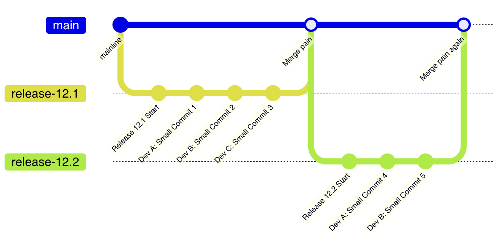
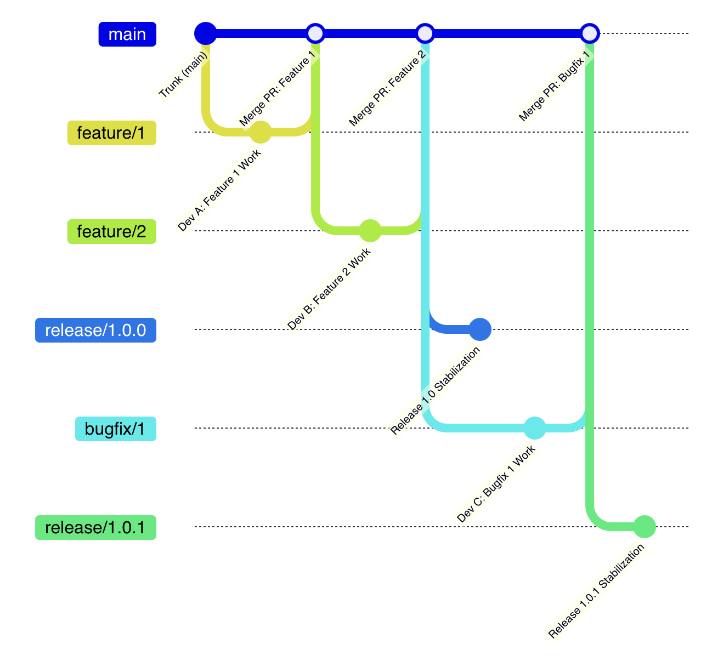

# Monorepo 主干开发与最佳实践

## 一、文档概述

本文档介绍了我们走向持续集成和持续发布过程中的关键部分——**基于主干开发**、**特性开关**、**基础设施即代码（IaC）**。这些方法对我们现有管理方法、开发习惯、基建有较大的不同，应当认为这是一个**模式级别的改变**。

本文档侧重介绍新模式以及最佳实践，例如面向 monorepo 的构建系统、单元测试等众所周知的环节被刻意忽略。

---

## 二、基于主干开发（Trunk-Based Development）

### 2.1 核心定义

**基于主干开发（Trunk-Based Development）**：开发人员围绕着主干分支上协作和编写代码，而没有其它共享的长期分支。

**核心特点：**
- 这种模式是持续集成、持续发布的最佳实践
- 不仅适用于几个人的小团队，也适用于上万人的团队协作
- 自从 2020 年起，Git 社区的默认分支已经从 `master` 变更为 `main`
- 此文档说的主干分支等同于 `main`

**成功案例：**
> Google 进行基于主干的开发，并在单个 monorepo 主干中拥有 **35000 名开发人员和 QA 自动化人员**。

### 2.2 对立面：在主干之外共享分支

#### 问题模式：长期存在的发布分支



<details>
<summary>查看分支图示例</summary>

```
gitGraph
commit id: "mainline"
branch release-12.1
checkout release-12.1
commit id: "Release 12.1 Start"
commit id: "Dev A: Small Commit 1"
commit id: "Dev B: Small Commit 2"
commit id: "Dev C: Small Commit 3"
checkout main
merge release-12.1 id: "Merge pain"
branch release-12.2
checkout release-12.2
commit id: "Release 12.2 Start"
commit id: "Dev A: Small Commit 4"
commit id: "Dev B: Small Commit 5"
checkout main
merge release-12.2 id: "Merge pain again"
```

</details>

**这个模式带来的问题：**
- **多人并行开发但不持续集成**
- **最终合并时冲突严重**
- **代码集成延迟**
- **问题发现时间延后**

相比之下，**Trunk-Based Development** 直接在 `main` 上进行开发，频繁集成，可以避免这些问题。

> ⚠️ **为什么不推荐 GitFlow**：GitFlow 之类的分支模型之所以不被推荐，正是因为它在主干之外共享了分支。

### 2.3 针对小型团队的主干开发

#### 适用场景
- 团队规模：1-10 人
- 活跃提交者数量较少
- 代码审查机制较为灵活

#### 工作模式


<details>
<summary>查看分支图示例</summary>

```
gitGraph
commit id: "Trunk (main)"
commit id: "Dev A: Small Commit 1"
commit id: "Dev B: Small Commit 2"
commit id: "Pre-Integration Build Pass"
commit id: "Dev C: Small Commit 3"
branch release/1.0.0
checkout release/1.0.0
commit id: "Release 1.0 Stabilization"
checkout main
commit id: "Dev A: Small Commit 4"
commit id: "Dev B: Small Commit 5"
branch release/1.0.1
checkout release/1.0.1
commit id: "Release 1.0.1 Stabilization"
checkout main
```

</details>

**关键特点：**
1. **直接提交到主干**：每个提交者都将小型提交直接推送到主干
2. **前置验证**：在提交之前已运行过构建步骤，并且必须通过验证
3. **版本分支可选**：通常由自动化工具创建，但开发者永远不会在版本分支中提交代码

**工作流程：**
```
1. 开发者在本地开发
2. 运行构建和测试
3. 通过验证后，直接提交到 main
4. 自动化工具创建发布分支（可选）
5. 发布分支仅用于稳定化，不接受开发提交
```

### 2.4 针对成规模团队的主干开发

#### 适用场景
- 团队规模：10+ 人
- 需要代码审查机制
- 需要更严格的质量控制

#### 工作模式



<details>
<summary>查看分支图示例</summary>

```
gitGraph
commit id: "Trunk (main)"
branch feature/1
checkout feature/1
commit id: "Dev A: Feature 1 Work"

checkout main
merge feature/1 id: "Merge PR: Feature 1"

branch feature/2
checkout feature/2
commit id: "Dev B: Feature 2 Work"

checkout main
merge feature/2 id: "Merge PR: Feature 2"

branch release/1.0.0
checkout release/1.0.0
commit id: "Release 1.0 Stabilization"

checkout main
branch bugfix/1
checkout bugfix/1
commit id: "Dev C: Bugfix 1 Work"

checkout main
merge bugfix/1 id: "Merge PR: Bugfix 1"

branch release/1.0.1
checkout release/1.0.1
commit id: "Release 1.0.1 Stabilization"

checkout main
```

</details>

**关键特点：**
1. **使用短期特性分支**：一个开发者完成任务的时间最长不超过几天
2. **PR 代码审查**：通过 PR 的代码审查和自动化构建流程进行验证
3. **及早合并**：完成验证后，及时合并到主干

**约束条件：**
- ✅ 允许"结对编程"在特性分支上协作
- ❌ 不允许当前特性无关的人员在特性分支提交代码
- ❌ 不允许长期存在的特性分支（最长几天）
- ✅ 版本分支由自动化工具创建，开发者不在版本分支提交代码

**工作流程：**
```
1. 从 main 创建短期特性分支
2. 在特性分支上开发（不超过几天）
3. 提交 PR 进行代码审查
4. 自动化构建和测试
5. 审查通过后，合并到 main
6. 删除特性分支
7. 自动化工具创建发布分支（可选）
```

---

## 三、基于主干开发的关键实践

### 3.1 核心原则

#### 1. 及早合并到主干
- **特性开发**：在主干中进行，及早合并
- **错误修复**：在主干中修复，避免在发布分支修复

**为什么？**
> 如果在发布分支中进行修复错误后再合并到主干，那么也有可能会忘记合并它，然后在下一个发布时刻会出现回归，引起团队成员相互指责。

#### 2. 尽可能的将操作自动化
- **环境管理**：开发测试环境的创建、销毁均应该自动化进行
- **构建流程**：自动化构建、测试、部署
- **版本发布**：自动化版本号生成、打包、发布

#### 3. 默认使用小的 PR
- **易于评审**：小的 PR 更容易进行代码审查
- **快速测试**：测试范围小，测试速度快
- **快速集成**：降低集成风险，减少冲突

**最佳实践：**
- PR 的修改行数控制在 200-400 行以内
- 一个 PR 只解决一个问题
- PR 描述清晰，包含背景、改动、测试

#### 4. 充分运用特性开关
- **保持主干可发布**：未完成的特性通过开关控制，不影响发布
- **灰度发布**：通过特性开关控制功能的发布范围
- **A/B 测试**：通过特性开关进行实验

**这是保持主干处于随时可发布的关键！**

#### 5. 快速的版本回滚
- **发现问题及时回滚**：快速回滚到上一个稳定版本
- **修正后再发布**：在主干修复问题后，重新发布

### 3.2 实践细则

**分支管理：**
- ✅ 主干分支（main）是唯一的长期分支
- ✅ 特性分支生命周期不超过几天
- ✅ 发布分支由自动化工具创建，定期清理
- ❌ 禁止在主干之外的共享分支（除了结对编程）
- ❌ 禁止长期分支（除了主干）
- ❌ 禁止开发者在发布分支上提交代码

**提交管理：**
- ✅ 小而频繁的提交
- ✅ 每次提交都通过自动化测试
- ✅ 提交信息清晰明了
- ❌ 禁止未经测试的提交
- ❌ 禁止破坏主干构建的提交

**代码审查：**
- ✅ 所有代码通过 PR 审查
- ✅ 自动化检查先行，人工审查后置
- ✅ 快速响应，及时合并
- ❌ 禁止跳过代码审查直接提交

---

## 四、特性开关（Feature Flags）

### 4.1 概念介绍

**特性开关（Feature Flags）**：通过使用特性标志，开发团队可以在不部署新版本的情况下切换特性、添加特性，从而实现更灵活的功能管理和发布控制。

**核心价值：**
- **解耦部署和发布**：代码可以部署，但功能不启用
- **渐进式发布**：逐步向用户开放新功能
- **快速回滚**：发现问题立即关闭，无需重新部署
- **A/B 测试**：不同用户看到不同的功能

### 4.2 粒度控制

特性标志的控制范围可以灵活调整：

**粗粒度：**
- 控制整个组件的用户界面
- 控制整个模块的功能
- 示例：新版编辑器、新版首页

**细粒度：**
- 根据用户的地理位置显示不同的温度单位
- 根据用户类型显示不同的价格
- 示例：付费功能、区域化功能

**开发人员可以根据需求设置不同的特性标志，以控制应用的不同功能。**

### 4.3 实现方式

#### 方式一：抽象层实现

在实现特性标志时，开发人员可以创建一个抽象层，然后在应用启动时根据传递的标志来决定使用哪个实现。

**示例：**
```typescript
// 特性标志配置
interface FeatureFlags {
  newEditor: boolean;
  darkMode: boolean;
  advancedSearch: boolean;
}

// 根据特性标志选择实现
function getEditorComponent(flags: FeatureFlags) {
  if (flags.newEditor) {
    return NewEditorComponent;
  }
  return LegacyEditorComponent;
}
```

#### 方式二：依赖注入

可以使用依赖注入（Dependency Injection）来根据配置选择相应的组件。

**示例：**
```typescript
// 使用依赖注入
@Injectable()
class EditorService {
  constructor(
    @Inject('FEATURE_FLAGS') private flags: FeatureFlags,
    @Inject('EDITOR_COMPONENT') private editor: IEditor
  ) {}
}
```

### 4.4 持续集成管道

**重要性：**
在持续集成（CI）过程中，确保对所有合理的特性标志组合进行测试非常重要。

**最佳实践：**
- 在每次提交代码后，CI 管道应针对每个有意义的特性标志组合并行运行测试
- 确保所有功能的正确性
- 避免特性标志组合导致的意外问题

**示例：**
```yaml
# CI 配置示例
test:
  matrix:
    feature-flags:
      - { newEditor: true, darkMode: true }
      - { newEditor: true, darkMode: false }
      - { newEditor: false, darkMode: true }
      - { newEditor: false, darkMode: false }
```

### 4.5 运行时可切换

**需求场景：**
有时仅在应用启动时设置特性标志是不够的，在很多场景下需要在不重新启动应用的情况下，动态启用或禁用功能。

**应用场景：**
- 节假日到来的时候启用特别功能
- 突发问题时快速关闭功能
- 根据服务器负载动态调整功能

**实现方式：**
- 从远程配置中心实时获取特性标志
- 通过管理后台动态修改特性标志
- 支持热更新，无需重启应用

### 4.6 技术债务管理

**警告：**
> ⚠️ 需要注意特性标志可能会引入技术债务。如果特性标志未被及时清理或管理不当，可能会导致代码库复杂性增加，影响代码的可维护性。

**最佳实践：**
1. **可搜索性**：特性开关至少要具备代码仓库中的可搜索性
2. **自动化检测**：最好能够被自动化工具检测
3. **定期清理**：定期清理已经稳定的特性标志
4. **文档记录**：记录特性标志的用途、生命周期

**清理策略：**
- 功能稳定后，移除特性标志
- 特性标志应该有明确的生命周期
- 使用工具自动检测过期的特性标志

---

## 五、特性开关实践

### 5.1 特性开关结合 AB 实验

**当前实践：**
这是我们已有的实践，不同之处在于当前的特性开关和 AB 实验紧密的绑定在一起。

**应用场景：**
- 新功能效果验证
- 用户体验优化
- 转化率提升实验

**实施步骤：**
1. 定义实验目标和指标
2. 创建特性标志，绑定实验分组
3. 实施功能开发
4. 收集数据，分析效果
5. 根据结果决定是否全量发布

### 5.2 特性开关结合灰度发布

**行业趋势：**
> 使用**灰度发布**（Gray Release）来管理**特性开关**（Feature Flags）的实践已经成为了一种主流方法，尤其是在现代敏捷开发和持续交付的环境中。

**对稿定 DevOps 的影响：**
当前的灰度机制是通过一个延后合并的版本分支来管理的，它违背了基于主干开发的最佳实践。我们必须利用特性开关逐步改进这个问题，让代码及早的合并。

**需要接受的变化：**
- ✅ 过去的灰度机制不侵入代码
- ⚠️ 特性开关的结合使用无法免去代码侵入
- ✅ 但带来了更好的可控性和灵活性

**灰度发布策略：**
1. **按用户百分比**：先向 5% 用户开放，逐步扩大到 100%
2. **按用户分组**：先向内部用户开放，再向外部用户开放
3. **按地域**：先向特定地区开放，再向全国开放
4. **按用户属性**：先向付费用户开放，再向免费用户开放

### 5.3 特性开关管理 SaaS 与 Self-Hosted 版本

**业务场景：**
Self-Hosted 版本与 SaaS 标准版本有很多功能差异。

**解决方案：**
特性开关可以在主干上区分这两个版本，这样 Self-Hosted 版本也能够基于主干开发的模式享受到持续集成与持续发布的优势。

**实施策略：**
```typescript
// 版本类型特性标志
const VERSION_FLAGS = {
  saas: {
    cloudStorage: true,
    aiFeatures: true,
    advancedAnalytics: true,
  },
  selfHosted: {
    cloudStorage: false,  // 自部署版本不使用云存储
    aiFeatures: false,     // AI 功能仅 SaaS 提供
    advancedAnalytics: false, // 高级分析仅 SaaS 提供
  },
};
```

**优势：**
- 统一代码库，降低维护成本
- 两个版本都能享受 CI/CD 的优势
- 功能差异清晰可控

---

## 六、基础设施即代码（IaC）

### 6.1 概念介绍

**基础设施即代码（Infrastructure as Code, IaC）**：一种配置管理形式，它将组织的基础架构资源编码为文本文件。然后这些基础架构文件将提交到 Git 这样的版本控制系统。

**核心理念：**
> 现代 DevOps 的基础设施通常等于代码。IaC 推崇将配置、流程等采用代码协作的方式进行，以适应复杂的环境、不断复杂的工程规模，是提高研发过程中自动化程度的最佳实践。

### 6.2 核心价值

#### 1. 版本控制
- 每次配置的变更都会被记录在版本控制系统中
- 方便审查、追溯和回滚
- 配置变更有完整的历史记录

#### 2. 一致性
- 环境的创建和管理变得自动化
- 避免了"配置漂移"（即生产、开发环境的差异）
- 确保所有环境的配置一致

#### 3. 可复现性
- 任何人都可以通过 IaC 脚本重建相同的环境
- 新环境搭建变得简单快速
- 灾难恢复更加可靠

#### 4. 团队协作
- 开发人员和运维人员可以使用相同的工具和流程来管理基础设施
- 减少沟通成本
- 提高协作效率

#### 5. 可生长
- 这种透明度可以让拥有较少背景信息的人员也能够持续的改进自动化工作流
- 知识沉淀在代码中，而不是在个人脑中
- 新人可以快速上手

### 6.3 支持依赖

版本控制存储库支持功能分支和 PR 工作流程，这是 CI/CD 的基础依赖关系。现代的 DevOps 实践中，早已经证明了将代码提交到 Git 存储库然后应用功能分支和 PR 工作流程是非常高效的。

---

## 七、IaC 实践

### 7.1 构建流水线配置放在仓库中

**为什么？**
- 构建流程的变更可追溯
- 团队成员可以协作改进构建流程
- 构建配置随代码一起演进

**示例：**
```yaml
# .github/workflows/ci.yml
name: CI

on:
  push:
    branches: [main]
  pull_request:
    branches: [main]

jobs:
  build:
    runs-on: ubuntu-latest
    steps:
      - uses: actions/checkout@v3
      - name: Install dependencies
        run: pnpm install
      - name: Run tests
        run: pnpm test
      - name: Build
        run: pnpm build
```

**状态：✅ 已经是 DevOps 团队的共识**

### 7.2 环境的配置放在仓库中

**为什么？**
- 环境配置可版本控制
- 环境搭建自动化
- 配置漂移可追踪

**实施方式：**
- 私密环境配置使用 GitHub 或者 GitLab 的环境功能保密管理
- 在代码中引入环境配置
- 不同环境使用不同的配置文件

**示例：**
```typescript
// config/production.ts
export default {
  database: {
    host: process.env.DB_HOST,
    port: parseInt(process.env.DB_PORT || '5432'),
  },
  redis: {
    host: process.env.REDIS_HOST,
    port: parseInt(process.env.REDIS_PORT || '6379'),
  },
};
```

**状态：✅ 正在成为共识中**

### 7.3 阿波罗启动配置放在仓库中

**为什么？**
- 启动配置可版本控制
- 配置变更可追溯
- 便于团队协作

**状态：⏳ 尚未沟通**

### 7.4 阿波罗运行时配置放在仓库中

**为什么？**
- 运行时配置可版本控制
- 配置变更可追溯
- 便于回滚

**状态：⏳ 尚未沟通**

---

## 八、争议性实践

### 8.1 团队规模的定义与流程

**争议点：**
主干开发：风格与权衡一文中，将活跃提交者的数量 1-100 之间称之为小团队，它建议使用直接提交代码到主干的工作模式。

**我们的选择：**
- 考虑到代码质量和团队协作
- 采用成规模团队的工作模式（使用 PR）
- 即使团队较小，也保持 PR 审查机制

### 8.2 主干构建失败自动撤回提交

**Google 的实践：**
在 Google 的实践中，发现主干构建失败后自动化工具将自动撤回失败的提交，并且通知开发者修复后再合并。

**争议点：**
- 自动撤回可能导致其他开发者的困扰
- 需要完善的通知机制
- 需要快速的修复响应

**我们的选择：**
- 暂不采用自动撤回
- 使用 PR 机制，在合并前确保构建成功
- 保持主干的稳定性

### 8.3 在发布分支中挑选 Bugfix 到主干

**争议点：**
- 在发布分支中挑选 Bugfix 到主干
- 或者挑选特性到发布分支

**我们的立场：**
- ❌ 不推荐在发布分支中修复后挑选到主干
- ✅ 推荐在主干中修复，然后自动化发布
- ❌ 不推荐挑选特性到发布分支

**原因：**
- 容易忘记合并，导致回归
- 增加管理复杂度
- 违背主干开发原则

### 8.4 端对端测试的用例和开发的仓库是分开的

**当前问题：**
开发和 QA 不知道对方在做什么，也无法一起改进测试用例。

**我们的立场：**
- ✅ 推荐端对端测试用例放在同一个仓库
- ✅ 开发和 QA 共同维护测试用例
- ✅ 测试用例随代码一起演进

---

## 九、参考资料

### 9.1 基于主干开发

- **Paul Hammant: 基于主干开发** - 主干开发的权威指南
- **Google Cloud: 基于主干开发** - Google 的实践经验

### 9.2 基础设施即代码（IaC）

- **Amazon: 什么是基础设施即代码** - AWS 的 IaC 实践
- **Atlassian: 基础设施即代码** - Atlassian 的 IaC 指南
- **Google Cloud 上的基础架构即代码** - GCP 的 IaC 实践
- **陶建辉: 研发天天加班，但总是忙不过来，为什么这样，有解吗？** - 国内视角的思考

### 9.3 特性开关

- **Feature Toggles** - 著名软件工程师 Martin Fowler 讨论了特性开关的基本概念以及如何使用特性开关进行持续交付和灰度发布
- **LaunchDarkly** - 流行的特性开关管理平台，提供了关于特性开关、灰度发布等方面的丰富资源和最佳实践
- **Unleash** - 开源的特性开关平台，支持灰度发布，提供许多关于如何实施特性开关的文档和案例研究
- **Atlassian: Feature Flagging Tutorials** - 关于特性开关在持续交付（CD）中的应用，阐述了特性开关和灰度发布如何支持快速迭代和降低风险
- **GitHub** - 博客文章讨论了如何在大规模环境中管理特性开关，涉及了灰度发布的策略与实践

---

## 十、总结

### 10.1 核心要点

1. **基于主干开发**是持续集成、持续发布的基础
2. **特性开关**是保持主干随时可发布的关键
3. **基础设施即代码**是提高自动化程度的最佳实践
4. **小而频繁的提交**降低集成风险
5. **及早合并**避免分支偏离过远

### 10.2 模式转变

这是一个**模式级别的改变**，涉及：
- **管理方法**：从分支管理到主干开发
- **开发习惯**：从长期分支到短期分支
- **基础设施**：从手工操作到自动化
- **团队协作**：从各自为战到持续集成

### 10.3 预期收益

**短期：**
- 减少集成冲突
- 提高部署频率
- 加快问题发现

**长期：**
- 提升团队效率
- 降低维护成本
- 提高代码质量

### 10.4 下一步

1. 阅读 [CI/CD 工作流设计](../02-工作流设计/CI-CD工作流设计.md)
2. 了解具体的工作流程和自动化实现
3. 在项目中逐步应用这些实践

---

*文档版本：v1.0*  
*最后更新：2025-01-25*
