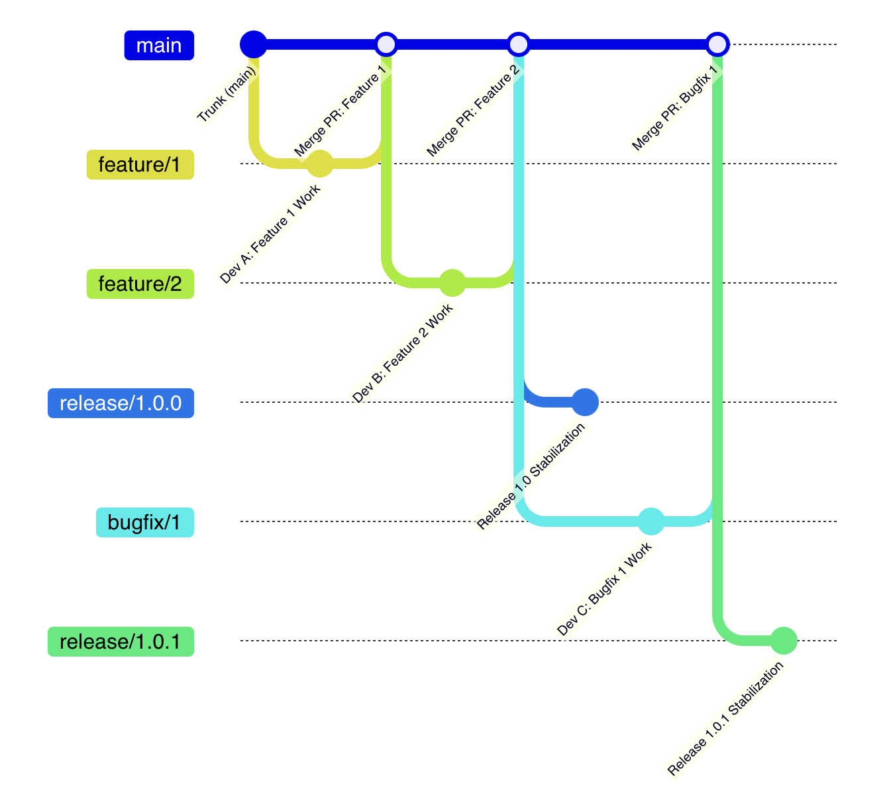
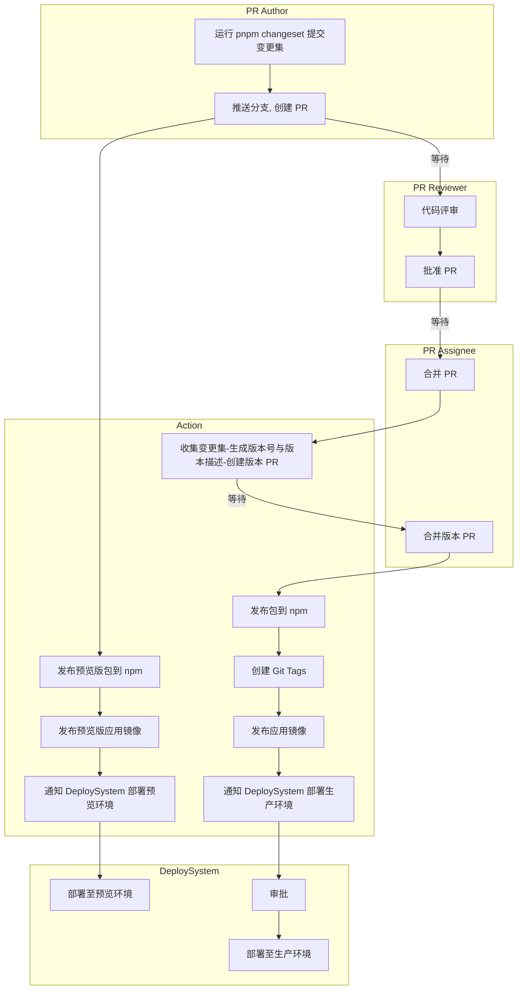

# RFC 17: Monorepo 包和应用 CI/CD 工作流设计

## 一、文档概述

### 1.1 方案背景

> 📌 **重要说明**  
> 这份方案是在过去内部讨论的共识基础上进一步完善而来：基于人和系统的维度，提出包和应用发布的完整自动化工作流，以便对齐自动化系统实施的细节；通过持续完善后，这份文档也将会发展为一线开发的指南。

### 1.2 理念依据

> 📖 **IaC 理念**  
> 现代 DevOps 的基础设施通常等于代码，即—— IaC。IaC 推崇将配置、流程等采用代码协作的方式进行，以适应复杂的环境、不断复杂的工程规模，是提高研发过程中自动化程度的最佳实践。

这份提案遵循 IaC 的理念，遵循行业中持续集成、持续交付的最佳实践。

**更多背景信息见**：[主干开发与最佳实践](../01-核心概念/主干开发与最佳实践.md)

### 1.3 平台说明

> ℹ️ **术语说明**  
> 虽然我们即将要迁移到 GitLab，但由于这份文档最初是基于 GitHub 创建的，所以相关术语依然采用 GitHub 的术语，但这些工作流也适用于 GitLab。

**MVP 验证仓库：**
目前提案已经在实施阶段，在一个独立的仓库中部署自动化脚本，验证 MVP：
https://gitlab.gaoding.com/gdesign/monorepo-workflows-example

---

## 二、核心约定

### 2.1 版本管理约定

#### 语义化版本规范
- 包和应用遵循 **语义化版本** 规范
- 版本号格式：`MAJOR.MINOR.PATCH`
  - `MAJOR`：重大更新，不兼容的 API 修改
  - `MINOR`：功能更新，向后兼容的功能新增
  - `PATCH`：问题修正，向后兼容的错误修复

#### 发布前提
- 无论是包还是应用，有 **变更集（Changeset）** 才能发布
- 变更集记录了改动内容和影响范围
- 变更集决定版本号如何变化

### 2.2 分支模型约定

#### 主分支
- 采用 **基于主干的开发** 模式
- 以 **main** 作为主分支

> ⚠️ **注意事项**  
> 由于大多数项目当前默认分支为 `master`，使用 `main` 作为新的主分支可以减少迁移过程和旧的工作流冲突。

#### 分支类型
1. **主干分支（main）**：唯一的长期分支
2. **特性分支（feature/\*）**：短期分支，用于开发新特性
3. **修复分支（bugfix/\*）**：短期分支，用于修复问题
4. **发布分支（release/\*）**：自动创建，用于版本发布

---

## 三、分支模型

### 3.1 分支模型图示



<details>
<summary>查看详细分支流程</summary>

```
gitGraph
commit id: "Trunk (main)"
branch feature/1
checkout feature/1
commit id: "Dev A: Feature 1 Work"

checkout main
merge feature/1 id: "Merge PR: Feature 1"

branch feature/2
checkout feature/2
commit id: "Dev B: Feature 2 Work"

checkout main
merge feature/2 id: "Merge PR: Feature 2"

branch release/1.0.0
checkout release/1.0.0
commit id: "Release 1.0 Stabilization"

checkout main
branch bugfix/1
checkout bugfix/1
commit id: "Dev C: Bugfix 1 Work"

checkout main
merge bugfix/1 id: "Merge PR: Bugfix 1"

branch release/1.0.1
checkout release/1.0.1
commit id: "Release 1.0.1 Stabilization"

checkout main
```

</details>

### 3.2 分支约束

**允许的操作：**
- ✅ 从 main 创建短期特性分支
- ✅ 特性分支允许"结对编程"
- ✅ 自动化工具创建发布分支

**禁止的操作：**
- ❌ 除了"结对编程"之外，不允许在主干分支之外的共享分支
- ❌ 不允许主干之外的长期分支，发布分支要定期清理
- ❌ 不允许开发者在发布分支上提交代码

---

## 四、角色定义

### 4.1 人类角色

#### PR Author（PR 作者）
- **职责**：创建和维护 PR
- **工作**：
  - 完成代码变更
  - 运行 `pnpm changeset` 添加变更记录
  - 推送分支，创建 PR
  - 响应评审意见

#### PR Reviewer（PR 评审者）
- **职责**：代码评审和质量把关
- **工作**：
  - 进行代码评审
  - 提出改进意见
  - 批准 PR

#### PR Assignee（PR 处理者）
- **职责**：PR 的最终合并决策
- **工作**：
  - 确认一切就绪
  - 合并来自 Author 的特性 PR
  - 合并来自 Action 的版本 PR

### 4.2 自动化系统角色

#### Action（工作流任务脚本）
- **职责**：自动化构建、测试、发布
- **工作**：
  - 运行代码检查和单元测试
  - 发布预览版包和应用
  - 收集变更集，生成版本号
  - 创建版本 PR
  - 发布正式版包和应用
  - 创建 Git Tags
  - 通知部署系统

#### DeploySystem（应用部署系统）
- **职责**：应用的部署和运维
- **工作**：
  - 部署至预览环境
  - 部署审批
  - 部署至生产环境
  - 服务监控和健康检查

---

## 五、发布工作流

### 5.1 完整流程图



> ℹ️ **说明**  
> 为了突出核心部分，流程图中省略了代码检查、单元测试等流程。

### 5.2 开发阶段

#### 步骤 1：完成代码变更

**PR Author** 完成代码变更后，运行 `pnpm changeset` 添加变更记录。

**操作示例：**
```bash
# 添加变更集
pnpm changeset

# 选择变更类型
? What kind of change is this for @gaoding/package-a?
  ❯ patch (bug fix)
    minor (feature)
    major (breaking change)

# 填写变更描述
? Please enter a summary for this change:
  Fix: 修复按钮点击无响应的问题 #PINGCODE-1234
```

**变更集文件示例：**
```markdown
---
"@gaoding/package-a": patch
---

Fix: 修复按钮点击无响应的问题 #PINGCODE-1234
```

#### 步骤 2：推送分支到远程后发起 PR

**PR Author** 推送分支到远程后发起 PR。

**操作示例：**
```bash
# 推送分支
git push origin feature/fix-button-click

# 在 GitHub/GitLab 上创建 PR
# PR 标题：Fix: 修复按钮点击无响应的问题
# PR 描述：关联 PingCode 任务 #PINGCODE-1234
```

### 5.3 测试阶段

#### 步骤 1：发布预览版

**Action** 自动执行以下操作：
1. 发布预览包到 npm
2. 发布预览应用镜像到指定平台

**预览版本号格式：**
```
1.2.3-pr-123.1
```

#### 步骤 2：通知部署系统

**Action** 通知 DeploySystem 平台部署预览环境。

#### 步骤 3：部署预览环境

**DeploySystem** 将镜像部署到云平台、启动服务。

> ⚠️ **注意**  
> 由于 `stage` 是公共的测试环境，会存在占用的可能，因此需要沟通。

**预览环境信息：**
- 环境 URL：`https://pr-123.preview.gaoding.com`
- 有效期：PR 关闭后自动销毁
- 数据：使用测试数据，不影响生产数据

### 5.4 发布阶段

#### 步骤 1：代码评审

**PR Reviewer** 进行代码评审：
- 检查代码质量
- 验证变更集内容
- 确认测试通过
- 批准 PR

#### 步骤 2：合并特性 PR

**PR Assignee** 确认一切就绪后合并来自 Author 的特性 PR。

**合并方式：**
- 使用 Squash and Merge（推荐）
- 保持主干提交历史清晰

#### 步骤 3：生成版本 PR

**Action** 自动执行：
1. 收集变更集
2. 生成版本号与版本描述
3. 创建版本 PR

**版本 PR 示例：**
```markdown
Title: chore: version packages

## Releases

- @gaoding/package-a@1.2.4
- @gaoding/app-editor@2.0.1

## Changes

### @gaoding/package-a@1.2.4
- Fix: 修复按钮点击无响应的问题 #PINGCODE-1234

### @gaoding/app-editor@2.0.1
- Fix: 修复编辑器保存失败的问题 #PINGCODE-1235
```

#### 步骤 4：合并版本 PR

**PR Assignee** 确认一切就绪后合并来自 Action 的版本 PR。

**确认项：**
- ✅ 版本号正确
- ✅ 变更描述清晰
- ✅ 没有遗漏的变更
- ✅ CI 检查通过

#### 步骤 5：发布包和镜像

**Action** 自动执行：
1. 打包版本
2. 发布包到 npm
3. 创建版本 Git Tags
4. 推送 Docker Image 到指定平台

**npm 发布示例：**
```bash
# 发布包
pnpm publish -r --filter "./packages/*"

# 创建 Git Tags
git tag @gaoding/package-a@1.2.4
git tag @gaoding/app-editor@2.0.1

# 推送 Tags
git push --tags
```

#### 步骤 6：通知部署系统

**Action** 通知 DeploySystem 平台部署。

**通知信息：**
```json
{
  "application": "app-editor",
  "version": "2.0.1",
  "image": "registry.gaoding.com/app-editor:2.0.1",
  "environment": "production",
  "changelog": "Fix: 修复编辑器保存失败的问题 #PINGCODE-1235"
}
```

#### 步骤 7：生产环境部署

**DeploySystem** 审批后将镜像部署到云平台、启动服务。

**部署流程：**
1. 审批（由运维或负责人审批）
2. 灰度发布（先发布到部分节点）
3. 监控验证（检查服务健康状态）
4. 全量发布（发布到所有节点）
5. 发布完成（通知相关人员）

---

## 六、变更集（Changeset）管理

### 6.1 什么是变更集

**变更集（Changeset）** 是一个描述代码变更的 Markdown 文件，包含：
- 变更的包名
- 变更类型（patch、minor、major）
- 变更描述

### 6.2 创建变更集

**命令：**
```bash
pnpm changeset
```

**交互流程：**
```
? Which packages would you like to include?
  ◯ @gaoding/package-a
  ◯ @gaoding/package-b
  ◉ @gaoding/app-editor

? What kind of change is this for @gaoding/app-editor?
  ◯ patch
  ◯ minor
  ◉ major

? Please enter a summary for this change:
  Breaking: 重构编辑器核心架构 #PINGCODE-2000
```

**生成的文件：**
```markdown
# .changeset/gentle-foxes-dance.md
---
"@gaoding/app-editor": major
---

Breaking: 重构编辑器核心架构 #PINGCODE-2000
```

### 6.3 如何关联 PingCode 任务

在变更集中填写 `#PingCodeID` 即可，正如在 GitHub 关联 issues 一样简单。

**示例：**
```markdown
---
"@gaoding/package-a": patch
---

Fix: 修复按钮样式问题 #PINGCODE-1234
```

### 6.4 变更集的生命周期

1. **创建**：开发者运行 `pnpm changeset` 创建
2. **提交**：随代码一起提交到 Git
3. **审查**：作为 PR 的一部分进行审查
4. **收集**：Action 收集所有变更集
5. **生成版本**：根据变更集生成版本号和 CHANGELOG
6. **清理**：发布后自动删除

---

## 七、CI/CD 流水线详解

### 7.1 PR 检查流水线

**触发时机：**
- 创建 PR 时
- PR 更新时

**执行步骤：**
```yaml
name: PR Check

on:
  pull_request:
    branches: [main]

jobs:
  check:
    runs-on: ubuntu-latest
    steps:
      - name: Checkout
        uses: actions/checkout@v3
        
      - name: Setup Node.js
        uses: actions/setup-node@v3
        with:
          node-version: '18'
          
      - name: Install dependencies
        run: pnpm install
        
      - name: Lint
        run: pnpm lint
        
      - name: Type check
        run: pnpm type-check
        
      - name: Unit tests
        run: pnpm test
        
      - name: Build
        run: pnpm build
```

### 7.2 预览发布流水线

**触发时机：**
- PR 创建或更新时

**执行步骤：**
```yaml
name: Preview Release

on:
  pull_request:
    branches: [main]

jobs:
  preview:
    runs-on: ubuntu-latest
    steps:
      - name: Checkout
        uses: actions/checkout@v3
        
      - name: Setup Node.js
        uses: actions/setup-node@v3
        
      - name: Install dependencies
        run: pnpm install
        
      - name: Build
        run: pnpm build
        
      - name: Publish preview packages
        run: pnpm publish -r --tag pr-${{ github.event.pull_request.number }}
        
      - name: Build Docker image
        run: docker build -t app:pr-${{ github.event.pull_request.number }} .
        
      - name: Push Docker image
        run: docker push app:pr-${{ github.event.pull_request.number }}
        
      - name: Notify deploy system
        run: |
          curl -X POST ${{ secrets.DEPLOY_WEBHOOK_URL }} \
            -H "Content-Type: application/json" \
            -d '{
              "pr": "${{ github.event.pull_request.number }}",
              "image": "app:pr-${{ github.event.pull_request.number }}",
              "environment": "preview"
            }'
```

### 7.3 版本管理流水线

**触发时机：**
- PR 合并到 main 时

**执行步骤：**
```yaml
name: Version Management

on:
  push:
    branches: [main]

jobs:
  version:
    runs-on: ubuntu-latest
    steps:
      - name: Checkout
        uses: actions/checkout@v3
        with:
          fetch-depth: 0
          
      - name: Setup Node.js
        uses: actions/setup-node@v3
        
      - name: Install dependencies
        run: pnpm install
        
      - name: Create version PR
        run: |
          pnpm changeset version
          
          # 如果有版本变更，创建 PR
          if [[ -n $(git status -s) ]]; then
            git config user.name "github-actions[bot]"
            git config user.email "github-actions[bot]@users.noreply.github.com"
            
            git checkout -b changeset-release/main
            git add .
            git commit -m "chore: version packages"
            git push origin changeset-release/main
            
            # 创建 PR
            gh pr create \
              --title "chore: version packages" \
              --body "This PR was automatically generated by changeset" \
              --base main \
              --head changeset-release/main
          fi
```

### 7.4 正式发布流水线

**触发时机：**
- 版本 PR 合并到 main 时

**执行步骤：**
```yaml
name: Release

on:
  push:
    branches: [main]
    paths:
      - '.changeset/**'
      - 'packages/**/package.json'

jobs:
  release:
    runs-on: ubuntu-latest
    steps:
      - name: Checkout
        uses: actions/checkout@v3
        
      - name: Setup Node.js
        uses: actions/setup-node@v3
        
      - name: Install dependencies
        run: pnpm install
        
      - name: Build
        run: pnpm build
        
      - name: Publish to npm
        run: pnpm publish -r
        env:
          NPM_TOKEN: ${{ secrets.NPM_TOKEN }}
          
      - name: Create Git tags
        run: |
          git config user.name "github-actions[bot]"
          git config user.email "github-actions[bot]@users.noreply.github.com"
          
          # 为每个发布的包创建 tag
          pnpm changeset tag
          git push --tags
          
      - name: Build Docker images
        run: |
          for app in apps/*; do
            docker build -t $app:$(cat $app/package.json | jq -r .version) $app
          done
          
      - name: Push Docker images
        run: docker push --all-tags
        
      - name: Notify deploy system
        run: |
          curl -X POST ${{ secrets.DEPLOY_WEBHOOK_URL }} \
            -H "Content-Type: application/json" \
            -d @release-info.json
```

---

## 八、环境管理

### 8.1 环境类型

| 环境 | 用途 | 数据 | 访问权限 |
|------|------|------|---------|
| **开发环境（dev）** | 本地开发 | 本地数据/测试数据 | 开发者 |
| **预览环境（preview）** | PR 预览 | 测试数据 | 内部团队 |
| **测试环境（stage）** | 集成测试 | 测试数据 | 内部团队 |
| **生产环境（production）** | 正式服务 | 生产数据 | 所有用户 |

### 8.2 环境配置管理

**使用 GitHub/GitLab 环境功能：**
```yaml
# .github/workflows/deploy.yml
jobs:
  deploy:
    environment:
      name: production
      url: https://app.gaoding.com
    steps:
      - name: Deploy
        run: deploy.sh
        env:
          DATABASE_URL: ${{ secrets.DATABASE_URL }}
          API_KEY: ${{ secrets.API_KEY }}
```

**环境变量管理：**
- 敏感信息使用 Secrets 管理
- 非敏感配置可以放在代码中
- 不同环境使用不同的配置文件

---

## 九、最佳实践

### 9.1 变更集最佳实践

**Do：**
- ✅ 每个 PR 都包含变更集
- ✅ 变更描述清晰明了
- ✅ 关联 PingCode 任务
- ✅ 选择正确的变更类型

**Don't：**
- ❌ 忘记创建变更集
- ❌ 变更描述过于简单
- ❌ 选错变更类型
- ❌ 一个变更集包含多个不相关的改动

### 9.2 PR 最佳实践

**Do：**
- ✅ PR 保持小而专注
- ✅ PR 标题清晰
- ✅ PR 描述完整
- ✅ 及时响应评审意见

**Don't：**
- ❌ 大而全的 PR
- ❌ PR 标题不清晰
- ❌ PR 缺少描述
- ❌ 长时间不响应评审

### 9.3 发布最佳实践

**Do：**
- ✅ 定期发布，避免积累
- ✅ 发布前充分测试
- ✅ 准备好回滚方案
- ✅ 发布后监控服务状态

**Don't：**
- ❌ 长时间不发布
- ❌ 测试不充分就发布
- ❌ 没有回滚方案
- ❌ 发布后不监控

---

## 十、参考资料

### 10.1 模式相关

- **基于主干的开发模式** - 参见 [主干开发与最佳实践](../01-核心概念/主干开发与最佳实践.md)
- **DevOps 基础设施即代码** - IaC 最佳实践

### 10.2 具体实践相关

- **GitHub: 管理部署环境** - GitHub Actions 环境管理
- **GitHub: 触发工作流事件-workflow_dispatch** - 手动触发工作流
- **changesets: 自动化变更集** - Changesets 官方文档
- **changesets: 预发布版本** - 预发布版本管理
- **changesets: 快照发布** - 快照版本发布
- **changesets: 发布应用** - 应用发布流程
- **React 的每日构建版本** - React 的发布实践

---

## 十一、总结

### 11.1 工作流核心

1. **变更集驱动**：所有发布都基于变更集
2. **自动化优先**：尽可能自动化每个环节
3. **主干开发**：基于主干的开发模式
4. **快速反馈**：PR 预览提供快速反馈
5. **质量保障**：代码审查和自动化测试

### 11.2 角色职责

**开发者：**
- 创建变更集
- 提交 PR
- 响应评审

**评审者：**
- 代码评审
- 批准 PR

**自动化系统：**
- 运行检查
- 发布预览
- 生成版本
- 部署应用

### 11.3 预期收益

**效率提升：**
- 自动化减少手工操作
- 预览环境加快验证
- 快速发布缩短周期

**质量保障：**
- 代码审查确保质量
- 自动化测试覆盖
- 灰度发布降低风险

**团队协作：**
- 流程透明可追溯
- 职责清晰明确
- 沟通成本降低

---

*文档版本：v1.0*  
*最后更新：2025-01-25*
