# 指南：在 Monorepo 中使用 pnpm + Turbo 构建 Docker 镜像

## 一、文档概述

> 📌 **内容说明**  
> 本文介绍如何在 Monorepo 项目中配合使用 pnpm、Turbo 和 Docker，实现高效的容器镜像构建流程。通过预先构建 dist 产物，再进入 Docker 构建流程，可以充分利用构建缓存，提高构建效率。

### 1.1 背景

在 Monorepo 项目中，我们采用以下技术栈：
- **pnpm**：包管理工具，支持 workspace 和高效的依赖管理
- **Turbo**：任务管理工具，提供智能缓存和并行构建
- **Docker**：容器化技术，用于应用部署

### 1.2 项目结构

```
monorepo/
├── apps/                    # 应用目录
│   ├── app-editor/         # 编辑器应用（独立）
│   ├── app-admin/          # 管理后台应用（独立）
│   └── app-api/            # API 服务（独立）
├── packages/               # 公共包目录
│   ├── ui-components/      # UI 组件库
│   ├── utils/              # 工具函数库
│   └── shared-config/      # 共享配置
├── package.json
├── pnpm-workspace.yaml
└── turbo.json
```

**特点：**
- `apps/` 目录中的应用相互独立，没有依赖关系
- `apps/` 中的应用可能共同依赖 `packages/` 中的公共包
- 每个应用需要能够独立构建 Docker 镜像

---

## 二、核心设计原则

### 2.1 预构建策略

**为什么要预构建？**
- ✅ 利用 Turbo 的缓存机制，避免重复构建
- ✅ 分离构建和镜像打包过程，提高效率
- ✅ 更好的调试和问题定位
- ✅ 可以在本地验证构建产物

**构建流程：**
```
1. 使用 Turbo 构建应用（生成 dist/）
2. 将构建产物复制到 Docker 镜像
3. 在镜像中配置运行环境
4. 启动应用
```

### 2.2 Dockerfile 放置策略

**每个 app 放独立的 Dockerfile（推荐）**

**优势：**
- ✅ Turbo 可以管理 Docker 构建任务
- ✅ 每个应用的构建配置独立，互不影响
- ✅ 更容易维护和定制
- ✅ 支持并行构建多个镜像

**结构：**
```
apps/
├── app-editor/
│   ├── src/
│   ├── package.json
│   ├── Dockerfile          # ← 每个 app 有自己的 Dockerfile
│   └── .dockerignore
├── app-admin/
│   ├── src/
│   ├── package.json
│   ├── Dockerfile          # ← 每个 app 有自己的 Dockerfile
│   └── .dockerignore
```

---

## 三、方案设计

### 3.1 整体架构

```mermaid
graph LR
    A[源代码] --> B[pnpm install]
    B --> C[Turbo build]
    C --> D[生成 dist/]
    D --> E[Docker build]
    E --> F[Docker 镜像]
    
    style C fill:#90EE90
    style E fill:#87CEEB
```



### 3.2 构建流程

#### 阶段一：本地构建
```bash
# 1. 安装依赖
pnpm install

# 2. 使用 Turbo 构建所有应用
pnpm turbo build

# 3. 构建特定应用
pnpm turbo build --filter=app-editor
```

#### 阶段二：Docker 镜像构建
```bash
# 构建单个应用的镜像
docker build -f apps/app-editor/Dockerfile -t app-editor:latest .

# 或使用 Turbo 管理
pnpm turbo docker:build --filter=app-editor
```

---

## 四、配置详解

### 4.1 pnpm workspace 配置

**pnpm-workspace.yaml：**
```yaml
packages:
  - 'apps/*'
  - 'packages/*'
```

**根目录 package.json：**
```json
{
  "name": "monorepo",
  "private": true,
  "scripts": {
    "build": "turbo build",
    "docker:build": "turbo docker:build"
  },
  "devDependencies": {
    "turbo": "^1.10.0"
  }
}
```

### 4.2 Turbo 配置

**turbo.json：**
```json
{
  "$schema": "https://turbo.build/schema.json",
  "pipeline": {
    "build": {
      "dependsOn": ["^build"],
      "outputs": ["dist/**", ".next/**"],
      "cache": true
    },
    "docker:build": {
      "dependsOn": ["build"],
      "cache": false
    }
  }
}
```

**说明：**
- `build` 任务会先构建依赖的包（`^build`）
- `docker:build` 任务依赖于 `build` 任务
- `build` 任务启用缓存，`docker:build` 不缓存

### 4.3 应用 package.json 配置

**apps/app-editor/package.json：**
```json
{
  "name": "app-editor",
  "version": "1.0.0",
  "scripts": {
    "dev": "next dev",
    "build": "next build",
    "start": "next start",
    "docker:build": "docker build -f Dockerfile -t app-editor:latest ../../"
  },
  "dependencies": {
    "@monorepo/ui-components": "workspace:*",
    "@monorepo/utils": "workspace:*",
    "next": "^13.0.0",
    "react": "^18.0.0"
  }
}
```

**关键点：**
- `docker:build` 脚本构建 Docker 镜像
- 使用 `workspace:*` 引用 monorepo 内的包
- Docker 构建上下文是仓库根目录（`../../`）

---

## 五、Dockerfile 最佳实践

### 5.1 多阶段构建 Dockerfile

**适用场景：** 需要在 Docker 中完整构建的场景

**apps/app-editor/Dockerfile：**
```dockerfile
# ============================================
# 阶段 1: 基础依赖安装
# ============================================
FROM node:18-alpine AS base

# 安装 pnpm
RUN npm install -g pnpm@8

# ============================================
# 阶段 2: 安装依赖
# ============================================
FROM base AS dependencies

WORKDIR /app

# 复制 workspace 配置
COPY pnpm-workspace.yaml package.json pnpm-lock.yaml ./

# 复制所有 package.json（包括依赖的 packages）
COPY apps/app-editor/package.json ./apps/app-editor/
COPY packages/*/package.json ./packages/

# 安装依赖
RUN pnpm install --frozen-lockfile

# ============================================
# 阶段 3: 构建应用
# ============================================
FROM base AS builder

WORKDIR /app

# 从依赖阶段复制 node_modules
COPY --from=dependencies /app/node_modules ./node_modules
COPY --from=dependencies /app/apps ./apps
COPY --from=dependencies /app/packages ./packages

# 复制源代码
COPY apps/app-editor ./apps/app-editor
COPY packages ./packages

# 构建应用
RUN pnpm --filter=app-editor build

# ============================================
# 阶段 4: 生产运行环境
# ============================================
FROM node:18-alpine AS runner

WORKDIR /app

# 创建非 root 用户
RUN addgroup --system --gid 1001 nodejs
RUN adduser --system --uid 1001 nextjs

# 复制构建产物
COPY --from=builder /app/apps/app-editor/public ./public
COPY --from=builder --chown=nextjs:nodejs /app/apps/app-editor/.next ./.next
COPY --from=builder /app/node_modules ./node_modules
COPY --from=builder /app/apps/app-editor/package.json ./package.json

USER nextjs

EXPOSE 3000

ENV PORT 3000
ENV NODE_ENV production

CMD ["node_modules/.bin/next", "start"]
```

### 5.2 预构建 Dockerfile（推荐）

**适用场景：** 利用 Turbo 预构建，只在 Docker 中打包运行环境

**apps/app-editor/Dockerfile：**
```dockerfile
# ============================================
# 阶段 1: 生产依赖安装
# ============================================
FROM node:18-alpine AS dependencies

WORKDIR /app

# 安装 pnpm
RUN npm install -g pnpm@8

# 复制 package.json 和 lock 文件
COPY pnpm-workspace.yaml package.json pnpm-lock.yaml ./
COPY apps/app-editor/package.json ./apps/app-editor/
COPY packages/*/package.json ./packages/

# 只安装生产依赖
RUN pnpm install --prod --frozen-lockfile

# ============================================
# 阶段 2: 运行环境
# ============================================
FROM node:18-alpine AS runner

WORKDIR /app

# 创建非 root 用户
RUN addgroup --system --gid 1001 nodejs
RUN adduser --system --uid 1001 nextjs

# 从依赖阶段复制 node_modules
COPY --from=dependencies /app/node_modules ./node_modules

# 复制预构建的产物（在本地通过 Turbo 构建）
COPY apps/app-editor/dist ./dist
COPY apps/app-editor/public ./public
COPY apps/app-editor/package.json ./package.json

USER nextjs

EXPOSE 3000

ENV PORT 3000
ENV NODE_ENV production

CMD ["node", "dist/server.js"]
```

**构建命令：**
```bash
# 1. 先用 Turbo 构建
pnpm turbo build --filter=app-editor

# 2. 再构建 Docker 镜像
docker build -f apps/app-editor/Dockerfile -t app-editor:latest .
```

### 5.3 .dockerignore 配置

**apps/app-editor/.dockerignore：**
```
# 忽略开发依赖
node_modules
.pnpm-store

# 忽略构建产物（如果使用预构建）
# dist
# .next

# 忽略开发文件
.git
.gitignore
.env.local
.env.development

# 忽略文档和测试
*.md
*.test.ts
*.spec.ts
__tests__
coverage

# 忽略 IDE 配置
.vscode
.idea
*.swp
*.swo

# 忽略日志
*.log
npm-debug.log*
pnpm-debug.log*
```

---

## 六、构建优化策略

### 6.1 利用构建缓存

#### Docker 层缓存
```dockerfile
# ❌ 不好的做法：一次性复制所有文件
COPY . .
RUN pnpm install

# ✅ 好的做法：分层复制，利用缓存
COPY package.json pnpm-lock.yaml ./
RUN pnpm install
COPY . .
```

#### Turbo 缓存
```bash
# 设置远程缓存（可选）
pnpm turbo build --filter=app-editor --cache-dir=.turbo-cache

# 使用 Turborepo Remote Cache
export TURBO_TOKEN=your-token
export TURBO_TEAM=your-team
pnpm turbo build
```

### 6.2 并行构建

**构建多个应用：**
```bash
# 并行构建所有应用
pnpm turbo build

# 并行构建指定应用
pnpm turbo build --filter=app-editor --filter=app-admin
```

**并行构建 Docker 镜像：**
```bash
# 使用 Turbo 并行构建镜像
pnpm turbo docker:build

# 或使用 Docker Compose
docker-compose build --parallel
```

### 6.3 减小镜像体积

**技巧一：使用 Alpine 基础镜像**
```dockerfile
FROM node:18-alpine  # 体积小
# vs
FROM node:18         # 体积大
```

**技巧二：多阶段构建**
```dockerfile
# 构建阶段使用完整镜像
FROM node:18 AS builder
# ...

# 运行阶段使用精简镜像
FROM node:18-alpine AS runner
COPY --from=builder /app/dist ./dist
```

**技巧三：清理缓存**
```dockerfile
RUN pnpm install --prod --frozen-lockfile \
  && pnpm store prune \
  && rm -rf /root/.pnpm-store
```

**技巧四：只复制必要文件**
```dockerfile
# 只复制生产依赖
COPY --from=dependencies /app/node_modules ./node_modules

# 只复制构建产物
COPY --from=builder /app/dist ./dist
```

---

## 七、CI/CD 集成

### 7.1 GitHub Actions 示例

**.github/workflows/docker-build.yml：**
```yaml
name: Build Docker Images

on:
  push:
    branches: [main]
  pull_request:
    branches: [main]

jobs:
  build:
    runs-on: ubuntu-latest
    
    steps:
      - name: Checkout
        uses: actions/checkout@v3
        
      - name: Setup Node.js
        uses: actions/setup-node@v3
        with:
          node-version: '18'
          
      - name: Install pnpm
        uses: pnpm/action-setup@v2
        with:
          version: 8
          
      - name: Install dependencies
        run: pnpm install --frozen-lockfile
        
      - name: Build with Turbo
        run: pnpm turbo build
        env:
          TURBO_TOKEN: ${{ secrets.TURBO_TOKEN }}
          TURBO_TEAM: ${{ secrets.TURBO_TEAM }}
          
      - name: Set up Docker Buildx
        uses: docker/setup-buildx-action@v2
        
      - name: Login to Container Registry
        uses: docker/login-action@v2
        with:
          registry: registry.gaoding.com
          username: ${{ secrets.DOCKER_USERNAME }}
          password: ${{ secrets.DOCKER_PASSWORD }}
          
      - name: Build and push Docker images
        run: |
          # 获取变更的应用
          CHANGED_APPS=$(pnpm turbo run docker:build --dry=json | jq -r '.packages[]')
          
          # 构建每个变更的应用
          for app in $CHANGED_APPS; do
            echo "Building $app..."
            pnpm turbo docker:build --filter=$app
            
            # 推送镜像
            docker push registry.gaoding.com/$app:${{ github.sha }}
            docker push registry.gaoding.com/$app:latest
          done
```

### 7.2 GitLab CI 示例

**.gitlab-ci.yml：**
```yaml
stages:
  - build
  - docker

variables:
  DOCKER_DRIVER: overlay2
  DOCKER_TLS_CERTDIR: "/certs"

# 构建应用
build:
  stage: build
  image: node:18
  cache:
    paths:
      - node_modules/
      - .turbo/
  script:
    - npm install -g pnpm@8
    - pnpm install --frozen-lockfile
    - pnpm turbo build
  artifacts:
    paths:
      - apps/*/dist/
      - apps/*/.next/
    expire_in: 1 hour

# 构建 Docker 镜像
docker:
  stage: docker
  image: docker:latest
  services:
    - docker:dind
  dependencies:
    - build
  script:
    - docker login -u $CI_REGISTRY_USER -p $CI_REGISTRY_PASSWORD $CI_REGISTRY
    - |
      for app in apps/*; do
        app_name=$(basename $app)
        docker build -f $app/Dockerfile -t $CI_REGISTRY_IMAGE/$app_name:$CI_COMMIT_SHA .
        docker push $CI_REGISTRY_IMAGE/$app_name:$CI_COMMIT_SHA
      done
  only:
    - main
    - tags
```

---

## 八、本地开发与调试

### 8.1 本地构建验证

**步骤一：构建应用**
```bash
# 构建单个应用
pnpm turbo build --filter=app-editor

# 查看构建产物
ls -la apps/app-editor/dist/
```

**步骤二：构建镜像**
```bash
# 构建 Docker 镜像
docker build -f apps/app-editor/Dockerfile -t app-editor:dev .

# 查看镜像信息
docker images app-editor:dev
docker inspect app-editor:dev
```

**步骤三：运行容器**
```bash
# 运行容器
docker run -p 3000:3000 app-editor:dev

# 或使用 docker-compose
docker-compose up app-editor
```

### 8.2 Docker Compose 配置

**docker-compose.yml：**
```yaml
version: '3.8'

services:
  app-editor:
    build:
      context: .
      dockerfile: apps/app-editor/Dockerfile
    ports:
      - "3000:3000"
    environment:
      - NODE_ENV=production
      - DATABASE_URL=${DATABASE_URL}
    depends_on:
      - postgres
      
  app-admin:
    build:
      context: .
      dockerfile: apps/app-admin/Dockerfile
    ports:
      - "3001:3000"
    environment:
      - NODE_ENV=production
      
  postgres:
    image: postgres:15-alpine
    environment:
      - POSTGRES_PASSWORD=password
    volumes:
      - postgres-data:/var/lib/postgresql/data
      
volumes:
  postgres-data:
```

**使用：**
```bash
# 构建所有服务
docker-compose build

# 启动所有服务
docker-compose up

# 启动特定服务
docker-compose up app-editor

# 后台运行
docker-compose up -d
```

### 8.3 调试技巧

#### 查看构建过程
```bash
# 详细构建日志
docker build -f apps/app-editor/Dockerfile -t app-editor:dev . --progress=plain

# 不使用缓存
docker build --no-cache -f apps/app-editor/Dockerfile -t app-editor:dev .
```

#### 进入容器调试
```bash
# 运行容器并进入 shell
docker run -it app-editor:dev sh

# 查看容器内文件
docker run -it app-editor:dev ls -la /app

# 查看容器日志
docker logs <container-id>
```

#### 分析镜像大小
```bash
# 查看镜像层
docker history app-editor:dev

# 分析镜像大小
docker images app-editor:dev

# 使用 dive 工具分析
dive app-editor:dev
```

---

## 九、常见问题与解决方案

### 9.1 依赖安装问题

**问题：** pnpm install 在 Docker 中失败

**解决方案：**
```dockerfile
# 确保使用正确的 pnpm 版本
RUN npm install -g pnpm@8

# 使用 frozen-lockfile 确保一致性
RUN pnpm install --frozen-lockfile

# 如果遇到网络问题，配置镜像
RUN pnpm config set registry https://registry.npmmirror.com
```

### 9.2 workspace 依赖问题

**问题：** 找不到 workspace 包

**解决方案：**
```dockerfile
# 确保复制了 pnpm-workspace.yaml
COPY pnpm-workspace.yaml ./

# 确保复制了所有依赖包的 package.json
COPY packages/*/package.json ./packages/

# 确保 workspace 协议正确
# package.json 中使用 "workspace:*"
```

### 9.3 构建缓存失效

**问题：** 每次构建都重新安装依赖

**解决方案：**
```dockerfile
# 先复制依赖相关文件
COPY package.json pnpm-lock.yaml ./

# 安装依赖
RUN pnpm install

# 最后复制源代码
COPY . .
```

### 9.4 镜像体积过大

**问题：** 镜像体积超过 1GB

**解决方案：**
1. 使用 Alpine 基础镜像
2. 使用多阶段构建
3. 只安装生产依赖
4. 清理构建缓存
5. 使用 .dockerignore

**优化示例：**
```dockerfile
# 多阶段构建，只保留必要文件
FROM node:18-alpine AS runner
COPY --from=builder /app/dist ./dist
COPY --from=dependencies /app/node_modules ./node_modules

# 清理不必要的文件
RUN rm -rf /usr/local/lib/node_modules/npm
```

---

## 十、最佳实践总结

### 10.1 构建流程最佳实践

**Do：**
- ✅ 使用预构建策略，利用 Turbo 缓存
- ✅ 每个应用独立 Dockerfile
- ✅ 使用多阶段构建减小镜像体积
- ✅ 利用 Docker 层缓存
- ✅ 配置 .dockerignore 排除不必要文件

**Don't：**
- ❌ 在 Docker 中安装开发依赖
- ❌ 一次性复制所有文件
- ❌ 使用过大的基础镜像
- ❌ 忽略安全最佳实践（如使用 root 用户）

### 10.2 性能优化最佳实践

**构建性能：**
- 利用 Turbo 缓存加速构建
- 并行构建多个应用
- 使用 Docker Buildx 缓存

**运行性能：**
- 使用生产模式运行
- 配置合理的资源限制
- 使用健康检查

**镜像大小：**
- 使用 Alpine 镜像
- 只安装必要依赖
- 清理临时文件和缓存

### 10.3 安全最佳实践

**Do：**
- ✅ 使用非 root 用户运行
- ✅ 扫描镜像漏洞
- ✅ 使用最新的基础镜像
- ✅ 不在镜像中包含敏感信息

**示例：**
```dockerfile
# 创建非 root 用户
RUN addgroup --system --gid 1001 nodejs
RUN adduser --system --uid 1001 nextjs

USER nextjs

# 健康检查
HEALTHCHECK --interval=30s --timeout=3s \
  CMD node healthcheck.js
```

---

## 十一、参考资源

### 11.1 官方文档

- **pnpm**：https://pnpm.io/
- **Turborepo**：https://turbo.build/repo
- **Docker**：https://docs.docker.com/

### 11.2 最佳实践指南

- **Docker 多阶段构建**：https://docs.docker.com/build/building/multi-stage/
- **Node.js Docker 最佳实践**：https://github.com/nodejs/docker-node/blob/main/docs/BestPractices.md
- **Monorepo Docker 构建**：https://turbo.build/repo/docs/handbook/deploying-with-docker

### 11.3 工具推荐

- **dive**：Docker 镜像分析工具
- **hadolint**：Dockerfile linter
- **docker-slim**：镜像优化工具

---

## 十二、总结

### 12.1 核心要点

1. **预构建策略**：利用 Turbo 先构建，再打包到 Docker
2. **独立 Dockerfile**：每个应用有自己的 Dockerfile
3. **多阶段构建**：分离构建和运行环境
4. **充分缓存**：利用 Turbo 和 Docker 的缓存机制

### 12.2 工作流程

```
1. pnpm install          # 安装依赖
   ↓
2. pnpm turbo build      # Turbo 构建（带缓存）
   ↓
3. docker build          # 构建镜像（只打包产物）
   ↓
4. docker push           # 推送镜像
   ↓
5. 部署运行              # 在生产环境运行
```

### 12.3 预期收益

**效率提升：**
- Turbo 缓存加速构建
- Docker 层缓存减少重复工作
- 并行构建提高吞吐量

**成本降低：**
- 镜像体积更小，存储成本降低
- 构建时间更短，CI/CD 成本降低
- 统一流程，维护成本降低

**质量保障：**
- 一致的构建流程
- 可重复的构建结果
- 更好的调试体验

---

*文档版本：v1.0*  
*最后更新：2025-01-25*  
*基于 AI 建议和最佳实践整理*
