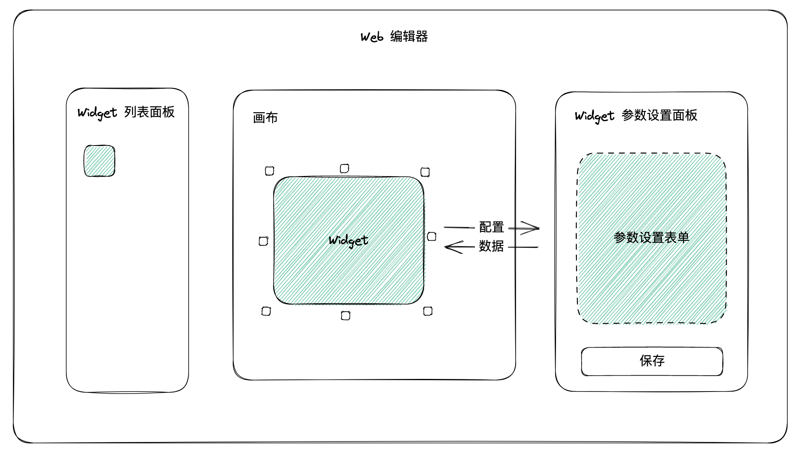
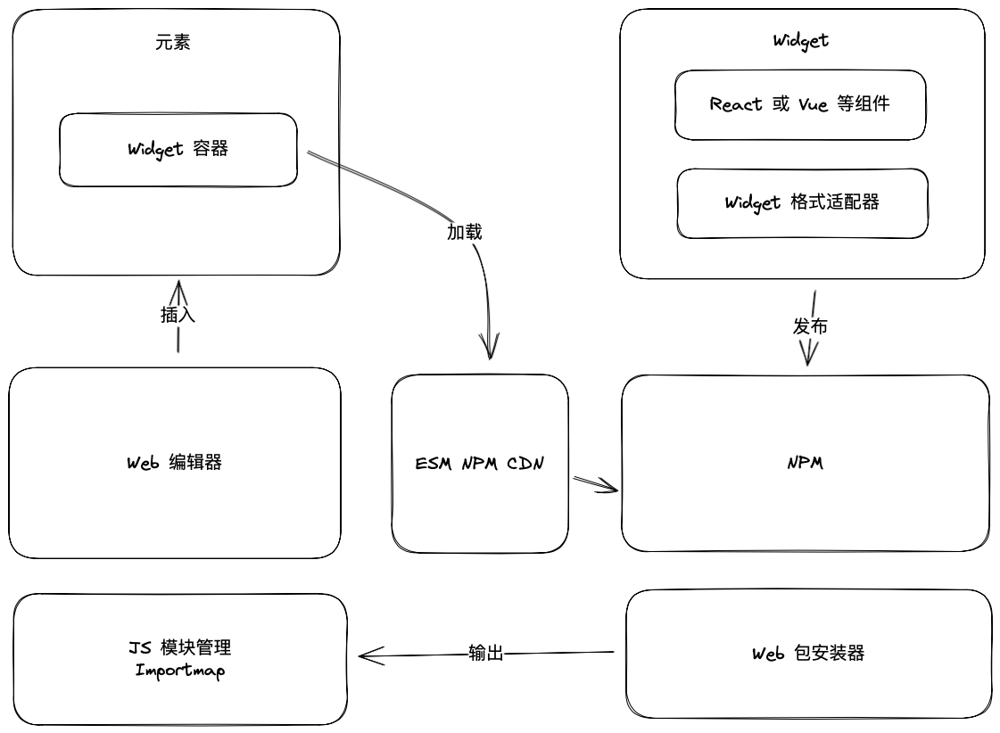
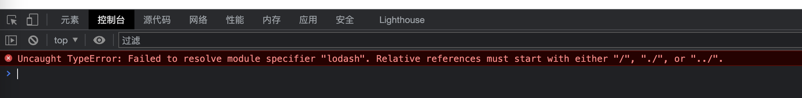
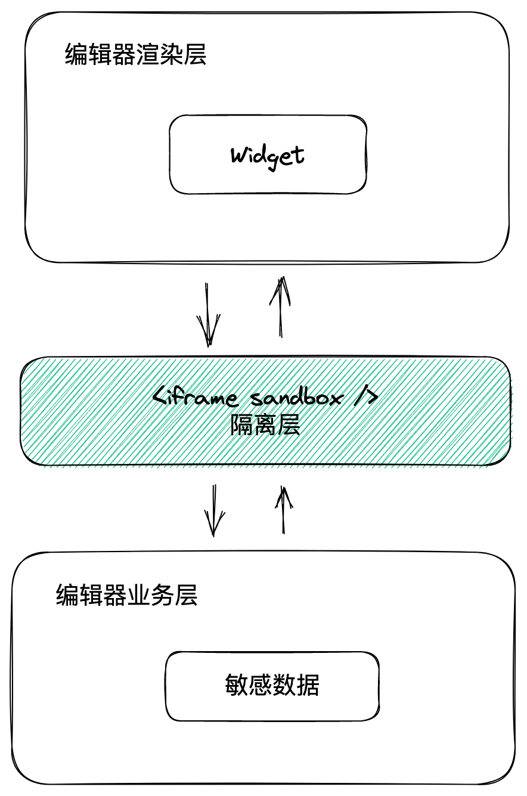
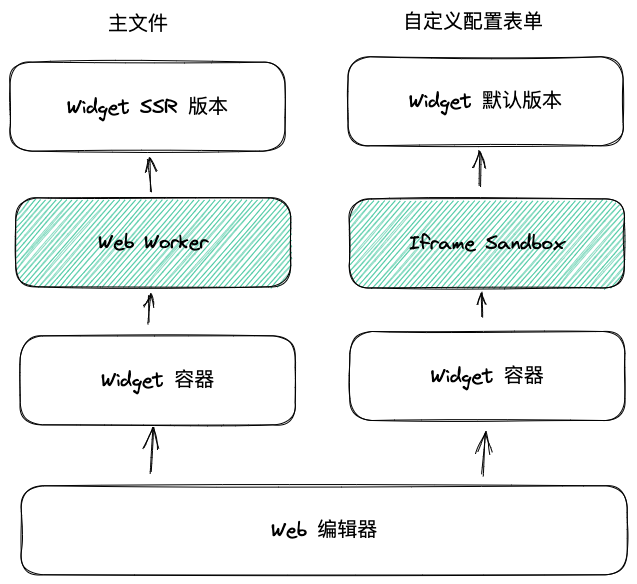
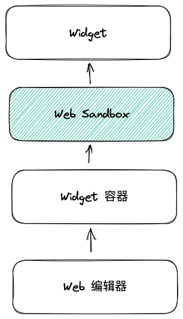

# 稿定 Widget 系统设计（RFC 1）

## 一、概述

### 1.1 定义

稿定 Widget 是一种**为 Web 编辑器设计的插件类型**，它是一个由开发者代码实现的小区块，支持编辑器画布内容扩展。

> 💡 **核心理念**  
> Widget 是编辑器中的"微服务"，它封装了业务逻辑和 UI，可以独立开发、发布和更新。

### 1.2 应用场景

**典型用例：**
- 📊 创建第三方数据驱动的**销售业绩排行榜**
- 📈 创建第三方数据驱动的**表格、图表**
- 🎰 创建**抽奖小游戏转盘**并连接到第三方抽奖系统
- 📝 创建**表单**并提交数据到第三方平台

### 1.3 实践验证

本提案核心部分已经在**稿定 Iliad 编辑器**中完成了实践验证，在其基础上优化形成系统方案，以适用于不同编辑器。

---

## 二、设计动机

### 2.1 保持简单实用

> 💭 **现状分析**  
> 当前稿定的影响力还处于较为薄弱的阶段，而开发者生态需要漫长的时间运营才能起步。

**优先级排序：**
1. **开发者体验**（最优先）
2. **实现难度**
3. **能力开放程度**

Widget 提案聚焦解决前两个问题，保持简单实用。

### 2.2 保持外部适应

> 🌍 **开放理念**  
> 创建真正开放且透明的插件格式及其工具，让 Widget 能随时适应社区生态，与 Web 前端工程融合。

**核心价值：**
- ✅ 避免开发者被锁定在私有平台
- ✅ 基于 Web 标准，技术栈无关
- ✅ 可在不同厂商的低代码编辑器中使用
- ✅ 计划未来以**开源方式**提供（开源版本命名为 **Web Widget**）

---

## 三、提议内容

### 3.1 目标

在稿定平面编辑器、网页编辑器、文章编辑器等 Web 编辑器中使用**共同的内容扩展机制**——Widget。

**关键特性：**
- 使用一致的编辑模式和开发模式
- 统一的基本格式范式
- 让企业客户能够简单高效地集成业务内容
- 支持**自助**管理代码资产

---

## 四、基本模式

### 4.1 编辑模式



编辑器在产品层面定义 Widget 的职责以及基本编辑交互模式，并且对所有 Widget 一视同仁。

#### 有限编辑

**核心约束：**
- ✅ 用户能够利用编辑器基本排版功能对 Widget 进行自由排版
- ❌ 不能直接和 Widget 内部元素进行交互修改内容

**设计理念：**
```
Widget 被视作"外部"元素，是封闭的
  ↓
工作机制非常简单
  ↓
利于 Widget 开发者和编辑器开发者理解
```

#### 可配置

**参数设置：**
- Widget 支持参数设置
- 通过参数设置面板改变 Widget 内部外观
- 编辑器负责展示参数设置面板并记忆设置数据

**表单生成方式：**
| 方式 | 说明 | 适用场景 |
|------|------|----------|
| **自动生成** | 编辑器根据 JSON Schema 自动生成表单 | 简单配置（单选、多选、输入框） |
| **自定义界面** | 开发者提供自定义的参数设置表单 | 复杂交互（文件上传、富文本编辑） |

---

### 4.2 开发模式

Widget 从开发、调试、发布都采用**行业标准或公共服务**，避免使用私有技术和多余概念。

#### 开发到发布流程

```
1. 开发
   ├─ 支持 React、Vue 等任意技术栈
   ├─ 通过适配器包装成 Widget 生命周期格式
   └─ 支持任意 Web 打包构建工具
      ↓
2. 配置
   ├─ 提供参数设置的 JSON Schema 描述（可选）
   ├─ 提供自定义用户界面（可选）
   └─ 使用 peerDependencies 进行依赖共享
      ↓
3. 构建
   ├─ 使用 ESM 格式作为 Widget 入口文件
   └─ 满足浏览器兼容要求
      ↓
4. 发布
   └─ 使用 NPM 源发布 Widget 包
```

#### 迁移与调试

**类似概念：**
- Islands Architecture（孤岛）
- 微前端

**核心特性：**
```
Widget 是编辑器画布中的孤岛
  ↓
不和其他外部元素产生交互
  ↓
不依赖宿主（编辑器）API
  ↓
直接使用 Web API 运行
```

**开发优势：**
- ✅ 开发调试无需启动编辑器
- ✅ 通过 Widget 容器，在不同 Web 工程中迁移

---

### 4.3 格式模式

#### 包结构

Widget 是一个**标准的 NPM 包**：

```json
{
  "name": "@gaoding/demo",
  "version": "0.0.1",
  "description": "An user widget with login ability",
  "exports": {
    ".": "./dist/index.js",
    "./manifest": "./web-widget.json",
    "./data-ui": "./dist/data-ui.js"
  },
  "keywords": ["web-widget"],
  "dependencies": {
    "@web-widget/vue2-adapter": "^1.0.0"
  },
  "peerDependencies": {
    "vue": "^2.6.12"
  },
  "files": [
    "dist",
    "icon",
    "web-widget.json"
  ]
}
```

**关键字段：**
- `exports`：定义入口文件
- `peerDependencies`：共享依赖
- `version`：版本管理

#### 主入口（"."）

**原生实现：**
```javascript
export default () => ({
  async mount({ container, data }) {
    container.innerHTML = `
      <style>
        h3 { color: red }
      </style>
      <h3>${data.title}</h3>
    `;
  }
});
```

**使用 UI 库（通过适配器）：**
```javascript
import adapter from '@web-widget/vue2-adapter';
import App from './App.vue';

export default adapter(App);
```

#### 清单（"./manifest"）

```json
{
  "schemaVersion": "0.0.0",
  "displayName": "Web Widget Demo",
  "summary": "The Markdown to use for the main readme of this package.",
  "icons": [
    {
      "src": "icon/lowres.webp",
      "sizes": "64x64",
      "type": "image/webp"
    },
    {
      "src": "icon/hd_hi",
      "sizes": "128x128"
    }
  ],
  "cssProperties": [
    {
      "name": "--text-color",
      "syntax": "<color>",
      "default": "#ff0000",
      "summary": "Set text color"
    }
  ],
  "dataSchema": {
    /* JSON Schema */
  }
}
```

**用途：**
- 后端管理系统获取信息
- 增强可视化编辑器能力
- `dataSchema` 字段：描述参数配置的数据格式，自动生成表单

#### 参数设置界面（"./data-ui"，可选）

```javascript
export default () => ({
  async mount({ data, container }) {
    // 渲染表单界面
    const input = document.createElement('input');
    input.value = data.title;
    
    input.onchange = () => {
      // 提交数据更新
      container.update({ title: input.value });
    }
    
    container.appendChild(input);
  }
});
```

**使用场景：**
- 复杂交互（文件上传）
- 简单配置可使用 `dataSchema` 自动生成

---

## 五、类似方案对比

### 5.1 vs Figma Widget

**相似之处：**
- ✅ 用于扩展画布元素而不是提供自动化

**不同之处：**

| 维度 | Figma Widget | 稿定 Widget |
|------|--------------|-------------|
| **画布交互** | 允许在画布中直接交互内部元素 | 不可以（除非发布成网页） |
| **平台依赖** | 只能在 Figma 旗下产品运行，依赖 Figma API | 与特定编辑器无关，只需 Web API |
| **技术栈** | Figma 私有 API | Web 标准 |

### 5.2 vs Canva 嵌入式元素

Canva 使用 **Iframely** 从第三方平台嵌入媒体。

**限制：**
- ❌ 无法嵌入任意 HTML，只能嵌入 Iframely API 支持的媒体
- ❌ Iframe 的各种缺点，编辑器无法控制跨域内容

### 5.3 vs XXX Plugin

**Figma、VSCode、Photoshop 插件：**
- 主要用于提供**自动化**

**稿定 Widget：**
- 仅用于创建**内容**

---

## 六、技术架构

### 6.1 整体架构图



### 6.2 架构层次

```
┌─────────────────────────────────────┐
│           应用层                    │
│    Widget 实例（业务逻辑 + UI）      │
└─────────────────────────────────────┘
                ↓
┌─────────────────────────────────────┐
│         Widget 容器层                │
│   生命周期管理 / Shadow DOM 隔离     │
└─────────────────────────────────────┘
                ↓
┌─────────────────────────────────────┐
│          加载层                     │
│   Importmap / ESM CDN / 包安装器    │
└─────────────────────────────────────┘
                ↓
┌─────────────────────────────────────┐
│          基础层                     │
│         NPM / Web 标准              │
└─────────────────────────────────────┘
```

---

## 七、入口格式与生命周期

### 7.1 入口格式

**工厂函数模式：**
```javascript
export default () => ({
  async bootstrap(props) {},
  async mount(props) {},
  async update(props) {},
  async unmount(props) {},
  async unload(props) {}
});
```

**单例模式：**
```javascript
export async function bootstrap(props) {}
export async function mount(props) {}
export async function update(props) {}
export async function unmount(props) {}
export async function unload(props) {}
```

**约定：**
- ✅ 所有生命周期函数都是可选的
- ✅ 生命周期函数必须返回 `Promise`（建议使用 `async` 函数）
- ✅ 第一个 `props` 参数接收应用内置接口

### 7.2 生命周期

```
load (模块加载)
  ↓
bootstrap (初始化，仅首次执行)
  ↓
mount (挂载，渲染 UI)
  ↓
update (更新，可多次触发)
  ↓
unmount (卸载，清理资源)
  ↓
unload (移除，Widget 被删除)
```

#### bootstrap（初始化）

**时机：** Widget 第一次挂载前执行一次

**用途：**
```javascript
export default () => ({
  async bootstrap() {
    // 下载必要资源
    await Promise.all([
      loadCSS('https://cdn.example.com/styles.css'),
      loadBackgroundImage('https://cdn.example.com/bg.jpg'),
      fetchImportantData()
    ]);
  }
});
```

**优势：**
- Widget 容器可能会预加载
- 提前执行 `bootstrap` 可提高用户体验

#### mount（挂载）

**时机：** 将自己渲染出来

**示例：**
```javascript
export default () => ({
  async mount({ container, data }) {
    // 创建 DOM 元素
    const element = document.createElement('div');
    element.textContent = data.title;
    
    // 插入到容器
    container.appendChild(element);
    
    console.log('mounted!');
  }
});
```

#### update（更新）

**时机：** Widget 挂载完成后，外部触发更新

**示例：**
```javascript
export default () => ({
  async update({ data }) {
    // 使用框架更新 DOM
    app.updateData(data);
    console.log('updated!', data);
  }
});
```

#### unmount（卸载）

**时机：** 卸载函数被调用时

**清理内容：**
```javascript
export default () => ({
  async unmount({ container }) {
    // 清理 DOM 元素
    container.removeChild(element);
    
    // 清理事件监听
    window.removeEventListener('resize', handler);
    
    // 清理内存
    instance = null;
    
    console.log('unmounted!');
  }
});
```

**必须清理：**
- DOM 元素
- 事件监听
- 内存引用
- 全局变量
- 消息订阅

#### unload（移除）

**时机：** Widget 被删除前

---

## 八、发布与更新

### 8.1 发布要求

Widget 是一个标准的 NPM 包，发布到 NPM 源即可。

**必须：**
- ✅ 使用语义化版本管理（编辑器依赖它管理版本更新）
- ✅ 使用 ESM 格式，满足浏览器兼容要求
- ✅ 使用 `exports` 而不是 `main` 导出入口

**推荐：**
- ✅ 代码压缩
- ✅ 排除大型第三方依赖，声明 `peerDependencies`

### 8.2 容器

**Web Components 自定义标签：**
```html
<web-widget
  name="@gaoding/demo"
  version="0.0.1"
  data='{"title": "Hello"}'
></web-widget>
```

**Shadow DOM 隔离：**
```html
<web-widget name="@gaoding/demo">
  #shadow-root(open)
    <style>
      h3 { color: red }
    </style>
    <h3>Hello</h3>
</web-widget>
```

**作用：**
- 简化 Web 编辑器实现插件机制的复杂度
- 让 Widget 能够移植到不同 Web 工程中
- 管理 Widget 生命周期
- 避免样式冲突

### 8.3 安装与更新

**核心机制：**
```
Widget 使用 URL 异步加载
  ↓
用户在浏览器中进行安装与更新
  ↓
ESM NPM CDN：从 NPM 获取包并提供加速
  ↓
Importmap：提供模块地址映射
  ↓
本质：变更 CDN 地址和 Importmap 配置
```

---

## 九、ESM CDN 与 Importmap

### 9.1 ESM NPM CDN


**功能：**
- 直接从 NPM 获取包
- 提供 CDN 加速
- 自动转换 CJS 为 ESM

**URL 格式：**
```
https://esm.dancf.com/npm:demo-widget@4.17.21/index.js
```

### 9.2 Importmap

**定义：**  
Importmap（导入映射）是 WICG 提出的新提案，控制 JavaScript 的模块加载行为。

**问题：**
```html
<script type="module">
  import _ from 'lodash';  // ❌ 浏览器报错
  _.clone({})
</script>
```



**解决方案：**
```html
<script type="importmap">
{
  "imports": {
    "lodash": "https://esm.dancf.com/npm:lodash@4.17.21/index.js"
  }
}
</script>

<script type="module">
  import _ from 'lodash';  // ✅ 正常工作
  _.clone({})
</script>
```

**版本管理：**
```html
<script type="importmap">
{
  "imports": {
    "demo-widget": "https://esm.dancf.com/npm:demo-widget@1.0.0/index.js"
  }
}
</script>

<!-- 安装 Widget -->
<web-widget name="demo-widget"></web-widget>
```

**浏览器支持：**
- ✅ Chrome 89+ 原生支持
- ✅ 通过垫片支持更低版本浏览器

### 9.3 包安装器

**作用：**  
专门用于处理 Importmap 的生成

**开源库：**  
https://github.com/jspm/generator

---

## 十、依赖共享

### 10.1 为什么需要依赖共享？

Widget 可能依赖第三方模块（如 Vue、React），通过依赖共享可以：
- ✅ 减少包体积
- ✅ 避免重复加载
- ✅ 提高性能

### 10.2 实现方式

**Step 1：package.json 声明**
```json
{
  "peerDependencies": {
    "vue": "^2.6.12",
    "lodash": "^4.17.21"
  }
}
```

**Step 2：构建时排除**
```javascript
// vite.config.js
export default {
  build: {
    rollupOptions: {
      external: ['vue', 'lodash']
    }
  }
}
```

**Step 3：Importmap 配置**
```json
{
  "imports": {
    "vue": "https://esm.dancf.com/npm:vue@2.6.12/dist/vue.esm.browser.js",
    "lodash": "https://esm.dancf.com/npm:lodash@4.17.21/lodash.js",
    "@gaoding/widget-a": "https://esm.dancf.com/npm:@gaoding/widget-a@1.0.0/index.js",
    "@gaoding/widget-b": "https://esm.dancf.com/npm:@gaoding/widget-b@1.0.0/index.js"
  }
}
```

**结果：**
```
Widget A 和 Widget B 共享 Vue 和 lodash
只加载一次，节省带宽和内存
```

---

## 十一、高级特性

### 11.1 导出到图片

**需求：**  
Widget 需要支持导出为图片

**实现：使用 SVG foreignObject**
```javascript
const content = webWidget.shadowRoot.innerHTML;
const xhtml = new XMLSerializer().serializeToString(content);

return `
  <svg xmlns="http://www.w3.org/2000/svg">
    <foreignObject width="100%" height="100%">
      <div xmlns="http://www.w3.org/1999/xhtml">
        ${xhtml}
      </div>
    </foreignObject>
  </svg>
`;
```

**限制：**  
SVG 的 foreignObject 能力有一些限制（不在本提案核心内容展开）

### 11.2 SEO

**问题：**  
Widget 基于 Web Components，需要解决 SEO 问题

**解决方案：Shadow DOM 序列化**
```html
<web-widget>
  <template shadowrootmode="open">
    <h3>Hello World</h3>
  </template>
</web-widget>
```

**测试结果：**
- ✅ Google 支持收录序列化后的 shadow DOM 内容
- ✅ 百度支持收录序列化后的 shadow DOM 内容

**浏览器支持：**
- Chrome：原生支持
- 其他浏览器：通过少量垫片代码支持

---

## 十二、安全策略

### 12.1 安全挑战

> ⚠️ **核心问题**  
> JS 语言特性容易获取全局变量，运行第三方代码会对应用安全造成隐患。

**现状：**  
Web 标准中尚未提供理想的运行第三方代码的机制，需要开发者小心处理。

### 12.2 方案一：Iframe Sandbox 模式



**实现：**
- Iframe 的 `sandbox` 属性或跨域 URL 限制第三方代码权限
- **关键**：让编辑器的渲染层（画布与核心交互）都放在沙盒化的 Iframe 中
- 借助 Iframe postMessage API 与外侧的业务层通讯

**架构：**
```
┌─────────────────────────────────────┐
│         业务层（主窗口）             │
│   用户数据 / 敏感信息 / API         │
└─────────────────────────────────────┘
                ↓ postMessage
┌─────────────────────────────────────┐
│   渲染层（沙盒化 Iframe）            │
│   编辑器画布 / Widget 容器          │
│   ├─ 内置元素                       │
│   └─ Widget 实例（第三方代码）       │
└─────────────────────────────────────┘
```

**优势：**
- ✅ 第三方 Widget 无法穿越沙盒隔离层
- ✅ 无法获取敏感数据
- ✅ 无法实施攻击

**缺点：**
- ⚠️ Widget 依然可能破坏渲染层内容

### 12.3 方案二：Web Worker + SSR 模式



**核心思想：**
```
Widget 约定了"有限编辑"模式
  ↓
内部元素不与用户交互
  ↓
JS 只需完成渲染
  ↓
类似组件的 SSR 模式
```

**架构：**
- **编辑器中**：使用 Web Worker 运行 SSR 版本
- **落地页中**：使用默认版本（客户端渲染）

**package.json 配置：**
```json
{
  "exports": {
    ".": {
      "worker": "./dist/ssr.js",
      "default": "./dist/index.js"
    }
  }
}
```

**SSR 版本示例：**
```javascript
import { createSSRApp } from 'vue';
import { renderToWebStream } from 'vue/server-renderer';
import App from './App.vue';

export async function response({ data }) {
  const app = createSSRApp(App);
  const stream = await renderToWebStream(app);
  return new Response(stream, {
    status: 200,
    headers: { 'Content-Type': 'text/html' }
  });
}
```

**优势：**
- ✅ Web Worker 作为沙盒（需注意网络请求会携带 Cookie）
- ✅ 主流前端 UI 库支持在此环境中渲染
- ✅ 解决安全问题的同时，也解决了实时 SEO 问题

**注意：**  
自定义参数设置面板需要与用户交互，应使用 Iframe sandbox 运行。

### 12.4 方案三：Web Sandbox 模式



**项目介绍：**  
为 Widget 提供理想的 DOM 渲染安全沙盒环境的项目。

**核心能力：**
- 虚拟 DOM 树
- 内容安全策略
- 本地存储隔离
- Web Components 支持
- Viewport 隔离
- Task 隔离
- 隔离 XSS 攻击

**支持：**
- ✅ 主流前端 UI 库运行环境

**演示：**  
https://web-sandbox.js.org/

### 12.5 方案四：Worker DOM 模式

**简介：**  
Google AMP 项目组推出，和 Web Sandbox 类似

**缺点：**
- ❌ 与主流前端库兼容性较差

### 12.6 方案五：保守安全运营策略

**非技术方案，而是产品运营策略：**

**措施：**
1. 仅支持安装 NPM 白名单内的组织账号的包（如 `@gaoding-inc/`）
2. 采用人工审核 Widget

**案例：**  
虽然 Figma 有自己的沙盒机制，但依然对每个插件进行人工审核。

**适用阶段：**  
早期阶段采用保守策略是行之有效的方式。

### 12.7 为什么不是其他方案？

#### ❌ Figma Sandbox

**问题：**
- Figma 使用第三方 JS 引擎实现沙盒运行插件逻辑层
- 使用浏览器 Iframe 运行插件 UI 层
- Widget 核心职责是绘制 UI，第三方 JS 引擎无法提供 DOM 环境

#### ❌ ES6 Proxy Sandbox

**问题：**
- 国内一些微前端库的基本实现原理
- 无法拒绝恶意代码执行
- 大多数无法通过 Web Sandbox 提供的 XSS 用例

### 12.8 方案对比

| 特性 | Iframe Sandbox | Web Worker + SSR | Web Sandbox | Worker DOM |
|------|----------------|------------------|-------------|------------|
| **编辑器实现难度** | 中 | 中 | 低 | 中 |
| **Widget 容器实现难度** | 低 | 中 | 高 | 高 |
| **ESM 支持** | ✅ | ✅ [1] | ✅ | ✅ [2] |
| **Importmap 支持** | ✅ | ❌ | ✅ | ❌ |
| **Web API 数量** | 多 | 少 | 多 | 少 |
| **组件级隔离** | ❌ | ✅ | ✅ | ✅ |

**注释：**
- [1] 需要处理浏览器兼容问题
- [2] 支持 system 格式，作为 ESM 代替品

---

## 十三、迭代策略

### 13.1 普通用户

对用户使用**"小挂件"**的概念在编辑器中呈现。

### 13.2 开发者

**开放策略：**

Web 插件的安全机制是比插件机制更复杂的课题，在形成堡垒般的安全机制之前，应当以**保守方式开放**：

```
编辑器内部开发者
  ↓
SKA 开发者
  ↓
特定企业开发者
  ↓
（安全模型构建完成）
  ↓
全部开放
```

---

## 十四、未来可能性

### 14.1 自动生成企业动态内容

**场景：**  
通过服务器渲染，在服务器上运行 Widget，批量生成企业业务数据驱动的图片内容。

**流程：**
```
企业数据
  ↓
服务器运行 Widget SSR
  ↓
生成动态图片
  ↓
批量输出
```

### 14.2 扩展私有接口

**技术可行性：**  
Widget 在技术层面允许在基本模式上扩展私有 API，利用编辑器特有 API 实现更多效果。

**建议：**  
虽然基本模式允许扩展，但**不推荐过早这样做**。

### 14.3 通过插槽组合元素

**能力：**  
Widget 容器默认使用 shadow DOM，可提供原生插槽能力，编辑器可将不同元素放在 Widget 内部。

**Widget 代码：**
```javascript
export default () => ({
  async mount({ container }) {
    container.innerHTML = `
      <slot name="title">
        <h3>Default title</h3>
      </slot>
      <slot name="content">
        Default content
      </slot>
    `;
  }
});
```

**清单定义：**
```json
{
  "slots": [
    {
      "name": "title",
      "summary": "Title slot"
    },
    {
      "name": "content",
      "summary": "Content slot"
    }
  ]
}
```

**使用：**
```html
<web-widget name="@gaoding/demo">
  <div slot="title">hello</div>
  <div slot="content">Let's have some different text!</div>
</web-widget>
```

---

## 十五、总结

### 15.1 核心设计

1. **简单实用**  
   优先考虑开发者体验和实现难度

2. **外部适应**  
   基于 Web 标准，技术栈无关，可开源

3. **三种模式**  
   编辑模式、开发模式、格式模式统一

4. **标准化**  
   基于 NPM、ESM、Importmap 等行业标准

5. **安全可控**  
   提供多种安全策略方案

### 15.2 关键特性

**编辑体验：**
- ✅ 有限编辑（封闭但可配置）
- ✅ 参数设置（自动生成或自定义）
- ✅ 自由排版

**开发体验：**
- ✅ 任意技术栈（React、Vue 等）
- ✅ 任意构建工具
- ✅ 标准 NPM 包
- ✅ 无需启动编辑器即可开发调试

**技术架构：**
- ✅ 基于 Web Components
- ✅ Shadow DOM 隔离
- ✅ ESM + Importmap
- ✅ 依赖共享

**安全策略：**
- ✅ Iframe Sandbox
- ✅ Web Worker + SSR
- ✅ Web Sandbox
- ✅ 保守运营策略

### 15.3 应用场景

**当前：**
- 数据可视化（图表、排行榜）
- 交互组件（表单、抽奖）
- 第三方集成

**未来：**
- 服务器端批量生成
- 私有 API 扩展
- 插槽组合

---

*文档版本：v1.0 (RFC 1)*  
*最后更新：2025-01-26*  
*原始文档：Confluence - RFC 1: 稿定 Widget*
