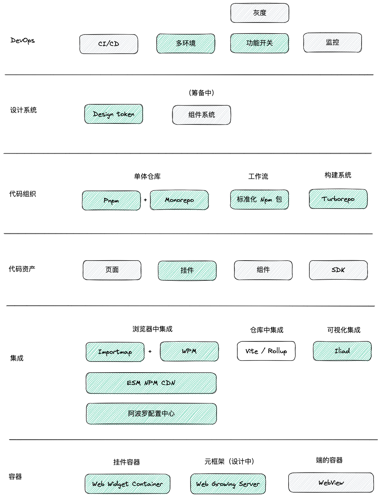
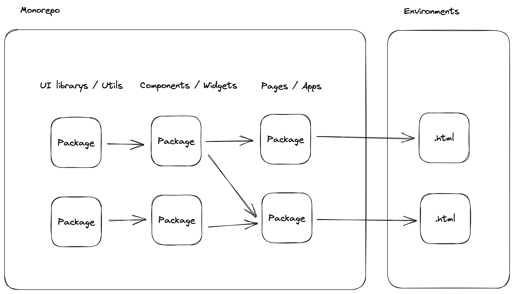
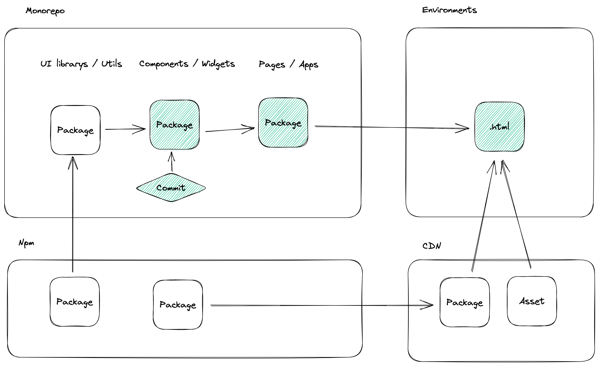
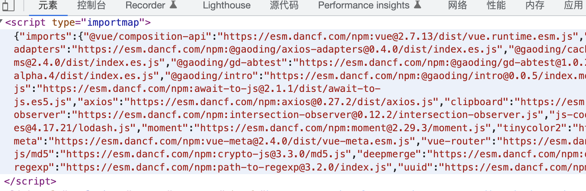

# 前端可生长架构设计（RFC 0）

## 一、架构概述

### 1.1 定义

稿定前端可生长的架构是**微前端架构的一种实现**，它属于通用基础架构，旨在构建一个可持续发展、技术栈无关、易于扩展的前端生态系统。

### 1.2 核心理念

> 💡 **设计哲学**  
> 尊重 Web 标准与公共平台，最大程度避免造私有标准与平台

---

## 二、设计动机

### 2.1 核心原则

1. **尊重 Web 标准与公共平台**  
   最大程度避免造私有标准与平台

2. **避免技术栈污染**  
   最大程度避免上游技术栈污染下游

3. **减少构建依赖**  
   最大程度减少构建，提高开发效率

4. **技术栈适应性**  
   重视外部不同技术栈的适应性

5. **抽象层次提升**  
   持续提高 ProCode 抽象层次，最终与 NoCode 模式融合

---

## 三、整体架构

### 3.1 架构全景图



### 3.2 架构分层

```
┌─────────────────────────────────────────────────────┐
│                    应用层                            │
│  ┌──────────┐  ┌──────────┐  ┌──────────┐          │
│  │  页面    │  │  挂件    │  │  组件    │          │
│  └──────────┘  └──────────┘  └──────────┘          │
└─────────────────────────────────────────────────────┘
                        ↓
┌─────────────────────────────────────────────────────┐
│                  集成层                              │
│  ┌─────────────┐  ┌────────────┐  ┌──────────┐    │
│  │ Importmap   │  │   挂件容器  │  │  Iliad   │    │
│  └─────────────┘  └────────────┘  └──────────┘    │
└─────────────────────────────────────────────────────┘
                        ↓
┌─────────────────────────────────────────────────────┐
│                  工具链层                            │
│  ┌───────┐  ┌──────────┐  ┌─────┐  ┌──────────┐   │
│  │ Pnpm  │  │ Turborepo│  │ Wpm │  │ ESM CDN  │   │
│  └───────┘  └──────────┘  └─────┘  └──────────┘   │
└─────────────────────────────────────────────────────┘
                        ↓
┌─────────────────────────────────────────────────────┐
│                  基础设施层                          │
│  ┌──────────────┐  ┌─────────────┐                 │
│  │  Monorepo    │  │   DevOps    │                 │
│  └──────────────┘  └─────────────┘                 │
└─────────────────────────────────────────────────────┘
```

---

## 四、基础设施层

### 4.1 单体仓库（Monorepos）

#### 定义



前端工程的基础设施基于**单体仓库**，即一个仓库中包含多个项目（或页面入口），以**包颗粒度**进行独立发布与部署。

#### 核心优势

| 优势 | 说明 |
|------|------|
| **可见性** | 每个人都可以看到其他人的代码，带来更好的协作和跨团队贡献 |
| **简化依赖管理** | 共享依赖关系简单，所有模块托管在同一存储库中 |
| **唯一依赖源** | 每个依赖只有一个版本，避免版本冲突和依赖地狱 |
| **一致性** | 更容易执行代码质量标准和统一风格 |
| **共享时间线** | API 或共享库的变更立即暴露，促进团队沟通合作 |
| **原子提交** | 大规模重构更容易，可在一次提交中更新多个包或项目 |
| **隐式 CI** | 所有代码统一维护，保证持续集成 |
| **统一 CI/CD** | 每个项目使用相同的部署流程 |
| **统一构建流程** | 共享一致的构建流程，随时可迭代自动化脚本 |

> 📚 **延伸阅读**  
> [5 分钟搞懂 Monorepo](https://www.perforce.com/blog/vcs/what-monorepo)

#### 实施策略

**短期目标：**
- ✅ 原则上不再允许新开业务仓库
- ✅ 新增业务沿用所在团队的大仓库

**中期目标：**
- 🔧 平台增加对单体仓库的 CI/CD、环境、灰度、功能开关支持
- 🔧 加大前端基建投入，持续提升单体仓库的工程自动化程度
- 🔧 持续提升仓库分支管理水平，逐步走向主干开发模式

**长期目标：**
- 🎯 根据业务整合契机，持续整合现有仓库
- 🎯 最终前端业务走向一个大仓库

---

### 4.2 前端 ✖️ DevOps



#### 工作流程

**版本管理：**
- 通过 Git 分支策略收集版本 PR
- 结合 DevOps 平台多环境、灰度（即将支持 Monorepo）
- 功能开关（正在设计中）进行独立测试与发布

**构建系统：**
- 分析包之间依赖关系自动调度构建任务
- 使用完全自动化流程
- 禁止任何形式的手动干预构建输出产物
- 通过即早发现问题消除包版本不一致的隐患

**包共享策略：**
| 协议 | 用途 | 示例 |
|------|------|------|
| `workspace:` | 共享当前仓库本地包 | `workspace:*` |
| `npm:` | 共享外部仓库或第三方包 | `npm:react@18.0.0` |
| `https:` | 在浏览器中共享包 | `https://esm.sh/react@18.0.0` |

---

## 五、工具链层

### 5.1 包管理工具：Pnpm

**为什么选择 Pnpm？**

| 优势 | 说明 |
|------|------|
| **极快** | 避免地狱依赖，节省磁盘空间 |
| **Monorepos 友好** | 支持 `workspaces` 协议 |
| **更严格** | 避免幽灵依赖破坏工程 |

**与 Npm 对比：**

```
Npm：每个项目都有独立的 node_modules
项目A/node_modules/react
项目B/node_modules/react  (重复)

Pnpm：全局存储 + 硬链接
全局/.pnpm-store/react
项目A/node_modules/react -> 全局/.pnpm-store/react
项目B/node_modules/react -> 全局/.pnpm-store/react
```

---

### 5.2 构建系统：Turborepo

**为什么选择 Turborepo？**

Turborepo 取代了过去使用的 **Lerna** 与 **ci-task-runner**（稿定自研），提供更强大的构建能力。

#### 核心特性

**1. 增量构建**
```bash
# 自动分析依赖顺序，只构建变更的包
turbo run build
```

- 分析包与包之间的依赖顺序
- 自动安排构建任务顺序
- 无需人工干预

**2. 并行执行**
```bash
# 充分利用多核 CPU
turbo run build --parallel
```

- 充分利用多核 CPU
- 并行执行独立任务
- 大幅提升构建速度

**3. 缓存机制**
```bash
# 远程缓存，团队共享
turbo run build --cache-dir=.turbo
```

- 本地缓存构建产物
- 支持远程缓存
- 跨机器共享缓存

#### 依赖图示例

```
packages/
├── ui-components
│   └── (无依赖)
├── utils
│   └── (无依赖)
├── app-editor
│   ├── → ui-components
│   └── → utils
└── app-admin
    ├── → ui-components
    └── → utils

构建顺序：
1. ui-components, utils (并行)
2. app-editor, app-admin (并行)
```

---

### 5.3 打包工具：Any

#### 选型原则

对打包工具不限制选型，只要满足以下要求：

**必要条件：**
- ✅ 完整支持 ESM 输出
- ✅ 尽可能减少私有语法对源代码的侵入
- ✅ 高性能

#### 推荐工具

| 工具 | 推荐度 | 理由 |
|------|--------|------|
| **Vite** | ⭐⭐⭐⭐⭐ | 极快的开发体验，完美的 ESM 支持 |
| **Rollup** | ⭐⭐⭐⭐ | 纯粹的 ESM 打包器 |
| **Web Builder** | ⭐⭐⭐⭐ | 稿定自研，针对 Web 优化 |
| Webpack | ⚠️ 避免使用 | 无法达到上述三点要求 |

---

### 5.4 Web 管理工具：Wpm

Wpm 是**稿定开发的包管理工具**，面向浏览器以及 CDN 提供原生的 ESM 包支持。

#### 核心能力

**1. 本地与远程包的抽象**
```json
{
  "imports": {
    "react": "https://esm.sh/react@18.0.0",
    "@gaoding/ui": "workspace:*"
  }
}
```

**2. web-modules.json 配置**
```json
{
  "modules": {
    "react": "18.0.0",
    "@gaoding/ui": "1.2.3"
  }
}
```

**3. Importmap 集成**
- 自动生成 Importmap
- 管理依赖版本
- 支持本地开发和生产环境切换

---

### 5.5 静态资源加速：ESM Npm CDN

**稿定自研的 ESM CDN**，让浏览器直接使用 Npm 源上的模块而无需打包。

#### 核心特性

**1. 自动转换**
```javascript
// CJS 模块
module.exports = { foo: 'bar' }

// 自动转换为 ESM
export default { foo: 'bar' }
```

**2. 固定不可变 URL**
```
https://esm.gaoding.com/react@18.0.0/index.js
永久不变，可安全缓存
```

**3. 多重回源灾备**
- 主 CDN：阿里云
- 备用 CDN：腾讯云
- 直连 Npm 源

---

## 六、集成层

### 6.1 Importmap：Web 模块集成标准



#### 什么是 Importmap？

Importmap 是一个 **Web 标准**，用于在浏览器中映射模块标识符到 URL。

**传统方式：**
```javascript
// 需要打包工具处理
import React from 'react';
```

**Importmap 方式：**
```html
<script type="importmap">
{
  "imports": {
    "react": "https://esm.gaoding.com/react@18.0.0/index.js"
  }
}
</script>

<script type="module">
// 浏览器原生支持，无需打包
import React from 'react';
</script>
```

#### 核心优势

**1. 跨业务共享**
- ✅ 包的供应方可以独立构建与发布
- ✅ 跨团队、跨仓库、跨业务线共享代码资产

**2. 灵活更新**
```javascript
// 通过阿波罗合并导入映射，无需发布版本即可更新公共模块
{
  "imports": {
    "react": "https://esm.gaoding.com/react@18.2.0/index.js"  // 版本升级
  }
}
```

**3. 依赖去重**
```
应用A: react@18.0.0
应用B: react@18.0.0
       ↓
共享同一份 React，只加载一次
```

---

### 6.2 挂件容器：Web Widget Container

#### 什么是挂件容器？

挂件容器是**挂件的运行容器**，提供技术栈中立、在浏览器中使用 CDN 集成前端组件的机制。

#### 核心能力

**1. 技术栈隔离**
```javascript
// Vue 挂件
export default {
  mount(el) {
    // Vue 3 应用
    createApp(App).mount(el);
  }
}

// React 挂件
export default {
  mount(el) {
    // React 应用
    ReactDOM.render(<App />, el);
  }
}
```

**2. 样式隔离**
- 支持 Shadow DOM
- CSS 作用域隔离
- 避免样式冲突

**3. 生命周期管理**
```typescript
interface Widget {
  mount(container: HTMLElement, props?: any): void;
  unmount?(): void;
  update?(props: any): void;
}
```

---

### 6.3 WebView 容器：Web 容器

提供 **App、小程序、桌面客户端** 中的 Web 运行容器。

**支持平台：**
- 📱 iOS App
- 🤖 Android App
- 🎯 微信小程序
- 💻 桌面客户端（Electron）

**由移动端团队主导开发和维护。**

---

### 6.4 可视化集成工具：Iliad

**Iliad** 是稿定的网页编辑器（落地页编辑器），支持**设计师、运营或开发人员**以可视化方式将挂件集成在落地页中。

#### 核心能力

**1. 可视化编辑**
```
┌─────────────────────────────────┐
│  拖拽挂件 → 配置属性 → 预览 → 发布  │
└─────────────────────────────────┘
```

**2. 挂件库**
- 内置常用挂件
- 自定义挂件
- 第三方挂件市场

**3. 实时预览**
- 所见即所得
- 响应式预览
- 多设备适配

---

## 七、应用层

### 7.1 包的标准

> 💡 **核心理念**  
> 无论是组件、SDK 还是页面入口，都将以**包的方式**来组织代码。

#### 为什么需要标准化？

使用标准化后的包可以：
- ✅ 避免上游包的构建方式污染下游技术栈
- ✅ 实现团队内外部自动化集成
- ✅ 支持浏览器直接使用 CDN

#### 标准规范

**必须满足：**

1. **语义化版本号**
```json
{
  "version": "1.2.3"
  // 主版本.次版本.修订号
}
```

2. **使用 exports 字段**
```json
{
  "exports": {
    ".": {
      "import": "./dist/index.js",
      "require": "./dist/index.cjs"
    }
  }
}
```

3. **默认导出 ESM 格式**
```json
{
  "type": "module"
}
```

4. **浏览器兼容语法**
```javascript
// ✅ Good
export const foo = () => {};

// ❌ Bad (Node.js 特有)
import fs from 'fs';
```

5. **条件导出**
```json
{
  "exports": {
    ".": {
      "browser": "./dist/browser.js",
      "node": "./dist/node.js",
      "default": "./dist/index.js"
    }
  }
}
```

6. **使用 imports 字段（包内别名）**
```json
{
  "imports": {
    "#utils": "./src/utils/index.js"
  }
}
```

7. **peerDependencies 共享依赖**
```json
{
  "peerDependencies": {
    "react": "^18.0.0"
  }
}
```

8. **workspaces 协议引用本地包**
```json
{
  "dependencies": {
    "@gaoding/ui": "workspace:*"
  }
}
```

9. **优先使用公共 Npm 源**
- 公开的包发布到 npmjs.com
- 内部包可使用私有源

---

### 7.2 代码资产定义

#### 资产类型

| 类型 | 说明 | 共享 | 外部耦合 | 技术栈中立 | 可视化排版 |
|------|------|:----:|:--------:|:----------:|:----------:|
| **页面** | 与路由密切关联的模块 | ❌ | ❌ | ❌ | ❌ |
| **挂件** | 介于页面和组件之间，微前端入口 | ✅ | ✅ | ✅ | ✅ |
| **组件** | 常规 UI 组件（.vue / .jsx） | ✅ | ❌ | ❌ | ⚠️ |
| **SDK** | 纯 API（用户信息、埋点等） | ✅ | ✅ | ✅ | ❌ |

---

### 7.3 挂件（Widget）

> 💡 **核心概念**  
> 挂件是稿定定义的概念，它是**前端中的微服务**，通过容器运行在不同的技术栈、项目中。

#### 格式规范级别

##### Level 1：基础组件

**要求：**
- ✅ 使用 Vue 或 React 组件
- ✅ 封装内部细节，提供可直接使用的业务功能
- ✅ 接收 Props，但不对外暴露接口和事件（可在 Props 中使用回调代替）
- ✅ 满足包的标准

**示例：**
```vue
<template>
  <div class="user-card">
    
    <h3>{{ name }}</h3>
  </div>
</template>

<script>
export default {
  props: ['avatar', 'name']
}
</script>
```

##### Level 2：跨技术栈挂件

**额外要求：**
- ✅ 包的入口默认导出满足技术栈无关的生命周期格式
- ✅ CSS 适应 Shadow DOM
- ✅ 发布到 Npm 源，支持浏览器使用 CDN 载入

**生命周期格式：**
```typescript
export default {
  // 挂载
  mount(container: HTMLElement, props?: any): void {
    // 创建应用实例
  },
  
  // 卸载
  unmount(): void {
    // 销毁应用实例
  },
  
  // 更新
  update(props: any): void {
    // 更新应用
  }
}
```

**应用场景：**
- 跨业务共享 UI 服务（如 DAM 输出模块给二方业务）
- 产品框架可插拔组件

##### Level 3：NoCode 可视化组件

**额外要求：**
- ✅ 提供清单（Manifest），满足 NoCode 工具的可视化编辑

**清单示例：**
```json
{
  "name": "用户卡片",
  "icon": "https://...",
  "props": {
    "avatar": {
      "type": "image",
      "label": "头像",
      "default": "https://..."
    },
    "name": {
      "type": "string",
      "label": "姓名"
    }
  }
}
```

**应用场景：**
- 稿定平面编辑器可插拔组件
- 网页编辑器可插拔组件
- 文章编辑器可插拔组件
- 支撑**自助**管理代码资产

---

### 7.4 页面集成手段

#### 为什么重视页面集成？

- 🎯 稿定的灰度策略基于入口页
- 📊 SLS 的页面性能指标采集基于入口页
- ⚡ 入口页的首次加载性能至关重要

#### 集成策略

**推荐：多页模式（MPA）**
```
站点A: /editor
站点B: /admin
站点C: /home

每个站点独立入口，独立部署
```

**避免：单页模式（SPA）扩张**
```
❌ 不推荐继续增加单页架构的规模
原因：
- 首屏加载慢
- 代码耦合严重
- 灰度困难
```

---

## 八、未来规划

### 8.1 设计系统（筹备中）

#### 什么是设计系统？

设计系统是一系列**文档元素、组件和区域、设计和前端指南**的完整标准。

#### 核心目标

**1. 统一品牌与体验**
- 统一视觉语言
- 统一交互规范
- 统一开发工作流

**2. Web 响应式实践**
- 适配多种设备
- 流式布局
- 媒体查询

**3. 统一的 UI 组件库**
- 跨项目复用
- 统一设计规范
- 谨慎探索中

---

### 8.2 元框架

#### 什么是元框架？

元框架将取代目前的**前端 BFF 层**，将可生长架构的开发与生产环节串联起来，形成完整的前端开发体系。

#### 核心能力

**1. 多种渲染模式**

| 模式 | 说明 | 适用场景 |
|------|------|----------|
| **SPA** | 单页应用 | 富交互应用 |
| **SSR** | 服务端渲染 | SEO、首屏性能 |
| **ESR** | 边缘渲染 | 全球化部署 |
| **Islands** | 岛屿架构 | 静态为主、局部交互 |

**2. 提高抽象层次**
- 减少工程复杂度
- 提高开发体验
- 统一开发规范

**3. 技术栈适应性**
- 支持 Vue
- 支持 React
- 支持其他框架

**4. ProCode 与 NoCode 融合**
- 共享页面格式
- 共享挂件格式
- 统一抽象层

**5. 生态弹性**
- 保持对外部技术变化的适应性
- 提高前端团队对基础架构的掌控力

---

## 九、实施指南

### 9.1 新项目接入

**步骤 1：选择合适的仓库**
- 加入现有团队的 Monorepo
- 不再新建独立仓库

**步骤 2：创建包**
```bash
# 在 Monorepo 中创建新包
pnpm create @gaoding/package --name my-app
```

**步骤 3：遵循包标准**
- 配置 `package.json` exports
- 使用 ESM 格式
- 配置 peerDependencies

**步骤 4：集成 CI/CD**
- 配置 DevOps 流水线
- 配置灰度策略
- 配置功能开关

### 9.2 现有项目迁移

**评估阶段：**
1. 分析项目依赖
2. 评估迁移成本
3. 制定迁移计划

**迁移阶段：**
1. 调整包结构
2. 适配构建工具
3. 迁移到 Monorepo

**验证阶段：**
1. 功能测试
2. 性能测试
3. 灰度发布

---

## 十、总结

### 10.1 核心价值

1. **技术栈无关**  
   不同技术栈可以和谐共存

2. **独立发布**  
   包级别的独立发布与部署

3. **代码共享**  
   跨团队、跨项目共享代码资产

4. **提高效率**  
   统一工具链，减少重复工作

5. **持续演进**  
   架构可随业务发展持续优化

### 10.2 关键原则

- ✅ 尊重 Web 标准
- ✅ 避免技术栈污染
- ✅ 减少构建依赖
- ✅ 提高抽象层次
- ✅ ProCode 与 NoCode 融合

### 10.3 技术栈

| 层级 | 技术选型 |
|------|----------|
| **基础设施** | Monorepo + DevOps |
| **包管理** | Pnpm |
| **构建系统** | Turborepo |
| **打包工具** | Vite / Rollup / Web Builder |
| **模块管理** | Wpm + Importmap |
| **CDN** | ESM Npm CDN |
| **容器** | Web Widget Container |
| **编辑器** | Iliad |

---

## 十一、参考资源

### 官方文档

- **Monorepo 工具**：https://monorepo.tools/
- **Turborepo**：https://turbo.build/
- **Pnpm**：https://pnpm.io/
- **Importmap**：https://github.com/WICG/import-maps

### 延伸阅读

- 5 分钟搞懂 Monorepo
- 微前端架构最佳实践
- ESM 模块系统详解
- 设计系统构建指南

---

*文档版本：v1.0 (RFC 0)*  
*最后更新：2025-01-26*  
*原始文档：Confluence - RFC 0: 前端基础架构*
