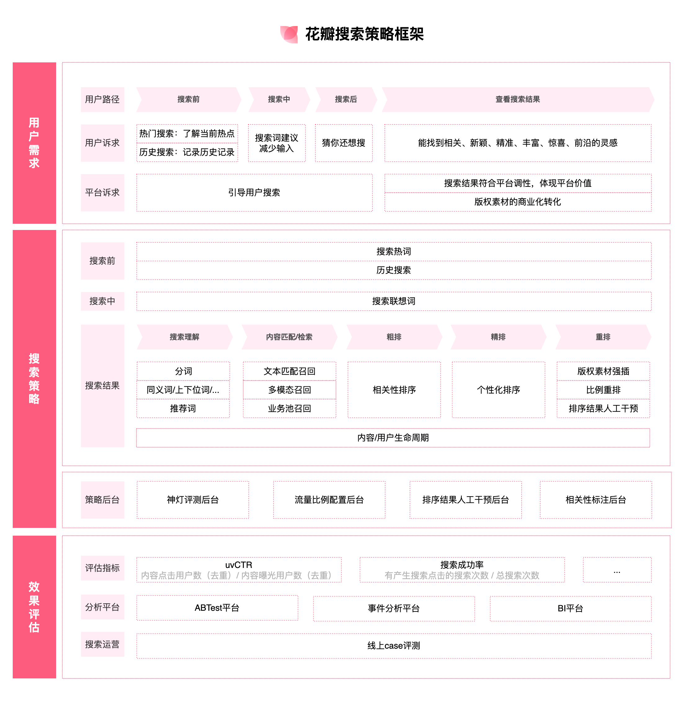
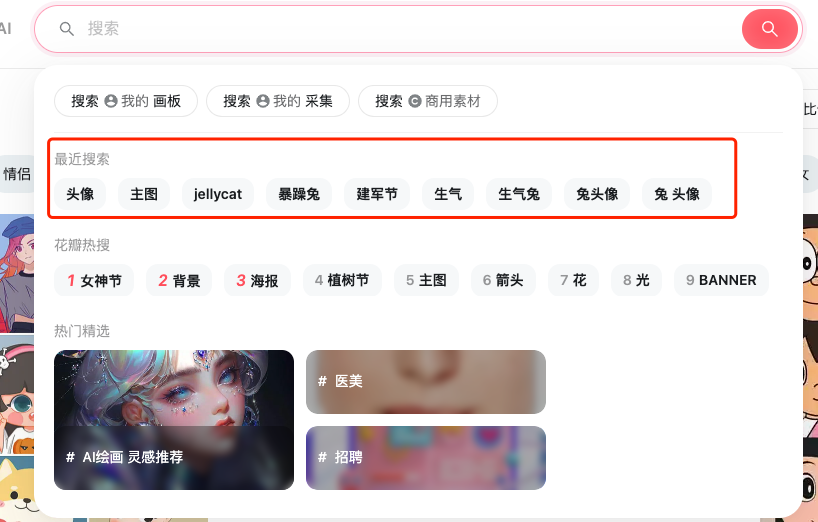
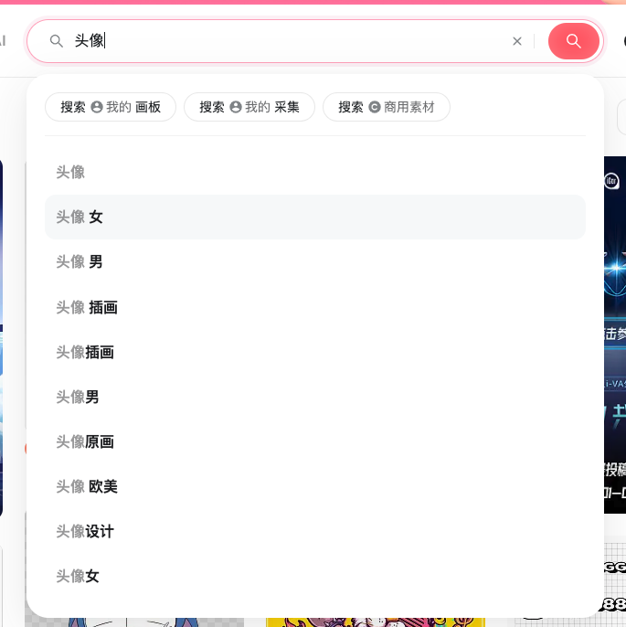
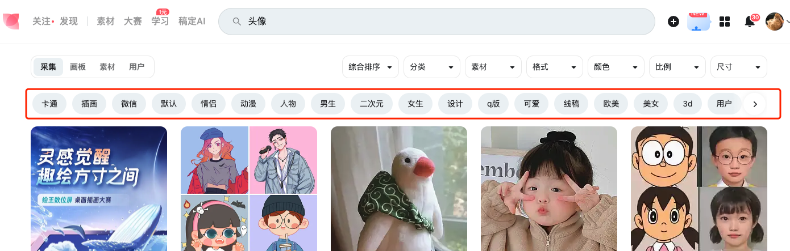
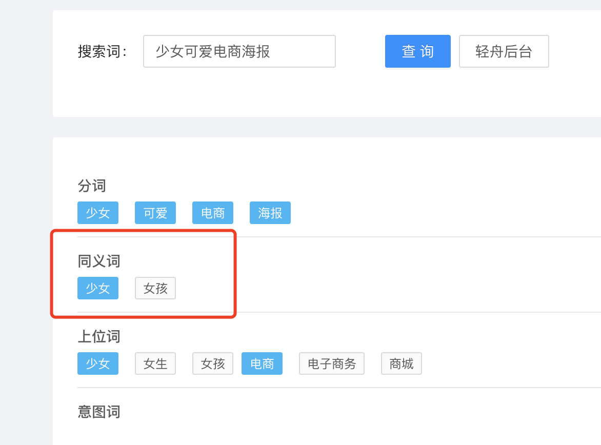
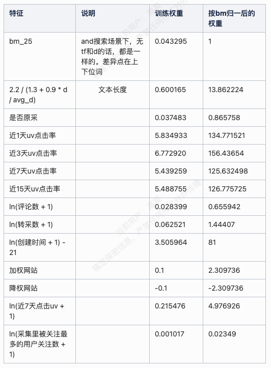
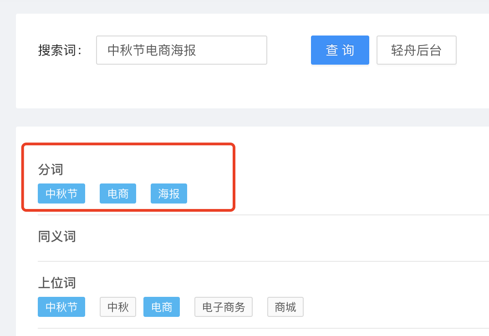

# 花瓣搜索能力介绍

> **文档来源**  
> Confluence: https://doc.huanleguang.com/pages/viewpage.action?pageId=286485554

---

## 文档更新记录

| 版本 | 操作 | 修订内容 | 修订日期 | 修订人 |
|------|------|---------|---------|--------|
| 1.0 | 新增 | 花瓣搜索能力介绍初版 | 2023-03-08 | @未知用户 (haikui) |
| 2.0 | 优化 | 文档结构化整理和美化 | 2025-01-25 | 文档整理团队 |

---

## 文档概述

本文档详细介绍**花瓣网搜索能力**的完整架构、算法策略和技术实现，涵盖搜索理解、召回、排序等核心环节。

**核心价值**：
- 📊 搜索是花瓣网核心功能，近 **60%** 访客使用搜索
- 🚀 搜索结果页是花瓣网 **第二大流量页面**
- 🎯 完整的搜索三阶段架构

---

## 一、引言

### 1.1 搜索的重要性

**数据说明搜索的价值**：

```
访客使用率：近 60% 的花瓣访客使用搜索功能
页面流量：搜索结果页为花瓣第二大访客量页面
业务影响：搜索质量直接影响用户留存和转化
```

### 1.2 什么是搜索

**搜索的本质**：

> 搜索是用户的搜索词（Query）与系统海量内容完成匹配的过程

**经典三阶段架构**：

```
┌─────────────────────────────────────────────┐
│   阶段 1：搜索理解与处理                     │
│                                             │
│   • 词法分析：分词                           │
│   • 句法分析：语法结构                       │
│   • 语义理解：同义词、近义词                 │
│                                             │
│   目的：理解用户意图，处理歧义和不准确表达   │
└──────────────────┬──────────────────────────┘
                   │
                   ▼
┌─────────────────────────────────────────────┐
│   阶段 2：检索召回                          │
│                                             │
│   • 内容理解：标签、标题、描述               │
│   • 相关性匹配：Query 与内容匹配            │
│   • 召回策略：文本、向量、业务池             │
│                                             │
│   目的：从海量数据中筛选出相关内容           │
└──────────────────┬──────────────────────────┘
                   │
                   ▼
┌─────────────────────────────────────────────┐
│   阶段 3：排序                              │
│                                             │
│   • 粗排：初步排序                           │
│   • 精排：精细化排序                         │
│   • 重排：业务策略调整                       │
│                                             │
│   目的：预测用户需求，呈现最优结果           │
└─────────────────────────────────────────────┘
```

**花瓣搜索架构**围绕该流程进行建设。

---

## 二、搜索能力框架

### 2.1 整体架构



**架构层次**：

```
┌──────────────────────────────────────────────┐
│          用户交互层                           │
│  • 搜索框                                    │
│  • 热词推荐                                  │
│  • 联想词                                    │
│  • 历史搜索                                  │
└──────────────────┬───────────────────────────┘
                   │
┌──────────────────┴───────────────────────────┐
│          搜索理解层                           │
│  • 分词（Jieba）                             │
│  • 同义词映射                                │
│  • Query 改写                                │
└──────────────────┬───────────────────────────┘
                   │
┌──────────────────┴───────────────────────────┐
│          召回层                              │
│  • 文本召回 + LR 排序                        │
│  • 多目标个性化召回                          │
│  • 业务池召回                                │
└──────────────────┬───────────────────────────┘
                   │
┌──────────────────┴───────────────────────────┐
│          排序层                              │
│  • 粗排（LR）                                │
│  • 精排（多目标 CTR 预估）                   │
│  • 重排（L4分、扶持分）                      │
└──────────────────┬───────────────────────────┘
                   │
┌──────────────────┴───────────────────────────┐
│          策略层                              │
│  • 比例混排                                  │
│  • 扶持分重排                                │
│  • 素材/灵感比例调整                         │
└──────────────────────────────────────────────┘
```

### 2.2 搜索类型

花瓣搜索支持多种搜索类型：

| 搜索类型 | 说明 | 特点 |
|---------|------|------|
| **采集搜索** | 搜索灵感内容（采集） | 个性化推荐为主 |
| **素材搜索** | 搜索设计素材 | 精准匹配为主 |
| **模板搜索** | 搜索设计模板 | 复用稿定模板搜索接口 |

---

## 三、采集搜索 & 素材搜索

### 3.1 搜索能力详解

#### 3.1.1 搜索前 - 引导用户搜索

**目标**：降低用户决策成本，提升搜索效率

##### A. 搜索热词

**定义**：基于搜索热度推荐的高频搜索词


**策略详情**：

```yaml
统计规则:
  数据源: 搜索日志
  统计周期: 近 12 小时
  统计指标: 搜索 UV（去重）
  数据处理:
    - 英文统一转大写
    - 取 TOP 10
    
去重规则:
  同义词过滤:
    - 互相包含的词
    - 字符串重叠占比过高
    
降权规则:
  条件: 本次统计的热词与上次重复
  操作: 对该热词进行降权
  
更新策略:
  统计周期: 12 小时
  更新频率: 每小时更新一次
```

**实现逻辑**：

```python
# 伪代码
def get_search_hot_words():
    # 1. 统计近 12h 搜索 UV
    logs = fetch_search_logs(hours=12)
    word_uv = count_unique_visitors(logs)
    
    # 2. 数据处理
    word_uv = normalize_words(word_uv)  # 英文大写
    
    # 3. 去重
    word_uv = filter_synonyms(word_uv)
    
    # 4. 降权处理
    previous_hot_words = get_previous_hot_words()
    word_uv = apply_decay(word_uv, previous_hot_words)
    
    # 5. 取 TOP 10
    hot_words = get_top_n(word_uv, n=10)
    
    return hot_words
```

##### B. 历史搜索词

**定义**：用户历史搜索过的搜索词



**策略详情**：

```yaml
数据来源:
  - 用户本地存储（LocalStorage/Cookie）
  
展示规则:
  - 界面默认展示一行历史记录
  - 按时间倒序排列
  
处理方:
  - 花瓣前端处理
```

##### C. 搜索底纹词

**状态**：暂无

---

#### 3.1.2 搜索中 - 辅助用户输入

**目标**：减少输入成本，纠正输入错误

##### A. 搜索联想词

**定义**：对用户输入的 Query 进行联想扩展



**策略详情**：

```yaml
实现方式:
  - 记录用户搜索词
  - 在搜索词表中进行前缀匹配
  
排序规则:
  - 根据最近搜索次数排序
  - 搜索次数越高，排序越靠前
  
当前状态:
  - 目前由花瓣后端处理
  - 后续计划交接到搜索侧
  - 需要维护搜索联想词表
```

**工作原理**：

```python
# 伪代码
def get_suggest_words(prefix):
    # 1. 从联想词表中查找
    candidates = search_suggest_table
        .filter(word.startswith(prefix))
        .order_by(search_count DESC)
        .limit(10)
    
    # 2. 返回联想词
    return candidates
```

---

#### 3.1.3 搜索后 - 引导精准搜索

**目标**：当无结果时引导用户重新搜索

##### A. 搜索推荐词

**定义**：无搜索结果时推荐的相关搜索词



**策略详情**：

```yaml
过滤规则:
  数据范围: 近 90 天
  条件:
    - 搜索 UV > 5
    - 搜索结果点击 > 1
  黑名单: 过滤搜索敏感词
  
统计规则:
  方法: 分词后统计词语共现频率
  原理: 经常同时出现的词，组合成词的可能性更大
  
排序规则:
  - 按搜索次数倒序排列
```

**实现示例**：

```python
# 伪代码
def get_recommend_words(query):
    # 1. 对 query 分词
    terms = jieba.cut(query)
    
    # 2. 查找共现词
    co_occur_words = []
    for term in terms:
        words = get_co_occurrence_words(term)
        co_occur_words.extend(words)
    
    # 3. 过滤
    valid_words = filter_words(co_occur_words, 
                                min_uv=5, 
                                min_click=1)
    
    # 4. 排序
    recommend_words = sort_by_search_count(valid_words)
    
    return recommend_words[:10]
```

---

### 3.2 搜索理解

**目标**：理解用户搜索意图，进行结构化解析

#### 3.2.1 分词

**定义**：将 Query 切分成多个 Term


**示例**：

```
输入: "手机海报"
↓ 分词
输出: ["手机", "海报"]
```

**技术方案**：

```yaml
分词工具: Jieba 分词

分词模式:
  精确模式:
    用途: 搜索词分词
    特点: 将句子最精确地切开，适合文本分析
    示例: "我来到北京清华大学" → ["我", "来到", "北京", "清华大学"]
    
  全模式:
    用途: 构建搜索索引
    特点: 扫描出所有可能成词的词语，速度快
    示例: "我来到北京清华大学" → ["我", "来到", "北京", "清华", "华大", "大学"]

分词词库:
  基础词库: Jieba 内置词库
  自定义词库: 轻舟后台分词库
  
词库干预:
  场景: 分词不准导致召回问题
  方法: 通过分词词库进行干预
  示例:
    - 添加专有名词
    - 添加行业术语
```

**分词流程**：

```
用户输入
   ↓
预处理（去空格、统一大小写）
   ↓
Jieba 分词
   ↓
自定义词库匹配
   ↓
分词结果
```

#### 3.2.2 同义词

**定义**：对同近义表达的 Query 进行语义归一



**作用**：

> 解决用户搜索词与内容标题/标签**同含义但不同表达**导致内容召回不全的问题

**技术方案**：

```yaml
实现方式:
  - 基于同义词表映射
  - 对 Query 进行改写
  
词库来源:
  - Jieba 分词后的词
  - 匹配轻舟后台同义词库
  
映射示例:
  "手机" → ["手机", "移动电话", "mobile phone"]
  "海报" → ["海报", "宣传画", "poster"]
```

**同义词改写示例**：

```
原始 Query: "手机海报"
   ↓
分词: ["手机", "海报"]
   ↓
同义词扩展:
  "手机" → ["手机", "移动电话"]
  "海报" → ["海报", "宣传画"]
   ↓
改写后 Query:
  - "手机 海报"
  - "移动电话 海报"
  - "手机 宣传画"
  - "移动电话 宣传画"
```

---

### 3.3 召回策略

**目标**：从海量内容中筛选出相关内容

#### 3.3.1 文本召回 + LR 排序

**定义**：基于文本匹配的召回，并使用 LR 模型进行初步排序

**召回流程**：

```
Query（分词 + 同义词）
   ↓
文本匹配
   ↓
召回候选集
   ↓
LR 模型打分
   ↓
按 LR 分数排序
```

**技术细节**：

```yaml
数据源:
  - 与稿定使用同一个词库
  
优化策略:
  - 对拼信内容在召回时进行打压
  - 参考: [20241030 花瓣搜索文本召回词拓展切换为新数据源及逻辑优化]
  
LR 排序特征:
  - 文本相关性得分
  - 内容热度
  - 用户行为（点击、采集、下载）
  - 内容质量分
```

**LR 模型特征和权重**：



| 特征类别 | 特征名称 | 权重 | 说明 |
|---------|---------|------|------|
| **文本相关性** | Query-Title 匹配度 | 高 | Query 与标题的匹配程度 |
| | Query-Tag 匹配度 | 中 | Query 与标签的匹配程度 |
| **内容热度** | 点击数 | 高 | 内容被点击的次数 |
| | 采集数 | 高 | 内容被采集的次数 |
| | 下载数 | 中 | 内容被下载的次数 |
| **内容质量** | 清晰度 | 中 | 图片清晰度 |
| | 审美分 | 低 | 内容审美评分 |

#### 3.3.2 业务池召回

**定义**：基于业务规则的内容召回

**配置方式**：

```yaml
配置后台: 轻舟 - 流量比例管理后台

配置项:
  - 内容范围限制
  - 召回比例
  
实现方式:
  业务池优先召回 → 多目标过滤 → 文本召回兜底补充
```

#### 3.3.3 多目标召回

**定义**：个性化多目标召回，针对不同用户和场景召回不同数量的内容

**召回数量策略**：


```yaml
召回规则:
  满足以下任一条件召回 240 个:
    条件 1 - 用户类型:
      - 首访新客
      - 未注册老客
      - 会员老客
      （通过用户分群实现）
      
    条件 2 - 搜索词特征:
      - 近 90 天曝光 UV > 20
      - PV > 1000
      - UV CTR < 阈值
      - 素材 UV CTR < 阈值
      （算法提供表）
  
  低搜词场景（召回 120 个）:
    定义: 近一周搜索 PV 排序在 TOP 5W 以后的词
    策略: 召回多目标向量 120 个
    融合: 多目标优先于文本，融合后总数 800 个
  
  其他情况:
    召回数量: 15 个
```

**相关链接**：
- [召回_多目标召回]
- [20250515 花瓣搜索召回路比例调整及业务池支持多目标召回（需ab）]

#### 3.3.4 扶持分重排

**定义**：根据扶持分对召回结果进行重新排序

**实施策略**：

```yaml
适用范围:
  - 灵感多目标召回
  - 素材多目标召回
  - 灵感文本召回
  - 素材文本召回
  
重排规则:
  步骤 1: 多召回 300 个
  步骤 2: 根据扶持分进行分档
    - 扶持程度高: 一档
    - 扶持程度中: 一档
    - 扶持程度低: 一档
  步骤 3: 档内排序
    - 多目标/业务池: 按原向量分/LR 分排序
    - 文本召回: 按召回分和扶持分加权排序
  步骤 4: 取对应数量进行融合
  
优先级:
  扶持程度高 > 扶持程度中 > 扶持程度低
```

**实现示例**：

```python
# 伪代码
def rerank_by_support_score(results, target_count):
    # 1. 多召回 300 个
    extended_results = recall(target_count + 300)
    
    # 2. 按扶持分分档
    high_support = filter(extended_results, support_level='high')
    medium_support = filter(extended_results, support_level='medium')
    low_support = filter(extended_results, support_level='low')
    
    # 3. 档内排序
    high_support = sort(high_support, by='recall_score')
    medium_support = sort(medium_support, by='recall_score')
    low_support = sort(low_support, by='recall_score')
    
    # 4. 合并并截取
    reranked = high_support + medium_support + low_support
    return reranked[:target_count]
```

**相关链接**：
- [20250115 花瓣搜索采集tab素材比例根据策略进行动态调整（需ab）]

---

### 3.4 精排 - 多目标排序

**定义**：基于用户行为预估，进行个性化排序

**预估目标**：

```
用户行为预估:
  - 点击概率
  - 采集概率
  - 下载概率
  - 付费概率
```

**模型架构**：

```
用户特征 + Query 特征 + 内容特征
   ↓
深度学习模型（Multi-Task Learning）
   ↓
多目标预估得分
   ↓
加权融合
   ↓
最终排序分数
```

**相关文档**：
- [L3: 个性化排序](https://doc.huanleguang.com/wiki/pages/viewpage.action?pageId=248343892)

---

### 3.5 重排 - 策略调整

**目标**：基于业务策略对排序结果进行调整

#### 3.5.1 L4 分重排

**定义**：综合多目标得分和业务策略的最终排序分数

**支持的目标**：

```yaml
多目标:
  - 点击
  - 采集
  - 下载
  - 付费
  - 扶持分
  
特殊策略:
  会员用户: 自产内容加权
```

**会员自产内容加权**：

```yaml
策略: 20240516 花瓣搜索针对会员用户增加自产素材的排序权重

规则:
  用户类型: 会员用户
  内容类型: 自产素材
  操作: 排序权重 +X
```

#### 3.5.2 比例混排

**定义**：根据搜索词特征动态调整素材在结果中的比例

**混排策略**：



| 搜索词类型 | 判断条件 | 素材比例 |
|-----------|---------|---------|
| **高差异词 A** | 灵感和素材 PV CTR 差值 ∈ [0.01, 0.02) | 无非会员下载: 15%<br>有非会员下载: 20% |
| **高差异词 B** | 灵感和素材 PV CTR 差值 ∈ [0.02, 0.03) | 无非会员下载: 15%<br>有非会员下载: 15% |
| **中差异词 A** | 灵感和素材 PV CTR 差值 ∈ [0.03, 0.04) | 无非会员下载: 5%<br>有非会员下载: 10% |
| **中差异词 B** | 灵感和素材 PV CTR 差值 ∈ [0.04, 0.05) | 无非会员下载: 5%<br>有非会员下载: 10% |
| **中差异词 C** | 灵感和素材 PV CTR 差值 ∈ [0.05, 0.06) | 无非会员下载: 5%<br>有非会员下载: 10% |
| **中差异词 D** | 灵感和素材 PV CTR 差值 ∈ [0.06, 0.07) | 无非会员下载: 5%<br>有非会员下载: 10% |
| **高差异词 C** | 灵感和素材 PV CTR 差值 ∈ [0.07, 0.08) | 无非会员下载: 5%<br>有非会员下载: 10% |
| **极高差异词** | 灵感和素材 PV CTR 差值 >= 0.08 | 无非会员下载: 5%<br>有非会员下载: 10% |
| **其他情况** | 不符合以上条件 | 30% |

**策略说明**：

```
核心思路:
  - PV CTR 差值越大 → 用户对灵感/素材的偏好越明显
  - 有非会员下载 → 素材质量较高 → 适当提升素材比例
  - 其他情况 → 默认 30% 素材比例
```

**相关链接**：
- [20250115 花瓣搜索采集tab素材比例根据策略进行动态调整（需ab）]

---

### 3.6 搜索链路整体流程图

**完整流程**：

```
用户输入 Query
   ↓
┌──────────────────────────────────┐
│  搜索前置引导                     │
│  • 搜索热词                      │
│  • 历史搜索词                    │
└────────────┬─────────────────────┘
             │
             ↓
┌──────────────────────────────────┐
│  搜索理解                        │
│  • 分词（Jieba 精确模式）        │
│  • 同义词映射                    │
└────────────┬─────────────────────┘
             │
             ↓
┌──────────────────────────────────┐
│  召回                            │
│  • 文本召回（300个）             │
│  • 多目标召回（240/120/15个）    │
│  • 业务池召回                    │
│  ↓                               │
│  扶持分重排（+300个）             │
└────────────┬─────────────────────┘
             │
             ↓
┌──────────────────────────────────┐
│  粗排                            │
│  • LR 模型打分                   │
│  • 按 LR 分排序                  │
└────────────┬─────────────────────┘
             │
             ↓
┌──────────────────────────────────┐
│  精排                            │
│  • 多目标排序模型                │
│  • 预估点击/采集/下载/付费概率   │
└────────────┬─────────────────────┘
             │
             ↓
┌──────────────────────────────────┐
│  重排                            │
│  • L4 分计算                     │
│  • 会员自产内容加权              │
└────────────┬─────────────────────┘
             │
             ↓
┌──────────────────────────────────┐
│  策略调整                        │
│  • 比例混排（灵感/素材）         │
│  • 素材比例动态调整              │
└────────────┬─────────────────────┘
             │
             ↓
       搜索结果展示
```

---

## 四、模板搜索

### 4.1 实现方案

**技术方案**：

```yaml
接口来源:
  - 复用稿定模板搜索接口
  - 接口文档: [02 搜索能力_介绍与接入]
  
模型训练:
  数据增强: 增加花瓣侧模板搜索数据
  训练数据: 花瓣用户搜索行为 + 稿定用户搜索行为
  
优化同步:
  - 稿定模板搜索的优化会同步到花瓣
  - 统一维护，降低成本
```

### 4.2 差异点

| 维度 | 稿定模板搜索 | 花瓣模板搜索 |
|------|-------------|-------------|
| **用户群体** | 设计师为主 | 普通用户为主 |
| **搜索意图** | 专业设计需求 | 灵感和设计需求 |
| **训练数据** | 稿定搜索数据 | 稿定 + 花瓣搜索数据 |
| **接口** | 稿定搜索接口 | 同稿定接口 |

---

## 五、总结与展望

### 5.1 核心能力总结

**搜索引导**：
- ✅ 搜索热词：基于热度推荐
- ✅ 搜索联想：减少输入成本
- ✅ 搜索推荐：无结果时引导

**搜索理解**：
- ✅ 分词：Jieba 精确模式
- ✅ 同义词：语义归一

**召回策略**：
- ✅ 文本召回：基于关键词匹配
- ✅ 多目标召回：个性化召回
- ✅ 业务池召回：业务规则召回
- ✅ 扶持分重排：内容扶持

**排序策略**：
- ✅ 粗排：LR 模型
- ✅ 精排：多目标排序
- ✅ 重排：L4 分 + 业务策略
- ✅ 比例混排：动态调整素材比例

### 5.2 数据指标

**搜索使用情况**：

```
使用率: 近 60% 的花瓣访客使用搜索
访问量: 搜索结果页为花瓣第二大流量页面
```

**核心指标**：

| 指标 | 说明 | 目标 |
|------|------|------|
| **UV CTR** | 去重点击率 | 提升用户真实点击 |
| **PV CTR** | 页面点击率 | 提升整体点击 |
| **下载率** | 下载转化率 | 提升付费转化 |
| **付费率** | 付费转化率 | 提升商业价值 |

### 5.3 未来优化方向

**搜索理解**：
- 🔄 深度语义理解（BERT）
- 🔄 意图识别
- 🔄 Query 改写优化

**召回优化**：
- 🔄 向量召回优化
- 🔄 混合召回策略
- 🔄 召回多样性提升

**排序优化**：
- 🔄 深度学习排序模型
- 🔄 实时特征引入
- 🔄 多目标平衡优化

**策略优化**：
- 🔄 精细化比例控制
- 🔄 个性化策略
- 🔄 实时 AB 测试

---

## 六、参考资料

**内部文档**：
- [L3: 个性化排序](https://doc.huanleguang.com/wiki/pages/viewpage.action?pageId=248343892)
- [02 搜索能力_介绍与接入]
- [20241030 花瓣搜索文本召回词拓展切换为新数据源及逻辑优化]
- [召回_多目标召回]
- [20250515 花瓣搜索召回路比例调整及业务池支持多目标召回]
- [20250115 花瓣搜索采集tab素材比例根据策略进行动态调整]
- [20240516 花瓣搜索针对会员用户增加自产素材的排序权重]

**原始文档**：
- [Confluence: 花瓣搜索能力介绍](https://doc.huanleguang.com/pages/viewpage.action?pageId=286485554)

---

**文档维护**：搜索算法团队  
**文档整理**：前端基建团队  
**创建日期**：2023-03-08  
**整理日期**：2025-01-25  
**文档版本**：v2.0
