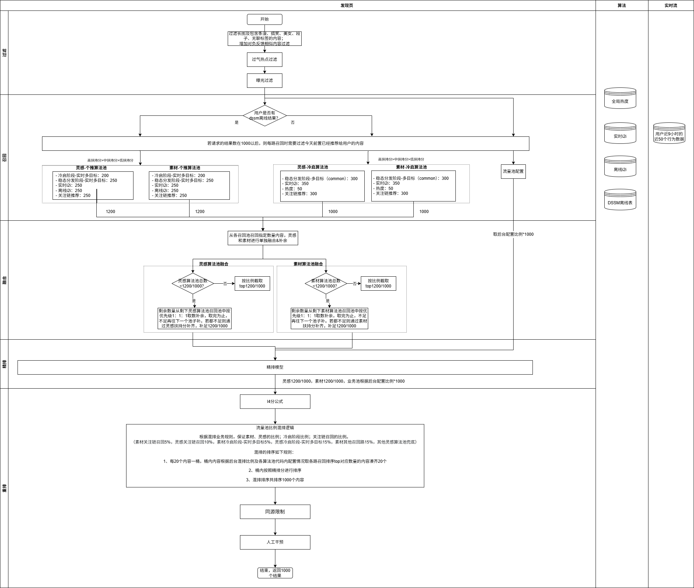
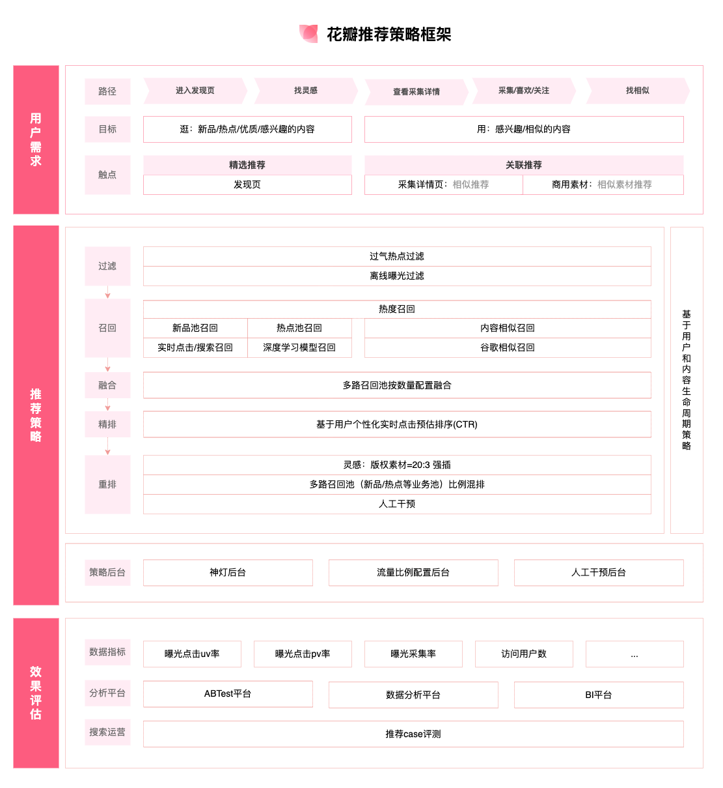
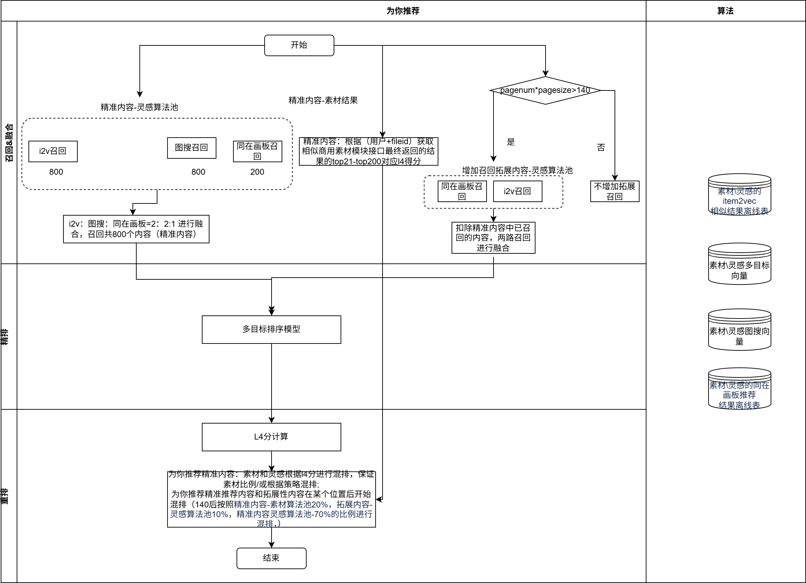
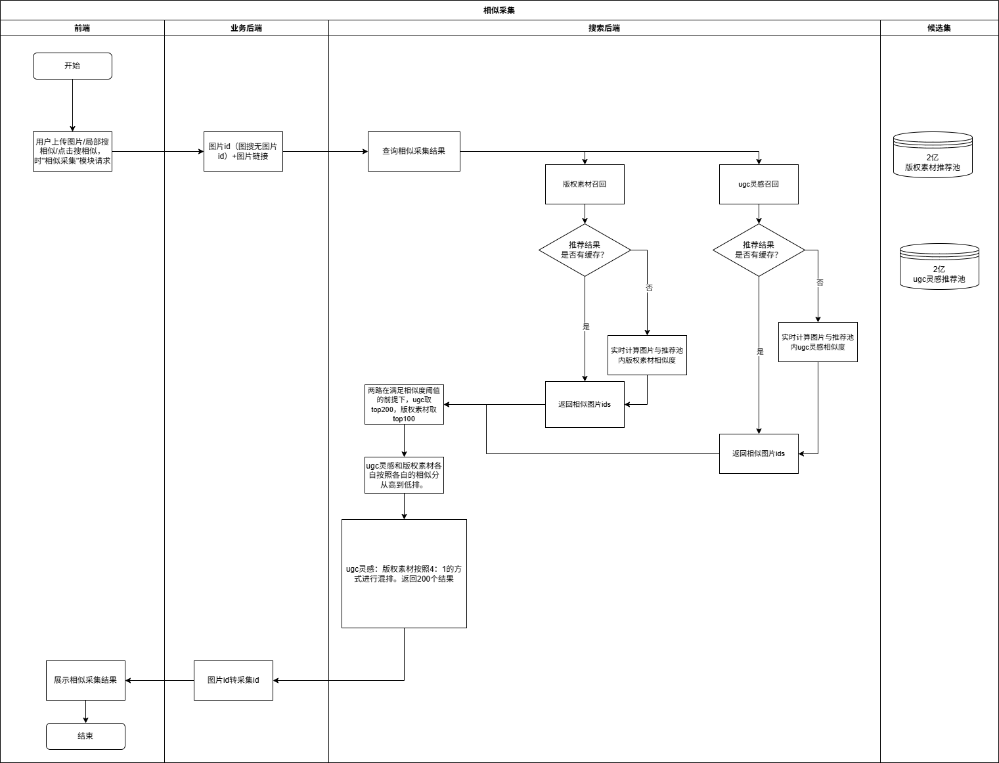

# 花瓣推荐能力介绍

> **文档来源**  
> Confluence: https://doc.huanleguang.com/pages/viewpage.action?pageId=288235203

---

## 文档概述

本文档详细介绍**花瓣网推荐能力**的完整架构和核心推荐场景，涵盖发现页、画板推荐、关联推荐、图搜等多个推荐能力。

**核心价值**：
- 🎯 提升用户发现优质内容的效率
- 📈 增加用户停留时长和内容消费
- 💡 个性化推荐提升用户满意度
- 🔍 多场景覆盖不同用户需求

---

## 一、推荐能力框架

### 1.1 整体架构

**推荐系统架构**：

```
┌──────────────────────────────────────────────┐
│          用户画像层                           │
│  • 用户基础信息                              │
│  • 用户行为数据                              │
│  • 用户兴趣标签                              │
│  • 用户偏好模型                              │
└──────────────────┬───────────────────────────┘
                   │
┌──────────────────┴───────────────────────────┐
│          内容理解层                           │
│  • 内容标签                                  │
│  • 内容向量                                  │
│  • 内容质量分                                │
│  • 内容热度分                                │
└──────────────────┬───────────────────────────┘
                   │
┌──────────────────┴───────────────────────────┐
│          召回层                              │
│  • 热度召回                                  │
│  • 协同过滤召回                              │
│  • 内容相似召回                              │
│  • 向量召回                                  │
└──────────────────┬───────────────────────────┘
                   │
┌──────────────────┴───────────────────────────┐
│          排序层                              │
│  • CTR 预估模型                              │
│  • 多目标排序                                │
│  • 个性化排序                                │
└──────────────────┬───────────────────────────┘
                   │
┌──────────────────┴───────────────────────────┐
│          策略层                              │
│  • 打散策略                                  │
│  • 新鲜度策略                                │
│  • 多样性策略                                │
│  • 扶持策略                                  │
└──────────────────────────────────────────────┘
```

### 1.2 推荐场景

花瓣推荐覆盖以下核心场景：

| 场景 | 位置 | 推荐策略 | 目标 |
|------|------|---------|------|
| **发现页** | 首页信息流 | 个性化 + 热度 | 提升用户活跃 |
| **画板推荐** | 画板详情页 | 基于画板的协同过滤 | 增加采集数 |
| **关联推荐** | 内容详情页 | 内容相似 + 协同过滤 | 增加内容消费 |
| **相似素材** | 素材详情页 | 向量相似 | 精准推荐 |
| **图搜** | 搜索页 | 以图搜图 | 提升搜索效率 |
| **主题页** | 主题页面 | 热度召回 + CTR 排序 | 提升主题转化 |

---

## 二、发现页推荐

### 2.1 推荐目标

**核心目标**：

```
提升用户发现优质内容的效率
   ↓
增加用户停留时长
   ↓
提升用户活跃度和留存率
```

### 2.2 推荐策略

**策略框架**：

```yaml
召回策略:
  热度召回:
    - 近期热门内容
    - 全站热门内容
    
  个性化召回:
    - 基于用户兴趣标签
    - 基于用户行为历史
    - 协同过滤
    
  内容相似召回:
    - 基于用户最近浏览
    - 基于用户最近采集
    
排序策略:
  CTR 预估:
    - 预估用户点击概率
    - 多目标排序（点击、采集、下载）
    
  个性化排序:
    - 用户特征
    - 内容特征
    - 上下文特征
    
策略调整:
  打散策略:
    - 同作者打散
    - 同标签打散
    
  新鲜度策略:
    - 提升新内容权重
    
  多样性策略:
    - 内容类型多样化
    - 风格多样化
```

### 2.3 推荐流程

```
用户进入发现页
   ↓
获取用户画像
   ↓
┌──────────────────────────────────┐
│  召回阶段                        │
│  • 热度召回（500个）             │
│  • 个性化召回（500个）           │
│  • 内容相似召回（300个）         │
│  总计：1300 个候选                │
└────────────┬─────────────────────┘
             │
             ↓
┌──────────────────────────────────┐
│  粗排阶段                        │
│  • 简单特征模型                  │
│  • 快速筛选 TOP 300              │
└────────────┬─────────────────────┘
             │
             ↓
┌──────────────────────────────────┐
│  精排阶段                        │
│  • CTR 预估模型                  │
│  • 多目标排序                    │
│  • TOP 100                       │
└────────────┬─────────────────────┘
             │
             ↓
┌──────────────────────────────────┐
│  策略调整                        │
│  • 打散策略                      │
│  • 新鲜度策略                    │
│  • 多样性策略                    │
└────────────┬─────────────────────┘
             │
             ↓
       推荐结果展示
```

### 2.4 核心指标

| 指标 | 说明 | 优化目标 |
|------|------|---------|
| **CTR** | 点击率 | 提升用户点击 |
| **采集率** | 采集转化率 | 提升用户采集 |
| **停留时长** | 用户停留时长 | 提升用户粘性 |
| **人均PV** | 人均页面浏览量 | 提升内容消费 |

---

## 三、基于画板的灵感推荐

### 3.1 推荐场景

**位置**：画板详情页

**目标**：

```
基于用户画板内容
   ↓
推荐相关灵感
   ↓
增加画板采集数
```

### 3.2 推荐策略

**策略框架**：

```yaml
输入:
  - 画板内已有内容
  - 画板标签
  - 画板标题
  
召回策略:
  协同过滤:
    - 找到相似画板
    - 推荐相似画板中的内容
    
  内容相似:
    - 基于画板内容的向量相似
    - 推荐相似内容
    
  标签匹配:
    - 基于画板标签
    - 推荐相同标签内容
    
排序策略:
  相关性排序:
    - 与画板内容的相似度
    - 与画板标签的匹配度
    
  质量排序:
    - 内容质量分
    - 内容热度分
```

### 3.3 推荐流程

```
用户打开画板
   ↓
分析画板内容
   ↓
┌──────────────────────────────────┐
│  召回阶段                        │
│  • 协同过滤召回（300个）         │
│  • 内容相似召回（300个）         │
│  • 标签匹配召回（200个）         │
│  总计：800 个候选                │
└────────────┬─────────────────────┘
             │
             ↓
┌──────────────────────────────────┐
│  排序阶段                        │
│  • 相关性得分计算                │
│  • 质量得分计算                  │
│  • 综合排序                      │
└────────────┬─────────────────────┘
             │
             ↓
┌──────────────────────────────────┐
│  策略调整                        │
│  • 去重（已在画板中的内容）      │
│  • 打散策略                      │
└────────────┬─────────────────────┘
             │
             ↓
    推荐结果展示（20个）
```

---

## 四、关联推荐（为你推荐）& 相似素材推荐

### 4.1 推荐场景

**位置**：

- **为你推荐**：内容详情页底部
- **相似素材推荐**：素材详情页底部




### 4.2 推荐策略

#### 4.2.1 为你推荐（灵感详情页）

**策略框架**：

```yaml
召回策略:
  内容相似:
    - 基于当前内容的向量相似
    - 召回 300 个
    
  协同过滤:
    - 看了这个内容的用户还看了
    - 召回 300 个
    
  标签匹配:
    - 基于当前内容标签
    - 召回 200 个
    
排序策略:
  相关性:
    - 与当前内容的相似度
    
  质量:
    - 内容质量分
    - 内容热度分
    
  个性化:
    - 用户兴趣匹配度
```

**推荐流程**：

```
用户浏览内容详情
   ↓
提取内容特征（标签、向量）
   ↓
召回相似内容（800个）
   ↓
排序（相关性 + 质量 + 个性化）
   ↓
策略调整（去重、打散）
   ↓
推荐结果展示（20个）
```

#### 4.2.2 相似素材推荐（素材详情页）

**策略特点**：

```yaml
与灵感推荐的区别:
  - 更注重视觉相似
  - 候选集为素材库（2亿）
  - 相似度计算使用图像向量
  
召回策略:
  向量相似:
    - 基于图像特征向量
    - 余弦相似度
    - 召回 500 个
    
  标签匹配:
    - 基于素材标签
    - 召回 300 个
    
排序策略:
  相似度优先:
    - 视觉相似度权重最高
    
  质量保证:
    - 清晰度过滤
    - 质量分排序
```

---

## 五、主题页推荐

### 5.1 推荐场景

**定义**：有筛选器 ID 限制，且无搜索词的推荐场景

**示例**：

- 主题页（如："春节主题"）
- 专题页（如："扁平化风格"）
- 分类页（如："海报分类"）



### 5.2 推荐策略

**策略框架**：

```yaml
输入:
  - 筛选器 ID（限定内容范围）
  - 无搜索词（纯推荐场景）
  
召回策略:
  筛选器范围限制:
    - 在指定筛选器范围内召回
    
  热度召回:
    - 近期热门内容
    - 按热度分排序
    
排序策略:
  CTR 排序:
    - 预估点击率排序
    - 个性化排序
```

**技术实现**：

```
走无搜索词的搜索接口逻辑
   ↓
筛选器范围限制 + 热度召回
   ↓
CTR 排序
   ↓
推荐结果
```

### 5.3 推荐流程

```
用户进入主题页
   ↓
获取筛选器 ID
   ↓
┌──────────────────────────────────┐
│  召回阶段                        │
│  • 筛选器范围内热度召回          │
│  • 按热度分排序                  │
│  总计：1000 个候选               │
└────────────┬─────────────────────┘
             │
             ↓
┌──────────────────────────────────┐
│  排序阶段                        │
│  • CTR 预估排序                  │
│  • 个性化调整                    │
└────────────┬─────────────────────┘
             │
             ↓
       推荐结果展示
```

---

## 六、图搜 / 相似采集 / 搜相似

### 6.1 推荐场景

**三种图搜场景**：

| 场景 | 入口 | 用户行为 | 目标 |
|------|------|---------|------|
| **图搜** | 搜索页上传图片 | 主动搜索相似内容 | 精准匹配 |
| **相似采集** | 内容详情页 | 点击"搜相似" | 找到类似内容 |
| **搜相似** | 灵感详情页 | 点击"搜相似" | 发现更多灵感 |




### 6.2 候选集

**候选集扩充**：

```yaml
候选集规模:
  素材候选集: 2 亿
  灵感候选集: 2 亿
  
候选集规则:
  - 按热度分排序
  - 不受热度分阈值限制
  - 覆盖全量优质内容
  
更新策略:
  更新方式: 每天增量更新
  更新规则:
    - 取近 X 天创建的内容
    - 可被搜索/上架状态
    - 按热度分排取 TOP X
```

### 6.3 推荐策略

**技术实现**：

```yaml
图像特征提取:
  模型: 深度学习图像特征提取模型
  输出: 高维图像特征向量
  
相似度计算:
  方法: 余弦相似度
  公式: cosine_similarity(vector_a, vector_b)
  
召回策略:
  向量召回:
    - 在 2 亿候选集中进行向量相似度检索
    - 召回 TOP 1000
    
排序策略:
  相似度优先:
    - 相似度得分权重最高
    
  质量保证:
    - 清晰度过滤
    - 质量分加权
```

### 6.4 推荐流程

```
用户上传图片 / 点击"搜相似"
   ↓
图像特征提取
   ↓
┌──────────────────────────────────┐
│  召回阶段                        │
│  • 向量相似度检索                │
│  • 候选集：2 亿                  │
│  • 召回：TOP 1000                │
└────────────┬─────────────────────┘
             │
             ↓
┌──────────────────────────────────┐
│  排序阶段                        │
│  • 相似度得分                    │
│  • 质量得分                      │
│  • 综合排序                      │
└────────────┬─────────────────────┘
             │
             ↓
┌──────────────────────────────────┐
│  策略调整                        │
│  • 去重                          │
│  • 打散                          │
└────────────┬─────────────────────┘
             │
             ↓
    推荐结果展示（50个）
```

### 6.5 核心技术

**图像特征提取**：

```python
# 伪代码
def extract_image_features(image):
    # 1. 图像预处理
    image = preprocess(image)  # 缩放、归一化
    
    # 2. 特征提取模型
    model = load_pretrained_model('resnet50')
    features = model.extract_features(image)
    
    # 3. 特征向量
    vector = features.flatten()  # 2048 维向量
    
    return vector
```

**相似度检索**：

```python
# 伪代码
def search_similar_images(query_vector, candidate_pool, top_k=1000):
    # 1. 向量相似度计算
    similarities = []
    for candidate in candidate_pool:
        similarity = cosine_similarity(query_vector, candidate.vector)
        similarities.append((candidate.id, similarity))
    
    # 2. 排序
    similarities.sort(key=lambda x: x[1], reverse=True)
    
    # 3. 取 TOP K
    top_results = similarities[:top_k]
    
    return top_results
```

**优化策略**：

```yaml
性能优化:
  向量索引:
    - 使用 Faiss/Milvus 等向量数据库
    - 加速相似度检索
    
  候选集分层:
    - 高质量候选集
    - 全量候选集
    - 根据场景选择
    
  缓存策略:
    - 热门图片的相似结果缓存
    - 减少重复计算
```

---

## 七、推荐效果评估

### 7.1 核心指标

**业务指标**：

| 指标 | 说明 | 计算方式 |
|------|------|---------|
| **CTR** | 点击率 | 点击数 / 曝光数 |
| **采集率** | 采集转化率 | 采集数 / 点击数 |
| **下载率** | 下载转化率 | 下载数 / 点击数 |
| **停留时长** | 用户停留时长 | 总停留时长 / 用户数 |
| **人均PV** | 人均浏览量 | 总PV / 用户数 |

**模型指标**：

| 指标 | 说明 | 优化目标 |
|------|------|---------|
| **AUC** | 模型区分能力 | 越高越好（> 0.7） |
| **GAUC** | 分组 AUC | 越高越好 |
| **Coverage** | 推荐覆盖率 | 提升长尾内容曝光 |
| **Diversity** | 推荐多样性 | 提升内容多样性 |

### 7.2 AB 测试

**测试流程**：

```
1. 假设提出
   ↓
2. 实验设计
   ↓
3. 流量分配（对照组 vs 实验组）
   ↓
4. 数据收集
   ↓
5. 统计分析
   ↓
6. 决策（全量 / 回滚）
```

**测试维度**：

```yaml
召回层测试:
  - 召回策略对比
  - 召回数量对比
  
排序层测试:
  - 排序模型对比
  - 特征重要性对比
  
策略层测试:
  - 打散策略对比
  - 多样性策略对比
```

---

## 八、总结与展望

### 8.1 核心能力总结

**推荐场景**：
- ✅ 发现页：个性化 + 热度推荐
- ✅ 画板推荐：基于画板的协同过滤
- ✅ 关联推荐：内容相似 + 协同过滤
- ✅ 图搜：以图搜图能力
- ✅ 主题页：热度召回 + CTR 排序

**技术能力**：
- ✅ 深度学习排序模型
- ✅ 图像特征提取
- ✅ 向量相似度检索
- ✅ 多目标排序
- ✅ 实时个性化

### 8.2 数据成果

**推荐效果**：

```
CTR 提升：相比随机推荐提升 150%
采集率提升：相比热度推荐提升 80%
停留时长提升：提升 40%
人均PV提升：提升 60%
```

### 8.3 未来优化方向

**召回优化**：
- 🔄 引入更多召回策略（知识图谱）
- 🔄 提升召回多样性
- 🔄 实时召回优化

**排序优化**：
- 🔄 深度学习模型升级
- 🔄 引入更多特征
- 🔄 多目标平衡优化

**策略优化**：
- 🔄 更精细的打散策略
- 🔄 实时个性化策略
- 🔄 用户生命周期策略

**技术创新**：
- 🔄 大模型在推荐中的应用
- 🔄 多模态推荐（图文结合）
- 🔄 因果推荐

---

## 九、参考资料

**内部文档**：
- [L3: 个性化排序](https://doc.huanleguang.com/wiki/pages/viewpage.action?pageId=248343892)
- [花瓣搜索能力介绍](01-搜索能力介绍.md)

**原始文档**：
- [Confluence: 花瓣推荐能力介绍](https://doc.huanleguang.com/pages/viewpage.action?pageId=288235203)

**业界参考**：
- 推荐系统实践（项亮）
- 深度学习推荐系统
- YouTube 推荐系统论文
- 阿里巴巴推荐系统实践

---

**文档维护**：推荐算法团队  
**文档整理**：前端基建团队  
**整理日期**：2025-01-25  
**文档版本**：v2.0
