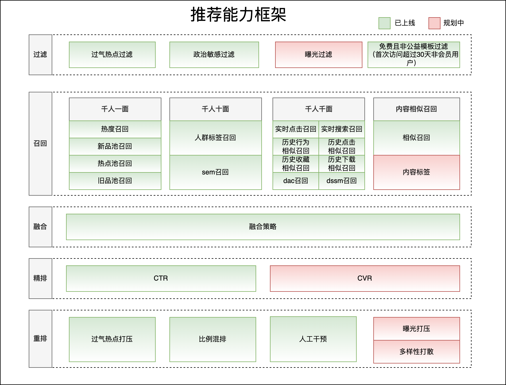

# 稿定推荐能力介绍

> **文档来源**  
> Confluence: https://doc.huanleguang.com/pages/viewpage.action?pageId=172116940

---

## 文档概述

本文档详细介绍**稿定设计推荐能力**的完整架构、召回排序策略和各坑位推荐现状，涵盖模板推荐、素材推荐等核心场景。

**核心价值**：
- 🎯 提升用户设计效率
- 📈 增加模板使用率和付费转化
- 💡 个性化推荐满足不同用户需求
- 🔍 多场景覆盖设计全流程

---

## 一、推荐能力框架

### 1.1 整体架构



**推荐流程**：

```
用户画像 + 场景上下文
   ↓
┌──────────────────────────────────┐
│  过滤层                          │
│  • 政治敏感过滤                  │
│  • 曝光过滤                      │
│  • 过气热点过滤                  │
└────────────┬─────────────────────┘
             │
             ↓
┌──────────────────────────────────┐
│  召回层                          │
│  • 热度召回                      │
│  • 个性化召回（DAC、DSSM）       │
│  • i2i 召回（行为相似）          │
│  • 实时召回（点击、搜索）        │
│  • 人群标签召回                  │
│  • SEM 召回                      │
└────────────┬─────────────────────┘
             │
             ↓
┌──────────────────────────────────┐
│  融合层                          │
│  • 多路召回融合                  │
│  • 内容优质分加权                │
└────────────┬─────────────────────┘
             │
             ↓
┌──────────────────────────────────┐
│  精排层                          │
│  • CTR 预估模型                  │
│  • 多目标排序                    │
└────────────┬─────────────────────┘
             │
             ↓
┌──────────────────────────────────┐
│  重排层                          │
│  • 过气热点打压                  │
│  • 付费模板置顶                  │
│  • 运营人工干预                  │
│  • 比例混排                      │
│  • 多样性打散                    │
│  • 实时曝光打压                  │
└────────────┬─────────────────────┘
             │
             ↓
       推荐结果展示
```

---

## 二、推荐能力详细介绍

### 2.1 过滤层

**目标**：过滤不合适的内容，保证推荐质量

#### 2.1.1 政治敏感过滤

```yaml
功能: 过滤政治敏感内容
规则: 基于敏感词库和内容审核
相关文档: [政治敏感过滤]
```

#### 2.1.2 曝光过滤

```yaml
功能: 过滤用户已曝光的内容
规则:
  - 过滤近期已曝光的内容
  - 防止重复推荐
  
策略:
  - Web: 曝光去重
  - App: 曝光去重
```

#### 2.1.3 过气热点过滤

```yaml
功能: 离线过滤过气热点内容
规则:
  - 节日/热点过期后的内容
  - 避免推荐过时内容
  
示例:
  - 春节过后过滤春节相关内容
  - 双十一过后过滤双十一相关内容
```

---

### 2.2 召回层

**目标**：从海量内容中召回候选集

#### 2.2.1 热度召回

```yaml
定义: 基于内容热度的召回

策略:
  - 近期热门内容
  - 全站热门内容
  - 按热度分排序
  
召回数量: 根据场景配置（通常 200-500 个）

相关文档: [2.1.0 热度召回]
```

#### 2.2.2 个性化召回

**A. DAC 召回（Deep Attention Cross）**

```yaml
模型: DAC 深度注意力交叉模型

特点:
  - 用户兴趣建模
  - 内容特征交叉
  - 深度学习排序
  
使用场景:
  - Web 模板中心
  - App 创作页
  
冷启动策略:
  - 使用 userid=0 训练 dac_common 模型
  - 为冷启动用户提供推荐
  
召回数量: 300-500 个

相关文档: [2.1.5.1 Web模板中心DAC召回模型]
```

**B. DSSM 召回（Deep Structured Semantic Model）**

```yaml
模型: DSSM 深度语义匹配模型

特点:
  - 用户向量和内容向量
  - 语义相似度匹配
  - 向量检索
  
使用场景:
  - Web 模板推荐
  - App 模板推荐
  
召回数量: 300-500 个

相关文档:
  - [2.1.4.2 稿定Web DSSM召回]
  - [2.1.4.1 稿定App-DSSM]
```

**策略说明**：

```
个性化召回仅召回优质内容池的内容
   ↓
保证推荐质量的同时提升个性化
```

#### 2.2.3 i2i 召回（Item-to-Item）

**A. 历史行为相似召回**

```yaml
定义: 基于用户历史行为的内容相似推荐

策略:
  - 离线 i2i 召回
  - 基于用户浏览/点击/下载历史
  - 推荐相似内容
  
召回数量: 200-300 个

相关文档: [2.1.7.0 离线i2i召回]
```

**B. 历史点击相似召回**

```yaml
定义: 基于点击行为的相似推荐

策略:
  - 用户 A 点击了内容 X
  - 找到也点击 X 的其他用户
  - 推荐他们点击的其他内容
  
召回数量: 200-300 个

相关文档: [2.1.7.1 离线clicki2i]
```

**C. 历史收藏相似召回**

```yaml
定义: 基于收藏行为的相似推荐

策略:
  - 用户 A 收藏了内容 X
  - 找到也收藏 X 的其他用户
  - 推荐他们收藏的其他内容
  
召回数量: 100-200 个

相关文档: [2.1.7.4 离线收藏i2i]
```

**D. 历史下载相似召回**

```yaml
定义: 基于下载行为的相似推荐

策略:
  - 用户 A 下载了内容 X
  - 找到也下载 X 的其他用户
  - 推荐他们下载的其他内容
  
召回数量: 100-200 个

相关文档: [2.1.7.3 离线downloadi2i]
```

**E. 相似内容召回（Item2Vec）**

```yaml
定义: 基于内容向量的相似推荐

策略:
  - 内容向量化（Item2Vec）
  - 向量相似度检索
  - 推荐相似模板/素材
  
使用场景:
  - 模板详情页相似推荐
  - 编辑器找相似
  
召回数量: 100-200 个

相关文档: [2.1.7.6 item2vec模板/素材相似召回]
```

#### 2.2.4 实时召回

**A. 实时点击召回**

```yaml
定义: 基于实时点击行为的召回

策略:
  - 实时更新用户点击序列
  - 基于最近点击推荐相似内容
  
时效性: 分钟级更新

召回数量: 50-100 个

相关文档: [2.1.7.2 实时点击模板召回]
```

**B. 实时搜索召回（Query i2i）**

```yaml
定义: 基于实时搜索行为的召回

策略:
  - 用户搜索了 Query A
  - 推荐 Query A 的相关内容
  - 基于 Query 相似度
  
时效性: 分钟级更新

召回数量: 50-100 个

相关文档: [2.1.7.5 实时queryi2i]
```

#### 2.2.5 人群标签召回

```yaml
定义: 基于用户人群标签的召回

策略:
  - 用户分群（设计师、运营、新手等）
  - 为不同人群推荐不同内容
  - 精准匹配用户需求
  
召回数量: 100-200 个

相关文档: [2.1.9 人群标签召回]
```

#### 2.2.6 SEM 召回

```yaml
定义: 搜索引擎营销（SEM）召回

策略:
  - 推广内容优先召回
  - 付费推广模板
  - 提升商业价值
  
召回数量: 根据推广预算

相关文档: [2.1.10 sem召回]
```

---

### 2.3 融合层

**目标**：将多路召回结果进行融合

#### 2.3.1 融合策略

```yaml
融合公式:
  融合分 = 召回分 * 权重 + 内容优质分
  
内容优质分计算:
  内容优质分 = 内容是否优质 + 热度分
  
  其中:
    - 内容是否优质: 在优质内容池为 100，否则为 0
    - 热度分: 内容的热度得分
```

**融合流程**：

```
多路召回结果
   ↓
去重（相同内容只保留一条）
   ↓
计算融合分
   ↓
按融合分排序
   ↓
取 TOP N（通常 800-1000）
   ↓
进入精排
```

**相关文档**：[融合策略]

---

### 2.4 精排层

**目标**：精细化排序，预估用户行为

#### 2.4.1 CTR 预估模型

```yaml
模型版本:
  - Web: [20221027-WEB模板中心CTR精排-V3]
  - 编辑器: [web编辑器相似推荐精排模型]
  
预估目标:
  - 点击概率
  - 下载概率
  - 付费概率
  
特征:
  - 用户特征（历史行为、兴趣标签）
  - 内容特征（标签、类别、热度）
  - 上下文特征（时间、场景）
  
模型架构:
  - 深度学习模型
  - 多任务学习（Multi-Task Learning）
```

**工作原理**：

```
用户 + 内容 + 上下文
   ↓
特征工程
   ↓
CTR 预估模型
   ↓
预估得分（0-1）
   ↓
按预估得分排序
```

---

### 2.5 重排层

**目标**：基于业务策略调整排序结果

#### 2.5.1 过气热点打压

```yaml
定义: 降低过气热点内容的排序

策略:
  - 检测内容是否为过气热点
  - 降低排序权重
  - 避免推荐过时内容
  
相关文档: [过气热点打压]
```

#### 2.5.2 付费模板置顶

```yaml
定义: 针对特定用户置顶付费模板

策略:
  - 用户群体: 注册超过 30 天的非会员
  - 内容范围: 仅查看付费内容和公益内容
  - 目的: 提升付费转化
  
相关文档: [付费模板置顶]
```

#### 2.5.3 运营人工干预

```yaml
定义: 运营人员手动调整排序结果

功能:
  - 置顶特定内容
  - 屏蔽特定内容
  - 调整排序权重
  
配置后台:
  - 轻舟排序结果干预后台
  
相关文档: [排序结果干预_操作指引]
```

#### 2.5.4 比例混排

```yaml
定义: 按照配置的比例混排不同来源的内容

策略:
  - 20 个一桶
  - 比例设置 10% = 每 20 个中有 2 个该路召回
  - 不足比例用 base 补足
  - 混排后按 CTR 得分排序
  
配置后台:
  - 轻舟流量池后台
  
相关文档: [流量池后台_操作指引]
```

**示例**：

```
假设配置:
  - 路径 A 比例: 10%
  - 路径 B 比例: 20%
  - Base 路径: 70%
  
混排结果（每 20 个）:
  - 路径 A: 2 个
  - 路径 B: 4 个
  - Base: 14 个
```

#### 2.5.5 多样性打散

```yaml
定义: 打散相似内容，提升推荐多样性

策略:
  - 同作者打散
  - 同类别打散
  - 同风格打散
  
规则:
  - 相邻 N 个位置内不出现相同作者
  - 相邻 M 个位置内不出现相同类别
```

#### 2.5.6 实时曝光打压

```yaml
定义: 降低用户已曝光内容的排序

策略:
  - 统计用户近 14 天曝光数据
  - 已曝光内容降权
  - 避免重复推荐
  
配置:
  - 支持在排序结果干预后台配置
  
相关文档:
  - [20240126 双端曝光打压逻辑优化]
  - [20231213-排序结果干预后台支持配置曝光打压]
```

---

## 三、各坑位推荐策略现状

### 3.1 稿定 Web

#### 3.1.1 模板中心 / 场景页 / 营销日历 / 首页瀑布流

**推荐位置**：
- 模板中心瀑布流
- 场景页模板中心
- 营销日历
- 首页瀑布流 - 推荐分类内容

**推荐策略**：

```yaml
召回:
  - 热度召回
  - DAC 个性化召回
  - DSSM 个性化召回
  - i2i 召回
  - 实时召回
  
融合:
  - 多路召回融合
  - 内容优质分加权
  
精排:
  - CTR 预估模型
  
重排:
  - 过气热点打压
  - 付费模板置顶
  - 比例混排
  - 多样性打散
```

**专栏顺序推荐逻辑**：

```yaml
策略:
  - 取轻舟人群标签配置顺序
  - 子 Tab 取筛选器热度排序
  
相关文档:
  - [20231023-WEB推荐页内容分发维度路径优化]
  - [模板中心/场景页模板中心/营销日历]
```

#### 3.1.2 最新 / 最热专栏

**推荐策略**：

```yaml
最新专栏:
  - 基于内容创建时间
  - 近期上架内容
  
最热专栏:
  - 基于内容热度分
  - 高热度内容
  
相关文档: [新品\热门专栏推荐]
```

#### 3.1.3 编辑器左侧栏 - 模板 Tab / 找相似弹窗 / 模板详情页相似推荐

**推荐策略**：

```yaml
召回:
  - Item2Vec 相似召回
  - 基于当前模板的向量相似
  
排序:
  - 相似度排序
  - CTR 预估排序
  
重排:
  - 多样性打散
```

#### 3.1.4 编辑器左侧栏 - 素材

**推荐策略**：

```yaml
召回:
  - 基于编辑器上下文
  - 基于用户历史行为
  
排序:
  - CTR 预估排序
  
相关文档: [编辑器左侧栏模板推荐素材]
```

#### 3.1.5 编辑器左侧栏 - 素材相似推荐

**推荐策略**：

```yaml
召回:
  - 基于当前素材的向量相似
  - 图像特征相似
  
排序:
  - 相似度排序
  
相关文档: [素材相似推荐]
```

---

### 3.2 稿定 App

#### 3.2.1 创作页瀑布流 / 模板页瀑布流

**推荐策略**：

```yaml
召回:
  - 热度召回
  - DSSM 个性化召回
  - i2i 召回
  
融合:
  - 多路召回融合
  
精排:
  - CTR 预估模型（App 版本）
  
重排:
  - 付费模板置顶
  - 比例混排
  - 曝光打压
  
相关文档: [创作页瀑布流/模板页瀑布流/场景页瀑布流/营销日历]
```

#### 3.2.2 最新 / 最热专栏

**推荐策略**：同 Web 端逻辑

#### 3.2.3 模板详情页 / 图片模板编辑器 - 换模板

**推荐策略**：

```yaml
召回:
  - Item2Vec 相似召回
  - 基于当前模板的相似推荐
  
排序:
  - 相似度 + CTR 预估
  
相关文档:
  - [模板详情页]
  - [编辑器内换模板]
```

#### 3.2.4 图片标记编辑器 - 换模板

**推荐策略**：

```yaml
召回:
  - 基于图片标记内容
  - 推荐相关模板
  
排序:
  - 相关性排序
```

#### 3.2.5 编辑器左侧栏 - 素材为你推荐

**推荐策略**：同 Web 端逻辑

#### 3.2.6 编辑器左侧栏 - 素材相似推荐

**推荐策略**：同 Web 端逻辑

#### 3.2.7 模板编辑器 - 作图完成页

**推荐策略**：

```yaml
召回:
  - 基于用户刚完成的作品
  - 推荐相关模板
  
目的:
  - 引导用户继续创作
  
相关文档: [模板编辑器作图完成页]
```

#### 3.2.8 我的收藏

**推荐策略**：

```yaml
召回:
  - 基于用户收藏的内容
  - 推荐相似内容
  
相关文档: [收藏夹]
```

---

### 3.3 稿定 Art AI 社区

#### 3.3.1 关联推荐

**推荐策略**：

```yaml
召回:
  - 通过图搜能力进行支持
  - 基于 AI 作品的视觉相似
  
排序:
  - 相似度排序
  
相关文档: [稿定ai社区增加作品/模板图搜能力支持]
```

---

## 四、推荐效果评估

### 4.1 核心指标

| 指标 | 说明 | 优化目标 |
|------|------|---------|
| **CTR** | 点击率 | 提升用户点击 |
| **下载率** | 下载转化率 | 提升用户下载 |
| **付费率** | 付费转化率 | 提升商业价值 |
| **停留时长** | 用户停留时长 | 提升用户粘性 |
| **人均PV** | 人均浏览量 | 提升内容消费 |

### 4.2 AB 测试

**测试维度**：

```yaml
召回层:
  - 召回策略对比
  - 召回数量对比
  - 召回质量对比
  
融合层:
  - 融合策略对比
  - 权重配置对比
  
精排层:
  - 模型版本对比
  - 特征重要性对比
  
重排层:
  - 业务策略对比
  - 比例混排对比
```

---

## 五、总结与展望

### 5.1 核心能力总结

**召回能力**：
- ✅ 热度召回
- ✅ 个性化召回（DAC、DSSM）
- ✅ i2i 召回（行为相似）
- ✅ 实时召回（点击、搜索）
- ✅ 人群标签召回
- ✅ SEM 召回

**排序能力**：
- ✅ 多路召回融合
- ✅ CTR 预估精排
- ✅ 业务策略重排

**策略能力**：
- ✅ 过气热点打压
- ✅ 付费模板置顶
- ✅ 运营人工干预
- ✅ 比例混排
- ✅ 多样性打散
- ✅ 实时曝光打压

### 5.2 未来优化方向

**召回优化**：
- 🔄 引入更多召回策略
- 🔄 提升召回多样性
- 🔄 实时召回优化

**排序优化**：
- 🔄 多目标排序模型升级
- 🔄 引入更多特征
- 🔄 实时特征优化

**策略优化**：
- 🔄 更精细的业务策略
- 🔄 智能化比例混排
- 🔄 实时策略调整

---

## 六、参考资料

**内部文档**：
- [2.1.0 热度召回](https://doc.huanleguang.com/wiki/pages/viewpage.action?pageId=176929106)
- [2.1.5.1 Web模板中心DAC召回模型](https://doc.huanleguang.com/wiki/pages/viewpage.action?pageId=123766180)
- [2.1.4.2 稿定Web DSSM召回](https://doc.huanleguang.com/wiki/pages/viewpage.action?pageId=151726650)
- [20221027-WEB模板中心CTR精排-V3](https://doc.huanleguang.com/wiki/pages/viewpage.action?pageId=263063436)
- [20231023-WEB推荐页内容分发维度路径优化](https://doc.huanleguang.com/wiki/pages/viewpage.action?pageId=333263465)

**原始文档**：
- [Confluence: 稿定推荐能力介绍](https://doc.huanleguang.com/pages/viewpage.action?pageId=172116940)

---

**文档维护**：推荐算法团队  
**文档整理**：前端基建团队  
**整理日期**：2025-01-25  
**文档版本**：v2.0
