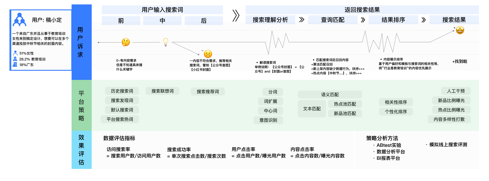
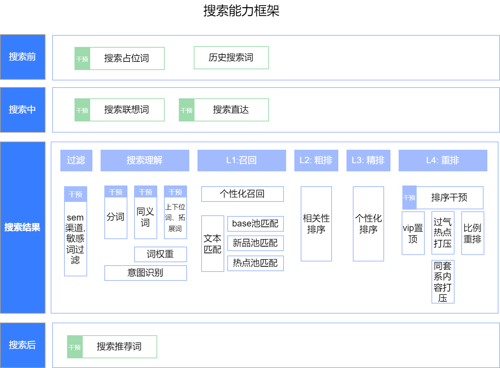
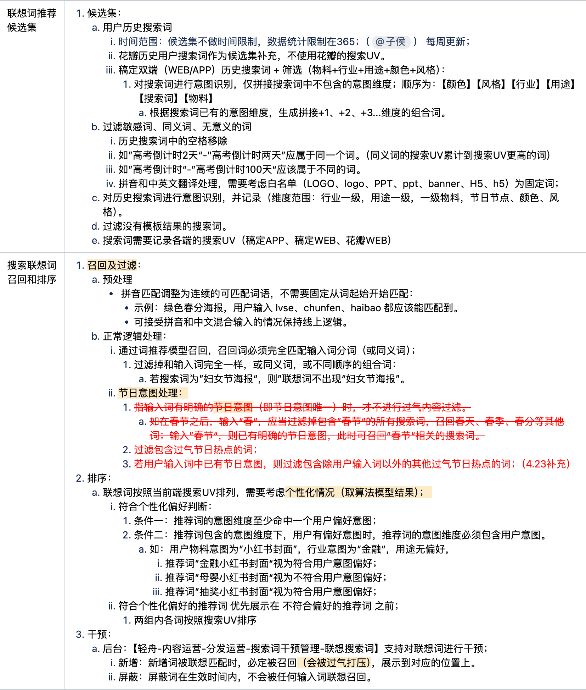
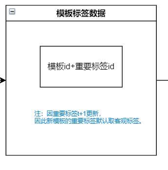
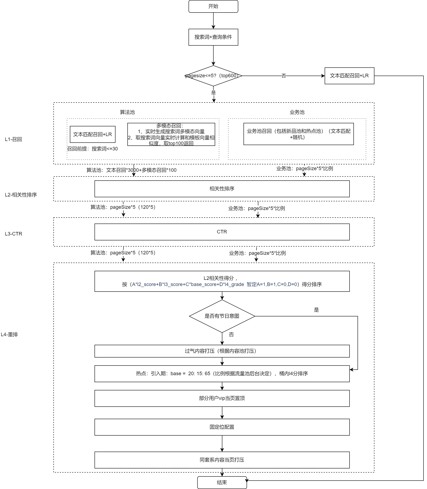
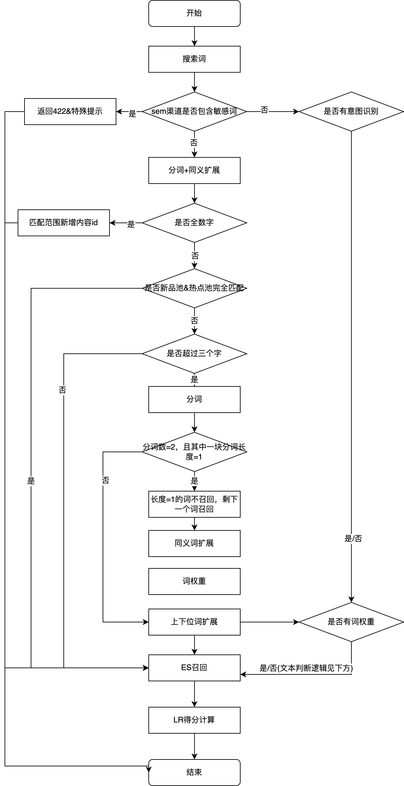
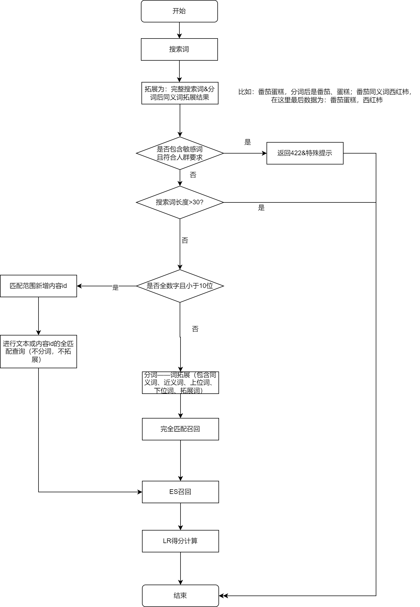
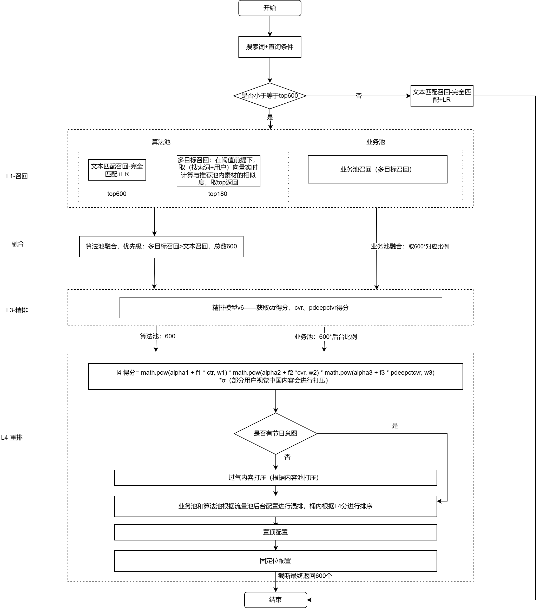

# 稿定搜索能力介绍

> **文档来源**  
> Confluence: https://doc.huanleguang.com/pages/viewpage.action?pageId=172116922

---

## 文档概述

本文档详细介绍**稿定设计搜索能力**的完整架构、技术实现和各搜索场景，涵盖模板搜索、素材搜索、DAM 搜索、Art AI 搜索等。

**核心价值**：
- 🔍 提升用户搜索效率
- 🎯 精准匹配用户需求
- 📈 提高搜索转化率
- 💡 多场景搜索覆盖

---

## 一、搜索能力框架

### 1.1 用户旅程图



**搜索流程**：

```
用户需求
   ↓
搜索前（引导）
   - 搜索底纹词
   - 历史搜索词
   - 搜索热词
   ↓
搜索中（辅助输入）
   - 下拉联想词
   - 专题搜索
   ↓
搜索后（结果展示）
   - 顶部标签推荐
   - Query 相关搜索词
   - 模板相关搜索词
```

### 1.2 整体架构



**架构层次**：

```
┌──────────────────────────────────────────────┐
│          搜索引导层                           │
│  • 搜索底纹词                                │
│  • 历史搜索词                                │
│  • 搜索热词                                  │
│  • 下拉联想词                                │
└──────────────────┬───────────────────────────┘
                   │
┌──────────────────┴───────────────────────────┐
│          搜索理解层                           │
│  • 分词                                      │
│  • 同义词/近义词/下位词                      │
│  • 意图识别                                  │
│  • 标签权重                                  │
│  • 主文案提取                                │
└──────────────────┬───────────────────────────┘
                   │
┌──────────────────┴───────────────────────────┐
│          召回层 (L1)                         │
│  • 热点池召回                                │
│  • 新品池召回                                │
│  • 文本召回 (BM25 + LR)                     │
│  • 向量召回 (个性化)                         │
└──────────────────┬───────────────────────────┘
                   │
┌──────────────────┴───────────────────────────┐
│          排序层 (L3)                         │
│  • 多目标模型排序                            │
└──────────────────┬───────────────────────────┘
                   │
┌──────────────────┴───────────────────────────┐
│          策略层 (L4)                         │
│  • VIP 模板置顶                              │
│  • 过气热点打压                              │
│  • 同套系打压                                │
└──────────────────────────────────────────────┘
```

---

## 二、模板搜索 - 综合排序

### 2.1 搜索前 - 引导用户搜索

#### 2.1.1 搜索底纹词

**定义**：搜索框内的占位提示词

```yaml
功能: 引导用户搜索热门内容
展示位置: 搜索框内占位符
更新策略: 根据热门搜索词定期更新

相关文档: [搜索底纹词]
```

#### 2.1.2 历史搜索词

**定义**：用户的历史搜索记录

```yaml
功能: 快速访问历史搜索
存储位置: 前端本地存储
展示规则: 时间倒序排列

相关文档: [历史搜索词]
```

#### 2.1.3 搜索热词

**定义**：基于全站热度的搜索词推荐


```yaml
功能: 引导用户搜索热门内容

统计规则:
  - 统计近期搜索热度
  - 取 TOP 10-20 热词
  - 定期更新

状态:
  - 23年底下线
  - 已重新上线

相关文档: [搜索热词]
```

#### 2.1.4 搜索发现

```yaml
功能: 搜索页的内容推荐

状态: 23年底下线
```

#### 2.1.5 搜索框激活推荐

```yaml
功能: 点击搜索框时的推荐

状态: 已下线
```

---

### 2.2 搜索中 - 辅助用户输入

#### 2.2.1 下拉联想词

**定义**：输入时的实时联想推荐



```yaml
功能: 
  - 减少用户输入成本
  - 纠正输入错误
  - 推荐相关搜索词

实现:
  - 前缀匹配
  - 按搜索热度排序
  - 实时更新

优化:
  - [202405稿定web搜索联想词上下游串联推荐]
```

#### 2.2.2 专题搜索

```yaml
功能: 针对特定专题的搜索

场景:
  - 营销日历
  - 节日专题
  - 热点专题

相关文档: [专题搜索]
```

#### 2.2.3 搜索词直达

```yaml
功能: 搜索词直接跳转到特定页面

场景:
  - 品牌词直达
  - 专题词直达
```

---

### 2.3 搜索后 - 结果展示与推荐

#### 2.3.1 顶部标签推荐

```yaml
功能: 搜索结果页顶部的标签筛选推荐

作用:
  - 帮助用户精确搜索
  - 提供相关标签筛选
```

#### 2.3.2 Query 相关搜索词推荐

```yaml
功能: 推荐与当前搜索词相关的其他搜索词

展示位置:
  - Web: 搜索框下方
  - App: 搜索框下方

相关文档: [query-相关搜索词]
```

#### 2.3.3 模板相关搜索词推荐

```yaml
功能: 基于模板推荐相关搜索词

状态: App 迭代时已去掉该功能

相关文档: [模板-相关搜索词]
```

---

### 2.4 过滤层

#### 2.4.1 敏感词过滤

```yaml
功能: 过滤敏感内容

规则:
  - 政治敏感词
  - 违禁词
  - 低俗词

相关文档: [过滤_敏感词过滤]
```

---

### 2.5 搜索理解层

#### 2.5.1 分词

**定义**：将搜索词切分成多个词

```yaml
分词工具: Jieba 分词

策略:
  - 精确分词模式
  - 自定义词库
  - 词库干预

相关文档: [理解_分词]
```

#### 2.5.2 同义词、下位词、近义词

**定义**：对搜索词进行扩展，提高召回

```yaml
词库扩展:
  - 同义词: 相同含义的词
  - 近义词: 相近含义的词
  - 下位词: 更具体的词
  
示例:
  原词: "手机"
  同义词: "移动电话"
  下位词: "iPhone", "华为手机"
  
优化:
  [20250218-稿定双端文本召回词拓展范围优化]
```

#### 2.5.3 意图识别

**定义**：识别用户搜索意图

```yaml
功能:
  - 个性化向量生成
  - 意图概率预测
  
使用:
  - 根据意图调整召回策略
  - 个性化排序
  
相关文档:
  [统一意图识别召回一期-搜索向量召回]
```

#### 2.5.4 标签权重

**定义**：不同标签的权重配置



```yaml
功能:
  - 标题权重最高
  - 核心标签权重中等
  - 辅助标签权重较低
  
相关文档:
  [20220111-标签权重优化]
```

#### 2.5.5 主文案提取

**定义**：提取内容的主要文案

```yaml
策略:
  - 基于字号 TOP 2 的文本
  - 生成主文案
  
目的:
  - 提高搜索相关性
  - 优先匹配主要内容
  
相关文档:
  [220317-全文案召回优化成主文案召回]
```

---

### 2.6 召回层 (L1)



#### 2.6.1 热点池召回

**定义**：热点内容池的召回

```yaml
热点内容定义:
  - 节日标签内容（在节日期间）
  - 热点事件相关内容
  
过气内容定义:
  - 节日标签内容（节日过后）
  - 热点事件过期内容
  
判断规则:
  统计日时:
    - 无热点标签 + 有过气标签 + 无过气标签组 → 过气内容
    - 有热点标签 + 有过气标签 + 有过气标签组 → 过气内容
    - 有热点标签 + 无过气标签 → 热点内容
    - 无热点标签 + 无过气标签 → 常规内容

优化策略:
  - [20230207-热点内容标签]
  - [20250305-有节日意图的搜索词不召回热点池内容]
  - [20250218-业务池召回提高相关阈值]
```

**过气标签组示例**：

```
示例:
  标签 "春节"，交集标签：["初一", "初二"]
  标签组合：
    - [春节, 初一]
    - [春节, 初二]
  
  若 "初一" 过气，"春节"、"初二" 未过气
  则过气标签组为：[春节, 初一]
```

#### 2.6.2 新品池召回

**定义**：新上架内容的召回

```yaml
新品池定义:
  条件1: (当前生命周期为引入期 OR 近14天上架)
        AND 非过气热点
        AND 发布状态为已发布
  
  条件2: OR 近1天上架（实时条件）

目的:
  - 提升新内容曝光
  - 给新内容冷启动机会

优化:
  [20250218-业务池召回提高相关阈值]
```

#### 2.6.3 文本召回

**定义**：基于文本匹配的召回




**召回流程**：

```yaml
步骤1: Query 分词
  - 使用 Jieba 精确分词
  
步骤2: 词扩展
  - 同义词扩展
  - 近义词扩展
  - 下位词扩展
  
步骤3: 完全匹配查询
  查询逻辑:
    原词和扩展词之间为 OR
    词和词之间为 AND
  
  示例:
    Query 分词: A B C N
    扩展结果:
      B 下位词: B1
      C 同义词: C1
      C 近义词: C2
      N 同义词: N1
    
    查询语句:
      A AND (B OR B1) AND (C OR C1 OR C2) AND (N OR N1)
    
    注意: C2（近义词）不计算 BM25 分值

步骤4: 排序
  - 计算 BM25 分值
  - 计算 LR 预估分
  - 综合排序
```

**LR 模型**：

```yaml
模型:
  - Web: [200811 - 稿定WEB LR预估分数权重]
  - App: [201030 - 稿定APP LR分数预估]
  
特征:
  - 文本相关性（BM25）
  - 内容热度
  - 用户行为

排序分 = BM25 分 * 权重1 + LR 分 * 权重2
```

**特殊规则**：

```yaml
纯数字处理:
  长度 <= 5:
    - 有个性化推荐
    - 文本召回走正常文本匹配
  
  长度 > 5 且 < 10:
    - 没有个性化推荐
    - 文本召回走 ID 匹配或正常文本匹配
  
  其他情况:
    - 有个性化推荐
    - 走文本匹配

符号处理:
  - 单独符号不进行召回
```

#### 2.6.4 向量召回（个性化）

**定义**：基于用户向量和内容向量的召回


```yaml
模型:
  - 深度学习向量模型
  - 用户向量 × 内容向量
  
召回策略:
  - 根据用户历史行为生成用户向量
  - 计算用户向量与内容向量的相似度
  - 召回相似度最高的内容
  
相关性阈值:
  - 低于阈值的内容不召回
  - 保证召回质量

召回数量:
  - 根据场景配置
  - 通常 100-200 个
```

---

### 2.7 排序层 (L3)

#### 2.7.1 多目标模型

**定义**：预估多个目标的深度学习模型

```yaml
预估目标:
  - 点击概率
  - 下载概率
  - 付费概率
  
模型特点:
  - Multi-Task Learning
  - 考虑未登录用户
  - 考虑投放信息
  
特征:
  用户特征:
    - 历史行为
    - 兴趣标签
    - 是否登录
    
  内容特征:
    - 标签
    - 类别
    - 热度
    - 质量分
    
  上下文特征:
    - 搜索词
    - 时间
    - 设备

优化:
  [20241211 稿定双端-排序模型增加考虑未登录用户和投放信息优化]
```

---

### 2.8 策略层 (L4)

#### 2.8.1 VIP 置顶

```yaml
定义: 针对特定用户置顶 VIP 模板

策略:
  生效人群: 首次访问超过30天且非会员用户
  判断规则: 使用分群ID
  
相关文档: [付费模板置顶]
```

#### 2.8.2 非节日意图搜索词打压过气热点

```yaml
定义: 对非节日意图的搜索词，打压过气热点内容

策略:
  - 只对非节日意图的搜索词生效
  - 打压部分有时效性标签组的内容
  - 降低过气内容的排序

优化:
  - [20230220-稿定web搜索增加过气热点打压]
  - [20220926-搜索app热点过气打压]
```

#### 2.8.3 同套系内容当页打压

```yaml
定义: 同一套系的内容在同一页内打散

策略:
  - 避免同一套系内容集中展示
  - 提升搜索结果多样性
```

---

### 2.9 搜索结果页下方推荐模块

```yaml
出现规则:
  - 搜索结果数 < 120 时展示

推荐数据规则:
  召回:
    - 根据原搜索词进行个性化召回（实时）
    - 召回低于相关性阈值的结果
    - 按向量相似度排序
    - 与顶部结果去重
    - 返回 TOP 100
  
  筛选:
    - 若用户有筛选行为，推荐时也带上筛选器ID
```

---

## 三、模板搜索 - 其他排序

### 3.1 最新上传

```yaml
召回策略:
  个性化召回:
    - 同综合排序的个性化召回
    - 在满足阈值前提下取 TOP 100
  
  文本召回:
    - 同综合排序的文本召回完全匹配
    - 词扩展 + 且召回
    - 根据"最新排序时间"取 TOP 700

排序策略:
  - 合并个性化召回和文本召回
  - 根据"最新排序时间"排序
  - 最新的排在前面
```

### 3.2 最多下载

```yaml
召回策略:
  个性化召回:
    - 同综合排序的个性化召回
    - 在满足阈值前提下取 TOP 100
  
  文本召回:
    - 同综合排序的文本召回完全匹配
    - 词扩展 + 且召回
    - 根据 LR 分取 TOP 700

排序策略:
  - 合并个性化召回和文本召回
  - 根据"下载次数"排序
  - 下载最多的排在前面
```

---

## 四、编辑器内工具素材搜索



```yaml
实现方案:
  - 接入花瓣素材算法模型
  - 文本召回可匹配的内容和稿定模板一致
  - 非核心 term 也可召回

优化:
  [20241105稿定双端编辑器内素材搜索接入花瓣素材算法模型]
```

---

## 五、编辑器外版权素材搜索

```yaml
实现方案: 花瓣融合二期

召回层:
  文本且召回（LR）:
    - 取核心 term
    - 使用花瓣 LR 模型和数据

排序层:
  - 使用花瓣排序模型
  - 特征取花瓣侧特征
  - 主要是内容侧特征

策略层:
  - 支持流量池
  - 支持排序结果干预

相关文档:
  [花瓣融合二期]
```

---

## 六、DAM 搜索

### 6.1 文件夹搜索

```yaml
匹配范围:
  - 文件夹名称

召回逻辑:
  - 在用户权限范围内
  - 文本模糊搜索（LIKE '%xxx%'）

排序逻辑:
  支持业务规则排序:
    - 添加时间
    - 修改时间
    - 文件大小
    - 文件名称
```

### 6.2 作品搜索

```yaml
匹配范围:
  - 作品标题（权重: 4分）
  - 用户打的标签（不算分）
  - AI 标签（不算分，旧 AI 视觉模型）
  - 作品文字（不区分主文案，需编辑器可识别）

召回逻辑:
  - 在用户权限范围内
  - 搜索词分词
  - 词库扩展（同义词、近义词）
  - OR 召回匹配

排序逻辑:
  支持业务规则排序:
    - 添加时间
    - 修改时间
    - 文件大小
    - 文件名称
```

---

## 七、Art AI 模板及作品搜索

### 7.1 AI 模板搜索

#### 7.1.1 综合排序

```yaml
匹配范围:
  - AI 模板标题
  - 标签
  - 分类
  - 话题

召回及排序逻辑:
  分词逻辑: 同稿定模板搜索
  词拓展逻辑: 同稿定模板搜索
  召回: 完全匹配召回
  
  排序分计算:
    排序分 = 1 * BM25 值 + 4 * 热度分
    （参考稿定文本召回逻辑）
```

#### 7.1.2 最新上传

```yaml
匹配范围: 同综合排序
分词逻辑: 同综合排序
词拓展逻辑: 同综合排序
召回逻辑: 完全匹配召回

排序逻辑:
  - 根据 AI 模板的最新排序时间
  - 从近到远排序
```

### 7.2 AI 作品搜索

#### 7.2.1 综合排序

```yaml
匹配范围:
  - AI 作品标签
  - 分类
  - 作品标题（即作品 prompt）

召回及排序逻辑:
  基本同 AI 模板搜索综合排序
  
  差异点:
    1. 热度分使用 AI 作品的热度分
    2. 匹配到作品标题时，不计算 BM25 分
```

#### 7.2.2 最新上传

```yaml
匹配范围: 同综合排序
分词逻辑: 同综合排序
词拓展逻辑: 同综合排序
召回逻辑: 完全匹配召回

排序逻辑:
  - 根据作品的最新排序时间
  - 从近到远排序
```

---

## 八、各坑位搜索链路接入现状

### 8.1 搜索结果页

```yaml
场景:
  - Web 搜索结果页
  - App 搜索结果页
  - 场景页搜索结果页

搜索链路:
  - 综合排序
  - 最新上传
  - 最多下载
```

### 8.2 编辑器内搜索

```yaml
场景:
  - 编辑器左侧栏模板搜索
  - 编辑器左侧栏素材搜索

搜索链路:
  - 工具素材搜索（接入花瓣模型）
```

### 8.3 专题搜索

```yaml
场景:
  - 营销日历搜索
  - 节日专题搜索

搜索链路:
  - 专题搜索能力
```

---

## 九、总结与展望

### 9.1 核心能力总结

**搜索引导**：
- ✅ 搜索底纹词
- ✅ 历史搜索词
- ✅ 搜索热词
- ✅ 下拉联想词

**搜索理解**：
- ✅ 分词
- ✅ 同义词/近义词/下位词
- ✅ 意图识别
- ✅ 标签权重
- ✅ 主文案提取

**召回策略**：
- ✅ 热点池召回
- ✅ 新品池召回
- ✅ 文本召回（BM25 + LR）
- ✅ 向量召回（个性化）

**排序策略**：
- ✅ 多目标模型排序

**策略优化**：
- ✅ VIP 模板置顶
- ✅ 过气热点打压
- ✅ 同套系打散

### 9.2 搜索场景覆盖

**模板搜索**：
- ✅ 综合排序
- ✅ 最新上传
- ✅ 最多下载

**素材搜索**：
- ✅ 编辑器内工具素材搜索
- ✅ 编辑器外版权素材搜索

**其他搜索**：
- ✅ DAM 搜索（文件夹、作品）
- ✅ Art AI 搜索（模板、作品）

### 9.3 未来优化方向

**搜索理解**：
- 🔄 深度语义理解
- 🔄 多轮对话搜索
- 🔄 图文混合搜索

**召回优化**：
- 🔄 召回多样性提升
- 🔄 实时召回优化
- 🔄 跨模态召回

**排序优化**：
- 🔄 排序模型升级
- 🔄 实时特征引入
- 🔄 多目标平衡优化

**用户体验**：
- 🔄 搜索结果解释
- 🔄 搜索引导优化
- 🔄 零结果优化

---

## 十、参考资料

**内部文档**：
- [200813 - ES相关性之BM25](https://doc.huanleguang.com/wiki/pages/viewpage.action?pageId=95402604)
- [200811 - 稿定WEB LR预估分数权重](https://doc.huanleguang.com/wiki/pages/viewpage.action?pageId=95402604)
- [201030 - 稿定APP LR分数预估](https://doc.huanleguang.com/wiki/pages/viewpage.action?pageId=105286028)
- [20220111-标签权重优化](https://doc.huanleguang.com/wiki/pages/viewpage.action?pageId=196114367)
- [220317-全文案召回优化成主文案召回](https://doc.huanleguang.com)
- [20230207-热点内容标签](https://doc.huanleguang.com)
- [20241211 稿定双端-排序模型增加考虑未登录用户和投放信息优化](https://doc.huanleguang.com)
- [统一意图识别召回一期-搜索向量召回](https://doc.huanleguang.com/wiki/pages/viewpage.action?pageId=369876347)
- [花瓣融合二期](https://doc.huanleguang.com/wiki/pages/viewpage.action?pageId=378306920)

**原始文档**：
- [Confluence: 稿定搜索能力介绍](https://doc.huanleguang.com/pages/viewpage.action?pageId=172116922)

---

**文档维护**：搜索算法团队  
**文档整理**：前端基建团队  
**整理日期**：2025-01-25  
**文档版本**：v2.0
