# 稿定前端超级仓库 CI/CD 深度解析

> 作者:资深前端架构师、SRE专家  
> 日期:2026-01-16  
> 项目:稿定科技前端 Monorepo (@gdesign/monorepo-root)

## 目录

- [1. 概述](#1-概述)
- [2. CI/CD 架构设计](#2-cicd-架构设计)
- [3. 核心技术栈](#3-核心技术栈)
- [4. Pipeline 流程详解](#4-pipeline-流程详解)
- [5. 自动化机器人系统](#5-自动化机器人系统)
- [6. Turbo 构建优化](#6-turbo-构建优化)
- [7. Changeset 版本管理](#7-changeset-版本管理)
- [8. 部署系统](#8-部署系统)
- [9. 最佳实践与优化](#9-最佳实践与优化)

---

## 1. 概述

### 1.1 CI/CD 核心价值

现代软件开发中，从代码提交到生产部署通常需要经历一系列标准化流程：

**传统手动流程的局限**：

1. 代码质量检查依赖人工审查
2. 测试执行需要手动触发和等待
3. 构建打包过程繁琐且耗时
4. 部署流程复杂，容易出现环境差异
5. 回滚和故障恢复响应缓慢

**CI/CD 自动化的价值**：

- **持续集成 (CI)**: 代码提交后自动触发构建、测试和质量检查，快速发现集成问题
- **持续部署 (CD)**: 通过验证的代码自动部署到目标环境，缩短交付周期

**本质上**，CI/CD 是将软件交付流程标准化、自动化，通过管道（Pipeline）机制编排各个环节，实现从代码到生产的高效流转。

### 1.2 项目背景

稿定科技前端超级仓库是一个基于 **Monorepo** 架构的大规模前端工程，整合了多个业务线的应用和共享基础设施。

**Monorepo 架构特点**：

相比传统的多仓库（Multi-repo）模式，Monorepo 将所有相关项目集中在单一代码仓库中管理：

```
多仓库模式的挑战:
├── 仓库A (独立版本控制)
├── 仓库B (独立版本控制)
└── 共享库仓库 (独立版本控制)

问题:
- 代码复用需要跨仓库同步
- 依赖版本管理复杂
- 原子性变更困难（需要多个 PR）
- CI/CD 配置分散
```

```
Monorepo 统一管理:
超级仓库/
├── apps/                    # 应用层
│   ├── gaoding/            # 稿定设计
│   ├── insmind/            # InsMind
│   └── open-platform/      # 开放平台
├── domains/                 # 领域层
│   ├── editor/             # 编辑器领域
│   └── commerce/           # 电商领域
└── packages/                # 基础设施层
    ├── ui/                 # UI 组件
    └── services/           # 服务层

优势:
- 统一的依赖管理和版本策略
- 原子性提交（一次 PR 可跨多个包）
- 共享 CI/CD 配置和工具链
- 更好的代码可见性和复用性
```

**项目规模指标**：

- 文件总数: 15,000+
- 应用数量: 8+
- 共享包: 100+
- 代码量: 500,000+ 行

### 1.3 CI/CD 设计驱动因素

在 Monorepo 规模下，传统手动流程面临的挑战：

**手动流程的瓶颈**：

- 环境准备：手动搭建测试环境，耗时 15-20 分钟
- 构建验证：全量构建后发现问题，反馈周期长
- 依赖管理：跨包依赖变更需要人工协调
- 部署风险：手动操作容易引入环境差异
- **结果**：单次验证周期 > 30 分钟，每日迭代次数 < 5 次

**自动化流程的效率提升**：

- 自动触发：代码提交即触发 Pipeline
- 增量构建：只构建变更的包及其依赖项
- 并行执行：多任务并发，缩短总耗时
- 环境一致：容器化确保环境可复现
- **结果**：单次验证周期 < 5 分钟，支持高频迭代

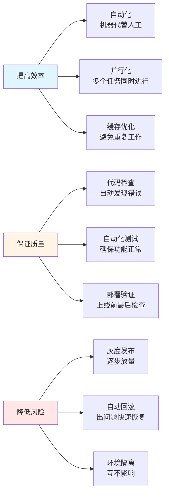

**核心设计原则**:

**1. 自动化优先**

消除手动流程中的重复性工作和人为错误：

```
手动流程:
代码提交 → 手动检查 → 手动测试 → 手动构建 → 手动部署
风险: 流程不一致、步骤遗漏、时间成本高

自动化流程:
代码提交 → Pipeline 自动编排 → 标准化流程 → 自动部署
优势: 流程标准化、可追溯、快速反馈
```

**2. 增量构建**

利用缓存和依赖分析，避免不必要的重复构建：

- **全量构建策略**：每次构建所有包，CI 耗时 15-20 分钟
- **增量构建策略**：基于文件变更和依赖图分析，只构建受影响的包，CI 耗时 3-5 分钟

Turbo 通过内容哈希和依赖追踪实现智能缓存，显著提升构建效率。

**3. 并行执行**

充分利用 CI 资源，缩短总体执行时间：

```
串行执行:
Task A (5min) → Task B (5min) → Task C (5min) = 15min

并行执行:
Task A (5min) ┐
Task B (5min) ├→ 并发执行 = 5min
Task C (5min) ┘
```

Stage 内的独立 Job 可并行执行，最大化 CI 吞吐量。

**4. 环境一致性**

通过容器化技术确保构建和运行环境的可复现性：

常见的环境差异问题：

- Node.js 版本不一致
- 系统依赖缺失
- 环境变量配置差异

Docker 容器化方案：

```
构建镜像 = 测试环境 = 生产环境
（封装应用及其所有依赖，确保环境一致性）
```

**5. 可观测性**

完善的日志、监控和追踪机制：

- **Pipeline 可视化**：实时查看执行进度和状态
- **结构化日志**：便于问题定位和审计
- **性能指标**：持续监控构建时间、缓存命中率等关键指标
- **Artifacts 保留**：保存构建产物和测试报告，支持问题复现

### 1.4 技术选型

基于 Monorepo 的特性和项目规模，我们选择了以下技术栈：

**GitLab CI/CD - Pipeline 编排引擎**

**职责**：

- CI/CD 流程的编排和执行
- 提供统一的 Runner 环境
- 管理 Artifacts 和缓存

**选型原因**：

- 与 GitLab 代码仓库深度集成，单点登录
- 声明式配置（YAML），易于版本控制
- 内置 Artifacts、Cache、Registry 等基础设施
- 支持组件化配置（Component），便于复用

**Turbo - Monorepo 构建编排工具**

**核心能力**：

- **智能缓存**：基于内容哈希的任务级缓存，避免重复构建
- **增量构建**：依赖图分析，只构建受影响的包
- **并行执行**：根据依赖关系自动并行化任务
- **远程缓存**：团队共享构建结果，加速 CI

**性能对比**：

```
场景：修改登录模块代码

传统构建：全量重新构建所有包
- 耗时：10-15 分钟
- 构建包数：100+

Turbo 增量构建：只构建受影响的包
- 耗时：1-2 分钟
- 构建包数：5-10
- 缓存命中率：85%+
```

**pnpm - 高效的包管理器**

**技术特点**：

- **内容寻址存储**：全局 store 存储依赖，通过硬链接复用
- **严格的依赖隔离**：非扁平化 node_modules，避免幽灵依赖
- **Workspace 支持**：原生支持 Monorepo 管理

**效率提升**：

- 磁盘占用减少 50%+（相比 npm/yarn）
- 安装速度提升 2-3 倍
- 支持 Catalog 功能，统一管理依赖版本

**Changesets - 语义化版本管理**

**工作流**：

1. 开发阶段：创建 changeset 文件，记录变更类型和描述
2. 发布准备：自动分析 changesets，更新版本号和 CHANGELOG
3. 发布执行：发布到 NPM Registry，创建 Git Tag

**解决的问题**：

- 自动化版本管理，遵循语义化版本规范
- 自动生成 CHANGELOG，减少手动维护成本
- 支持 Monorepo 场景的依赖版本联动

**Docker - 容器化运行时**

**价值**：

- 封装应用及其运行时依赖，确保环境一致性
- 通过镜像实现可复现的部署
- 利用分层缓存机制加速镜像构建

**典型场景**：

```
问题：开发环境 Node 16，生产环境 Node 18，出现兼容性问题

解决：Docker 镜像锁定 Node 版本，所有环境使用同一镜像
```

**OSS/CDN - 静态资源分发**

**架构**：

- **OSS (对象存储)**：持久化存储静态资源（HTML、JS、CSS、图片等）
- **CDN (内容分发网络)**：全球节点缓存，就近响应用户请求

**性能优化**：

- 减轻源站压力，提升并发能力
- 降低访问延迟（边缘节点缓存）
- 支持 HTTPS、GZIP 压缩等优化特性

**技术选型总结**：

| 技术         | 核心价值           | 关键指标              |
| ------------ | ------------------ | --------------------- |
| GitLab CI/CD | 流程编排和执行     | Pipeline 耗时 < 15min |
| Turbo        | 构建性能优化       | 缓存命中率 > 80%      |
| pnpm         | 依赖管理效率       | 安装速度提升 2-3x     |
| Changesets   | 版本管理自动化     | 零人工干预发布        |
| Docker       | 环境一致性保障     | 跨环境零差异          |
| OSS/CDN      | 静态资源高性能分发 | 全球访问延迟 < 100ms  |

---

## 2. CI/CD 架构设计（系统是如何工作的）

### 2.1 整体架构

CI/CD 系统由代码仓库、Pipeline 编排、基础设施三部分组成，通过 GitLab CI/CD 实现端到端的自动化流程：

**架构分层**：

1. **代码仓库层**：GitLab 托管源代码，触发 CI/CD 流程
2. **Pipeline 编排层**：7 个 Stage 串行执行，每个 Stage 包含多个并行 Job
3. **基础设施层**：提供镜像仓库、对象存储、CDN、容器编排等支撑服务

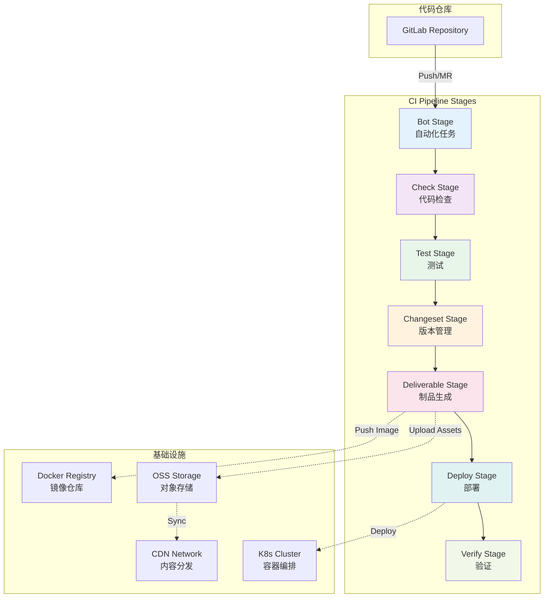

### 2.2 Pipeline 配置结构

项目的 GitLab CI 配置采用**组件化设计**,主配置文件 `.gitlab-ci.yml` 非常简洁:

```yaml:1:24:.gitlab-ci.yml
spec:
  inputs:
    catalog_update:
      description: 'Run catalog update bot'
      default: false
      type: boolean
    merge_versions_mr:
      description: 'Run merge versions MR bot'
      default: false
      type: boolean
    packages_index_update:
      description: 'Run packages index update bot'
      default: false
      type: boolean
    editor_code_update:
      description: 'Run editor code update'
      default: false
      type: boolean
---
include:
  - component: $CI_SERVER_FQDN/gdesign/monorepo-workflows/default@12
    inputs:
      create_gitlab_releases: 'false'
```

**关键设计**:

1. **输入参数化**: 通过 `spec.inputs` 定义可配置的开关,支持灵活控制
2. **组件复用**: 引入 `monorepo-workflows/default@12` 组件,封装通用流程
3. **版本管理**: 通过 `@12` 指定组件版本,确保稳定性

### 2.3 Stage 设计

Pipeline 由 7 个 Stage 组成，各 Stage 职责明确，串行执行以保证流程顺序性：

```yaml:25:32:.gitlab-ci.yml
stages:
  - bot         # 自动化维护任务
  - check       # 代码质量检查
  - test        # 自动化测试
  - changeset   # 版本管理
  - deliverable # 制品生成
  - deploy      # 环境部署
  - verify      # 部署验证
```

**各 Stage 职责详解**：

**Bot Stage - 自动化维护**

**职责**：定时或事件触发的自动化维护任务

- Catalog 依赖更新
- Packages Index 文档生成
- 版本 MR 自动合并
- 编辑器代码同步

**执行条件**：通过 `spec.inputs` 和 `rules` 控制，支持定时触发和手动触发

**Check Stage - 静态分析**

**职责**：代码质量门禁，确保代码符合规范

- **Lint 检查**：ESLint、Stylelint、Prettier 等
- **类型检查**：TypeScript `tsc --noEmit`
- **依赖扫描**：检测循环依赖、重复依赖、未使用依赖

**关键价值**：前置发现问题，避免低质量代码进入后续流程

**Test Stage - 自动化测试**

**职责**：功能验证，确保代码正确性

测试分层：

- **单元测试**：测试单个函数/模块的逻辑正确性
- **集成测试**：测试多个模块协作的正确性
- **E2E 测试**：模拟真实用户场景的端到端测试

**输出产物**：测试报告（JUnit XML）、覆盖率报告

**Changeset Stage - 版本管理**

**职责**：自动化版本发布流程

- 分析 `.changeset/*.md` 文件
- 计算新版本号（遵循语义化版本）
- 更新 package.json 和 CHANGELOG.md
- 创建版本 MR 或直接发布

**关键特性**：支持 Monorepo 场景的联动更新

**Deliverable Stage - 制品生成**

**职责**：生成可部署的交付物

制品类型：

- **Docker 镜像**：容器化应用镜像
- **静态资源**：前端构建产物（压缩、哈希）
- **部署配置**：K8s YAML、环境变量配置

**依赖关系**：依赖 Build Stage 的构建产物

**Deploy Stage - 环境部署**

**职责**：将制品部署到目标环境

环境分类：

- **Review 环境**：MR 预览环境，动态创建
- **Staging 环境**：预发布环境，验证功能
- **Production 环境**：生产环境，服务最终用户

**环境隔离**：通过 `CI_ENVIRONMENT_TYPE` 和 `CI_ENVIRONMENT_INSTANCE` 实现

**Verify Stage - 部署验证**

**职责**：验证部署结果，确保服务可用

验证维度：

- **健康检查**：HTTP 健康检查端点
- **冒烟测试**：核心业务流程快速验证
- **性能监控**：响应时间、错误率等指标
- **业务指标**：关键业务指标是否正常

**Stage 流程关系**：

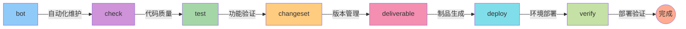

每个 stage 串行执行,同一 stage 内的 job 可以并行执行,保证了流程的顺序性和效率。

---

## 3. 核心技术栈

### 3.1 Turbo - 高性能构建编排

#### 3.1.1 Turbo 配置

```json:1:90:turbo.json
{
    "$schema": "https://turbo.build/schema.json",
    "globalPassThroughEnv": [
        "APOLLO_TOKEN",
        "APP_API_ENV",
        "APP_ENV",
        "CI_SERVER_URL",
        "CI_COMMIT_REF_NAME",
        "CI_COMMIT_SHA",
        "CI_COMMIT_SHORT_SHA",
        "CI_COMMIT_TAG",
        "CI_ENVIRONMENT_TYPE",
        "CI_ENVIRONMENT_INSTANCE",
        "CI_JOB_URL",
        "CI_MERGE_REQUEST_IID",
        "CI_PIPELINE_ID",
        "CI_PROJECT_ID",
        "CI",
        "DEPLOY_API_ORIGIN",
        "DEPLOY_API_TOKEN",
        "DEPLOY_PROJECT_ID",
        "GITLAB_TOKEN",
        "DCDN_ACCESS_KEY_ID",
        "DCDN_ACCESS_KEY_SECRET",
        "DEBUG_CDN_ENV_CODE",
        "DEPLOY_API_TOKEN",
        "DEV",
        "FLAGS_SECRET",
        "GAODINGX__UMS_JWT_SECRET_KEY",
        "GITLAB_TOKEN",
        "NODE_ENV",
        "NODE_OPTIONS",
        "NPM_TOKEN",
        "OSS_ACCESS_KEY_ID",
        "OSS_ACCESS_KEY_SECRET",
        "OSS_ENDPOINT",
        "PROD",
        "SSR",
        "TTXS__UMS_JWT_SECRET_KEY",
        "TURBO_API",
        "TURBO_TEAM",
        "TURBO_TOKEN",
        "ROLLUP_OPTIONS_MAX_PARALLEL_FILE_OPS"
    ],
    "tasks": {
        "stub": {
            "dependsOn": ["^stub"],
            "outputs": ["dist/**"]
        },
        "dev": {
            "cache": false,
            "persistent": true
        },
        "build": {
            "outputs": ["dist/**"],
            "dependsOn": ["^build"]
        },
        "test": {
            "outputs": ["output/coverage/**", "junit.xml"],
            "dependsOn": ["^build"]
        },
        "check-type": {
            "dependsOn": ["^check-type"]
        },
        "lint": {
            "dependsOn": []
        },
        "deliverable": {
            "dependsOn": ["build"],
            "outputs": ["output/deliverable/**"]
        },
        "deploy": {
            "dependsOn": ["deliverable"],
            "outputs": [],
            "env": ["CI_ENVIRONMENT_TYPE", "CI_ENVIRONMENT_INSTANCE"]
        },
        "destroy": {
            "dependsOn": ["deploy"],
            "outputs": [],
            "env": []
        },
        "verify": {
            "dependsOn": ["deploy"],
            "outputs": ["output/verify/**"]
        },
        "editor-code-update": {
            "cache": false
        }
    }
}
```

#### 3.1.2 任务依赖图

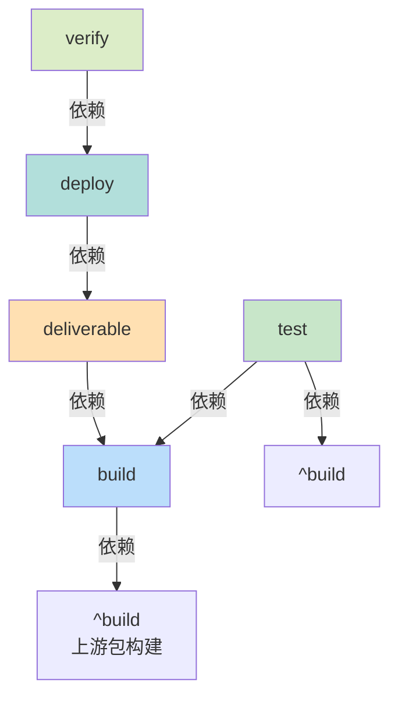

**关键概念**:

- **`^` 前缀**: 表示拓扑依赖,先执行所有上游依赖包的同名任务
- **`dependsOn`**: 定义任务间的依赖关系
- **`outputs`**: 指定需要缓存的输出文件/目录
- **`env`**: 影响缓存 key 的环境变量

#### 3.1.3 缓存机制

Turbo 的缓存策略:

```typescript
// 缓存 Key 计算公式
CacheKey = hash(
  taskName + // 任务名称
    inputs + // 输入文件内容
    env + // 环境变量
    dependencyOutputs, // 依赖的输出
);
```

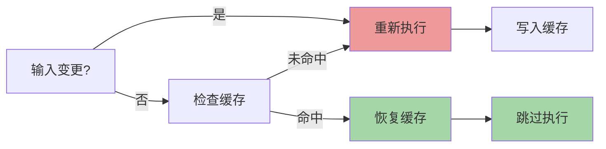

**缓存命中率优化**:

1. 合理划分包的粒度
2. 最小化不必要的文件变动
3. 固定 lockfile
4. 使用远程缓存 (TURBO_TOKEN)

### 3.2 pnpm Workspace

#### 3.2.1 Workspace 配置

```yaml:1:30:pnpm-workspace.yaml
packages:
  - apps/*
  - apps/insmind
  - apps/insmind/*
  - apps/insmind/libs/*
  - apps/insmind/routes/*
  - packages/*
  - packages/**/*
  - conditions/*
  - scripts/*
  - domains/*
  - domains/biz-framework/*
  - domains/commerce/*
  - domains/contents/*
  - domains/dam/*
  - domains/editor/apps/**
  - domains/editor/packages/**
  - domains/editor/extensions/**
  - domains/editor/plugins/**
  - domains/editor/widgets/**
  - domains/editor/demos/**
  - domains/editor/third-party/**
  - domains/editor/root-config/**
  - domains/editor/tools/**
  - domains/editor/shared-partner
  - domains/editor/infinite-shared-partner
  - domains/enterprise/*
  - '!**/__tests__/**'
  - '!**/__template__/**'
```

#### 3.2.2 依赖管理策略

**Catalog 依赖目录** (pnpm workspace catalog 功能):

```yaml:30:100:pnpm-workspace.yaml
catalog:
  '@actions/core': ^1.11.1
  '@actions/exec': ^1.1.1
  '@ant-design/icons': ^5.5.1
  # ... 更多依赖
```

**优势**:

1. **统一版本管理**: 所有包使用相同的依赖版本
2. **减少重复**: 避免多处声明相同依赖
3. **易于升级**: 集中升级依赖版本

**项目使用的自动化工具**:

```json:10:12:package.json
"bot:catalog": "node scripts/gitlab-mr-bot/dist/cli.js mr --source-branch chore/update-catalog --target-branch master --title \"chore: update catalog\" --description \"Automated catalog update\" --commit-message \"chore: update catalog\" --labels \"automation,catalog\" --reviewers \"@tangbing,@qiancong,@juanbai\" -- pnpm run catalog",
```

定期自动更新 catalog 并创建 MR 供审查。

---

## 4. Pipeline 流程详解

### 4.1 Bot Stage - 自动化维护

Bot Stage 包含多个自动化维护任务:

#### 4.1.1 Catalog 自动更新

```yaml:39:49:.gitlab-ci.yml
# 定时运行 catalog 更新任务
catalog update:
  stage: bot
  tags:
    - 'high-concurrency'
  rules:
    - if: '"$[[ inputs.catalog_update ]]" == "true" && ($CI_PIPELINE_SOURCE == "schedule" || $CI_PIPELINE_SOURCE == "web")'
  extends: .install-dependencies
  script:
    - pnpm run build
    - pnpm run bot:catalog
```

**工作流程**:

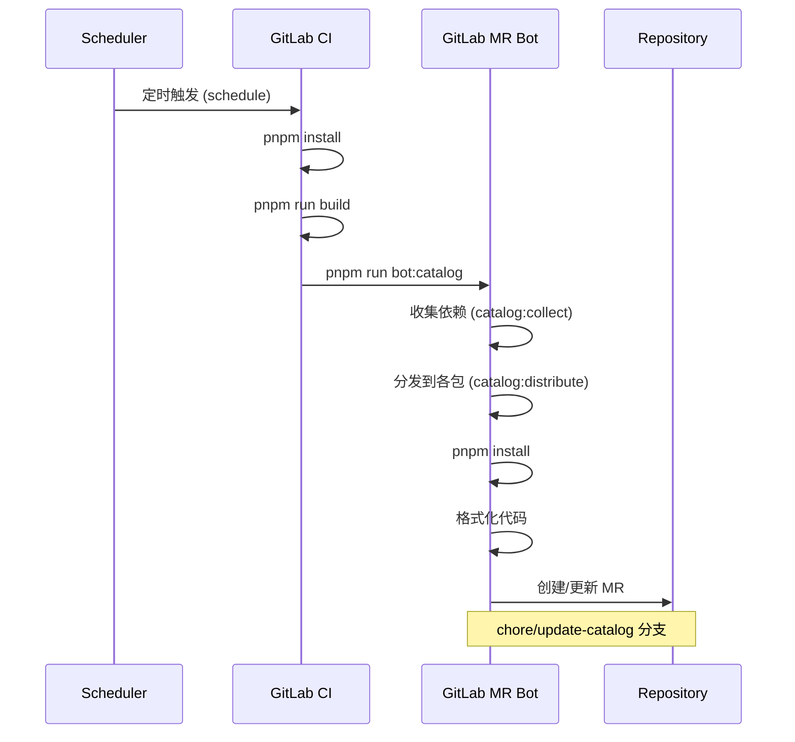

**catalog 管理器** 的核心逻辑在 `scripts/catalog-manager/`:

```typescript
// 简化的核心流程
class CatalogManager {
  // 收集所有包的依赖
  async collect() {
    const packages = await getWorkspacePackages();
    const allDeps = new Map();

    for (const pkg of packages) {
      for (const [name, version] of Object.entries(pkg.dependencies)) {
        // 去重、合并版本
        allDeps.set(name, resolveVersion(version));
      }
    }

    return allDeps;
  }

  // 分发到 catalog
  async distribute(allDeps) {
    const catalogConfig = loadCatalogConfig();

    for (const [name, version] of allDeps) {
      catalogConfig.catalog[name] = version;
    }

    await writeCatalogConfig(catalogConfig);
  }
}
```

#### 4.1.2 自动发布版本

```yaml:51:68:.gitlab-ci.yml
# 定时运行版本 MR 合并任务
auto publish versions:
  stage: bot
  tags:
    - 'high-concurrency'
  # 由于这个脚本中会锁定主分支，所以必须让它全局同时只运行一个实例
  resource_group: auto-publish-versions
  rules:
    # 在 changeset-release 分支的 MR 上手动触发
    - if: '$CI_PIPELINE_SOURCE == "merge_request_event" && $CI_MERGE_REQUEST_SOURCE_BRANCH_NAME =~ /^changeset-release\//'
      when: manual
      allow_failure: true
    # 定时任务或手动触发
    - if: '"$[[ inputs.merge_versions_mr ]]" == "true" && ($CI_PIPELINE_SOURCE == "schedule" || $CI_PIPELINE_SOURCE == "web")'
  extends: .install-dependencies
  timeout: 35m
  script:
    - pnpm run bot:merge-versions-mr
```

**resource_group 机制**:

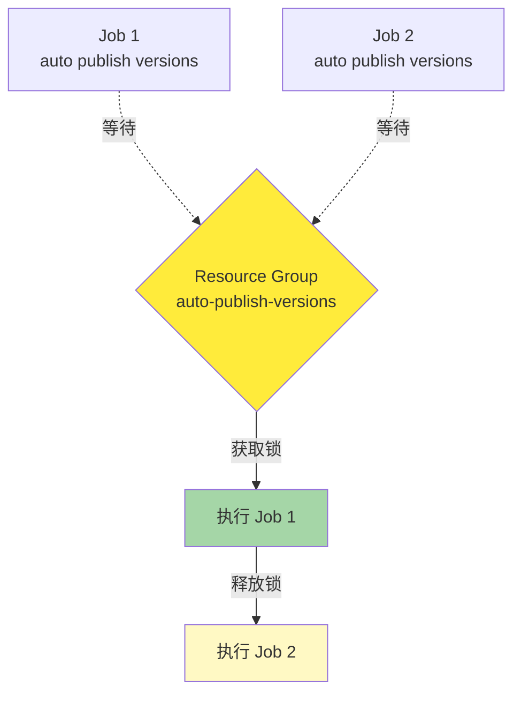

**为什么需要 resource_group?**

因为 `merge-versions-mr.mjs` 脚本会**锁定主分支**,防止在等待 pipeline 期间有其他代码合并导致版本分支不断更新。

### 4.2 Check Stage - 代码质量检查

Check Stage 通过引入的 `monorepo-workflows` 组件实现,通常包括:

1. **Lint 检查**: ESLint、Stylelint、Prettier
2. **类型检查**: TypeScript `tsc --noEmit`
3. **依赖检查**: 循环依赖、重复依赖扫描

```bash
# 本地执行示例
pnpm run lint          # 运行 lint
pnpm run check-type    # 类型检查
```

### 4.3 Test Stage - 自动化测试

```json:58:61:turbo.json
"test": {
    "outputs": ["output/coverage/**", "junit.xml"],
    "dependsOn": ["^build"]
}
```

测试策略:

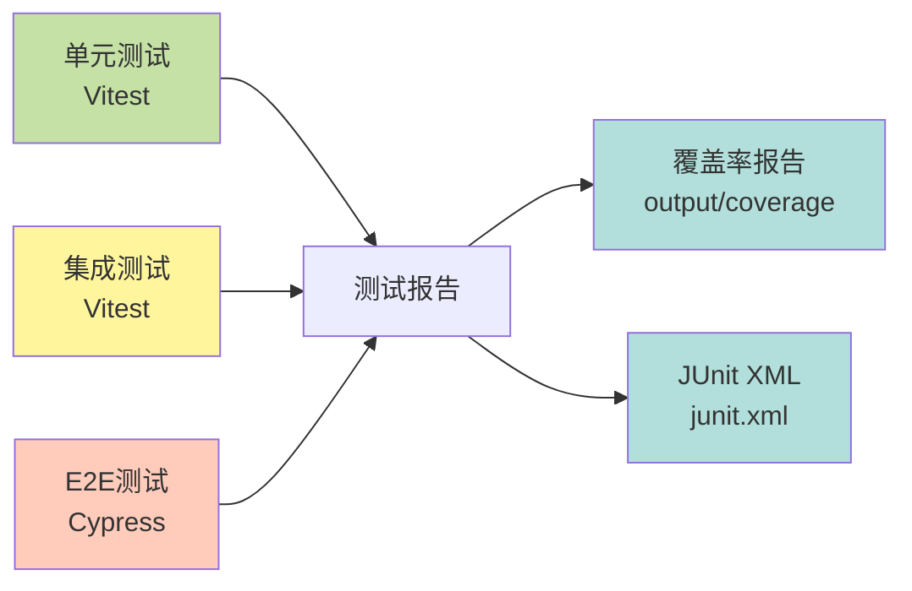

**测试排除配置**:

```json:243:256:package.json
"testExcludePackages": [
    "@gdesign/commerce-core",
    "@gdesign/smart-subtask",
    "@insmind/vue3-services",
    "@gdesign/container",
    "@gdesign/client-bootstrap",
    "@gdesign/meta-utils",
    "@insmind/vue3-routes",
    "@gdesign/site",
    "@app/gaoding-art",
    "@app/example-app",
    "@app/gaoding",
    "@gdesign/contents-app"
]
```

### 4.4 Changeset Stage - 版本管理

Changeset Stage 通过 `changesets-gitlab` 自动化版本发布:

```yaml
# changesets-gitlab 配置示例 (在引入的组件中)
changeset:
  stage: changeset
  script:
    - pnpm install
    - pnpm run build
    - pnpm exec changesets-gitlab
  variables:
    INPUT_VERSION: pnpm run changeset:version
    INPUT_PUBLISH: pnpm run changeset:publish
```

**版本发布流程**:

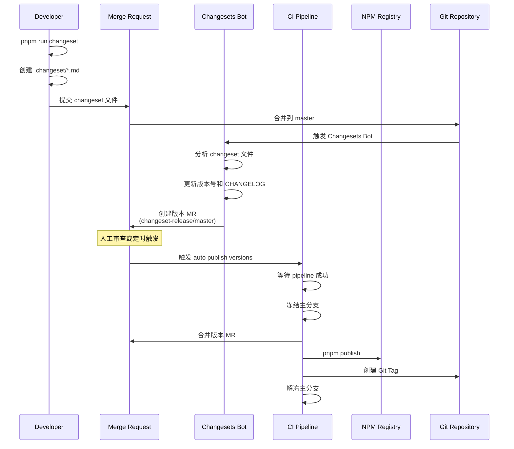

### 4.5 Deliverable Stage - 制品生成

Deliverable Stage 生成可部署的制品:

```json:68:71:turbo.json
"deliverable": {
    "dependsOn": ["build"],
    "outputs": ["output/deliverable/**"]
}
```

**制品类型**:

| 制品类型        | 说明                 | 示例                                          |
| --------------- | -------------------- | --------------------------------------------- |
| **Docker 镜像** | 容器化应用           | `gaoding-registry.cr.aliyuncs.com/app:v1.0.0` |
| **静态资源**    | 前端构建产物         | HTML、CSS、JS、图片等                         |
| **NPM 包**      | 可复用的库           | 上传到私有 NPM Registry                       |
| **部署配置**    | K8s YAML、Helm Chart | 用于部署编排                                  |

**应用示例配置**:

```json:19:27:apps/gaoding/turbo.json
"deliverable": {
    "passThroughEnv": [
        "OSS_ACCESS_KEY_ID",
        "OSS_ACCESS_KEY_SECRET",
        "NPM_TOKEN",
        "FLAGS_SECRET"
    ],
    "env": ["OSS_ENDPOINT"]
}
```

### 4.6 Deploy Stage - 环境部署

```json:72:76:turbo.json
"deploy": {
    "dependsOn": ["deliverable"],
    "outputs": [],
    "env": ["CI_ENVIRONMENT_TYPE", "CI_ENVIRONMENT_INSTANCE"]
}
```

**多环境部署**:

```json:34:36:package.json
"deploy:production": "CI_ENVIRONMENT_TYPE=production CI_ENVIRONMENT_INSTANCE=default APP_API_ENV=prod turbo run deploy --output-logs=new-only",
"deploy:review": "CI_ENVIRONMENT_TYPE=review CI_ENVIRONMENT_INSTANCE=$([ \"$CI_PIPELINE_SOURCE\" = \"merge_request_event\" ] && echo \"mr$CI_MERGE_REQUEST_IID\" || echo \"default\") APP_API_ENV=fat sh scripts/turbo-analyzer/turbo-with-report.sh turbo run deploy --output-logs=new-only",
"deploy:staging": "CI_ENVIRONMENT_TYPE=staging CI_ENVIRONMENT_INSTANCE=default APP_API_ENV=stage sh scripts/turbo-analyzer/turbo-with-report.sh turbo run deploy --output-logs=new-only",
```

**环境隔离策略**:

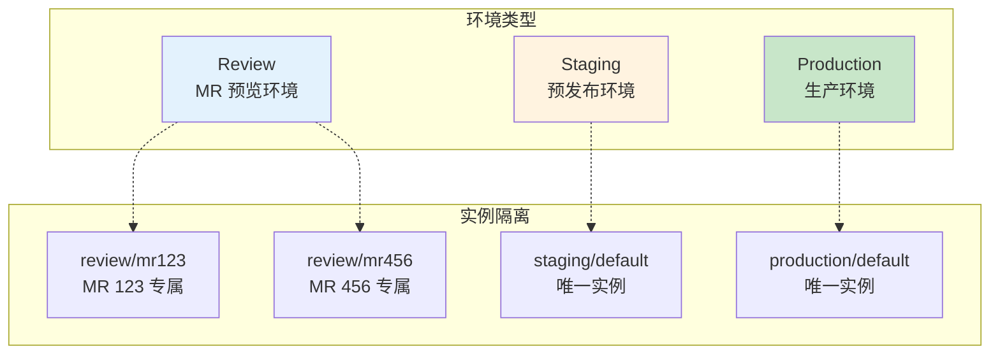

**CI_ENVIRONMENT_INSTANCE 计算**:

```bash
# Review 环境
CI_ENVIRONMENT_INSTANCE=$(
  [ "$CI_PIPELINE_SOURCE" = "merge_request_event" ] \
    && echo "mr$CI_MERGE_REQUEST_IID" \
    || echo "default"
)

# 示例:
# - MR#123 => CI_ENVIRONMENT_INSTANCE=mr123
# - 手动触发 => CI_ENVIRONMENT_INSTANCE=default
```

### 4.7 Verify Stage - 部署验证

```json:82:85:turbo.json
"verify": {
    "dependsOn": ["deploy"],
    "outputs": ["output/verify/**"]
}
```

验证任务示例:

```typescript
// 伪代码示例
async function verifyDeployment() {
  // 1. 健康检查
  await checkHealth(`https://${env}.example.com/health`);

  // 2. 冒烟测试
  await runSmokeTests();

  // 3. 性能监控
  await checkPerformance();

  // 4. 错误率监控
  await checkErrorRate();
}
```

---

## 5. 自动化机器人系统

### 5.1 GitLab MR Bot

GitLab MR Bot 是一个通用的**仓库自动维护机器人**,提供标准化的 MR 工作流。

#### 5.1.1 设计理念

**问题**: 大型项目包含大量自动化脚本(代码生成、配置同步、依赖更新等),但这些更新往往依赖人工执行,容易形成"更新惰性锁死"。

**解决方案**: 提供统一的自动化 MR 通道,让各种代码生成脚本能够自动提交变更,并在受控流程下被审查与合并。

#### 5.1.2 核心功能

```typescript
// scripts/gitlab-mr-bot/src/mr.ts 核心接口
interface SyncAndCreateMROptions {
  sourceBranch: string; // 源分支名称
  targetBranch?: string; // 目标分支(默认:当前分支)
  title?: string; // MR 标题
  description?: string; // MR 描述
  commitMessage: string; // 提交消息
  prepareWorkspace: () => Promise<void>; // 准备工作区回调
  removeSourceBranch?: boolean; // 合并后删除源分支
  labels?: string[]; // MR 标签
  reviewers?: Array<number | string>; // 评审人
  assignees?: Array<number | string>; // 指派人
  gitlabToken?: string; // GitLab Token
}

async function syncAndCreateMR(options: SyncAndCreateMROptions): Promise<void>;
```

#### 5.1.3 工作流程

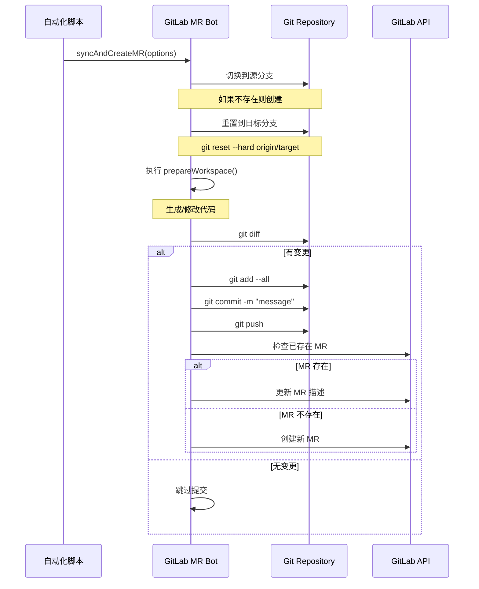

#### 5.1.4 实际应用示例

**Catalog 自动更新**:

```json:10:10:package.json
"bot:catalog": "node scripts/gitlab-mr-bot/dist/cli.js mr --source-branch chore/update-catalog --target-branch master --title \"chore: update catalog\" --description \"Automated catalog update\" --commit-message \"chore: update catalog\" --labels \"automation,catalog\" --reviewers \"@tangbing,@qiancong,@juanbai\" -- pnpm run catalog"
```

**编辑器代码自动更新**:

```json:11:11:package.json
"bot:editor-code-update": "node scripts/gitlab-mr-bot/dist/cli.js mr --source-branch chore/editor-code-update --target-branch master --title \"chore: update editor code\" --description \"Automated editor code update\" --commit-message \"chore: update editor code\" --labels \"automation,editor\" --reviewers \"@juanbai,@zhangliang,@facai\" -- npx turbo run editor-code-update"
```

**包索引自动生成**:

```json:12:12:package.json
"bot:generate-packages-index": "node scripts/gitlab-mr-bot/dist/cli.js mr --source-branch chore/update-packages-index --target-branch master --title \"chore: update packages index\" --description \"Automated packages index update\" --commit-message \"chore: update packages index\" --labels \"automation,docs\" --reviewers \"@tangbing,@qiancong,@juanbai\" -- pnpm run docs:generate-packages-index"
```

### 5.2 自动版本合并机器人

`scripts/merge-versions-mr.mjs` 是一个专门用于**自动合并版本发布 MR** 的高级机器人。

#### 5.2.1 核心挑战

**问题**: Changesets Bot 会创建版本 MR (changeset-release/master),但在等待 pipeline 期间,如果有新代码合并到 master,Changesets Bot 会自动更新版本 MR,导致 pipeline 重新开始,形成无限循环。

**解决方案**: 冻结主分支,等待 pipeline 完成后再合并,然后解冻。

#### 5.2.2 分支冻结机制

```typescript
// 简化的核心逻辑
async function freezeBranch() {
  // 1. 获取当前保护规则
  originalBranchProtection = await getBranchProtection();

  // 2. 设置权限为禁止所有人推送和合并 (access_level: 0)
  await updateBranchProtection(TARGET_BRANCH, {
    allowedToPush: buildFrozenPushAccessLevels(originalBranchProtection?.push_access_levels),
    allowedToMerge: buildFrozenMergeAccessLevels(originalBranchProtection?.merge_access_levels),
  });

  isBranchFrozen = true;
}

async function unfreezeBranch() {
  // 恢复原始保护规则
  await updateBranchProtection(TARGET_BRANCH, {
    allowedToPush: buildRestoredAccessLevels(originalBranchProtection.push_access_levels),
    allowedToMerge: buildRestoredAccessLevels(originalBranchProtection.merge_access_levels),
  });

  isBranchFrozen = false;
}
```

#### 5.2.3 完整工作流程

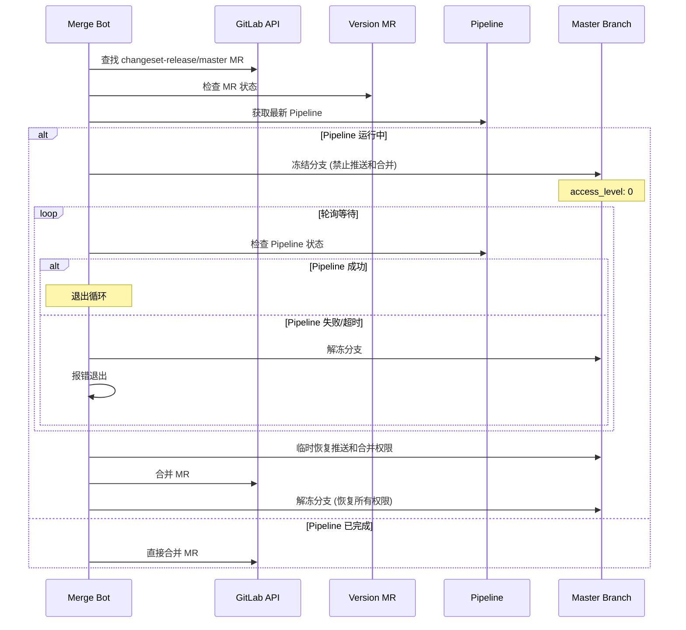

#### 5.2.4 关键代码片段

```javascript:485:532:scripts/merge-versions-mr.mjs
async function freezeBranch() {
    if (isBranchFrozen) {
        console.log(`   ℹ️  分支 ${TARGET_BRANCH} 已经冻结`);
        return;
    }

    console.log(`   🔒 冻结分支 ${TARGET_BRANCH}（禁止所有人推送和合并 MR）...`);

    // 先获取当前保护规则
    originalBranchProtection = await getBranchProtection();

    // 检查是否已经冻结（推送和合并权限都被禁止）
    const isPushForbidden = isAccessForbidden(originalBranchProtection?.push_access_levels);
    const isMergeForbidden = isAccessForbidden(originalBranchProtection?.merge_access_levels);

    if (isPushForbidden && isMergeForbidden) {
        console.log(`   ℹ️  分支 ${TARGET_BRANCH} 已经冻结（推送和合并都已禁止），无需更新`);
        isBranchFrozen = true;
        return;
    }

    if (DRY_RUN) {
        console.log(`   🔍 [DRY RUN] 将冻结分支 ${TARGET_BRANCH}`);
        isBranchFrozen = true;
        return;
    }

    try {
        // 构建冻结后的权限数组（禁止所有）
        const frozenLevels = {
            allowedToPush: buildFrozenPushAccessLevels(
                originalBranchProtection?.push_access_levels,
            ),
            allowedToMerge: buildFrozenMergeAccessLevels(
                originalBranchProtection?.merge_access_levels,
            ),
        };

        // 使用 PATCH 方法安全地更新保护规则
        await updateBranchProtection(TARGET_BRANCH, frozenLevels);

        isBranchFrozen = true;
        console.log(`   ✅ 分支 ${TARGET_BRANCH} 已冻结（所有人推送和合并权限已禁止）`);
    } catch (error) {
        console.error(`   ❌ 冻结分支失败:`, error.message);
        throw error;
    }
}
```

---

## 6. Turbo 构建优化

### 6.1 Turbo Analyzer - 性能分析

项目使用自定义的 `turbo-analyzer` 包装脚本来增强 Turbo 的可观测性:

```bash:1:15:scripts/turbo-analyzer/turbo-with-report.sh
#!/bin/sh

# Turbo 包装脚本 - 在 CI 环境中自动生成可视化报表
# 使用方法: ./scripts/turbo-analyzer/turbo-with-report.sh turbo run build --filter=@app/*
#
# GitLab CI 配置示例:
# build:
#   script:
#     - sh scripts/turbo-analyzer/turbo-with-report.sh turbo run build --filter=@app/*
#   artifacts:
#     paths:
#       - .turbo/runs/
#     expire_in: 7 days
#     when: always
```

### 6.2 构建缓存策略

**本地缓存**:

```
.turbo/
├── cache/          # 任务输出缓存
└── runs/           # 运行日志和分析报告
```

**远程缓存** (Turbo Remote Cache):

```json:40:42:turbo.json
"TURBO_API",
"TURBO_TEAM",
"TURBO_TOKEN"
```

启用远程缓存后,团队成员可以共享构建缓存,显著加速 CI/CD。

### 6.3 过滤器使用

Turbo 提供强大的 `--filter` 选项:

```bash
# 只构建应用
turbo run build --filter=@app/* --filter=@oem/*

# 只构建库
turbo run build --filter=!@app/* --filter=!@oem/*

# 构建特定包及其依赖
turbo run build --filter=@app/gaoding...

# 构建受影响的包 (基于 git diff)
turbo run build --filter=[HEAD^1]
```

**Filter 语法总结**:

| 语法              | 说明                     | 示例                           |
| ----------------- | ------------------------ | ------------------------------ |
| `@app/*`          | 匹配所有 @app scope 的包 | `@app/gaoding`, `@app/insmind` |
| `!@app/*`         | 排除所有 @app scope 的包 | 用于只构建库                   |
| `@app/gaoding...` | 包及其所有依赖           | 包含上游依赖                   |
| `...@app/gaoding` | 包及其所有依赖方         | 包含下游依赖                   |
| `[HEAD^1]`        | Git 变更的包             | 增量构建                       |

---

## 7. Changeset 版本管理

### 7.1 Changeset 工作流

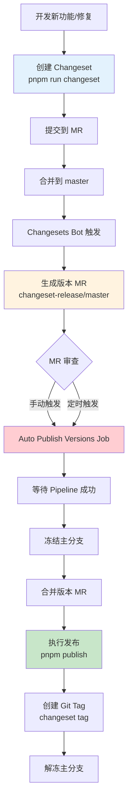

### 7.2 Changeset 文件结构

```markdown
---
'@gdesign/package-a': minor
'@gdesign/package-b': patch
---

添加新功能并修复 bug

- feat: 添加 XX 功能
- fix: 修复 YY 问题
```

### 7.3 版本发布策略

```json:22:28:package.json
"changeset": "echo '对 Cursor 说：创建变更集' && exit 1",
"changeset:publish": "pnpm publish -r --filter=!@app/* --no-git-checks && changeset tag",
"changeset:snapshot:enter": "touch .changeset/snapshot",
"changeset:snapshot:exit": "rm -f .changeset/snapshot",
"changeset:snapshot:publish": "pnpm publish -r --filter=!@app/* --no-git-checks",
"changeset:snapshot:version": "changeset version --snapshot snapshot",
"changeset:version": "changeset version",
```

**发布模式**:

1. **正式发布**: `changeset:publish`
   - 发布到公开/私有 NPM Registry
   - 创建 Git Tag
   - 更新 CHANGELOG

2. **快照发布**: `changeset:snapshot:*`
   - 用于预发布和测试
   - 版本号如: `1.2.3-snapshot-20260116`
   - 不创建 Git Tag

### 7.4 应用包与库包的发布差异

**库包** (`packages/`, `domains/`):

- 发布到 NPM Registry
- 创建 Git Tag
- 生成 CHANGELOG

**应用包** (`apps/`):

- **不发布到 NPM** (`--filter=!@app/*`)
- 仍创建 Git Tag (用于部署追踪)
- 版本号用于部署标识

---

## 8. 部署系统

### 8.1 容器化部署

#### 8.1.1 Dockerfile 示例

```dockerfile:1:25:apps/example-app/Dockerfile
# Base image
#----------------------------------------------------------------------------
FROM gaoding-registry-vpc.cn-hangzhou.cr.aliyuncs.com/gaodingx/base-image:node-20-onbuild AS base
ENV TZ=Asia/Shanghai
ENV PNPM_HOME="/pnpm"
ENV PATH="$PNPM_HOME:$PATH"
ENV COREPACK_NPM_REGISTRY=https://npm-mirror.gaoding.com
ENV NPM_CONFIG_REGISTRY=https://npm-mirror.gaoding.com
ENV COREPACK_DEFAULT_TO_LATEST=0
RUN npm install --global corepack@latest
RUN corepack enable
RUN corepack prepare pnpm@10.24.0 --activate

# Runner stage
#----------------------------------------------------------------------------
FROM base AS runner
ENV NODE_ENV=production
ARG FLAGS_SECRET
ENV FLAGS_SECRET=${FLAGS_SECRET}
WORKDIR /app
COPY .pruned/apps/example-app .
EXPOSE 80
CMD ./docker-entrypoint.sh start
HEALTHCHECK --interval=15s --timeout=1s --start-period=60s --retries=5 \
    CMD curl -f http://localhost/health || exit 1
```

**多阶段构建**:

1. **Base Stage**: 准备基础环境 (Node.js, pnpm)
2. **Runner Stage**: 复制构建产物并运行

#### 8.1.2 镜像构建流程

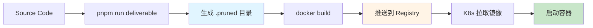

**`.pruned` 目录**:

使用 `pnpm deploy` 或类似工具生成精简的依赖树,只包含运行时需要的依赖,减小镜像体积。

### 8.2 静态资源部署

**OSS + CDN 架构**:

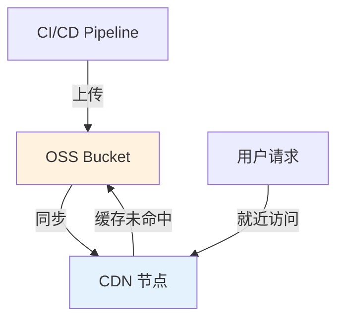

**部署脚本示例**:

```typescript
// 简化的部署逻辑
async function deployStatic() {
  const OSS = require('ali-oss');

  const client = new OSS({
    accessKeyId: process.env.OSS_ACCESS_KEY_ID,
    accessKeySecret: process.env.OSS_ACCESS_KEY_SECRET,
    bucket: 'gaoding-static',
    endpoint: process.env.OSS_ENDPOINT,
  });

  // 上传构建产物
  await uploadDir('dist/client', 'app/v1.0.0/', client);

  // 刷新 CDN 缓存
  await refreshCDN(['https://cdn.gaoding.com/app/v1.0.0/']);
}
```

### 8.3 多环境配置

**环境变量注入**:

```typescript
// 通过环境变量控制运行时行为
const config = {
  apiEndpoint:
    process.env.APP_API_ENV === 'prod'
      ? 'https://api.gaoding.com'
      : process.env.APP_API_ENV === 'stage'
        ? 'https://api-stage.gaoding.com'
        : 'https://api-fat.gaoding.com',

  enableDebug: process.env.NODE_ENV !== 'production',

  featureFlags: process.env.FLAGS_SECRET,
};
```

---

## 9. 最佳实践与优化

### 9.1 CI/CD 性能优化

#### 9.1.1 缓存优化

**依赖缓存**:

```yaml
# GitLab CI 缓存配置示例
cache:
  key:
    files:
      - pnpm-lock.yaml
  paths:
    - .pnpm-store/
    - node_modules/
```

**Turbo 缓存**:

```json
// 启用远程缓存
{
  "TURBO_TOKEN": "your-token",
  "TURBO_TEAM": "gaoding",
  "TURBO_API": "https://turbo.gaoding.com"
}
```

#### 9.1.2 并行化策略

**Job 并行**:

```yaml
# 同一 stage 内的 job 可以并行执行
test:unit:
  stage: test
  script: pnpm run test:unit

test:e2e:
  stage: test
  script: pnpm run test:e2e
```

**Turbo 并行**:

```json
{
  "tasks": {
    "lint": {
      "dependsOn": [] // 无依赖,可以并行
    }
  }
}
```

#### 9.1.3 增量构建

**基于 Git Diff**:

```bash
# 只测试变更的包
turbo run test --filter=[HEAD^1]

# 只构建受影响的包及其依赖方
turbo run build --filter=...[HEAD^1]
```

### 9.2 安全性

#### 9.2.1 敏感信息管理

**GitLab CI Variables**:

```yaml
variables:
  # 通过 GitLab CI/CD Settings 配置
  # OSS_ACCESS_KEY_ID: (masked)
  # OSS_ACCESS_KEY_SECRET: (protected)
  # NPM_TOKEN: (masked)
```

**环境变量注入**:

```json:19:44:turbo.json
"globalPassThroughEnv": [
    "APOLLO_TOKEN",
    "APP_API_ENV",
    "APP_ENV",
    "CI_SERVER_URL",
    "CI_COMMIT_REF_NAME",
    "CI_COMMIT_SHA",
    "CI_COMMIT_SHORT_SHA",
    "CI_COMMIT_TAG",
    "CI_ENVIRONMENT_TYPE",
    "CI_ENVIRONMENT_INSTANCE",
    "CI_JOB_URL",
    "CI_MERGE_REQUEST_IID",
    "CI_PIPELINE_ID",
    "CI_PROJECT_ID",
    "CI",
    "DEPLOY_API_ORIGIN",
    "DEPLOY_API_TOKEN",
    "DEPLOY_PROJECT_ID",
    "GITLAB_TOKEN",
    "DCDN_ACCESS_KEY_ID",
    "DCDN_ACCESS_KEY_SECRET",
    "DEBUG_CDN_ENV_CODE",
    "DEPLOY_API_TOKEN",
    "DEV",
    "FLAGS_SECRET"
]
```

#### 9.2.2 权限控制

**分支保护**:

```javascript
// merge-versions-mr.mjs 中的分支保护逻辑
async function updateBranchProtection(branchName, options) {
  const body = {
    allowed_to_push: options.allowedToPush,
    allowed_to_merge: options.allowedToMerge,
    code_owner_approval_required: options.codeOwnerApprovalRequired,
    allow_force_push: options.allowForcePush,
  };

  return gitlabApi('PATCH', `/projects/${CI_PROJECT_ID}/protected_branches/${branchName}`, body);
}
```

### 9.3 可观测性

#### 9.3.1 日志管理

**结构化日志**:

```typescript
// 标准化的日志格式
function log(level: 'info' | 'warn' | 'error', message: string, meta?: object) {
  console.log(
    JSON.stringify({
      timestamp: new Date().toISOString(),
      level,
      message,
      jobId: process.env.CI_JOB_ID,
      pipelineId: process.env.CI_PIPELINE_ID,
      ...meta,
    }),
  );
}
```

#### 9.3.2 监控指标

**关键指标**:

| 指标                        | 说明             | 目标值   |
| --------------------------- | ---------------- | -------- |
| **Pipeline Duration**       | 完整流程耗时     | < 15 min |
| **Build Cache Hit Rate**    | Turbo 缓存命中率 | > 80%    |
| **Test Coverage**           | 代码覆盖率       | > 70%    |
| **Deployment Success Rate** | 部署成功率       | > 99%    |
| **MTTR**                    | 平均修复时间     | < 30 min |

#### 9.3.3 性能分析

**Turbo 分析报告**:

```bash
# 生成性能分析报告
sh scripts/turbo-analyzer/turbo-with-report.sh turbo run build

# 查看报告
cat .turbo/runs/<run-id>/summary.json
```

### 9.4 故障处理

#### 9.4.1 回滚策略

**快速回滚**:

```bash
# 回滚到上一个版本
git revert <commit-hash>
git push

# 或使用 Git Tag 重新部署
git checkout v1.0.0
# 触发部署流程
```

**灰度回滚**:

1. 减少新版本的流量权重
2. 观察错误率和性能指标
3. 完全切换到旧版本
4. 修复问题后重新发布

#### 9.4.2 常见问题

**问题1: Pipeline 超时**

```yaml
# 增加 timeout
auto publish versions:
  timeout: 35m # 默认 1h
```

**问题2: 缓存不一致**

```bash
# 清除本地缓存
rm -rf .turbo/cache

# 清除远程缓存 (谨慎使用)
turbo run build --force
```

**问题3: 版本 MR 无限循环**

使用 `resource_group` 和分支冻结机制解决,如前文所述。

---

## 总结

稿定前端超级仓库的 CI/CD 系统是一个**高度自动化、模块化、可扩展**的现代化工程体系:

### 核心优势

1. **自动化优先**
   - GitLab MR Bot 实现代码自动维护
   - Changesets 自动化版本管理和发布
   - 自动合并版本 MR,减少人工干预

2. **高性能构建**
   - Turbo 增量构建和智能缓存
   - 并行执行最大化资源利用
   - 远程缓存共享加速团队协作

3. **多环境支持**
   - Review/Staging/Production 环境隔离
   - 基于 MR 的临时预览环境
   - 灵活的环境变量配置

4. **完善的质量保障**
   - 多阶段检查 (Lint、Test、Verify)
   - 自动化测试覆盖
   - 部署后验证

5. **可观测性强**
   - Turbo Analyzer 性能分析
   - 结构化日志
   - 完整的 artifacts 保存

### 技术亮点

- **分支冻结机制**: 创新性地解决版本 MR 无限循环问题
- **组件化 Pipeline**: 复用性强,易于维护
- **Monorepo 最佳实践**: pnpm + Turbo + Changesets 黄金组合
- **渐进式部署**: 支持灰度、蓝绿、金丝雀等多种策略

### 持续改进方向

1. **进一步提升缓存命中率**: 优化依赖结构,减少不必要的重新构建
2. **更精细的测试策略**: 基于代码变更智能选择测试用例
3. **可视化监控面板**: 实时展示 Pipeline 状态和性能指标
4. **成本优化**: 合理分配 CI 资源,减少不必要的计算

---

## 附录

### A. 常用命令速查

```bash
# 本地开发
pnpm install               # 安装依赖
pnpm run dev              # 启动开发服务器
pnpm run build            # 构建所有包
pnpm run build:apps       # 只构建应用
pnpm run build:libs       # 只构建库

# 代码质量
pnpm run lint             # 运行 lint
pnpm run lint:fix         # 自动修复 lint 问题
pnpm run check-type       # 类型检查
pnpm run test             # 运行测试

# 版本管理
pnpm run changeset        # 创建 changeset
pnpm run changeset:version  # 更新版本号
pnpm run changeset:publish  # 发布到 NPM

# 部署
pnpm run deliverable      # 生成制品
pnpm run deploy:review    # 部署到 Review 环境
pnpm run deploy:staging   # 部署到 Staging 环境
pnpm run deploy:production  # 部署到生产环境
```

### B. 相关资源

- [Turbo 官方文档](https://turbo.build/repo/docs)
- [Changesets 官方文档](https://github.com/changesets/changesets)
- [pnpm 官方文档](https://pnpm.io/)
- [GitLab CI/CD 文档](https://docs.gitlab.com/ee/ci/)

---

**文档版本**: v1.0.0  
**最后更新**: 2026-01-16  
**维护者**: 稿定科技前端架构团队
