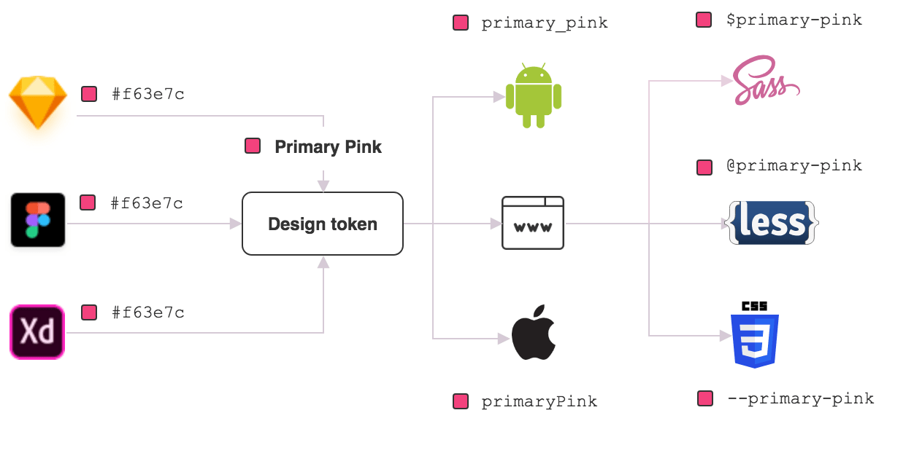

# Design Tokens（设计令牌）

## 一、概述

Design Tokens（设计令牌）是设计系统的基石，代表着设计规范工作的起点。业界普遍认为，建设设计系统应该从设计令牌开始。本文档阐述了为什么稿定需要 Design Tokens，以及如何基于这一理念构建设计系统。

---

## 二、背景与动机

### 2.1 设计系统演进的困境

**问题一：设计规范演进断断续续**

稿定的设计规范历经多次迭代，但都围绕 Ant Design 设计系统改造进行，这种方式存在以下局限：

1. **被动受限**：设计规范定义范围取决于组件库主题定义能力的强弱
   - 组件库提供什么能力，我们就定义哪些范围
   - 缺乏主动权和灵活性

2. **层级不足**：设计规范大都基于组件层面
   - 缺乏深入到常规设计中的细节约束
   - 无法覆盖组件之外的设计场景

3. **演进困难**：缺乏独立于组件库的设计规范载体
   - 需要一个更基础的主体来承载设计规范
   - 能够独立迭代演进，多端组件库只是接入规范
   - 需要一个同时适用业务场景的设计规范，可应用在业务设计和研发场景中

**问题二：业务设计体验一致性亟需治理**

随着业务发展，体验一致性问题日益突出：

1. **风格迥异**：设计师根据不同产品特性提出不同的设计理念
   - 多个产品的风格各不相同
   - 甚至相同产品不同模块的设计体验都有差异

2. **规范分化**：差异导致各个设计模块演进自己的设计规范
   - 缺乏统一的基础约束
   - 在业务一体化背景下，体验一致性将成为棘手问题

3. **治理困难**：缺乏最基础的设计、研发约束
   - 无法从根本上解决一致性问题
   - 需要更底层的设计原子作为统一标准

### 2.2 为什么需要 Design Tokens

基于以上问题，我们需要一个：
- **更基础的设计规范载体**：独立于组件库，能够独立演进
- **更精细的设计约束**：深入到设计细节，而不仅仅是组件层面
- **统一的设计语言**：作为所有设计、研发工作的基础原子
- **可迭代的设计系统**：支持持续优化和演进

Design Tokens 正是满足这些需求的最佳解决方案。

---

## 三、什么是 Design Tokens

### 3.1 概念定义

**Design Tokens（设计令牌）** 是设计系统的视觉设计原子，它们是存储视觉设计属性的命名实体。

**核心特征：**
- 使用命名实体代替硬编码值（例如颜色的十六进制值、间距的像素值）
- 为 UI 开发维护可扩展且一致的视觉系统
- 设计人员和开发人员使用 Design Tokens 来共享设计规范

### 3.2 可视化理解

如上图所示，Design Tokens 将设计属性抽象为可复用的命名实体，实现设计与代码的统一语言。

### 3.3 核心价值

1. **统一语言**：设计师和开发人员使用同一套术语
2. **可维护性**：修改 Token 值即可全局生效
3. **一致性保障**：确保设计规范在各处的一致应用
4. **跨平台支持**：同一套 Tokens 可转换为不同平台的格式

---

## 四、提议内容

### 4.1 目标设定

基于 Design Tokens 概念和方法论，打造更精细、可迭代、符合稿定业务的 Tokens 系列集。

**具体目标：**

1. **覆盖广度**
   - 初步落地覆盖 80% 设计场景的 Tokens 集
   - 包含颜色、间距、字体、阴影等各类设计原子

2. **协作机制**
   - 建立一个由设计师、研发协同的 Tokens 仓库
   - 管理分发 Tokens 相关产物
   - 支持版本管理和变更追踪

3. **业务推广**
   - 引导稿定设计产品相关业务的设计、研发同学协同工作
   - 抹平设计差异，推动体验一致性
   - 推动多项目接入：
     - 创作解决方案
     - 套版解决方案
     - 移动端
     - 编辑器

### 4.2 实施路径

**第一阶段：基础建设**
- 定义 Tokens 规范和分类体系
- 建立 Tokens 仓库和工作流
- 完成基础 Tokens 定义

**第二阶段：工具链建设**
- 开发 Tokens 转换工具
- 建立设计与研发协作流程
- 完成组件库接入

**第三阶段：业务推广**
- 推动各业务线接入
- 收集反馈并优化
- 持续迭代完善

---

## 五、方案细节

详细方案请参考以下文档：

- **[Desgin Tokens 方案介绍]**：介绍完整的技术方案和协作流程
- **[Tokens 定义规范 & 版本]**：定义 Tokens 的分类、命名和版本管理规范

---

## 六、相关资料

### 6.1 社区资料

- **DESIGN TOKENS COMMUNITY GROUP**：Design Tokens 标准化社区
- **Design tokens as your DNA**：Design Tokens 理念阐述
- **Awesome-Design-Tokens**：优秀的 Design Tokens 资源汇总
- **A guide to design tokens**：Design Tokens 实践指南

### 6.2 内部历史文档

- https://doc.huanleguang.com/pages/viewpage.action?pageId=97783067
- https://doc.huanleguang.com/display/frontend/Design+Token

---

## 七、总结

### 7.1 为什么从 Design Tokens 开始

Design Tokens 是设计系统的基石，原因在于：

1. **最底层的抽象**：作为设计原子，是设计系统的最小单元
2. **独立于实现**：不依赖特定的组件库或框架
3. **易于迭代**：可以独立演进，不受组件库限制
4. **跨端复用**：同一套定义可应用于多个平台

### 7.2 预期收益

通过建设 Design Tokens，我们将获得：

1. **设计规范的独立性**：不再受限于组件库能力
2. **设计细节的约束力**：深入到每一个设计细节
3. **体验一致性的保障**：统一的设计语言确保一致性
4. **协作效率的提升**：设计与研发使用同一套术语

### 7.3 下一步行动

1. 阅读 [Desgin Tokens 方案介绍]，了解技术实现方案
2. 阅读 [Tokens 定义规范 & 版本]，了解具体定义规范
3. 参与 Tokens 定义和评审工作
4. 推动所在项目接入 Design Tokens

---

*文档版本：v1.0*  
*最后更新：2025-01-25*
