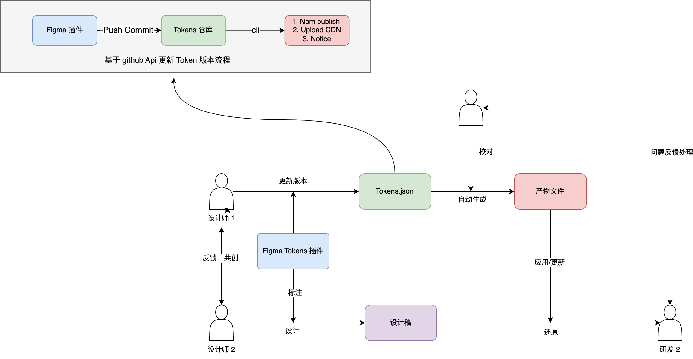
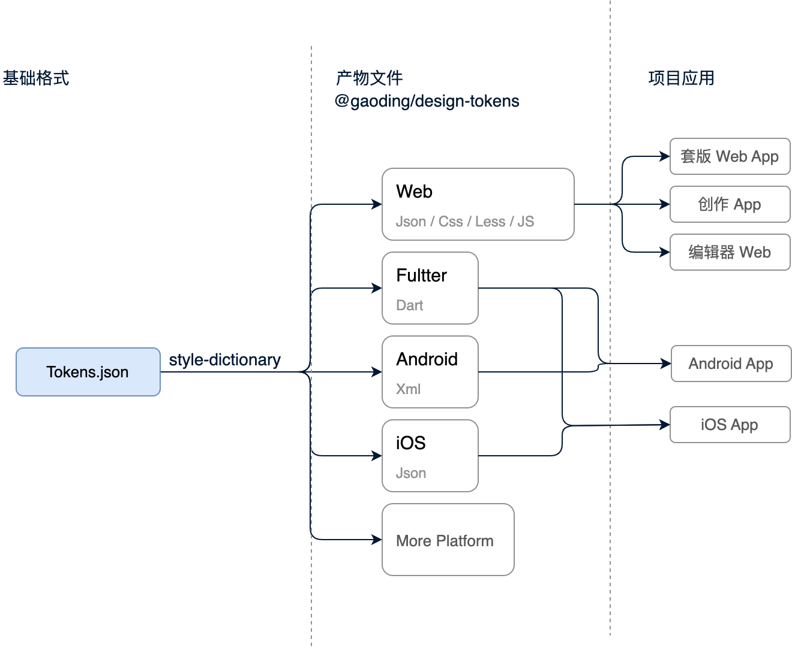
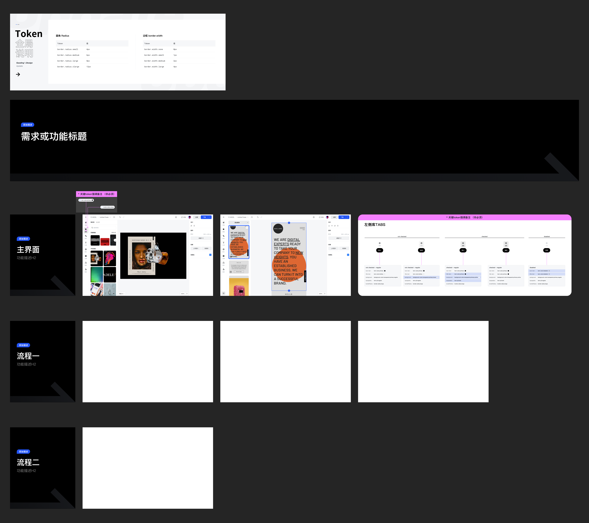

# Design Tokens 方案介绍

## 一、方案背景

### 1.1 前置阅读

在阅读本方案之前，建议先了解：
- **[Design Tokens（设计令牌）]**：了解 Design Tokens 的概念和价值
- **[Design Token 背景介绍](https://doc.huanleguang.com/wiki/pages/viewpage.action?pageId=241234786)**：了解更多背景信息

### 1.2 为什么需要新的维护方式

**传统方式的局限：**

大部分项目的设计令牌维护基于研发项目变量表，存在以下问题：

1. **抽象逻辑复杂**：大部分由研发维护，设计同学难以理解和更新
2. **协作不畅**：设计师无法直接参与 Tokens 的维护工作
3. **迭代困难**：修改流程繁琐，响应速度慢

**新方案的优势：**

在设计系统尚不成形的阶段，采用由设计主导的快速迭代模式：

1. **设计主导**：设计师直接在 Figma 中维护 Tokens
2. **快速迭代**：实现快速的迭代升级抽象设计原子
3. **高效协作**：设计与研发协作模式更加流畅

---

## 二、方案目标

### 2.1 核心目标

1. **由设计维护 Tokens 的协同工作流建设**
   - 设计师在 Figma 中直接维护
   - 通过工具自动同步到代码

2. **多端适配的 Token 转化方案**
   - 支持 Web、移动端、小程序等多平台
   - 自动转换为各端所需的格式

### 2.2 预期效果

- 设计师能够独立维护和更新 Tokens
- 研发能够直接使用 Tokens，无需重复定义
- 多端保持设计一致性
- 迭代效率显著提升

---

## 三、全流程协作流程

### 3.1 整体协作流程图



### 3.2 流程详解

**步骤一：设计维护**
1. 设计师在 Figma 中使用 Figma Tokens 插件维护 Tokens
2. 定义颜色、间距、字体等设计原子
3. 通过插件导出为 JSON 格式

**步骤二：版本管理**
1. Tokens JSON 文件提交到 Git 仓库
2. 支持版本控制和变更追踪
3. 团队协作和代码审查

**步骤三：自动转换**
1. 基于 Style Dictionary 进行转换
2. 自动生成多平台的 Token 文件
3. 包括 CSS、SCSS、JavaScript 等格式

**步骤四：分发使用**
1. 发布到 npm 仓库
2. 发布到 CDN
3. 各端项目接入使用

**步骤五：持续迭代**
1. 设计师在 Figma 中更新 Tokens
2. 自动触发转换和发布流程
3. 各端项目更新版本即可获得最新 Tokens

---

## 四、Tokens JSON 协议

### 4.1 协议结构说明

Tokens 以 JSON 格式存储，结构如下：

```json
{
  "Group of tokens": {
    "Subgroup of tokens": {
      "Token 1 name": {
        "value": "#aabbcc",
        "type": "color",
        "description": "A xxx color"
      },
      "Token 2 name": {
        "value": "#ddeeff",
        "type": "color"
      }
    }
  }
}
```

**结构说明：**
- **Group**：Tokens 的分组，如颜色组、间距组等
- **Subgroup**：子分组，更细粒度的分类
- **Token**：具体的 Token 定义
  - `value`：Token 的值
  - `type`：Token 的类型
  - `description`：Token 的描述（可选）

### 4.2 支持的类型

| 类型 | 基础值格式 | 说明 | 示例 |
|------|-----------|------|------|
| `sizing` | Number | 尺寸值 | `16` |
| `fontSizes` | Number | 字体大小 | `14` |
| `lineHeights` | String \| Number | 行高 | `1.5` 或 `"24px"` |
| `fontFamilies` | String | 字体族 | `"PingFang SC"` |
| `opacity` | Number | 透明度 | `0.8` |
| `color` | HEX \| RGB \| RGBA | 颜色值 | `"#FF0000"` |
| `fontWeights` | Number | 字体粗细 | `400` |
| `borderRadius` | Number \| String | 圆角 | `4` 或 `"4px"` |
| `boxShadow` | Array | 阴影 | 见下方示例 |
| `typography` | Object | 字体组合 | 见下方示例 |

### 4.3 基础示例

**字体大小示例：**
```json
{
  "font-size": {
    "50": {
      "value": 12,
      "type": "fontSizes"
    },
    "75": {
      "value": 13,
      "type": "fontSizes"
    },
    "100": {
      "value": 14,
      "type": "fontSizes"
    }
  }
}
```

**阴影示例：**
```json
{
  "boxshadow": {
    "small": {
      "value": {
        "x": 4,
        "y": 4,
        "blur": 4,
        "spread": 0,
        "color": "rgba(0, 0, 0, 0.5)",
        "type": "dropShadow"
      },
      "type": "boxShadow"
    }
  }
}
```

**字体组合示例：**
```json
{
  "text-h1": {
    "regular": {
      "value": {
        "fontFamily": "{font-family.body}",
        "fontWeight": "{font-weight.regular}",
        "lineHeight": "{line-height.small}",
        "fontSize": "{font-size.750}"
      },
      "type": "typography"
    }
  }
}
```

**引用示例：**
```json
{
  "brand": {
    "100": {
      "value": "{color.blue.100}",
      "type": "color",
      "description": "brand color 100"
    }
  }
}
```

通过 `{token.path}` 的方式引用其他 token，实现层级关系和语义化。

---

## 五、Tokens 定义与规范

### 5.1 详细规范文档

详细的 Tokens 定义规范请参考：
- **[Tokens 定义规范 & 版本]**

### 5.2 Figma 设计文件

详细 Tokens 设计文件：
https://www.figma.com/file/75N2O1ewVBsMW2Im6TNiff/%E7%A8%BF%E5%AE%9A---web%E5%9F%BA%E7%A1%80%E7%BB%84%E4%BB%B6?node-id=744%3A3595&t=hsKmsoVzCSL0hOuo-0

### 5.3 Tokens 分类

| 分类 | 描述 | 用途 |
|------|------|------|
| **Global** | 最底层的 token 值，属于基础的变量，是一系列阶梯式的值。基本不怎么变化，影响全局。 | **场景：**<br>• 通过控制颜色阶梯反转来实现基础的主题切换<br>• 通过控制 size 阶梯来实现 mobile 端放大，响应式缩放<br>• 通过控制 space 阶梯来实现紧凑模式等 |
| **Alias** | 应用 token，描述更具体的场景的别名 token，命名上是一系列语义化的 token，引用的是 global 值 | **场景：**<br>• 深入到细节的设计场景<br>• 通过对常见的模块、交互的命名来抽象具体的设计原子 |
| **Components** | 组件级别的 token，组件场景的 token | 针对组件的细节抽象 |

### 5.4 Tokens 关系

**层级关系：**
- Global Tokens → Alias Tokens → Component Tokens
- 下层引用上层，实现层级复用

**引用关系：**
- Alias Tokens 引用 Global Tokens
- Component Tokens 引用 Alias Tokens 或 Global Tokens

---

## 六、Tokens 转换流程

### 6.1 转换架构



### 6.2 基于 Style Dictionary 生成多平台 Token 文件

**Style Dictionary 简介：**
- Amazon 开源的设计令牌转换工具
- 支持将 JSON 格式的 Tokens 转换为多种格式
- 高度可配置，支持自定义转换规则

**转换流程：**
1. 读取 Tokens JSON 文件
2. 根据平台配置进行转换
3. 应用转换规则（如单位转换、命名转换等）
4. 输出目标平台格式的文件

**支持的输出格式：**
- CSS 变量
- SCSS 变量
- Less 变量
- JavaScript/TypeScript 对象
- JSON
- iOS Swift
- Android XML
- ...

### 6.3 Tokens 类型的转换规则说明

此章节涉及具体的技术实现细节，暂不展开。主要包括：
- 颜色格式转换
- 单位转换（px、rem、rpx 等）
- 命名转换（kebab-case、camelCase 等）
- 平台特定的适配规则

---

## 七、设计与研发协作

### 7.1 协作流程示意图



### 7.2 设计师工作流

1. **在 Figma 中维护 Tokens**
   - 使用 Figma Tokens 插件
   - 定义和更新 Tokens
   - 在设计稿中应用 Tokens

2. **导出 Tokens**
   - 通过插件导出为 JSON
   - 提交到 Git 仓库
   - 触发自动转换流程

3. **设计验证**
   - 在设计稿中验证 Tokens 效果
   - 确保设计一致性

### 7.3 研发工作流

1. **接入 Tokens**
   - 通过 npm 或 CDN 引入
   - 在代码中使用 CSS 变量

2. **使用示例**
   ```css
   .block {
     color: var(--text-color-primary, #222529);
   }
   ```

3. **更新 Tokens**
   - 更新 Tokens 版本
   - 自动获得最新的设计规范

### 7.4 协作优势

- **统一语言**：设计师和研发使用相同的命名
- **实时同步**：设计变更快速同步到代码
- **减少沟通**：通过 Tokens 减少设计与研发的沟通成本
- **保证一致**：确保设计稿与实现的一致性

---

## 八、产物与资源

### 8.1 核心产物

**npm 包：@gaoding/design-tokens**
- 包含所有 Tokens 定义
- 支持多种引入方式
- 持续更新维护

**相关组件库：**
- **@gaoding/gd-antd**：已接入 Tokens 的基础组件库
- **@gaoding/gd-antd-plus**：已接入 Tokens 的业务组件库

### 8.2 文档资源

- **@gaoding/design-tokens 文档**：详细的使用文档
- **接入指南**：[接入 Design token]
- **定义规范**：[Tokens 定义规范 & 版本]

---

## 九、相关链接

### 9.1 工具链接

- **Figma Tokens 插件**：https://www.figmatokens.com/
- **Style Dictionary**：https://amzn.github.io/style-dictionary/#/config

### 9.2 标准规范

- **Design Tokens 标准规范**：https://tr.designtokens.org/

### 9.3 内部资源

- **仓库地址**：https://git.gaoding.com/gaoding/gdesign-ui/tree/next/packages/design-tokens
- **Figma 设计文件**：https://www.figma.com/file/75N2O1ewVBsMW2Im6TNiff/稿定---web基础组件

---

## 十、总结

### 10.1 方案核心

本方案的核心在于：
1. **设计主导**：设计师直接维护 Tokens，无需研发介入
2. **自动化流程**：从设计到代码的自动转换
3. **多端支持**：一套 Tokens 适配多个平台
4. **高效协作**：设计与研发协作更加流畅

### 10.2 下一步

1. 阅读 [Tokens 定义规范 & 版本]，了解具体定义规范
2. 阅读 [接入 Design token]，了解如何接入使用
3. 开始在项目中接入 Design Tokens

---

*文档版本：v1.0*  
*最后更新：2025-01-25*
