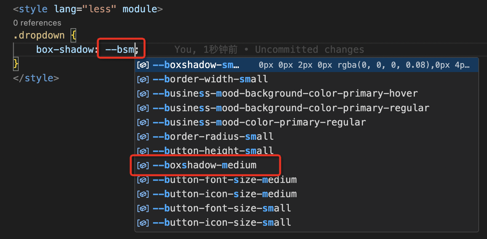
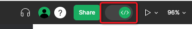
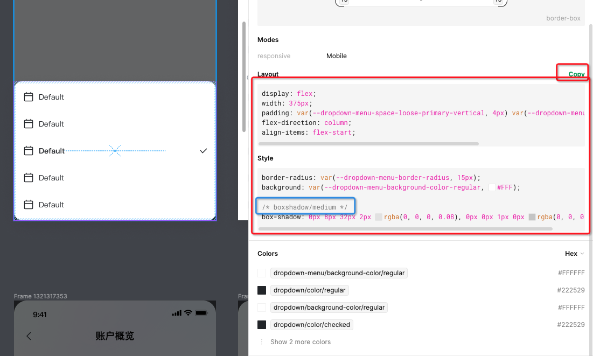

# 接入 Design Token

## 一、前置准备

### 1.1 需要了解的内容

在接入 Design Token 之前，建议先阅读以下文档：

- **[Design Tokens（设计令牌）]**：了解 Design Tokens 的概念和价值
- **[Desgin Tokens 方案介绍]**：了解完整的技术方案
- **[Tokens 定义规范 & 版本]**：了解 Tokens 的分类和命名规范

### 1.2 接入准备

确认以下内容：
- ✅ 已了解 Design Tokens 的基本概念
- ✅ 已了解 Tokens 的分类体系
- ✅ 项目支持 CSS 变量（CSS Custom Properties）
- ✅ 了解项目的构建流程

---

## 二、接入方式

### 2.1 方式一：使用 npm 包引入

**适用场景：**
- 使用构建工具的项目（Webpack、Vite 等）
- 需要在 JavaScript 中访问 Token 值
- 需要版本锁定和依赖管理

**安装：**
```bash
npm install @gaoding/design-tokens
```

**使用：**

**在 CSS 中使用：**
```css
@import '@gaoding/design-tokens/dist/default.css';

.my-component {
  color: var(--text-color-primary, #222529);
  padding: var(--spacing-medium, 16px);
}
```

**在 JavaScript 中使用：**
```javascript
import tokens from '@gaoding/design-tokens';

console.log(tokens.color.brand.primary); // #1677FF
```

**在 SCSS 中使用：**
```scss
@import '@gaoding/design-tokens/dist/default.scss';

.my-component {
  color: $text-color-primary;
  padding: $spacing-medium;
}
```

### 2.2 方式二：使用 CDN 链接引入（推荐）

**适用场景：**
- 快速接入，无需构建流程
- 简单的项目或页面
- 需要快速验证和测试

**Base URL：**
```
https://st0.dancf.com/package/npm/gaoding/design-tokens/:version/:fileName
```

**示例：**
```html
<!-- 引入默认主题 -->
<link rel="stylesheet" href="https://st0.dancf.com/package/npm/gaoding/design-tokens/0.1.1-beta.6/default.css">

<!-- 如果需要暗黑模式，同时引入 dark.css -->
<link rel="stylesheet" href="https://st0.dancf.com/package/npm/gaoding/design-tokens/0.1.1-beta.6/dark.css">
```

**在代码中使用：**
```css
.my-component {
  color: var(--text-color-primary, #222529);
  padding: var(--spacing-medium, 16px);
}
```

### 2.3 文件选择指南

| 文件名 | 包含内容 | 适用场景 |
|--------|---------|---------|
| **default.css** | global.css + alias.css | 一般业务项目（推荐） |
| **index.css** | global.css + alias.css + components/index.css | 搭配基础组件使用 |
| **dark.css** | 暗黑模式样式 | 需要暗黑模式时引入 |
| **global.css** | Global Tokens | 仅需要基础 Tokens |
| **alias.css** | Alias Tokens | 配合 global.css 使用 |

**注意事项：**
- 一般不推荐直接引入 global.css 与 alias.css
- 建议直接使用 **default.css**（包含 global.css + alias.css）
- 如果搭配基础组件使用，请直接使用 **index.css**（包含 global.css + alias.css + components/index.css）
- 如果需要使用暗黑模式，则需要同时引入 dark.css

---

## 三、暗黑模式切换

### 3.1 启用暗黑模式

引入 dark.css 后，通过以下方式之一切换暗黑模式：

**方式一：使用 data 属性**
```javascript
// 切换到暗黑模式
document.documentElement.setAttribute('data-theme', 'dark');

// 切换回亮色模式
document.documentElement.setAttribute('data-theme', 'light');
```

**方式二：使用 class**
```javascript
// 切换到暗黑模式
document.documentElement.classList.add('gdesign--dark');

// 切换回亮色模式
document.documentElement.classList.remove('gdesign--dark');
```

### 3.2 完整示例

```html
<!DOCTYPE html>
<html lang="zh-CN">
<head>
  <meta charset="UTF-8">
  <title>暗黑模式示例</title>
  <!-- 引入默认主题 -->
  <link rel="stylesheet" href="https://st0.dancf.com/package/npm/gaoding/design-tokens/0.1.1-beta.6/default.css">
  <!-- 引入暗黑主题 -->
  <link rel="stylesheet" href="https://st0.dancf.com/package/npm/gaoding/design-tokens/0.1.1-beta.6/dark.css">
  <style>
    body {
      background-color: var(--color-bg-primary);
      color: var(--color-text-primary);
      transition: background-color 0.3s, color 0.3s;
    }
  </style>
</head>
<body>
  <button onclick="toggleTheme()">切换主题</button>
  
  <script>
    function toggleTheme() {
      const html = document.documentElement;
      const currentTheme = html.getAttribute('data-theme');
      const newTheme = currentTheme === 'dark' ? 'light' : 'dark';
      html.setAttribute('data-theme', newTheme);
    }
  </script>
</body>
</html>
```

---

## 四、VSCode 拓展配置

### 4.1 推荐插件

**CSS Variable Autocomplete**

这个插件可以在编写样式时自动补全 CSS 变量名，大大提高开发效率。

### 4.2 安装步骤

1. 打开 VSCode
2. 打开扩展面板（Cmd/Ctrl + Shift + X）
3. 搜索 "CSS Variable Autocomplete"
4. 点击安装

### 4.3 使用效果

安装后，在编写 CSS 时输入 `--`，插件会自动提示所有可用的 CSS 变量：



例如输入 `--bsm` 可以快速找到 `--box-shadow-medium`。

---

## 五、在 Figma 设计稿上找到对应 Token

### 5.1 启用 Dev Mode

首先在 Figma 右上角启用 Dev Mode：



### 5.2 查看元素样式

在 Figma 设计稿上选中元素，可以直接查看当前元素的样式：



**功能：**
- 查看元素的颜色、字体、间距等属性
- 直接点击 copy 复制样式
- 查看使用的 Token 名称

### 5.3 查找对应的 CSS 变量

由于部分 Token 暂不支持直接在样式中显示（如 box-shadow），可以通过以下方式查找：

1. 在 Figma 中查看属性值（如阴影参数）
2. 在 VSCode 中输入 Token 前缀（如 `--bsm`）
3. 通过自动补全找到对应的 CSS 变量


---

## 六、Token 引用写法推荐

### 6.1 推荐写法

**使用 var() 函数并提供默认值：**
```css
.block {
  color: var(--text-color-primary, #222529);
  padding: var(--spacing-medium, 16px);
  border-radius: var(--radius-medium, 4px);
}
```

### 6.2 为什么要提供默认值

1. **容错性**：当 Token 缺失时，浏览器自动使用默认值，保证样式正常
2. **兼容性**：在不支持 CSS 变量的旧浏览器中使用默认值
3. **可读性**：从代码中可以直接看出实际的值

### 6.3 不推荐的写法

```css
/* ❌ 不推荐：没有默认值 */
.block {
  color: var(--text-color-primary);
}

/* ❌ 不推荐：直接使用硬编码值 */
.block {
  color: #222529;
}

/* ✅ 推荐：使用 Token 并提供默认值 */
.block {
  color: var(--text-color-primary, #222529);
}
```

---

## 七、实战示例

### 7.1 简单页面示例

```html
<!DOCTYPE html>
<html lang="zh-CN">
<head>
  <meta charset="UTF-8">
  <title>Design Tokens 示例</title>
  <!-- 引入 Design Tokens -->
  <link rel="stylesheet" href="https://st0.dancf.com/package/npm/gaoding/design-tokens/0.1.1-beta.6/default.css">
  <style>
    * {
      margin: 0;
      padding: 0;
      box-sizing: border-box;
    }
    
    body {
      font-family: var(--font-family-primary, -apple-system, BlinkMacSystemFont, 'Segoe UI', Roboto);
      font-size: var(--font-size-100, 14px);
      line-height: var(--line-height-normal, 1.5);
      color: var(--color-text-primary, #222529);
      background-color: var(--color-bg-primary, #ffffff);
    }
    
    .container {
      max-width: 1200px;
      margin: 0 auto;
      padding: var(--spacing-large, 24px);
    }
    
    .card {
      background-color: var(--color-bg-container, #ffffff);
      border: 1px solid var(--color-border-primary, #e5e6eb);
      border-radius: var(--radius-medium, 4px);
      padding: var(--spacing-medium, 16px);
      box-shadow: var(--shadow-card, 0 2px 8px rgba(0, 0, 0, 0.08));
      margin-bottom: var(--spacing-medium, 16px);
    }
    
    .card-title {
      font-size: var(--font-size-150, 16px);
      font-weight: var(--font-weight-medium, 500);
      color: var(--color-text-primary, #222529);
      margin-bottom: var(--spacing-small, 8px);
    }
    
    .card-content {
      font-size: var(--font-size-100, 14px);
      color: var(--color-text-secondary, #515767);
      line-height: var(--line-height-normal, 1.5);
    }
    
    .button {
      display: inline-block;
      padding: var(--spacing-small, 8px) var(--spacing-medium, 16px);
      background-color: var(--color-brand-primary, #1677FF);
      color: var(--color-white, #ffffff);
      border: none;
      border-radius: var(--radius-small, 2px);
      font-size: var(--font-size-100, 14px);
      cursor: pointer;
      transition: all 0.3s;
    }
    
    .button:hover {
      background-color: var(--color-brand-primary-hover, #3c89ff);
    }
  </style>
</head>
<body>
  <div class="container">
    <div class="card">
      <h2 class="card-title">使用 Design Tokens</h2>
      <p class="card-content">
        这个页面使用了 Design Tokens 来定义样式。所有的颜色、间距、字体都来自于 Tokens，
        而不是硬编码的值。这使得样式更容易维护和主题化。
      </p>
      <button class="button">了解更多</button>
    </div>
  </div>
</body>
</html>
```

### 7.2 React 组件示例

```jsx
import React from 'react';
import '@gaoding/design-tokens/dist/default.css';

const Card = ({ title, content }) => {
  return (
    <div style={{
      backgroundColor: 'var(--color-bg-container, #ffffff)',
      border: '1px solid var(--color-border-primary, #e5e6eb)',
      borderRadius: 'var(--radius-medium, 4px)',
      padding: 'var(--spacing-medium, 16px)',
      boxShadow: 'var(--shadow-card, 0 2px 8px rgba(0, 0, 0, 0.08))',
    }}>
      <h3 style={{
        fontSize: 'var(--font-size-150, 16px)',
        fontWeight: 'var(--font-weight-medium, 500)',
        color: 'var(--color-text-primary, #222529)',
        marginBottom: 'var(--spacing-small, 8px)',
      }}>
        {title}
      </h3>
      <p style={{
        fontSize: 'var(--font-size-100, 14px)',
        color: 'var(--color-text-secondary, #515767)',
        lineHeight: 'var(--line-height-normal, 1.5)',
      }}>
        {content}
      </p>
    </div>
  );
};

export default Card;
```

### 7.3 Vue 组件示例

```vue
<template>
  <div class="card">
    <h3 class="card-title">{{ title }}</h3>
    <p class="card-content">{{ content }}</p>
  </div>
</template>

<script>
import '@gaoding/design-tokens/dist/default.css';

export default {
  name: 'Card',
  props: {
    title: String,
    content: String
  }
}
</script>

<style scoped>
.card {
  background-color: var(--color-bg-container, #ffffff);
  border: 1px solid var(--color-border-primary, #e5e6eb);
  border-radius: var(--radius-medium, 4px);
  padding: var(--spacing-medium, 16px);
  box-shadow: var(--shadow-card, 0 2px 8px rgba(0, 0, 0, 0.08));
}

.card-title {
  font-size: var(--font-size-150, 16px);
  font-weight: var(--font-weight-medium, 500);
  color: var(--color-text-primary, #222529);
  margin-bottom: var(--spacing-small, 8px);
}

.card-content {
  font-size: var(--font-size-100, 14px);
  color: var(--color-text-secondary, #515767);
  line-height: var(--line-height-normal, 1.5);
}
</style>
```

---

## 八、常见问题

### 8.1 如何查看所有可用的 Token？

**方式一：查看文档**
- 阅读 [Tokens 定义规范 & 版本]

**方式二：查看 Figma 设计文件**
- https://www.figma.com/file/75N2O1ewVBsMW2Im6TNiff/稿定---web基础组件

**方式三：查看源文件**
- 在项目的 node_modules/@gaoding/design-tokens/dist/ 目录下查看生成的 CSS 文件

### 8.2 如何知道 Token 的值是什么？

**方式一：在浏览器开发者工具中查看**
```css
/* 在浏览器 Console 中执行 */
getComputedStyle(document.documentElement).getPropertyValue('--color-brand-primary');
```

**方式二：查看 CSS 文件**
打开 default.css 文件，搜索对应的 Token 名称。

### 8.3 Token 缺失怎么办？

1. 确认是否引入了正确的 CSS 文件
2. 检查 Token 名称是否正确
3. 查看是否是最新版本
4. 如果确实缺失，可以提issue 请求添加

### 8.4 如何自定义 Token 的值？

可以在项目中覆盖 Token 的值：

```css
:root {
  /* 覆盖品牌色 */
  --color-brand-primary: #ff6600;
  
  /* 覆盖间距 */
  --spacing-medium: 20px;
}
```

---

## 九、项目接入状态

### 9.1 已接入项目

- **套版项目**：已由 CDN 接入

### 9.2 待接入项目

- 创作解决方案
- 移动端
- 编辑器

---

## 十、总结

### 10.1 接入步骤回顾

1. 选择接入方式（npm 或 CDN）
2. 引入对应的 CSS 文件
3. 在代码中使用 CSS 变量
4. 配置 VSCode 插件提高效率
5. 参考 Figma 设计稿使用正确的 Token

### 10.2 最佳实践

- 使用 `var()` 函数并提供默认值
- 优先使用 Alias Tokens
- 保持代码与设计稿的一致性
- 定期更新 Tokens 版本

### 10.3 获取帮助

- 查看文档：[Tokens 定义规范 & 版本]
- 查看 Figma：https://www.figma.com/file/75N2O1ewVBsMW2Im6TNiff/稿定---web基础组件
- 联系设计团队或前端团队

---

*文档版本：v1.0*  
*最后更新：2025-01-25*
